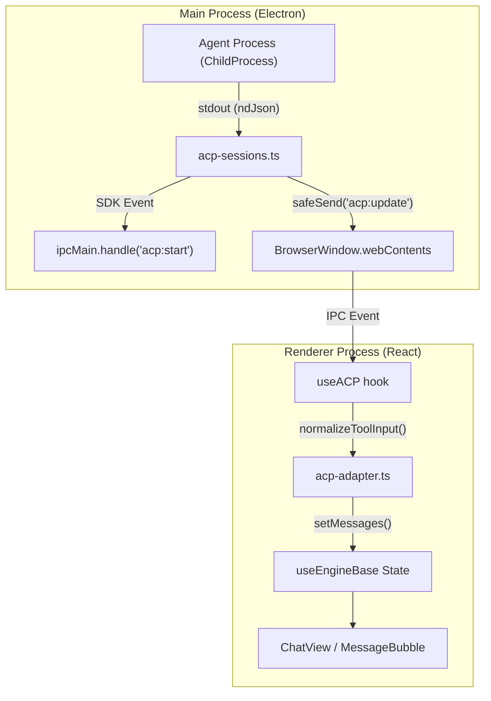
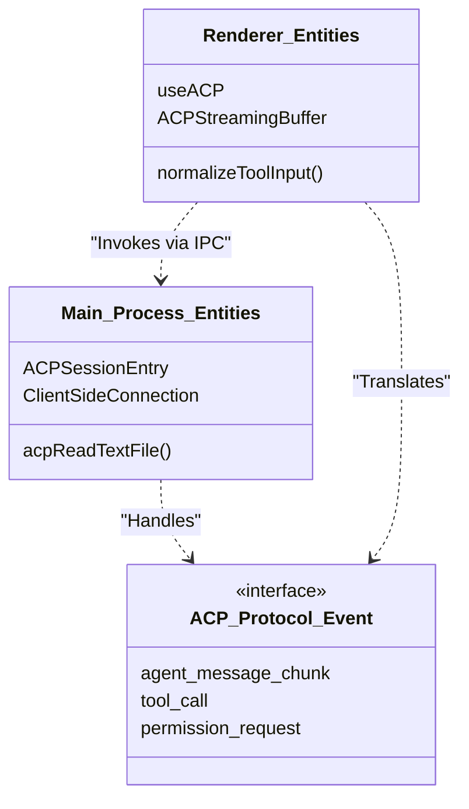

# ACP Engine: Agent Client Protocol

Relevant source files

The following files were used as context for generating this wiki page:

- [electron/src/ipc/acp-sessions.ts](electron/src/ipc/acp-sessions.ts)
- [electron/src/ipc/agent-registry.ts](electron/src/ipc/agent-registry.ts)
- [electron/src/lib/agent-registry.ts](electron/src/lib/agent-registry.ts)
- [electron/src/lib/codex-binary.ts](electron/src/lib/codex-binary.ts)
- [src/components/BackgroundAgentsPanel.tsx](src/components/BackgroundAgentsPanel.tsx)
- [src/components/TabBar.tsx](src/components/TabBar.tsx)
- [src/components/lib/tool-metadata.ts](src/components/lib/tool-metadata.ts)
- [src/hooks/useACP.ts](src/hooks/useACP.ts)
- [src/hooks/useBackgroundAgents.ts](src/hooks/useBackgroundAgents.ts)
- [src/lib/acp-adapter.ts](src/lib/acp-adapter.ts)
- [src/lib/background-acp-handler.ts](src/lib/background-acp-handler.ts)
- [src/lib/background-agent-store.ts](src/lib/background-agent-store.ts)
- [src/types/index.ts](src/types/index.ts)
- [src/types/protocol.ts](src/types/protocol.ts)

The **ACP Engine** enables Harnss to integrate with agents that implement the [Agent Client Protocol](https://github.com/agentclientprotocol/protocol). This protocol allows Harnss to spawn external agent processes (such as Gemini CLI or Goose), communicate via a standardized JSON-RPC-like stream, and provide the agent with local capabilities like file system access and MCP server connectivity.

## Process Spawning and Lifecycle

ACP agents are managed in the Electron main process via `acp-sessions.ts`. When a session starts, Harnss resolves the agent's binary and spawns it as a child process.

### Binary Resolution

Harnss supports three methods for launching ACP agents:

1.  **Registry-managed**: Binaries discovered or downloaded into the app's data directory [electron/src/lib/agent-registry.ts:11-28]().
2.  **System PATH**: Standard executables found via `which` or `where` [electron/src/lib/agent-registry.ts:123-136]().
3.  **npx**: Ephemeral execution for Node-based agents [electron/src/ipc/acp-sessions.ts:86-91]().

### Connection Setup

Once spawned, the main process establishes a `ClientSideConnection` using the ACP SDK [electron/src/ipc/acp-sessions.ts:15-20](). Communication occurs over `stdin` and `stdout` using an `ndJsonStream` (Newline Delimited JSON) [electron/src/ipc/acp-sessions.ts:50-53]().

### Session Entry Structure

Each active ACP agent is tracked in an `ACPSessionEntry` [electron/src/ipc/acp-sessions.ts:50-68]():
| Field | Description |
| :--- | :--- |
| `process` | The `ChildProcess` handle. |
| `connection` | The ACP SDK `ClientSideConnection` instance. |
| `pendingPermissions` | A map of in-flight permission requests awaiting user response. |
| `utilitySessionIds` | IDs for ephemeral tasks like title generation or commit message drafting. |
| `isReloading` | Flag to suppress history replay notifications during session revival. |

**Sources:** [electron/src/ipc/acp-sessions.ts:50-81](), [electron/src/lib/agent-registry.ts:11-28]()

## Protocol Translation: acp-adapter

The `acp-adapter.ts` and `useACP.ts` hook act as a normalization layer, translating ACP-specific events into the UI-agnostic shapes used by the Harnss renderer.

### Tool Input Normalization

ACP agents often wrap operations in shell commands (e.g., `["/bin/zsh", "-lc", "cat file.ts"]`). The `normalizeToolInput` function transforms these into structured fields compatible with Harnss tool renderers like `ReadContent` or `EditContent` [src/lib/acp-adapter.ts:15-39]().

### Turn Lifecycle

The `useACP` hook manages the state of a conversation turn [src/hooks/useACP.ts:34-47]():

1.  **Streaming**: `agent_message_chunk` and `agent_thought_chunk` events are buffered in `ACPStreamingBuffer` [src/hooks/useACP.ts:62-65]().
2.  **Tool Calls**: `tool_call` events trigger the creation of a `tool_call` message in the UI [src/hooks/useACP.ts:133-136]().
3.  **Completion**: The turn completes when the agent sends a `message_stop` or equivalent stop reason [src/types/protocol.ts:71-73]().

### ACP Data Flow

This diagram illustrates the flow from a process event to a UI update.

**ACP Event Propagation Diagram**

**Sources:** [electron/src/ipc/acp-sessions.ts:118-136](), [src/hooks/useACP.ts:157-162](), [src/lib/acp-adapter.ts:15-30]()

## Permission Behaviors

ACP defines a robust permission system for sensitive operations (e.g., writing files or executing commands). Harnss implements three behaviors controlled via `acpPermissionBehavior` [src/hooks/useACP.ts:67-68]():

1.  **`ask`**: Every restricted tool call pauses the agent and displays a permission request card in the chat [src/hooks/useACP.ts:21-23]().
2.  **`auto_accept`**: Automatically grants permissions for non-destructive operations (e.g., reading files) while still asking for others.
3.  **`allow_all`**: Automatically approves all requests.

When a permission is requested, the main process stores a resolver in `pendingPermissions` [electron/src/ipc/acp-sessions.ts:57](). Once the user clicks "Approve" or "Deny" in the UI, the renderer invokes `acp:respond-permission`, which resolves the promise in the main process and allows the agent to continue [electron/src/ipc/acp-sessions.ts:342-355]().

**Sources:** [src/hooks/useACP.ts:65-68](), [electron/src/ipc/acp-sessions.ts:57-58](), [src/types/ui.ts:44]()

## Session Revival and Load Session

ACP supports session persistence via `loadSession`. When Harnss restarts, it attempts to "revive" ACP sessions [electron/src/ipc/acp-sessions.ts:59-61]().

1.  **Check Capability**: Harnss checks if the agent supports `loadSession` during the initial handshake [electron/src/ipc/acp-sessions.ts:59]().
2.  **State Recovery**: If supported, Harnss sends the `session_id` to the agent. The agent is responsible for restoring its internal conversation state and tool history.
3.  **History Suppression**: While `isReloading` is true, Harnss suppresses duplicate message notifications from the agent to prevent UI flickering [electron/src/ipc/acp-sessions.ts:61-62]().

**Sources:** [electron/src/ipc/acp-sessions.ts:50-68](), [src/types/protocol.ts:3-15]()

## Background Agents and Task Lifecycle

ACP agents can spawn background tasks (subagents). These are tracked via the `BackgroundAgentStore` [src/lib/background-agent-store.ts:28-30]().

| Event Type          | Store Action                                                                                                                    |
| :------------------ | :------------------------------------------------------------------------------------------------------------------------------ |
| `task_started`      | Creates a "pending" agent entry in the store [src/lib/background-agent-store.ts:71-75]().                                       |
| `task_progress`     | Updates token usage, duration, and AI-generated summaries [src/lib/background-agent-store.ts:150-155]().                        |
| `tool_progress`     | Updates the "current tool" label and elapsed time in the `BackgroundAgentsPanel` [src/lib/background-agent-store.ts:181-185](). |
| `task_notification` | Marks the agent as `completed` or `error` and captures the final output file [src/lib/background-agent-store.ts:197-202]().     |

**Sources:** [src/lib/background-agent-store.ts:28-56](), [src/hooks/useBackgroundAgents.ts:19-33](), [src/components/BackgroundAgentsPanel.tsx:58-75]()

## Entity Mapping: Code to Protocol

The following diagram maps protocol concepts to specific code entities within the Harnss engine.

**ACP Entity Mapping Diagram**

**Sources:** [electron/src/ipc/acp-sessions.ts:50-68](), [src/hooks/useACP.ts:34-47](), [src/lib/acp-adapter.ts:15-30]()
