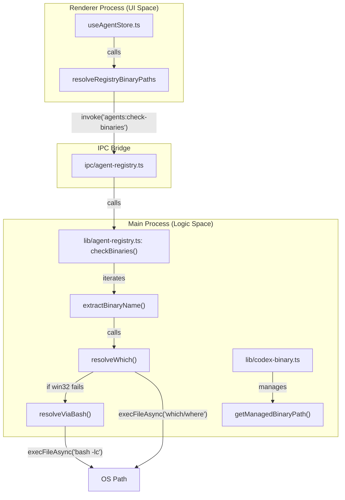
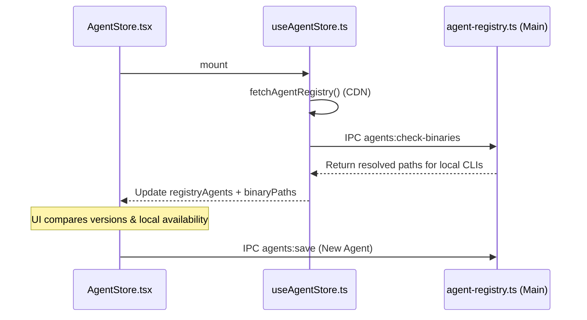

# Agent Registry & Binary Management

Relevant source files

The following files were used as context for generating this wiki page:

- [electron/src/ipc/agent-registry.ts](electron/src/ipc/agent-registry.ts)
- [electron/src/lib/agent-registry.ts](electron/src/lib/agent-registry.ts)
- [electron/src/lib/codex-binary.ts](electron/src/lib/codex-binary.ts)
- [src/components/TabBar.tsx](src/components/TabBar.tsx)
- [src/components/lib/tool-metadata.ts](src/components/lib/tool-metadata.ts)
- [src/components/settings/AgentStore.tsx](src/components/settings/AgentStore.tsx)
- [src/components/ui/switch.tsx](src/components/ui/switch.tsx)
- [src/hooks/useAgentRegistry.ts](src/hooks/useAgentRegistry.ts)
- [src/hooks/useAgentStore.ts](src/hooks/useAgentStore.ts)
- [src/lib/agent-store-utils.ts](src/lib/agent-store-utils.ts)
- [src/lib/background-acp-handler.ts](src/lib/background-acp-handler.ts)

The Agent Registry is a centralized system in the Electron main process responsible for discovering, persisting, and resolving the execution paths for AI agents. It manages both "Built-in" agents (Claude Code, Codex) and "User-installed" agents (typically ACP-compatible CLIs).

## Agent Persistence & Discovery

Harnss maintains a registry of agents in a `Map<string, InstalledAgent>` [electron/src/lib/agent-registry.ts:48-50](). This registry is populated from two sources:

1.  **Static Built-ins**: Hardcoded definitions for `claude-code` and `codex` [electron/src/lib/agent-registry.ts:30-44]().
2.  **User Config**: A JSON file located at `{userData}/openacpui-data/agents.json` [electron/src/lib/agent-registry.ts:52-54]().

The `loadUserAgents` function reads this file on startup and merges non-built-in agents into the active registry [electron/src/lib/agent-registry.ts:56-65]().

### The `InstalledAgent` Schema

Each agent entry contains metadata required for UI rendering and process spawning:
| Field | Description |
| :--- | :--- |
| `id` | Unique identifier (e.g., `claude-code`) |
| `engine` | One of `claude`, `acp`, or `codex` |
| `binary` | The executable name or absolute path |
| `args` | Array of CLI arguments (e.g., `["@anthropic-ai/claude-code"]` for npx) |
| `cachedConfigOptions` | Stored configuration options from previous ACP sessions [electron/src/lib/agent-registry.ts:27-27]() |

**Sources:** [electron/src/lib/agent-registry.ts:9-28](), [electron/src/lib/agent-registry.ts:52-65]()

## Binary Resolution Strategy

Harnss employs a tiered search strategy to find the correct executable for an agent, ensuring compatibility across macOS, Linux, and Windows.

### Tiered Search Order (Codex Example)

For the Codex engine, the `resolveCodexPathSync` function follows this priority [electron/src/lib/codex-binary.ts:69-110]():

1.  **Explicit Override**: Checks `CODEX_CLI_PATH` environment variable.
2.  **Managed Binary**: Looks in `{userData}/openacpui-data/bin/` for a version downloaded by the app.
3.  **Known Locations**: Hardcoded paths like `/Applications/Codex.app/...` or `/opt/homebrew/bin/codex` [electron/src/lib/codex-binary.ts:26-35]().
4.  **System PATH**: Uses `which` (POSIX) or `where` (Windows) to find `codex` in the user's environment.

### Windows Bash Fallback

On Windows, binaries are often installed in environments like Git Bash or WSL that are not visible to the standard Windows command prompt. If `where` fails, the registry attempts to resolve the binary by spawning a login shell (`bash -lc`) and running `command -v` [electron/src/lib/agent-registry.ts:146-169]().

### Binary Management Data Flow

The following diagram illustrates how a request for an agent binary flows from the Renderer UI through the IPC bridge to the resolution logic.

**Binary Resolution Entity Map**

**Sources:** [electron/src/lib/agent-registry.ts:122-169](), [electron/src/ipc/agent-registry.ts:30-34](), [src/hooks/useAgentStore.ts:20-23]()

## Managed Binaries & Auto-Download

For core engines like Codex, Harnss can automatically manage the binary lifecycle to ensure the user has the required features (e.g., Plan Mode).

1.  **Detection**: `isCodexInstalled()` checks if any valid binary exists [electron/src/lib/codex-binary.ts:59-66]().
2.  **Download**: If missing, `downloadCodexBinary()` uses `npm pack @openai/codex` to fetch the package and extract the platform-specific binary to the managed directory [electron/src/lib/codex-binary.ts:10-12]().
3.  **Refresh**: Managed binaries are checked for updates every 24 hours (`MANAGED_REFRESH_INTERVAL_MS`) [electron/src/lib/codex-binary.ts:116-116]().
4.  **Metadata**: Downloaded versions and timestamps are tracked in `codex-meta.json` [electron/src/lib/codex-binary.ts:124-157]().

**Sources:** [electron/src/lib/codex-binary.ts:38-47](), [electron/src/lib/codex-binary.ts:113-165](), [electron/src/lib/codex-binary.ts:171-216]()

## Agent Store & Installation

The `AgentStore` UI component allows users to browse a remote registry of ACP agents.

### Installation Logic

When a user clicks "Add" in the `AgentStore.tsx` [src/components/settings/AgentStore.tsx:164-178](), the system converts the `RegistryAgent` to an `InstalledAgent` definition using `registryAgentToDefinition` [src/lib/agent-store-utils.ts:9-46]():

- **NPX Distribution**: If the agent supports npx, it is configured to run via `npx <package> <args>` [src/lib/agent-store-utils.ts:14-28]().
- **Binary Distribution**: If the agent is already on the system PATH (detected via `checkBinaries`), it is configured using the absolute path found during the check [src/lib/agent-store-utils.ts:31-43]().

### Registry Update Lifecycle

**Sources:** [src/hooks/useAgentStore.ts:14-56](), [src/components/settings/AgentStore.tsx:45-60](), [src/lib/agent-store-utils.ts:64-71]()
