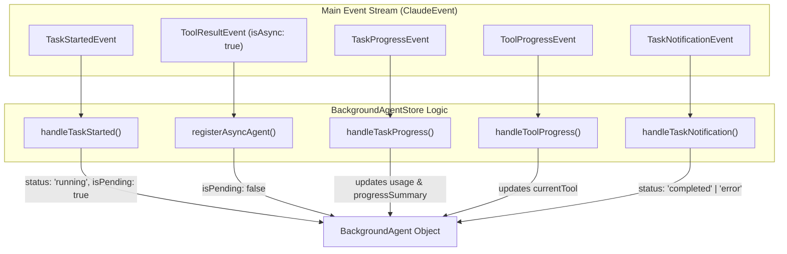
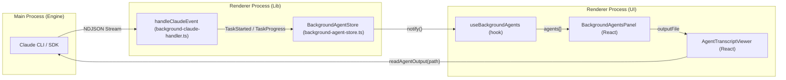

# Background Agents & Task Lifecycle

Relevant source files

The following files were used as context for generating this wiki page:

- [src/components/AgentTranscriptViewer.tsx](src/components/AgentTranscriptViewer.tsx)
- [src/components/BackgroundAgentsPanel.tsx](src/components/BackgroundAgentsPanel.tsx)
- [src/components/PanelHeader.tsx](src/components/PanelHeader.tsx)
- [src/components/ui/text-shimmer.tsx](src/components/ui/text-shimmer.tsx)
- [src/hooks/useBackgroundAgents.ts](src/hooks/useBackgroundAgents.ts)
- [src/index.css](src/index.css)
- [src/lib/background-agent-store.ts](src/lib/background-agent-store.ts)
- [src/lib/background-claude-handler.ts](src/lib/background-claude-handler.ts)
- [src/lib/streaming-buffer.test.ts](src/lib/streaming-buffer.test.ts)
- [src/lib/streaming-buffer.ts](src/lib/streaming-buffer.ts)
- [src/types/index.ts](src/types/index.ts)
- [src/types/protocol.ts](src/types/protocol.ts)

Harnss supports asynchronous subagents, referred to as **Tasks**, which can run independently of the main chat session's turn lifecycle. This system allows the AI to spawn long-running background processes (e.g., complex refactoring or web searches) while the user continues to interact with the primary session.

## Task Lifecycle State Machine

The lifecycle of a background agent is driven by the Claude SDK's event stream. Agents transition through states based on specific system events and tool results.

| State | Trigger Event | Description |
| :--- | :--- | :--- |
| **Pending** | `task_started` | The agent is registered in the store but not yet confirmed as an asynchronous task. [src/lib/background-agent-store.ts:71-95]() |
| **Running** | `tool_result` (with `isAsync: true`) | The task is confirmed as backgrounded. UI begins showing live progress metrics. [src/lib/background-agent-store.ts:102-132]() |
| **Stopping** | `window.claude.stopTask` | User initiated a stop request; the UI shows a "Stopping..." indicator. [src/hooks/useBackgroundAgents.ts:42-50]() |
| **Completed** | `task_notification` (status: `completed`) | The task finished successfully. A summary and output file path are provided. [src/lib/background-agent-store.ts:197-219]() |
| **Error** | `task_notification` (status: `failed`/`stopped`) | The task terminated prematurely or encountered an error. [src/lib/background-agent-store.ts:202-202]() |

### Natural Language to Code Entity Mapping: Lifecycle

The following diagram maps the logical lifecycle stages to the specific events and handlers in the codebase.

Title: Task Lifecycle Event Flow

Sources: [src/types/protocol.ts:199-243](), [src/lib/background-agent-store.ts:64-219]()

## BackgroundAgentStore

The `BackgroundAgentStore` is a singleton responsible for tracking all active and completed background tasks for a given session. It acts as the "source of truth" for the `BackgroundAgentsPanel` UI.

### Key Responsibilities
1.  **Event Routing**: Receives events from the main engine loop via `handleClaudeEvent` [src/lib/background-claude-handler.ts:160-188]().
2.  **State Persistence**: Maintains a `Map<string, Map<string, BackgroundAgent>>` where the outer key is the `sessionId` and the inner key is the `toolUseId` [src/lib/background-agent-store.ts:29-29]().
3.  **Subscription Model**: Implements a subscription pattern using `useSyncExternalStore` to trigger UI re-renders only when the agent list for the active session changes [src/hooks/useBackgroundAgents.ts:25-33]().
4.  **Snapshot Caching**: Caches referentially stable arrays of agents to prevent unnecessary React reconciliation [src/lib/background-agent-store.ts:32-56]().

Sources: [src/lib/background-agent-store.ts:28-62](), [src/hooks/useBackgroundAgents.ts:19-53]()

## Progress & Notification Protocol

Harnss uses a specialized protocol to visualize what a background agent is doing in real-time without polling the filesystem.

### Real-time Updates
*   **Metrics**: `TaskProgressEvent` provides `total_tokens`, `tool_uses`, and `duration_ms` [src/types/protocol.ts:209-220]().
*   **AI Summaries**: If enabled, the agent sends a natural language `summary` of its current progress, which is displayed as italicized text in the panel [src/components/BackgroundAgentsPanel.tsx:198-202]().
*   **Tool Activity**: `ToolProgressEvent` allows the UI to show exactly which tool (e.g., `Bash`, `Read`, `Grep`) is currently executing and for how many seconds [src/components/BackgroundAgentsPanel.tsx:204-215]().

### Completion & Transcripts
When a task finishes, the `TaskNotificationEvent` provides an `output_file` [src/types/protocol.ts:239-239](). This file contains a JSONL transcript of the agent's entire run. The `AgentTranscriptViewer` component reads this file via the `window.claude.readAgentOutput` IPC bridge and flattens it into a chat-like visual history [src/components/AgentTranscriptViewer.tsx:104-128]().

Title: Data Flow from Engine to UI

Sources: [src/lib/background-claude-handler.ts:160-188](), [src/lib/background-agent-store.ts:150-219](), [src/components/BackgroundAgentsPanel.tsx:58-91](), [src/components/AgentTranscriptViewer.tsx:104-128]()

## UI Components

### BackgroundAgentsPanel
The primary interface for monitoring tasks. It is typically docked in the right sidebar or bottom panel.
*   **AgentItem**: Renders an individual task with status icons (spinners for running, checkmarks for completed) [src/components/BackgroundAgentsPanel.tsx:94-151]().
*   **Tool Indicators**: Uses `TOOL_ICONS` to map tool names to Lucide icons (e.g., `Terminal` for Bash) [src/components/BackgroundAgentsPanel.tsx:43-56]().
*   **Actions**: Provides buttons to **Stop** a running task (calling `window.claude.stopTask`), **View Transcript**, or **Dismiss** a completed task [src/components/BackgroundAgentsPanel.tsx:154-194]().

### AgentTranscriptViewer
A modal dialog that renders the flattened JSONL history of a subagent.
*   **flattenEntries**: Converts raw JSONL blocks into `DisplayItem` objects (text, thinking, tool_call, tool_result) [src/components/AgentTranscriptViewer.tsx:176-241]().
*   **Collapsible Thinking**: Large "thinking" blocks are collapsed by default to keep the transcript readable [src/components/AgentTranscriptViewer.tsx:206-211]().

Sources: [src/components/BackgroundAgentsPanel.tsx:1-92](), [src/components/AgentTranscriptViewer.tsx:1-172]()