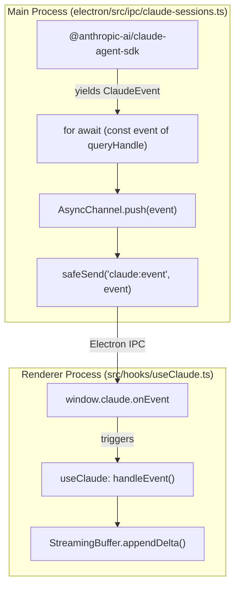
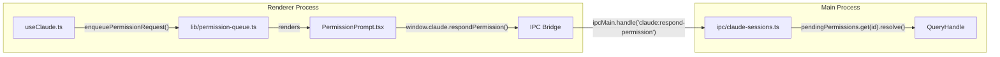

# Claude Engine: Sessions & Streaming

Relevant source files

The following files were used as context for generating this wiki page:

- [electron/src/ipc/claude-sessions.ts](electron/src/ipc/claude-sessions.ts)
- [electron/src/ipc/title-gen.ts](electron/src/ipc/title-gen.ts)
- [electron/src/lib/**tests**/claude-binary.test.ts](electron/src/lib/__tests__/claude-binary.test.ts)
- [electron/src/lib/**tests**/sdk.test.ts](electron/src/lib/__tests__/sdk.test.ts)
- [electron/src/lib/**tests**/session-derived-data.test.ts](electron/src/lib/__tests__/session-derived-data.test.ts)
- [electron/src/lib/claude-binary.ts](electron/src/lib/claude-binary.ts)
- [electron/src/lib/sdk.ts](electron/src/lib/sdk.ts)
- [src/components/PermissionPrompt.tsx](src/components/PermissionPrompt.tsx)
- [src/components/ToolCall.tsx](src/components/ToolCall.tsx)
- [src/components/ui/text-shimmer.tsx](src/components/ui/text-shimmer.tsx)
- [src/hooks/useClaude.ts](src/hooks/useClaude.ts)
- [src/hooks/useGitStatus.ts](src/hooks/useGitStatus.ts)
- [src/index.css](src/index.css)
- [src/lib/background-claude-handler.ts](src/lib/background-claude-handler.ts)
- [src/lib/background-session-store.ts](src/lib/background-session-store.ts)
- [src/lib/streaming-buffer.test.ts](src/lib/streaming-buffer.test.ts)
- [src/lib/streaming-buffer.ts](src/lib/streaming-buffer.ts)

The Claude Engine integration manages the lifecycle of the `@anthropic-ai/claude-agent-sdk` within Harnss. It coordinates between the Electron main process, which handles the stateful SDK instance and process spawning, and the React renderer, which manages the high-performance streaming UI and permission queueing.

## SDK Integration & Lifecycle

Harnss interacts with Claude through the `query` function exported by the SDK [electron/src/lib/sdk.ts:17-34](). In the main process, each session is encapsulated in a `SessionEntry` [electron/src/ipc/claude-sessions.ts:33-45]().

### Session Entry Structure

| Property             | Type                             | Description                                                                                      |
| :------------------- | :------------------------------- | :----------------------------------------------------------------------------------------------- |
| `channel`            | `AsyncChannel<unknown>`          | Buffers events from the SDK for the renderer [electron/src/ipc/claude-sessions.ts:34]().         |
| `queryHandle`        | `QueryHandle`                    | The active SDK query instance [electron/src/ipc/claude-sessions.ts:35]().                        |
| `pendingPermissions` | `Map<string, PendingPermission>` | Tracks tool-use requests awaiting user approval [electron/src/ipc/claude-sessions.ts:37]().      |
| `restarting`         | `boolean`                        | Flag to suppress exit events during a session reboot [electron/src/ipc/claude-sessions.ts:40](). |

### Startup & File Checkpointing

When a session starts, Harnss configures the SDK with `enableFileCheckpointing: true` [electron/src/ipc/claude-sessions.ts:19](). This allows the engine to emit checkpoint UUIDs, enabling the UI to support reverting file changes made via `Write`, `Edit`, or `NotebookEdit` tools [electron/src/ipc/claude-sessions.ts:16-23]().

**Sources:** [electron/src/ipc/claude-sessions.ts:1-45](), [electron/src/lib/sdk.ts:1-34]()

## Event Forwarding & AsyncChannel

The main process runs an event loop for each session that pulls messages from the SDK's `QueryHandle` (an `AsyncIterable`) and pushes them into an `AsyncChannel` [electron/src/ipc/claude-sessions.ts:7-9]().

### Main Process to Renderer Flow

1. **SDK Emit**: The SDK produces a `ClaudeEvent`.
2. **Main Loop**: `claude-sessions.ts` iterates over the `QueryHandle`.
3. **Channel Buffering**: Events are pushed to `AsyncChannel` to prevent backpressure if the renderer is busy.
4. **IPC Send**: Events are sent via `safeSend` to the renderer using the `claude:event` channel [electron/src/ipc/claude-sessions.ts:6]().

### Event Forwarding Loop

Title: Main Process Event Forwarding Loop

**Sources:** [electron/src/ipc/claude-sessions.ts:1-112](), [src/hooks/useClaude.ts:63-160]()

## Streaming & The StreamingBuffer

To achieve 60fps UI performance while handling high-frequency token deltas, Harnss uses a `StreamingBuffer` to decouple React state updates from incoming data [src/lib/streaming-buffer.ts:65-158]().

### Delta Merging & Overlap Detection

The SDK sometimes sends cumulative snapshots for "thinking" blocks rather than pure deltas. The `mergeStreamingChunk` utility uses a 200-character window to detect and resolve overlaps, ensuring content is not duplicated [src/lib/streaming-buffer.ts:7-26]().
In contrast, text deltas are treated as pure incremental chunks and are concatenated directly to avoid eating markdown-significant characters like pipes (`|`) or backticks (`` ` ``) at token boundaries [src/lib/streaming-buffer.ts:103-109]().

### High-Performance Flush Loop

`useClaude` implements an optimized `flushStreamingToState` callback [src/hooks/useClaude.ts:127-159]():

- **Index Caching**: It maintains `streamingIndexRef` to locate the active message in the `messages` array in $O(1)$ time [src/hooks/useClaude.ts:122]().
- **Thinking Throttle**: If only "thinking" content is arriving (which is usually hidden in the UI), flushes are throttled to 250ms to save CPU [src/hooks/useClaude.ts:166-174]().
- **rAF Scheduling**: Visible text deltas trigger a `requestAnimationFrame` flush to ensure smooth scrolling and rendering [src/hooks/useClaude.ts:180]().

**Sources:** [src/lib/streaming-buffer.ts:1-158](), [src/hooks/useClaude.ts:83-181]()

## Permission Queueing

When Claude attempts to use a tool (e.g., `Bash`, `Write`), the SDK pauses and emits a `permission_request`. Harnss manages these via a queueing system to prevent multiple dialogs from overlapping.

### Permission Lifecycle

1. **Request**: The SDK yields a `PermissionRequest`.
2. **Queue**: `useClaude` calls `enqueuePermissionRequest` [src/hooks/useClaude.ts:39]().
3. **UI Display**: The `PermissionPrompt` component renders the request [src/components/PermissionPrompt.tsx:185-190]().
4. **Resolution**: The user selects "Allow" or "Deny". The response is sent via IPC `claude:respond-permission`.
5. **Resume**: The main process resolves the `PendingPermission` promise, allowing the SDK to continue [electron/src/ipc/claude-sessions.ts:29-31]().

### Code Entity Association: Permissions

Title: Permission Request Handling Path

**Sources:** [src/hooks/useClaude.ts:39](), [src/components/PermissionPrompt.tsx:1-190](), [electron/src/ipc/claude-sessions.ts:25-45]()

## Context Compaction & Checkpointing

As conversations grow, the Claude SDK performs "compaction" to stay within model context limits. Harnss tracks this via system events.

- **Compaction Boundary**: When a `compact_boundary` event is received, `useClaude` inserts a `summary` role message into the thread [src/lib/background-claude-handler.ts:199-211](). This message displays the `compactPreTokens` count to inform the user of the context reduction [src/lib/background-claude-handler.ts:209]().
- **Status Tracking**: The `SystemStatusEvent` with `status: "compacting"` toggles the `isCompacting` state, which the UI uses to show a progress indicator [src/lib/background-claude-handler.ts:212-218]().

**Sources:** [src/lib/background-claude-handler.ts:197-218](), [src/hooks/useClaude.ts:73]()

## Background Session Handling

Harnss supports multi-tab usage where sessions continue to process in the background. The `BackgroundSessionStore` accumulates events for inactive sessions [src/lib/background-session-store.ts:48-52]().

When a user switches sessions:

1. **Suspend**: The active `useClaude` hook unmounts.
2. **Store**: The current state is moved to `BackgroundSessionStore` via `initFromState` [src/lib/background-session-store.ts:174-183]().
3. **Resume**: When switching back, the state is `consumed` from the store and passed as `initialMessages` to the new `useClaude` instance [src/lib/background-session-store.ts:150-167]().

**Sources:** [src/lib/background-session-store.ts:1-183](), [src/hooks/useClaude.ts:63-77]()
