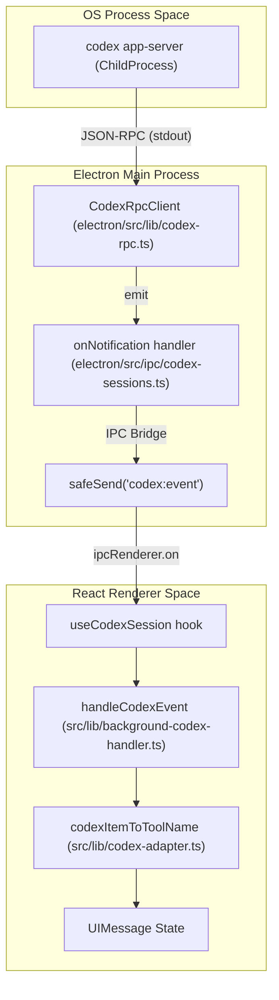
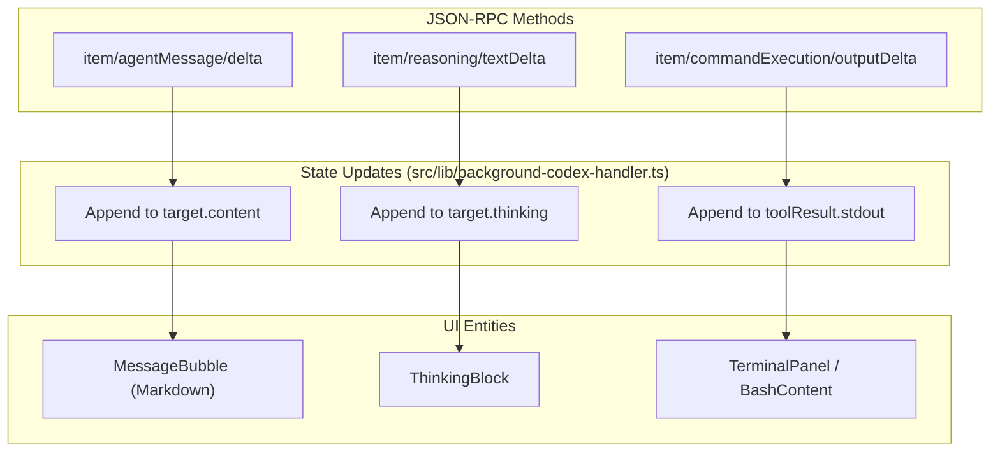

# Codex Engine: JSON-RPC Protocol

Relevant source files

The following files were used as context for generating this wiki page:

- [README.md](README.md)
- [electron/src/ipc/agent-registry.ts](electron/src/ipc/agent-registry.ts)
- [electron/src/ipc/codex-sessions.ts](electron/src/ipc/codex-sessions.ts)
- [electron/src/lib/agent-registry.ts](electron/src/lib/agent-registry.ts)
- [electron/src/lib/codex-binary.ts](electron/src/lib/codex-binary.ts)
- [electron/src/lib/codex-rpc.ts](electron/src/lib/codex-rpc.ts)
- [src/components/TabBar.tsx](src/components/TabBar.tsx)
- [src/components/lib/tool-metadata.ts](src/components/lib/tool-metadata.ts)
- [src/lib/background-acp-handler.ts](src/lib/background-acp-handler.ts)
- [src/lib/background-codex-handler.ts](src/lib/background-codex-handler.ts)
- [src/lib/codex-adapter.ts](src/lib/codex-adapter.ts)

Harnss integrates with the Codex CLI (OpenAI's coding agent) using a JSON-RPC app-server protocol. Unlike the Claude SDK, which uses a direct library integration, the Codex engine operates as a managed subprocess that communicates over standard I/O using JSON-RPC messages [electron/src/ipc/codex-sessions.ts:4-7](). This architecture allows Harnss to leverage Codex's native capabilities—such as Plan Mode, sandbox policies, and multi-file editing—while providing a rich, interactive UI.

## Binary Management & Lifecycle

The `CodexRpcClient` manages the lifecycle of the `codex app-server` process. Harnss employs a tiered search strategy to locate the Codex binary, prioritizing newer versions found in desktop application bundles over system-wide CLI installations [electron/src/lib/codex-binary.ts:4-9]().

### Binary Resolution Order

1.  **`CODEX_CLI_PATH`**: Explicit environment variable override [electron/src/lib/codex-binary.ts:85-86]().
2.  **Managed Binary**: A copy downloaded and maintained by Harnss in the `userData` directory [electron/src/lib/codex-binary.ts:89-90]().
3.  **Known Locations**: Hardcoded paths for macOS (e.g., `/Applications/Codex.app/...`) and Linux [electron/src/lib/codex-binary.ts:26-35]().
4.  **System PATH**: Fallback to `which codex` or `where codex` [electron/src/lib/codex-binary.ts:101-107]().

### Auto-Download via NPM

If no binary is found, Harnss triggers an automatic download using `npm pack @openai/codex` [electron/src/lib/codex-binary.ts:10-12](). The downloaded binary is stored in the "managed" location and is refreshed every 24 hours to ensure compatibility with protocol updates [electron/src/lib/codex-binary.ts:116-122]().

**Sources:** [electron/src/lib/codex-binary.ts:4-109](), [electron/src/lib/codex-binary.ts:116-122](), [electron/src/ipc/codex-sessions.ts:15-16]()

## JSON-RPC Protocol & Adapter Layer

The Codex protocol is item-based, emitting notifications for `item/started`, `item/completed`, and various delta types (text, reasoning, and command output) [electron/src/ipc/codex-sessions.ts:21-31](). Harnss uses a translation layer (`codex-adapter.ts`) to map these items into the standard `UIMessage` format used by the renderer [src/lib/codex-adapter.ts:4-6]().

### Item Translation Mapping

| Codex Item Type    | UI Tool Name            | UI Role     |
| :----------------- | :---------------------- | :---------- |
| `commandExecution` | `Bash`                  | `tool_call` |
| `fileChange`       | `Edit` or `Write`       | `tool_call` |
| `mcpToolCall`      | `mcp__[server]__[tool]` | `tool_call` |
| `webSearch`        | `WebSearch`             | `tool_call` |
| `agentMessage`     | N/A                     | `assistant` |

**Sources:** [src/lib/codex-adapter.ts:33-48](), [src/lib/codex-adapter.ts:51-56](), [electron/src/ipc/codex-sessions.ts:102-122]()

### Data Flow: Engine to Code Entity Space

The following diagram illustrates how a JSON-RPC notification from the Codex process is routed through the Main process and translated for the Renderer.

**Codex Event Routing Diagram**

**Sources:** [electron/src/lib/codex-rpc.ts:22-26](), [electron/src/ipc/codex-sessions.ts:151-182](), [src/lib/background-codex-handler.ts:13-22](), [src/lib/codex-adapter.ts:33-48]()

## Plan Mode & Approval Policies

Codex supports a "Plan Mode" where the agent drafts a sequence of steps before execution. Harnss captures `turn/plan/updated` notifications to populate the `TodoPanel` and `codexPlanText` state [electron/src/ipc/codex-sessions.ts:123-126](), [src/lib/background-codex-handler.ts:27-28]().

### Approval Flow

When Codex requires user permission (e.g., for a file edit or command), it sends a server request. Harnss intercepts these in `onServerRequest` and forwards them to the renderer as `codex:approval_request` [electron/src/ipc/codex-sessions.ts:184-194]().

1.  **Request**: The engine sends a JSON-RPC request with a unique `rpcId` [electron/src/ipc/codex-sessions.ts:192]().
2.  **UI Interaction**: The user clicks "Approve" or "Reject" in the `ToolCall` card.
3.  **Response**: The renderer invokes `codex:respond_to_approval`, which calls `rpc.sendResponse` back to the engine [electron/src/ipc/codex-sessions.ts:384-387]().

**Sources:** [electron/src/ipc/codex-sessions.ts:184-200](), [electron/src/ipc/codex-sessions.ts:380-391](), [src/lib/background-codex-handler.ts:76-112]()

## Item-Based Streaming

Codex provides granular streaming for different content types. Harnss utilizes a `StreamingBuffer` to accumulate these deltas before flushing them to the UI [src/lib/codex-adapter.ts:16]().

**Streaming Event Logic Diagram**

**Sources:** [src/lib/background-codex-handler.ts:132-143](), [src/lib/background-codex-handler.ts:145-154](), [src/lib/background-codex-handler.ts:156-180](), [electron/src/ipc/codex-sessions.ts:110-122]()

### Sandbox Modes

The engine supports a `sandbox` policy, which is passed during the `thread/start` or `thread/resume` handshake [electron/src/ipc/codex-sessions.ts:48-49](). This restricts the agent's ability to access the host filesystem or network, depending on the session configuration.

**Sources:** [electron/src/ipc/codex-sessions.ts:37-50](), [electron/src/ipc/codex-sessions.ts:208-220]()
