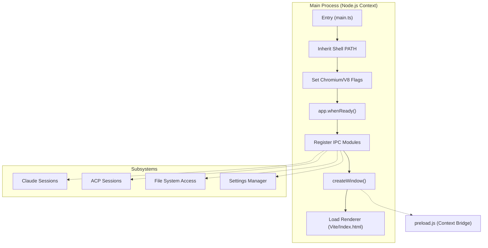
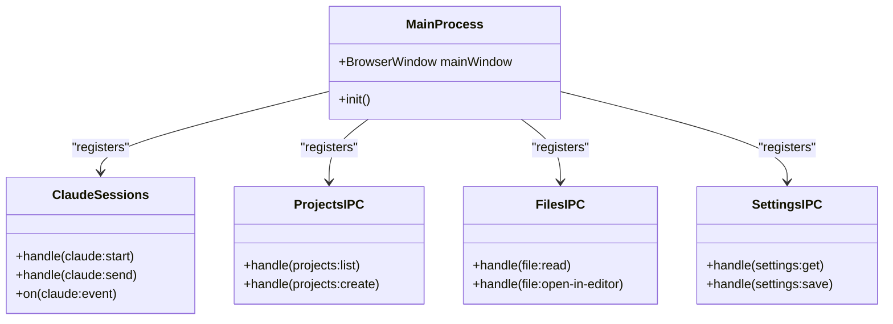

# Electron Main Process Architecture

Relevant source files

The following files were used as context for generating this wiki page:

- [electron/src/main.ts](electron/src/main.ts)
- [electron/src/preload.ts](electron/src/preload.ts)
- [package.json](package.json)
- [pnpm-lock.yaml](pnpm-lock.yaml)
- [src/types/window.d.ts](src/types/window.d.ts)

The Electron main process serves as the trusted backbone of the Harnss application. It is responsible for orchestrating the application lifecycle, managing native window resources, and providing a secure bridge between the web-based renderer and the underlying operating system.

## Process Initialization & Lifecycle

The entry point for the main process is `electron/src/main.ts`. Upon startup, the process performs several critical initialization steps before the UI is presented to the user:

1.  **Environment Sanitization**: On non-Windows platforms, the process explicitly inherits the user's shell `PATH` to ensure that AI SDKs and CLI tools (like `node` or `git`) can be resolved correctly [electron/src/main.ts:10-21]().
2.  **Performance Optimization**: Before the app is ready, specific Chromium and V8 flags are set to enable GPU acceleration and optimize JS compilation [electron/src/main.ts:51-54]().
3.  **Window Creation**: The `createWindow` function initializes the `BrowserWindow` with platform-specific configurations for transparency and title bar styles [electron/src/main.ts:72-111]().
4.  **IPC Registration**: All functional modules (Claude, Projects, Files, etc.) register their IPC handlers to listen for requests from the renderer [electron/src/main.ts:33-47]().

### Initialization Sequence

The following diagram illustrates the startup sequence and the relationship between the Main Process and its subsystems.

**Main Process Startup Flow**

Sources: [electron/src/main.ts:1-62](), [electron/src/main.ts:72-111]()

## Window & Resource Management

Harnss manages a single primary `BrowserWindow` but applies significant platform-specific logic to achieve a native "glass" feel.

| Feature | macOS (Tahoe+) | Windows 11 | Linux / Older macOS |
| :--- | :--- | :--- | :--- |
| **Transparency** | `liquidGlass` (Native Addon) | Native `mica` material | Opaque Background |
| **Title Bar** | `hidden` (Custom traffic lights) | Native (Auto-hide menu) | `hiddenInset` |
| **Minimum Width** | Dynamic via `app:set-min-width` | Dynamic + Frame Buffer | Dynamic |

The window's minimum width is dynamically adjusted via IPC based on the renderer's layout state (e.g., whether side panels or the Task panel are visible) [electron/src/main.ts:171-180]().

Sources: [electron/src/main.ts:72-109](), [electron/src/main.ts:141-152](), [electron/src/main.ts:171-180]()

## IPC Module Architecture

The main process is decoupled into specialized IPC modules. Each module is responsible for a specific domain of the application's functionality.

**Code Entity Mapping: IPC Handlers**

Sources: [electron/src/main.ts:33-47](), [electron/src/preload.ts:43-123]()

### IPC Bridge & Preload API
The `preload.ts` script acts as the secure gateway, exposing a structured `window.claude` API to the renderer while keeping `nodeIntegration` disabled. It maps high-level frontend calls to `ipcRenderer.invoke` or `ipcRenderer.send` operations.

For a deep dive into the available API surface and the event subscription model, see **[IPC Bridge & Preload API](#2.1)**.

### Native OS Integrations
The main process coordinates native features such as:
*   **Terminal Emulation**: Spawning PTYs via `node-pty`.
*   **Global Shortcuts**: Registering system-wide hotkeys.
*   **Liquid Glass**: Interfacing with the native macOS transparency engine.

For details on platform-specific implementations, see **[Native OS Integrations](#2.2)**.

### Settings & Data Persistence
Application state and user preferences are managed through a dual-process synchronization pattern. The main process handles the initial load of `settings.json` from the `userData` directory and watches for updates that require process-level changes (like changing the AI binary path).

For details on how data is persisted and synchronized, see **[Settings, Data Storage & Analytics](#2.3)**.

## Security Model

Harnss follows Electron security best practices:
*   **Context Isolation**: Enabled to ensure the renderer cannot access Node.js internals [electron/src/main.ts:85]().
*   **Node Integration**: Disabled in the renderer [electron/src/main.ts:86]().
*   **Navigation Restrictions**: All external links are intercepted and opened in the default system browser rather than within the app [electron/src/main.ts:131-139]().
*   **Permission Handlers**: The main process acts as the final arbiter for sensitive operations requested by AI agents (e.g., file writes, command execution).

Sources: [electron/src/main.ts:83-90](), [electron/src/main.ts:131-140]()