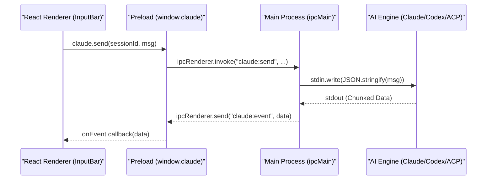
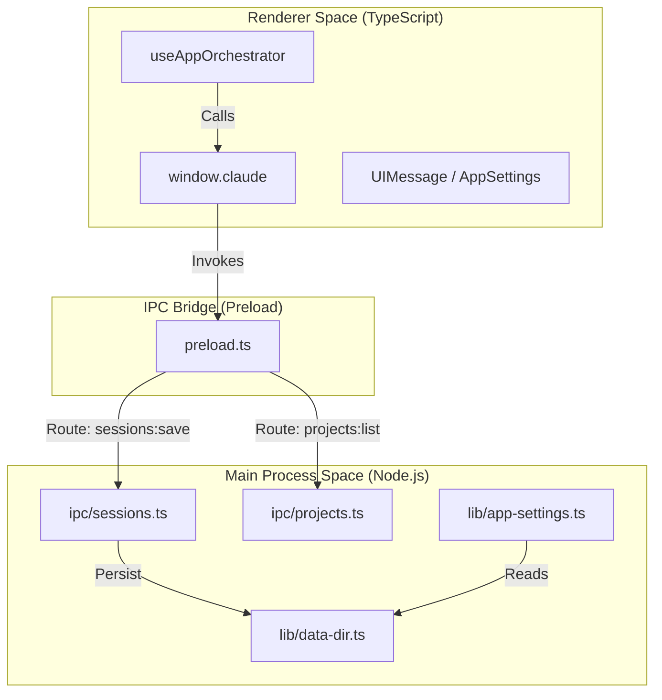

# IPC Bridge & Preload API

Relevant source files

The following files were used as context for generating this wiki page:

- [electron/src/ipc/sessions.ts](electron/src/ipc/sessions.ts)
- [electron/src/ipc/spaces.ts](electron/src/ipc/spaces.ts)
- [electron/src/lib/app-settings.ts](electron/src/lib/app-settings.ts)
- [electron/src/preload.ts](electron/src/preload.ts)
- [src/components/IconPicker.tsx](src/components/IconPicker.tsx)
- [src/components/SettingsView.tsx](src/components/SettingsView.tsx)
- [src/components/settings/AboutSettings.tsx](src/components/settings/AboutSettings.tsx)
- [src/components/settings/AdvancedSettings.tsx](src/components/settings/AdvancedSettings.tsx)
- [src/components/settings/PlaceholderSection.tsx](src/components/settings/PlaceholderSection.tsx)
- [src/lib/icon-utils.ts](src/lib/icon-utils.ts)
- [src/types/ui.ts](src/types/ui.ts)
- [src/types/window.d.ts](src/types/window.d.ts)

The IPC (Inter-Process Communication) Bridge is the central nervous system of Harnss, connecting the isolated React renderer process to the privileged Electron main process. It defines a strict, type-safe API surface through the `contextBridge`, ensuring the frontend can request native operations (like file system access, process spawning, and OS-level settings) without exposing dangerous Node.js primitives.

## The Preload Script & `window.claude`

The preload script acts as a gatekeeper. It uses Electron's `contextBridge.exposeInMainWorld` to attach a single global object, `window.claude`, to the renderer's window context [electron/src/preload.ts:43-43](). This object contains namespaced methods that wrap `ipcRenderer.invoke` (for request-response patterns) and `ipcRenderer.send` (for fire-and-forget notifications).

### Early Initialization

Before the React application mounts, the preload script performs critical UI synchronization:

1.  **Platform Detection**: It injects a `platform-${process.platform}` class into the `<html>` element to allow for platform-specific CSS [electron/src/preload.ts:28-28]().
2.  **Transparency Support**: It checks if the OS supports "Glass" effects (e.g., macOS Vibrancy or Windows Acrylic) and applies the `glass-enabled` class if the user has enabled it in `localStorage` [electron/src/preload.ts:29-38]().

### IPC Communication Patterns

Harnss utilizes two primary communication patterns:

| Pattern                | Implementation                          | Use Case                                                                            |
| :--------------------- | :-------------------------------------- | :---------------------------------------------------------------------------------- |
| **Invoke/Handle**      | `ipcRenderer.invoke` / `ipcMain.handle` | Asynchronous requests that return a value (e.g., `projects.list`, `sessions.load`). |
| **Event Subscription** | `ipcRenderer.on`                        | Real-time streaming data from the main process (e.g., AI stdout, terminal output).  |

## API Namespaces

The `window.claude` API is divided into logical namespaces to manage the complexity of the AI orchestration platform.

### Core Engine Control

These methods manage the lifecycle of AI processes (Claude, Codex, or ACP).

- `start(options)`: Spawns the underlying AI binary with specific environment variables and working directories [electron/src/preload.ts:46-46]().
- `send(sessionId, message)`: Dispatches a message to the active engine [electron/src/preload.ts:47-47]().
- `onEvent(callback)`: Subscribes to the `claude:event` channel, which streams tool calls, thinking blocks, and text responses [electron/src/preload.ts:56-60]().
- `respondPermission(...)`: Sends user approval/denial back to the engine for restricted tool use [electron/src/preload.ts:76-77]().

### Project & Session Management

Harnss implements a hierarchical storage model: **Spaces > Projects > Sessions**.

- **Projects**: Managed via `window.claude.projects`. Operations include `list`, `create`, `delete`, and `updateIcon` [electron/src/preload.ts:103-112]().
- **Sessions**: Managed via `window.claude.sessions`. These are persisted as JSON files in the user data directory [electron/src/ipc/sessions.ts:34-49](). To optimize performance, the main process also maintains `.meta.json` sidecar files for fast sidebar listing without parsing large chat histories [electron/src/ipc/sessions.ts:86-105]().

### System & Native Integration

- **File System**: `readFile(path)` and `openInEditor(path)` provide controlled access to the local disk [electron/src/preload.ts:97-99]().
- **Settings**: `settings.get()` and `settings.set(patch)` synchronize the `AppSettings` interface between the UI and the `settings.json` file [src/components/SettingsView.tsx:122-130]().
- **Git & Terminal**: Dedicated namespaces for worktree management and PTY-based terminal emulation.

## Data Flow: Message Dispatch

The following diagram illustrates the flow of a user message from the UI through the IPC bridge to the AI Engine.

### User Message Sequence

**Sources:** [electron/src/preload.ts:47-47](), [electron/src/preload.ts:56-60](), [src/types/window.d.ts:66-69]()

## Code Entity Mapping

The IPC Bridge connects high-level UI concepts to specific backend implementation classes and data structures.

### System Entity Map

**Sources:** [electron/src/preload.ts:103-123](), [electron/src/ipc/sessions.ts:34-64](), [electron/src/lib/app-settings.ts:102-126](), [src/types/ui.ts:136-164]()

## Event Subscription Model

Subscriptions in the bridge return a cleanup function to prevent memory leaks in the React lifecycle. When a component calls `onEvent`, the preload script creates a listener and returns a function that calls `ipcRenderer.removeListener` [electron/src/preload.ts:56-60]().

### Available Event Channels

| Channel                     | Source File     | Description                                                 |
| :-------------------------- | :-------------- | :---------------------------------------------------------- |
| `claude:event`              | `preload.ts:58` | Main stream for assistant messages and tool calls.          |
| `claude:stderr`             | `preload.ts:63` | Raw error output from the AI process.                       |
| `claude:exit`               | `preload.ts:68` | Notifies the UI when an engine process terminates.          |
| `claude:permission_request` | `preload.ts:73` | Triggered when an engine requires user approval for a tool. |

**Sources:** [electron/src/preload.ts:1-126](), [src/types/window.d.ts:1-152](), [electron/src/ipc/sessions.ts:1-155](), [electron/src/lib/app-settings.ts:1-146](), [src/types/ui.ts:1-213]()
