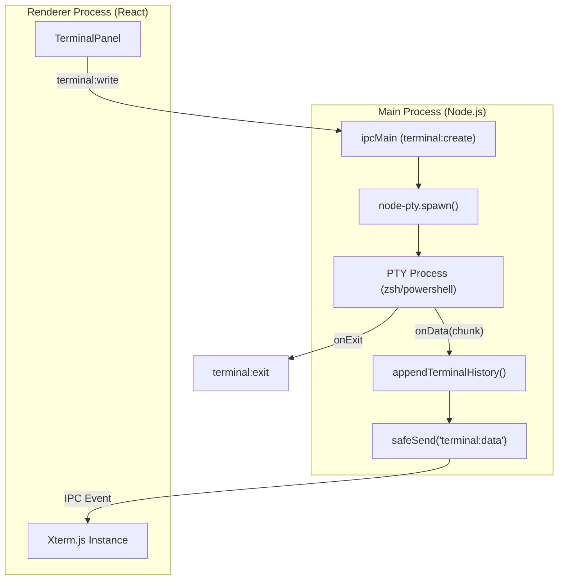
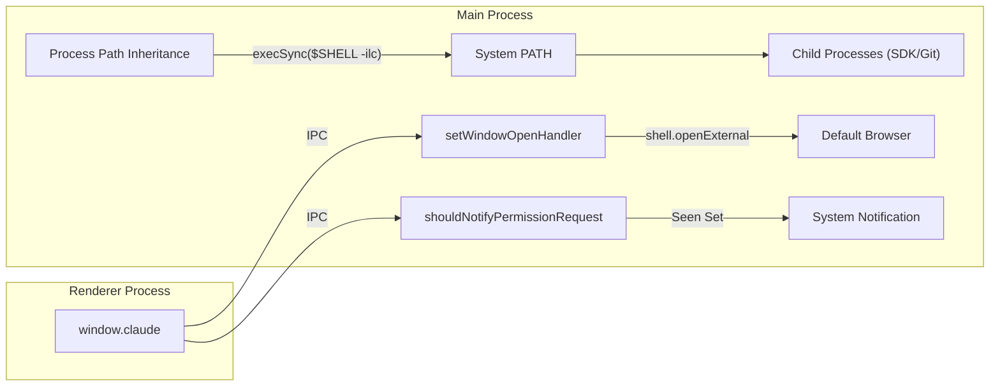

# Native OS Integrations

Relevant source files

The following files were used as context for generating this wiki page:

- [electron/src/ipc/terminal.ts](electron/src/ipc/terminal.ts)
- [electron/src/lib/__tests__/notification-utils.test.ts](electron/src/lib/__tests__/notification-utils.test.ts)
- [electron/src/lib/__tests__/terminal-history.test.ts](electron/src/lib/__tests__/terminal-history.test.ts)
- [electron/src/lib/__tests__/terminal-tabs.test.ts](electron/src/lib/__tests__/terminal-tabs.test.ts)
- [electron/src/lib/terminal-history.ts](electron/src/lib/terminal-history.ts)
- [electron/src/main.ts](electron/src/main.ts)
- [package.json](package.json)
- [pnpm-lock.yaml](pnpm-lock.yaml)
- [pnpm-workspace.yaml](pnpm-workspace.yaml)
- [scripts/delay.js](scripts/delay.js)

The Harnss main process coordinates platform-specific APIs to provide a high-performance, native-feeling desktop experience. This includes advanced window transparency effects, a robust PTY-based terminal system, and hardware-accelerated rendering configurations.

## Visual Effects & Window Management

Harnss implements modern transparency effects tailored to each operating system. It uses a combination of native Electron properties and specialized third-party libraries to achieve "Glass" and "Mica" aesthetics.

### Liquid Glass (macOS Tahoe+)
On macOS, Harnss utilizes the `electron-liquid-glass` library to provide a blurred transparency effect that integrates with the system wallpaper [package.json:41-41](). This is conditionally enabled and requires specific Chromium flags to be set before the app is ready [electron/src/main.ts:57-60]().

### Mica & Acrylic (Windows 11)
For Windows users, the application leverages Electron's native `backgroundMaterial` property. By setting this to `"mica"`, the window adopts the Windows 11 design language, automatically handling DWM (Desktop Window Manager) transparency without requiring `transparent: true` [electron/src/main.ts:98-103]().

### Visual Implementation Logic
The window configuration is determined during initialization in `createWindow` based on the host platform and the `glassEnabled` flag [electron/src/main.ts:72-111]().

| Feature | macOS (Tahoe+) | Windows 11 | Linux / Older macOS |
| :--- | :--- | :--- | :--- |
| **Transparency** | `electron-liquid-glass` | Native `mica` | None (Solid Color) |
| **Title Bar** | `hidden` | `autoHideMenuBar` | `hiddenInset` |
| **Traffic Lights** | Custom `{ x: 19, y: 19 }` | Standard Windows | Standard macOS |
| **Background** | Transparent | Native Material | `#040404` |

**Sources:** [electron/src/main.ts:72-111](), [electron/src/main.ts:141-151](), [package.json:41-41]()

---

## PTY Terminal Spawning

Harnss provides a fully functional terminal via `node-pty`, allowing users to interact with their system shell (zsh, bash, or powershell) directly within the app [package.json:46-46]().

### Implementation Details
The terminal lifecycle is managed in `electron/src/ipc/terminal.ts`. When a terminal is created, the system identifies the appropriate shell path (e.g., `COMSPEC` on Windows or `SHELL` on Unix) and spawns a PTY process [electron/src/ipc/terminal.ts:46-61]().

*   **Data Flow:** Output from the PTY process is captured via `ptyProcess.onData`, appended to a local history buffer, and forwarded to the renderer via the `terminal:data` IPC event [electron/src/ipc/terminal.ts:78-83]().
*   **History Management:** To prevent memory exhaustion, the app maintains a `TerminalHistoryState` with a maximum character limit of 250,000 [electron/src/lib/terminal-history.ts:1-11]().
*   **Cleanup:** Terminals are tracked in a `terminals` Map and can be destroyed individually or by "Space" (grouping) [electron/src/ipc/terminal.ts:160-180]().

### Terminal Process Architecture
"Terminal Lifecycle and Data Flow"

**Sources:** [electron/src/ipc/terminal.ts:33-102](), [electron/src/lib/terminal-history.ts:13-35](), [package.json:46-46]()

---

## Performance & GPU Optimization

Harnss applies aggressive V8 and Chromium performance flags to ensure the UI remains responsive, especially when rendering complex AI-generated markdown or Mermaid diagrams. These must be set via `app.commandLine.appendSwitch` before the `app.whenReady()` event [electron/src/main.ts:50-54]().

| Flag | Purpose |
| :--- | :--- |
| `enable-gpu-rasterization` | Forces GPU rasterization for all content to reduce CPU load. |
| `enable-zero-copy` | Avoids expensive CPU→GPU memory copies for rasterized tiles. |
| `ignore-gpu-blocklist` | Enables GPU acceleration even on hardware not officially supported by Chrome. |
| `CanvasOopRasterization` | Moves canvas rasterization off the main thread to prevent UI jank. |
| `v8CacheOptions` | Set to `bypassHeatCheckAndEagerCompile` to eliminate cold-start lag by caching compiled JS. |

**Sources:** [electron/src/main.ts:50-54](), [electron/src/main.ts:89-89]()

---

## System Integration & Permissions

Harnss bridges the gap between the sandboxed renderer and the native OS through several handlers and environment adjustments.

### Path Inheritance
Packaged macOS applications often launch with a minimal `$PATH`. Harnss detects the user's shell (e.g., `/bin/zsh`) and executes an interactive login shell command to inherit the full user environment. This ensures that child processes like `git` or AI SDKs can find necessary binaries [electron/src/main.ts:10-21]().

### Permission & Navigation Handlers
*   **External Links:** The `setWindowOpenHandler` and `will-navigate` listeners intercept URL requests, preventing the Electron window from navigating away from the app and instead opening links in the user's default browser [electron/src/main.ts:131-140]().
*   **Global Shortcuts:** The app registers global shortcuts via Electron's `globalShortcut` module, though implementation details for specific keys are managed within the main process lifecycle [electron/src/main.ts:2-2]().
*   **Clipboard:** A dedicated IPC handler `clipboard:write-text` allows the renderer to securely write to the system clipboard [electron/src/main.ts:159-166]().

### Permission Notification Logic
Harnss includes a utility to manage notifications for AI agent permission requests. The `shouldNotifyPermissionRequest` function ensures that the user is only notified once for a specific request ID within a session, preventing notification fatigue when the app moves between foreground and background [electron/src/lib/notification-utils.test.ts:56-103]().

"System Environment and Permission Bridge"

**Sources:** [electron/src/main.ts:10-21](), [electron/src/main.ts:131-140](), [electron/src/lib/notification-utils.test.ts:56-103]()