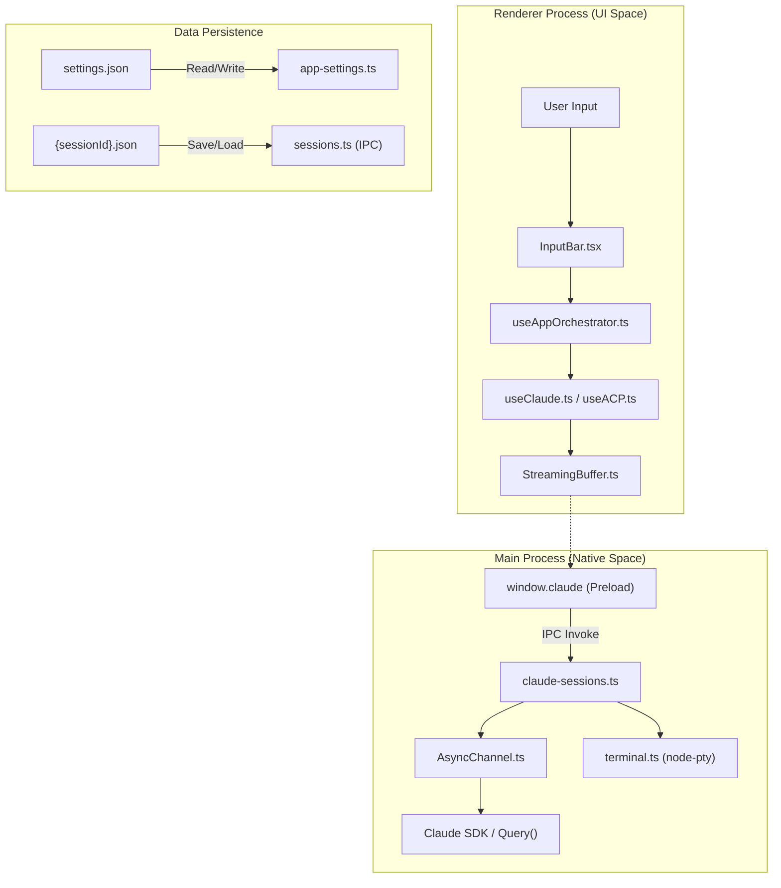
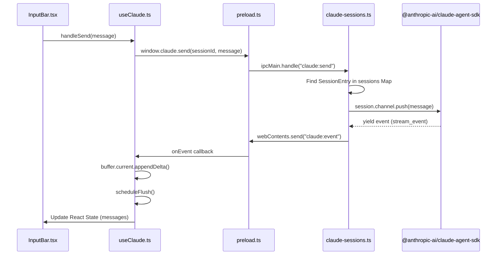

# Glossary

Relevant source files

The following files were used as context for generating this wiki page:

- [.claude/skills/release/references/release-notes-template.md](.claude/skills/release/references/release-notes-template.md)
- [CLAUDE.md](CLAUDE.md)
- [README.md](README.md)
- [electron/src/ipc/acp-sessions.ts](electron/src/ipc/acp-sessions.ts)
- [electron/src/ipc/claude-sessions.ts](electron/src/ipc/claude-sessions.ts)
- [electron/src/lib/app-settings.ts](electron/src/lib/app-settings.ts)
- [electron/src/main.ts](electron/src/main.ts)
- [electron/src/preload.ts](electron/src/preload.ts)
- [package.json](package.json)
- [pnpm-lock.yaml](pnpm-lock.yaml)
- [shared/types/engine.ts](shared/types/engine.ts)
- [src/components/AppLayout.tsx](src/components/AppLayout.tsx)
- [src/components/BackgroundAgentsPanel.tsx](src/components/BackgroundAgentsPanel.tsx)
- [src/components/InputBar.test.ts](src/components/InputBar.test.ts)
- [src/components/InputBar.tsx](src/components/InputBar.tsx)
- [src/components/SettingsView.tsx](src/components/SettingsView.tsx)
- [src/components/SummaryBlock.tsx](src/components/SummaryBlock.tsx)
- [src/components/TurnChangesSummary.tsx](src/components/TurnChangesSummary.tsx)
- [src/components/settings/AboutSettings.tsx](src/components/settings/AboutSettings.tsx)
- [src/components/settings/AdvancedSettings.tsx](src/components/settings/AdvancedSettings.tsx)
- [src/components/settings/PlaceholderSection.tsx](src/components/settings/PlaceholderSection.tsx)
- [src/hooks/useACP.ts](src/hooks/useACP.ts)
- [src/hooks/useAppOrchestrator.ts](src/hooks/useAppOrchestrator.ts)
- [src/hooks/useBackgroundAgents.ts](src/hooks/useBackgroundAgents.ts)
- [src/hooks/useClaude.ts](src/hooks/useClaude.ts)
- [src/hooks/useCodex.ts](src/hooks/useCodex.ts)
- [src/hooks/useEngineBase.ts](src/hooks/useEngineBase.ts)
- [src/hooks/useSessionManager.ts](src/hooks/useSessionManager.ts)
- [src/lib/acp-adapter.ts](src/lib/acp-adapter.ts)
- [src/lib/background-agent-store.ts](src/lib/background-agent-store.ts)
- [src/lib/codex-adapter.ts](src/lib/codex-adapter.ts)
- [src/types/index.ts](src/types/index.ts)
- [src/types/protocol.ts](src/types/protocol.ts)
- [src/types/ui.ts](src/types/ui.ts)
- [src/types/window.d.ts](src/types/window.d.ts)

This glossary defines the core concepts, protocols, and architectural terms used within the Harnss codebase. It serves as a reference for onboarding engineers to understand the mapping between domain language and implementation details.

## Core Architectural Terms

### App Orchestrator

The central React hook that coordinates the entire application state. It wires together session management, project management, settings, and UI panel states.

- **Implementation**: `useAppOrchestrator` [src/hooks/useAppOrchestrator.ts]()
- **Role**: Serves as the "brain" of the renderer process, providing a unified interface for components to interact with various sub-systems [src/components/AppLayout.tsx:57-79]().

### IPC Bridge

The communication layer between the Electron Main process and the Renderer process. It uses `contextBridge` to expose a restricted `window.claude` API.

- **Implementation**: `electron/src/preload.ts` [electron/src/preload.ts:43-126]()
- **Namespaces**: Includes `projects`, `sessions`, `spaces`, `git`, `terminal`, `files`, and engine-specific calls for `claude`, `acp`, and `codex`.

### Island Layout

A UI mode where panels are rendered as floating "islands" with rounded corners and gaps, often used in conjunction with macOS "Liquid Glass" transparency.

- **Constants**: `ISLAND_RADIUS`, `ISLAND_GAP` [src/components/AppLayout.tsx:9-16]().
- **Toggle**: Managed via `settings.transparency` and `glassSupported` [src/components/AppLayout.tsx:81-88]().

## Engine & Protocol Concepts

### ACP (Agent Client Protocol)

A standardized protocol for interacting with AI agents. Harnss acts as an ACP client, spawning agent processes and communicating via JSON-RPC over stdio.

- **Implementation**: `useACP` [src/hooks/useACP.ts]() and `acp-adapter` [src/lib/acp-adapter.ts]().
- **Process Management**: Handled in the main process via `acp-sessions.ts` [electron/src/ipc/acp-sessions.ts]().

### Codex Protocol

A JSON-RPC app-server protocol used specifically for the Codex CLI. It supports advanced features like "Plan Mode" and approval policies.

- **Implementation**: `useCodex` [src/hooks/useCodex.ts]() and `codex-adapter` [src/lib/codex-adapter.ts]().
- **Types**: Located in `shared/types/codex-protocol/` [CLAUDE.md:26-28]().

### AsyncChannel

A push-based async iterable used by the Claude SDK to handle multi-turn conversations. It allows the main process to "push" user messages into an active SDK `query()` loop.

- **Implementation**: `AsyncChannel` [electron/src/lib/async-channel.ts]()
- **Usage**: Each session entry in `claude-sessions.ts` maintains an `AsyncChannel` [electron/src/ipc/claude-sessions.ts:34-47]().

### StreamingBuffer

A renderer-side utility that accumulates incremental deltas (text, thinking, tool JSON) from the AI engine and flushes them to the React state.

- **Implementation**: `StreamingBuffer` [src/lib/streaming-buffer.ts]()
- **Optimization**: Uses `requestAnimationFrame` via `scheduleFlush` to prevent UI jank during high-frequency updates [src/hooks/useClaude.ts:127-180]().

## System Entity Mapping

### Natural Language to Code Entity Space

The following diagram maps high-level system concepts to their specific implementation classes and file locations.

**Sources**: [src/components/AppLayout.tsx](), [electron/src/preload.ts](), [src/hooks/useAppOrchestrator.ts](), [electron/src/ipc/claude-sessions.ts]().

### AI Engine Data Flow

This diagram illustrates how a message travels from the UI through the various protocol adapters to the underlying AI process.

**Sources**: [src/hooks/useClaude.ts:127-180](), [electron/src/ipc/claude-sessions.ts:47-112](), [electron/src/preload.ts:47-60]().

## Technical Glossary Table

| Term                   | Definition                                                                                 | Code Reference                                                   |
| :--------------------- | :----------------------------------------------------------------------------------------- | :--------------------------------------------------------------- |
| **Draft Session**      | A session that exists only in UI state (`DRAFT_ID`) until the first message is sent.       | [src/hooks/useAppOrchestrator.ts]()                              |
| **Context Compaction** | The process of summarizing old messages to fit within the LLM context window.              | `SystemCompactBoundaryEvent` [src/hooks/useClaude.ts:7]()        |
| **Element Grab**       | Feature allowing users to "grab" DOM elements from the internal browser to use as context. | `GrabbedElement` [src/types/ui.ts:103-120]()                     |
| **Glass Support**      | Native transparency (Mica on Windows, Liquid Glass on macOS).                              | `getGlassSupported` [electron/src/main.ts:155-157]()             |
| **MCP**                | Model Context Protocol; allows agents to use external tools (Jira, Google, etc.).          | `McpServerConfig` [src/types/ui.ts:213]()                        |
| **PTY**                | Pseudo-terminal; used to run real shell processes for the terminal panel.                  | `node-pty` [package.json:50](), [electron/src/ipc/terminal.ts]() |
| **Permission Mode**    | Controls AI autonomy: `ask` (prompt), `auto_accept` (approve), `allow_all` (bypass).       | `AppPermissionBehavior` [src/types/engine.ts]()                  |
| **Plan Mode**          | A state where the agent drafts a task list before executing tool calls.                    | `planMode` in `SessionBase` [src/types/ui.ts:193]()              |
| **Space**              | A logical grouping of projects with a shared theme and icon.                               | `Space` [src/types/ui.ts:69-77]()                                |
| **Task Agent**         | A sub-agent spawned by a primary session to perform a specific background task.            | `TaskStartedEvent` [src/hooks/useClaude.ts:8]()                  |

**Sources**: [src/types/ui.ts](), [src/types/engine.ts](), [package.json](), [electron/src/main.ts]().
