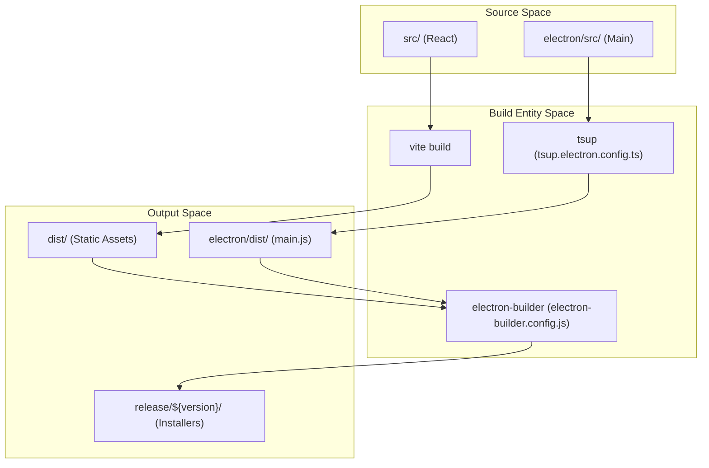
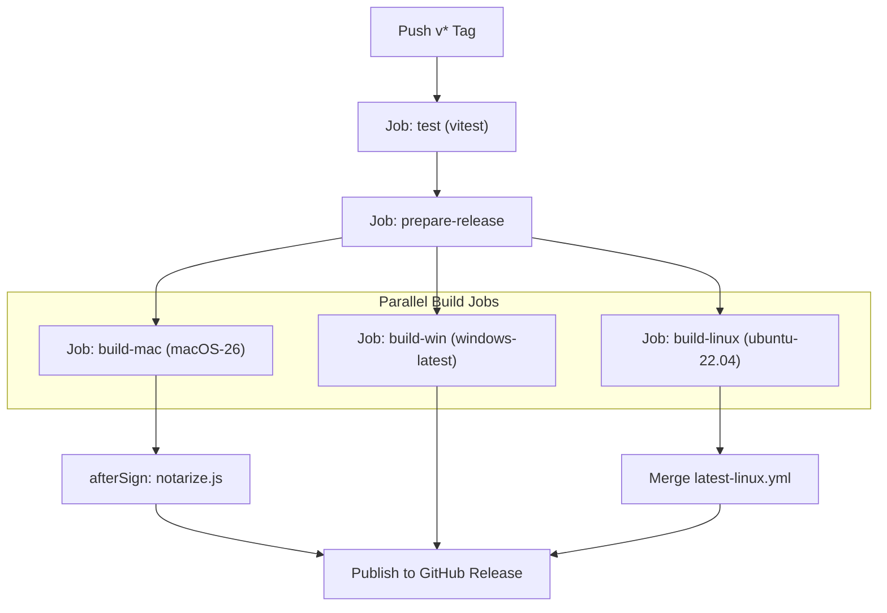

# Build, Packaging & Release

Relevant source files

The following files were used as context for generating this wiki page:

- [.github/CODEOWNERS](.github/CODEOWNERS)
- [.github/ISSUE_TEMPLATE/bug_report.yml](.github/ISSUE_TEMPLATE/bug_report.yml)
- [.github/ISSUE_TEMPLATE/config.yml](.github/ISSUE_TEMPLATE/config.yml)
- [.github/ISSUE_TEMPLATE/feature_request.yml](.github/ISSUE_TEMPLATE/feature_request.yml)
- [.github/pull_request_template.md](.github/pull_request_template.md)
- [.github/workflows/build.yml](.github/workflows/build.yml)
- [electron-builder.config.js](electron-builder.config.js)
- [electron/src/lib/updater.ts](electron/src/lib/updater.ts)
- [electron/src/main.ts](electron/src/main.ts)
- [package.json](package.json)
- [pnpm-lock.yaml](pnpm-lock.yaml)
- [src/components/UpdateBanner.tsx](src/components/UpdateBanner.tsx)

This page details the build pipeline and release infrastructure of Harnss. The project uses a combination of **Vite** for the renderer, **tsup** for the Electron main process, and **electron-builder** for cross-platform packaging.

## Build Pipeline Overview

The build process is divided into two primary stages: compiling the source code and packaging the binaries.

1.  **Main Process Compilation**: Handled by `tsup`, which bundles `electron/src/main.ts` and its dependencies into `electron/dist/main.js` [package.json:16-18]().
2.  **Renderer Compilation**: Handled by `vite`, which processes the React application and outputs static assets to the `dist/` directory [package.json:20]().
3.  **Packaging**: `electron-builder` consumes the outputs of both stages to create installers (DMG, NSIS, AppImage) [package.json:22-26]().

### Build Lifecycle Diagram

This diagram maps the natural language build stages to the specific scripts and configurations used in the codebase.

Title: Harnss Build Data Flow

Sources: [package.json:16-26](), [electron-builder.config.js:13-19]()

## Packaging with electron-builder

Harnss uses `electron-builder` to manage platform-specific requirements like code signing, notarization, and ASAR generation.

### ASAR Optimization & The afterPack Hook

Due to a known limitation in `electron-builder` v26 regarding file exclusions, Harnss implements a custom `afterPackHook` [electron-builder.config.js:21-63](). This hook manually prunes the ASAR archive after it is created to ensure the final bundle is lean.

- **Extraction**: The hook extracts `app.asar` to a temporary directory [electron-builder.config.js:34]().
- **Whitelisting**: It preserves only essential entries: `package.json`, `index.html`, `dist/`, `electron/dist/`, and production `node_modules` [electron-builder.config.js:13-19]().
- **Cleanup**: It removes source files (like `electron/src`) and development artifacts before repacking the ASAR [electron-builder.config.js:44-57]().

### Platform Specifics

- **macOS**: Requires `hardenedRuntime` and specific entitlements for microphone usage (voice dictation) [electron-builder.config.js:110-116]().
- **Windows**: Uses `nsis` with `mica` background material support enabled in the main process [electron/src/main.ts:103](), [electron-builder.config.js:129-150]().
- **Linux**: Targets `AppImage` and `deb` formats, with sequential builds for `x64` and `arm64` to avoid architecture conflicts [electron-builder.config.js:153-174](), [.github/workflows/build.yml:179-195]().

Sources: [electron-builder.config.js:21-63](), [electron-builder.config.js:105-174](), [electron/src/main.ts:98-103]()

## Release & CI/CD Pipeline

The release process is automated via GitHub Actions in `.github/workflows/build.yml`.

### Release Workflow Stages

1.  **Trigger**: Pushing a tag starting with `v*` starts the release [ .github/workflows/build.yml:3-6]().
2.  **Preparation**: The `prepare-release` job cleans up any existing assets for that tag to prevent upload conflicts [.github/workflows/build.yml:13-30]().
3.  **Parallel Builds**:
    - **macOS**: Builds both `arm64` and `x64` in a single job to ensure a unified `latest-mac.yml` for auto-updates [.github/workflows/build.yml:56-89]().
    - **Windows**: Builds both architectures to generate a single `latest.yml` [.github/workflows/build.yml:104-135]().
    - **Linux**: Builds architectures sequentially and uses `yq` to merge the resulting `latest-linux.yml` manifests [.github/workflows/build.yml:151-210]().
4.  **Notarization**: macOS builds are notarized using a custom script defined in `scripts/notarize.js` (invoked via `afterSign`) [electron-builder.config.js:183]().

### Release Logic Diagram

Title: GitHub Actions Release Pipeline

Sources: [.github/workflows/build.yml:1-220](), [electron-builder.config.js:183]()

## Auto-Update Mechanism

Harnss uses `electron-updater` to provide seamless updates to users.

### Implementation Details

- **Initialization**: The `initAutoUpdater` function configures the updater, including setting `autoDownload` to `false` to allow user-controlled updates [electron/src/lib/updater.ts:68-81]().
- **Prerelease Support**: Users can toggle `allowPrereleaseUpdates` in settings, which updates the `autoUpdater.allowPrerelease` property at runtime [electron/src/lib/updater.ts:83-89]().
- **Installation**:
  - On Windows/Linux, it uses `autoUpdater.quitAndInstall()` [electron/src/lib/updater.ts:179]().
  - On macOS, if the app is unsigned/notarized incorrectly, a `manualMacInstall` fallback is attempted to swap the `.app` bundle [electron/src/lib/updater.ts:139-141]().

### Update UI Flow

The `UpdateBanner` component in the renderer listens for IPC events from the main process:

1.  `updater:update-available`: Displays the "Update" button [src/components/UpdateBanner.tsx:22-27]().
2.  `updater:download-progress`: Shows a progress bar [src/components/UpdateBanner.tsx:31-35]().
3.  `updater:update-downloaded`: Displays the "Restart" button [src/components/UpdateBanner.tsx:39-43]().

Sources: [electron/src/lib/updater.ts:68-181](), [src/components/UpdateBanner.tsx:18-56]()
