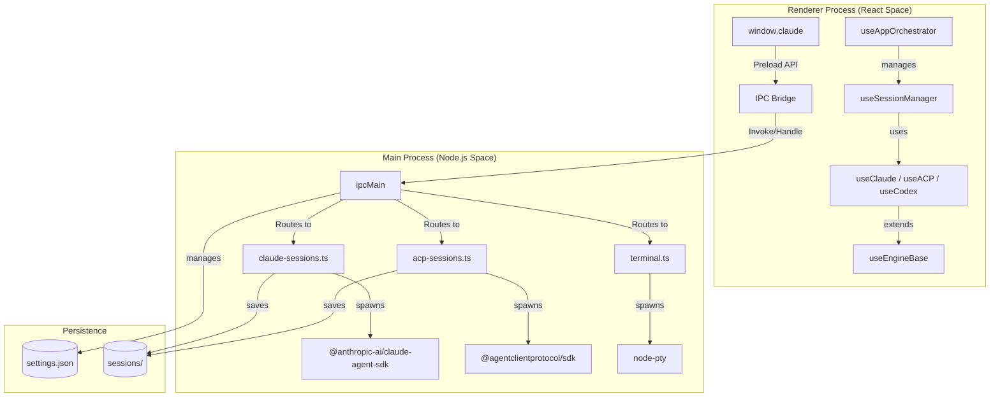
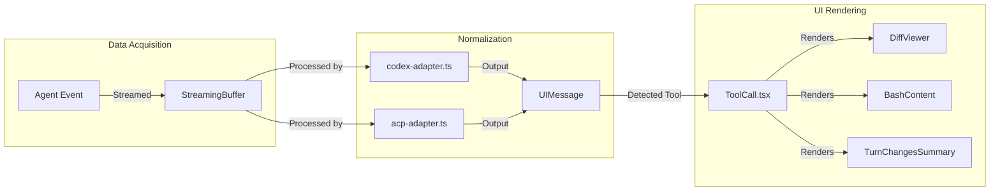

# Harnss Overview

Relevant source files

The following files were used as context for generating this wiki page:

- [.claude/skills/release/references/release-notes-template.md](.claude/skills/release/references/release-notes-template.md)
- [CLAUDE.md](CLAUDE.md)
- [README.md](README.md)
- [electron/src/main.ts](electron/src/main.ts)
- [package.json](package.json)
- [pnpm-lock.yaml](pnpm-lock.yaml)
- [src/components/SummaryBlock.tsx](src/components/SummaryBlock.tsx)
- [src/components/TurnChangesSummary.tsx](src/components/TurnChangesSummary.tsx)
- [src/hooks/useAppOrchestrator.ts](src/hooks/useAppOrchestrator.ts)
- [src/hooks/useEngineBase.ts](src/hooks/useEngineBase.ts)
- [src/lib/codex-adapter.ts](src/lib/codex-adapter.ts)

Harnss is a cross-platform desktop application designed to provide a unified, high-level interface for running and managing AI coding agents. It supports multiple execution protocols, including the Anthropic Agent SDK (Claude Code), the Agent Client Protocol (ACP), and the Codex JSON-RPC protocol [README.md:23-27]().

The system is built as an Electron application [package.json:70](), utilizing a multi-process architecture to separate the React-based user interface from the native OS integrations and long-lived AI agent sessions.

## System Architecture

Harnss follows a classic Electron architecture with a **Main Process** (Node.js) and a **Renderer Process** (Chromium).

- **Main Process**: Responsible for lifecycle management of AI agents, terminal PTY spawning, file system operations, and persistent settings [electron/src/main.ts:32-48]().
- **Renderer Process**: A React 19 application that handles the multi-pane layout, virtualized chat threads, and interactive tool visualizations [CLAUDE.md:7-14]().

### Process Communication & Entity Mapping

The following diagram illustrates how high-level system concepts map to specific code entities across the process boundary.

**Diagram: Entity Mapping & IPC Bridge**

Sources: [electron/src/main.ts:32-48](), [src/hooks/useAppOrchestrator.ts:31-39](), [src/hooks/useEngineBase.ts:50-55](), [CLAUDE.md:67-75]()

## Key Concepts

### Multi-Engine Integration

Harnss abstracts different AI protocols into a unified UI. While the underlying communication varies (e.g., `AsyncChannel` for Claude, JSON-RPC for Codex), the renderer treats them as "Engines" that produce a stream of `UIMessage` objects [src/hooks/useEngineBase.ts:2-7]().

| Engine     | Code Implementation | Protocol / SDK                   |
| :--------- | :------------------ | :------------------------------- |
| **Claude** | `useClaude.ts`      | `@anthropic-ai/claude-agent-sdk` |
| **ACP**    | `useACP.ts`         | `Agent Client Protocol`          |
| **Codex**  | `useCodex.ts`       | `JSON-RPC app-server`            |

Sources: [CLAUDE.md:142-152](), [src/lib/codex-adapter.ts:1-6]()

### Session & Project Hierarchy

The application organizes work into a three-tier hierarchy:

1.  **Spaces**: Named groups of projects with custom visual styling [src/hooks/useAppOrchestrator.ts:51-60]().
2.  **Projects**: Mapped to specific directories on the local filesystem [README.md:104-107]().
3.  **Sessions**: Individual chat histories with specific agents. Sessions can be "Drafts" (not yet persisted) or materialized [src/hooks/useAppOrchestrator.ts:89-103]().

### Rich Tool Visualization

Instead of raw JSON, tool calls (like file edits or bash commands) are intercepted and rendered as interactive components. For example, `TurnChangesSummary.tsx` provides word-level diffs and file change statistics [src/components/TurnChangesSummary.tsx:95-127]().

**Diagram: Tool Rendering Pipeline**

Sources: [src/lib/codex-adapter.ts:33-48](), [src/components/TurnChangesSummary.tsx:1-5](), [src/hooks/useEngineBase.ts:99-107]()

## Subsystem Overviews

### Project Setup & Developer Workflow

Harnss uses a `pnpm` workspace. The build pipeline involves `Vite` for the renderer and `tsup` for the Electron main process [package.json:17-22]().
For details, see [Getting Started & Project Setup](#1.1).

### Build & Release

The application is packaged using `electron-builder`. The release process includes code signing, notarization (for macOS), and auto-update publishing via GitHub Actions [package.json:22-26]().
For details, see [Build, Packaging & Release](#1.2).

### Settings & Persistence

Settings are managed in two tiers: `localStorage` for UI-only preferences and a `settings.json` file in the user data directory for configurations required by the main process (like binary paths) [CLAUDE.md:130-135]().
Sources: [electron/src/main.ts:46-48](), [src/hooks/useAppOrchestrator.ts:68-70]()
