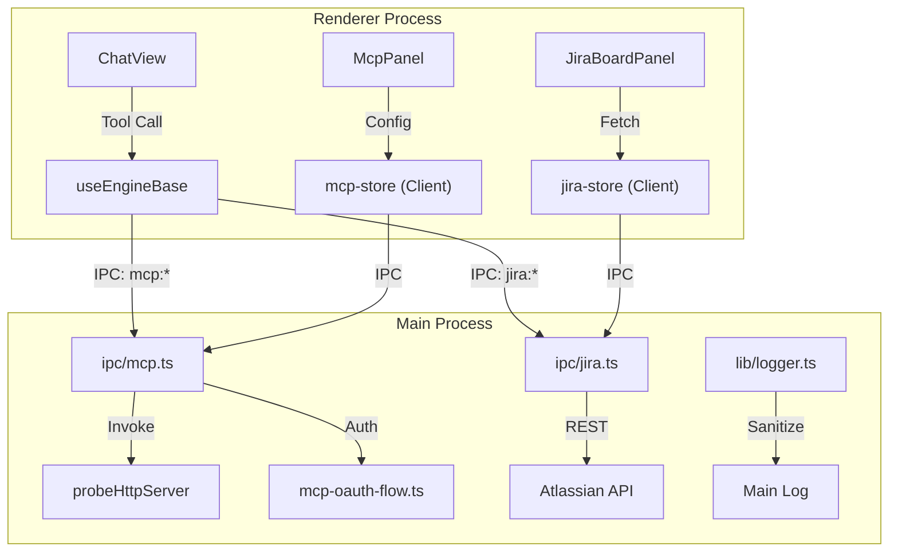
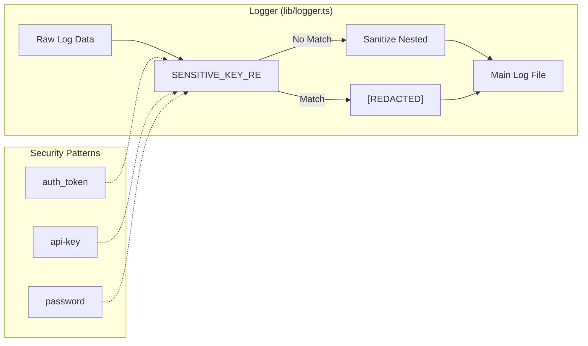

# MCP & External Integrations

Relevant source files

The following files were used as context for generating this wiki page:

- [electron/src/ipc/jira.ts](electron/src/ipc/jira.ts)
- [electron/src/ipc/mcp.ts](electron/src/ipc/mcp.ts)
- [electron/src/lib/**tests**/logger.test.ts](electron/src/lib/__tests__/logger.test.ts)
- [electron/src/lib/async-channel.ts](electron/src/lib/async-channel.ts)
- [electron/src/lib/error-utils.ts](electron/src/lib/error-utils.ts)
- [electron/src/lib/jira-oauth-store.ts](electron/src/lib/jira-oauth-store.ts)
- [electron/src/lib/jira-store.ts](electron/src/lib/jira-store.ts)
- [electron/src/lib/logger.ts](electron/src/lib/logger.ts)
- [shared/types/jira.ts](shared/types/jira.ts)

Harnss extends the capabilities of its AI engines by integrating with the **Model Context Protocol (MCP)** and third-party services like **Jira**. These integrations allow agents to interact with external tools, fetch real-time data, and perform actions across different platforms directly from the chat interface.

### Overview of Integrations

The integration layer is split between the Electron main process, which handles secure storage and network transport, and the React renderer, which provides specialized UI panels and message renderers.

| Integration  | Primary Purpose                     | Key Code Entities                                  |
| :----------- | :---------------------------------- | :------------------------------------------------- |
| **MCP**      | Extensible tool/resource protocol   | `mcp-store`, `mcp-oauth-flow`, `McpPanel`          |
| **Jira**     | Issue tracking and board management | `jira-store`, `jira-oauth-store`, `JiraBoardPanel` |
| **Context7** | External context provider           | Managed via MCP renderers                          |

### System Architecture: Integration Flow

The following diagram illustrates how external requests flow from the AI Engine through the IPC bridge to external services.

**Integration Request Flow**

Sources: [electron/src/ipc/mcp.ts:121-180](), [electron/src/ipc/jira.ts:52-160](), [electron/src/lib/logger.ts:13-22]()

---

## Model Context Protocol (MCP)

The Model Context Protocol (MCP) allows Harnss to connect to a variety of local and remote servers that provide tools, resources, and prompts. Harnss supports three primary transport layers: `stdio`, `sse` (Server-Sent Events), and `http`.

### Server Management & Probing

Harnss manages MCP server configurations on a per-project basis [electron/src/ipc/mcp.ts:122-124](). Before a server is activated, the system performs a "probe" to verify connectivity and authentication status:

- **Stdio**: Checks if the configured binary exists on the system path [electron/src/ipc/mcp.ts:105-119]().
- **HTTP/SSE**: Performs a `fetch` request to the `initialize` endpoint [electron/src/ipc/mcp.ts:17-66]().
- **Authentication**: If a server returns a 401 or 403, Harnss triggers an OAuth flow [electron/src/ipc/mcp.ts:51-53]().

For a deep dive into configuration, OAuth flows, and the dispatch system for custom MCP renderers, see the child page:
**[Model Context Protocol (MCP)](#6.1)**

Sources: [electron/src/ipc/mcp.ts:11-120](), [electron/src/ipc/mcp.ts:147-161]()

---

## Jira Integration

The Jira integration allows users to manage Atlassian Jira issues directly within Harnss. It supports both Jira Cloud (via API Tokens) and Jira Server/Data Center.

### Configuration & Persistence

Jira settings are stored in two distinct locations to ensure security:

1.  **Project Config**: Board IDs and instance URLs are stored per-project in `jira/*.json` [electron/src/lib/jira-store.ts:20-22]().
2.  **OAuth/Credentials**: Sensitive tokens are stored in `jira-oauth/*.json` using secure file permissions (`0o600`) to prevent unauthorized access [electron/src/lib/jira-oauth-store.ts:47-57]().

### Data Fetching & Security

The system uses a dedicated IPC module `ipc/jira.ts` to proxy requests to the Jira REST API [electron/src/ipc/jira.ts:161-185](). To protect user privacy, the `logger.ts` utility automatically redacts `Authorization` headers and `access_token` strings from all logs [electron/src/lib/logger.ts:13-22]().

For details on issue fetching, the Kanban board UI, and the Jira MCP renderer, see the child page:
**[Jira Integration](#6.2)**

Sources: [electron/src/lib/jira-store.ts:1-18](), [electron/src/lib/jira-oauth-store.ts:78-89](), [electron/src/ipc/jira.ts:37-50]()

---

## Security & Logging

External integrations often involve sensitive credentials. Harnss implements a strict sanitization layer in the main process logger to prevent accidental leakage of tokens or secrets.

**Data Sanitization Logic**

The `SENSITIVE_KEY_RE` regex targets common credential keys such as `authorization`, `api-key`, `access_token`, and `secret` [electron/src/lib/logger.ts:14-15](). This applies to both structured objects and embedded strings in URLs [electron/src/lib/logger.ts:17-22]().

Sources: [electron/src/lib/logger.ts:13-67](), [electron/src/lib/**tests**/logger.test.ts:33-50]()
