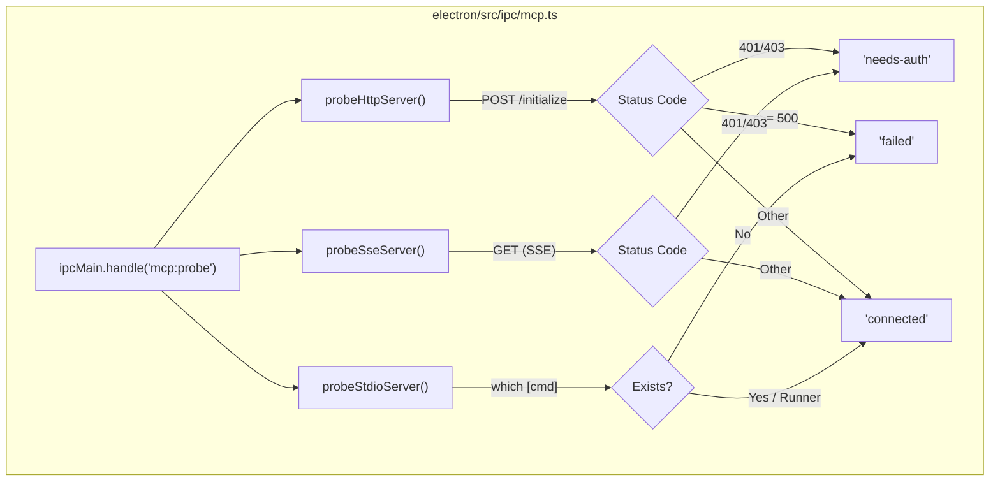
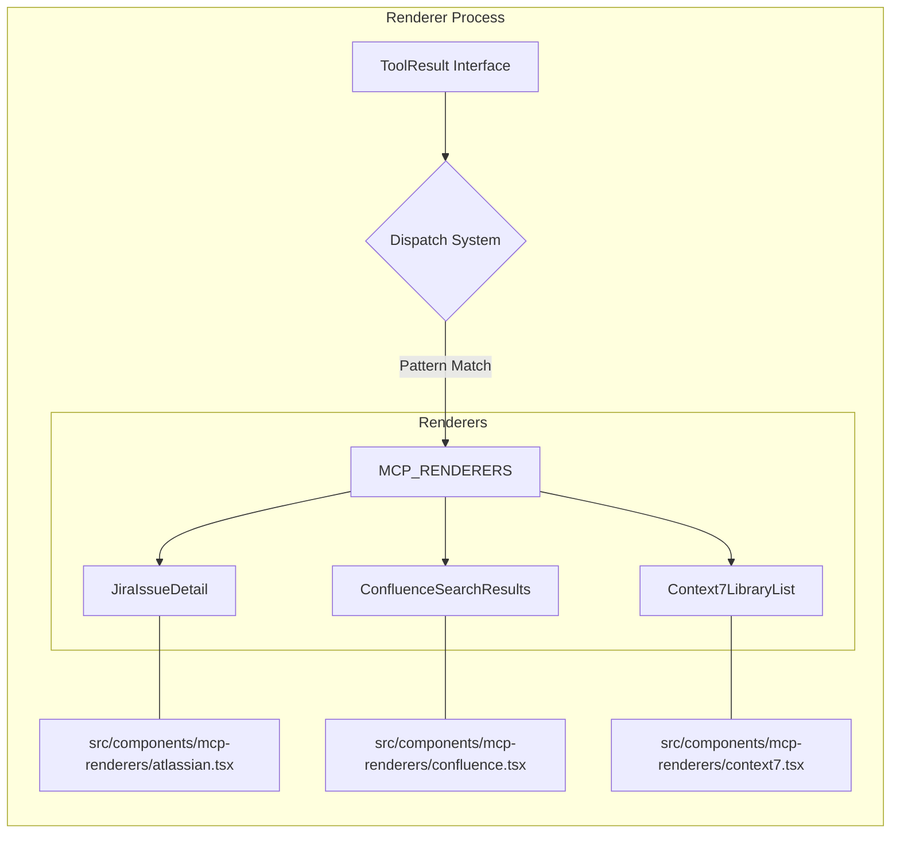

# Model Context Protocol (MCP)

Relevant source files

The following files were used as context for generating this wiki page:

- [electron/src/ipc/mcp.ts](electron/src/ipc/mcp.ts)
- [electron/src/lib/async-channel.ts](electron/src/lib/async-channel.ts)
- [electron/src/lib/error-utils.ts](electron/src/lib/error-utils.ts)
- [src/components/mcp-renderers/atlassian.tsx](src/components/mcp-renderers/atlassian.tsx)
- [src/components/mcp-renderers/confluence.tsx](src/components/mcp-renderers/confluence.tsx)
- [src/components/mcp-renderers/context7.tsx](src/components/mcp-renderers/context7.tsx)

The Model Context Protocol (MCP) subsystem in Harnss enables the integration of external tools, resources, and prompts into the AI chat experience. Harnss acts as an MCP host, managing the lifecycle of multiple MCP servers per project, handling secure authentication via OAuth, and providing specialized UI renderers for complex tool outputs.

## MCP Server Management

Harnss supports three primary transport mechanisms for MCP servers: `stdio`, `sse` (Server-Sent Events), and `http` [electron/src/ipc/mcp.ts:182-185](). Servers are configured on a per-project basis and persisted via the `mcp-store` [electron/src/ipc/mcp.ts:122-123]().

### Configuration and Persistence

The `mcp-store` manages the `McpServerConfig` objects, which include the server name, transport type, and transport-specific fields (e.g., `url` for HTTP/SSE, or `command`/`args` for stdio) [electron/src/ipc/mcp.ts:9-118]().

### Server Probing

Harnss implements a "probing" mechanism to track the health and availability of configured servers. The `mcp:probe` IPC handler executes concurrent checks across all servers [electron/src/ipc/mcp.ts:177-181]().

| Transport | Probe Method                                                                       | Success Criteria                                                                       |
| :-------- | :--------------------------------------------------------------------------------- | :------------------------------------------------------------------------------------- |
| **HTTP**  | `POST` to URL with `initialize` JSON-RPC payload [electron/src/ipc/mcp.ts:35-47]() | Status < 500 (except 401/403) [electron/src/ipc/mcp.ts:51-59]()                        |
| **SSE**   | `GET` with `Accept: text/event-stream` [electron/src/ipc/mcp.ts:81-83]()           | Status < 500 (except 401/403) [electron/src/ipc/mcp.ts:90-96]()                        |
| **stdio** | Binary check via `/usr/bin/which` [electron/src/ipc/mcp.ts:110]()                  | Binary exists or is a known runner (`npx`, `bunx`) [electron/src/ipc/mcp.ts:114-117]() |

**Diagram: MCP Server Probing Logic**

Sources: [electron/src/ipc/mcp.ts:17-120](), [electron/src/ipc/mcp.ts:177-195]()

## Authentication & OAuth Flow

For servers requiring authorization, Harnss provides a dedicated OAuth flow managed by `mcp-oauth-provider` and `mcp-oauth-store`.

### OAuth Lifecycle

1.  **Initiation**: `mcp:authenticate` is called with the server URL [electron/src/ipc/mcp.ts:147-150]().
2.  **Flow Execution**: `authenticateMcpServer` handles the browser-based exchange [electron/src/ipc/mcp.ts:150]().
3.  **Persistence**: Tokens are stored via `mcp-oauth-store` along with a `storedAt` timestamp to calculate expiration [electron/src/ipc/mcp.ts:164-171]().
4.  **Injection**: During probing or actual tool calls, the `Authorization: Bearer <token>` header is automatically injected if a valid token exists [electron/src/ipc/mcp.ts:26-29](), [electron/src/ipc/mcp.ts:72-75]().

Sources: [electron/src/ipc/mcp.ts:147-175](), [electron/src/ipc/mcp.ts:25-29]()

## UI Rendering System

Harnss features a dispatch system for rendering tool outputs. Instead of displaying raw JSON, it uses the `MCP_RENDERERS` and `MCP_RENDERER_PATTERNS` maps to select specialized React components based on the tool name or result shape.

### Specialized Renderers

Harnss includes built-in renderers for popular MCP servers:

- **Atlassian/Jira**: Renders Rovo search results, Jira issue details, and site resources [src/components/mcp-renderers/atlassian.tsx:21-113]().
- **Confluence**: Handles space listings, page descendants, and search results [src/components/mcp-renderers/confluence.tsx:25-145](). It also includes a `sanitizeConfluenceHtml` utility to convert Atlassian storage format to standard HTML [src/components/mcp-renderers/confluence.tsx:218]().
- **Context7**: Specialized for library searches and documentation queries, featuring reputation badges and code snippet counts [src/components/mcp-renderers/context7.tsx:51-187]().

### Data Flow: Tool Call to Renderer

When an AI engine returns an MCP tool result, the UI identifies the appropriate renderer. If no specific pattern matches, it falls back to a generic JSON or Markdown viewer.

**Diagram: Tool Result Rendering Dispatch**

Sources: [src/components/mcp-renderers/atlassian.tsx:78-83](), [src/components/mcp-renderers/confluence.tsx:25-31](), [src/components/mcp-renderers/context7.tsx:51-54]()

## Error Handling

The MCP subsystem utilizes `reportError` from `electron/src/lib/error-utils.ts` to ensure that failures (e.g., failed probes, auth timeouts) are logged, reported to PostHog, and returned to the UI with clean error messages [electron/src/ipc/mcp.ts:132](), [electron/src/lib/error-utils.ts:23-35]().

Sources: [electron/src/ipc/mcp.ts:132](), [electron/src/lib/error-utils.ts:23-35]()
