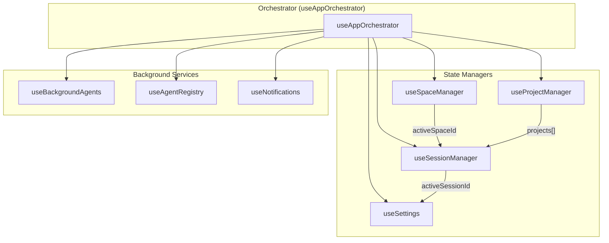
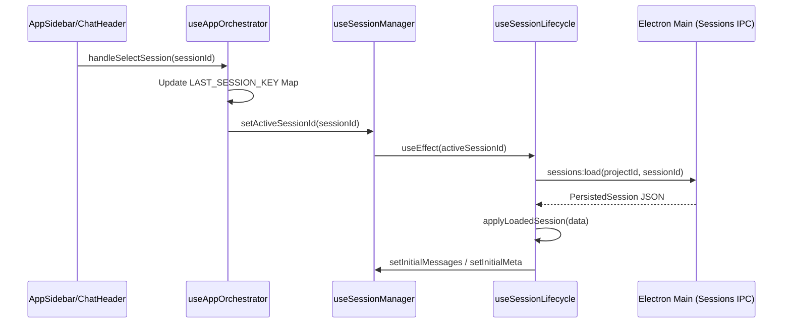

# App Orchestrator & Session Manager

Relevant source files

The following files were used as context for generating this wiki page:

- [.claude/skills/release/references/release-notes-template.md](.claude/skills/release/references/release-notes-template.md)
- [CLAUDE.md](CLAUDE.md)
- [src/App.tsx](src/App.tsx)
- [src/components/AppLayout.tsx](src/components/AppLayout.tsx)
- [src/components/SummaryBlock.tsx](src/components/SummaryBlock.tsx)
- [src/components/TurnChangesSummary.tsx](src/components/TurnChangesSummary.tsx)
- [src/hooks/session/useSessionLifecycle.ts](src/hooks/session/useSessionLifecycle.ts)
- [src/hooks/useAppOrchestrator.ts](src/hooks/useAppOrchestrator.ts)
- [src/hooks/useEngineBase.ts](src/hooks/useEngineBase.ts)
- [src/main.tsx](src/main.tsx)

The **App Orchestrator** is the central coordination layer of the Harnss renderer process. It is implemented primarily through the `useAppOrchestrator` hook, which aggregates specialized managers for projects, sessions, spaces, settings, and background tasks into a single unified interface for the UI.

### Orchestration Architecture

The orchestrator serves as the "brain" of the application, ensuring that when a user switches a Space, the correct Project is selected, the corresponding Session is loaded, and the UI Settings (like theme or model preferences) are scoped correctly to that context [src/hooks/useAppOrchestrator.ts:31-79]().

#### Space/Project/Session Hierarchy

Harnss organizes work into a three-tier hierarchy:

1.  **Spaces**: High-level containers (e.g., "Personal", "Work") managed by `useSpaceManager` [src/hooks/useSpaceManager.ts:1-20]().
2.  **Projects**: Local directories or repositories managed by `useProjectManager` [src/hooks/useProjectManager.ts:1-15]().
3.  **Sessions**: Individual chat threads with specific AI engines managed by `useSessionManager` [src/hooks/useSessionManager.ts:39-40]().

The orchestrator uses `resolveProjectForSpace` to determine which project should be active when a user enters a space, based on the `LAST_SESSION_KEY` persistence pattern [src/hooks/useAppOrchestrator.ts:51-60]().

#### Data Flow: Orchestrator Integration

The following diagram illustrates how `useAppOrchestrator` wires together disparate state modules.

**Orchestrator Logic Flow**

**Sources:** [src/hooks/useAppOrchestrator.ts:31-79](), [src/hooks/useSessionManager.ts:39-40]()

---

### Session Switch & Restoration Logic

Harnss implements an eager restoration pattern to ensure the user returns to their exact previous state upon app restart or space switching.

#### The LAST_SESSION_KEY Pattern

The orchestrator maintains a mapping of `spaceId -> sessionId` in `localStorage` under the key `harnss-last-session-per-space` [src/hooks/useAppOrchestrator.ts:35-35]().

When a session is selected or created:

1.  `handleSelectSession` is called [src/hooks/useAppOrchestrator.ts:183-200]().
2.  The orchestrator updates the `LAST_SESSION_KEY` map [src/hooks/useAppOrchestrator.ts:43-50]().
3.  The `useSessionLifecycle` hook triggers `applyLoadedSession`, which populates the engine state (messages, cost, context usage) from disk [src/hooks/session/useSessionLifecycle.ts:142-184]().

#### Background Session Store

To support multi-session concurrency without re-rendering every hidden chat, Harnss uses a `BackgroundSessionStore`. When a session is not "active" in the UI, its state (messages, processing status, cost) is preserved in a ref-backed store [src/hooks/session/useSessionLifecycle.ts:105-117](). This allows background agents to continue working and updating state even if the user switches to a different project [src/hooks/session/useSessionLifecycle.ts:10-11]().

**Session Switching Sequence**

**Sources:** [src/hooks/useAppOrchestrator.ts:183-200](), [src/hooks/session/useSessionLifecycle.ts:142-184](), [src/hooks/session/useSessionLifecycle.ts:187-210]()

---

### Implementation Details

#### Engine Locking

The orchestrator manages "Engine Locking." Once a session has started (materialized from a draft), the engine and agent are locked to prevent protocol corruption [src/hooks/useAppOrchestrator.ts:143-151](). If a user changes the agent in the UI while a session is active, the orchestrator automatically calls `manager.createSession` to spawn a new chat thread rather than attempting to swap the engine in-place [src/hooks/useAppOrchestrator.ts:117-132]().

#### Performance: rAF Scheduling

The `useEngineBase` hook, utilized by all AI engines (Claude, Codex, ACP), implements a `requestAnimationFrame` (rAF) flush mechanism [src/hooks/useEngineBase.ts:2-7](). This prevents React rendering bottlenecks during high-frequency streaming events by batching message updates into the next animation frame via `scheduleFlush` [src/hooks/useEngineBase.ts:100-107]().

| Entity                   | Role                                      | File Reference                                  |
| :----------------------- | :---------------------------------------- | :---------------------------------------------- |
| `useAppOrchestrator`     | Main coordination hook                    | [src/hooks/useAppOrchestrator.ts:31]()          |
| `useSessionManager`      | Manages session lifecycle and draft state | [src/hooks/useSessionManager.ts:1]()            |
| `useSessionLifecycle`    | Handles disk I/O and session revival      | [src/hooks/session/useSessionLifecycle.ts:53]() |
| `useEngineBase`          | Shared streaming and state foundation     | [src/hooks/useEngineBase.ts:50]()               |
| `BackgroundSessionStore` | Persists non-visible session state        | [src/lib/background-agent-store.ts:1]()         |

**Sources:** [src/hooks/useAppOrchestrator.ts:143-151](), [src/hooks/useEngineBase.ts:100-107](), [src/hooks/session/useSessionLifecycle.ts:10-11]()
