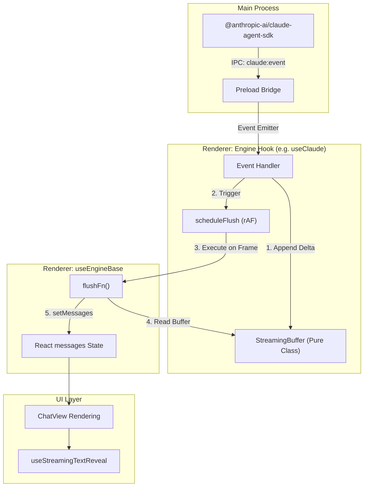
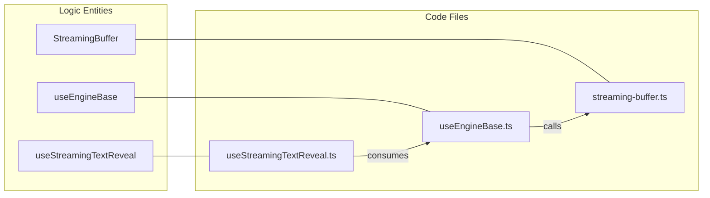

# Engine Base & Streaming Performance

Relevant source files

The following files were used as context for generating this wiki page:

- [.claude/skills/release/references/release-notes-template.md](.claude/skills/release/references/release-notes-template.md)
- [CLAUDE.md](CLAUDE.md)
- [src/components/SummaryBlock.tsx](src/components/SummaryBlock.tsx)
- [src/components/TurnChangesSummary.tsx](src/components/TurnChangesSummary.tsx)
- [src/components/ui/text-shimmer.tsx](src/components/ui/text-shimmer.tsx)
- [src/hooks/useAppOrchestrator.ts](src/hooks/useAppOrchestrator.ts)
- [src/hooks/useEngineBase.ts](src/hooks/useEngineBase.ts)
- [src/hooks/useStreamingTextReveal.ts](src/hooks/useStreamingTextReveal.ts)
- [src/index.css](src/index.css)
- [src/lib/background-claude-handler.ts](src/lib/background-claude-handler.ts)
- [src/lib/streaming-buffer.test.ts](src/lib/streaming-buffer.test.ts)
- [src/lib/streaming-buffer.ts](src/lib/streaming-buffer.ts)

The Engine Base layer provides the common foundation for all AI interaction in Harnss. It manages the delicate balance between high-frequency streaming data from AI SDKs and React's rendering lifecycle, ensuring that the UI remains responsive even during intense "thinking" phases or large-scale file edits.

## The useEngineBase Hook

`useEngineBase` is the shared foundation hook utilized by `useClaude`, `useACP`, and `useCodex`. It encapsulates the standard state variables required for any AI session and implements a coordinated flushing mechanism to prevent UI jank.

### Core State Management
The hook initializes and manages eight primary state variables that represent the lifecycle of an AI turn:
*   `messages`: The array of `UIMessage` objects currently displayed in the chat.
*   `isProcessing`: Boolean indicating if the engine is currently generating a response or executing tools.
*   `isConnected`: Boolean indicating if the underlying process (SDK, CLI, or Socket) is active.
*   `sessionInfo`: Metadata about the session (model, version, current working directory).
*   `totalCost`: Accumulated token cost for the session.
*   `pendingPermission`: The current tool call awaiting user approval.
*   `contextUsage`: Statistics on prompt/response tokens and cache hits.
*   `isCompacting`: Boolean indicating if a context compaction (summarization) is in progress.

[src/hooks/useEngineBase.ts:20-37]()

### Stable Closure Pattern (messagesRef)
To avoid stale closures in high-frequency event listeners, `useEngineBase` maintains a `messagesRef` that always points to the latest `messages` state. This allows asynchronous event handlers to read the current message list without triggering a re-render or requiring the handler to be recreated on every state change.

[src/hooks/useEngineBase.ts:67-68]()

Sources: `src/hooks/useEngineBase.ts`

## Streaming Performance & Synchronization

Harnss uses a specialized buffering and scheduling system to handle the high-velocity "firehose" of events coming from AI engines.

### requestAnimationFrame Flush Mechanism
Instead of calling `setMessages` immediately upon receiving every tiny text delta (which could happen dozens of times per second), engines push data into a `StreamingBuffer` and call `scheduleFlush`. 

`scheduleFlush` uses `requestAnimationFrame` (rAF) to batch updates. This ensures that React state transitions only occur once per display frame, aligning with the browser's paint cycle and significantly reducing CPU overhead during streaming.

[src/hooks/useEngineBase.ts:100-107]()

### React 19 Automatic Batching
Harnss leverages React 19's improved automatic batching. By wrapping the buffer-to-state transition inside the rAF callback, multiple state updates (e.g., updating message content and updating context usage) are batched into a single render pass.

### Streaming Architecture Diagram

The following diagram illustrates the flow from a raw SDK event to a rendered frame:

**Streaming Data Flow**

Sources: `src/hooks/useEngineBase.ts`, `src/lib/streaming-buffer.ts`, `electron/src/ipc/claude-sessions.ts`

## StreamingBuffer & Overlap Detection

The `StreamingBuffer` class is a pure-logic utility designed to handle the nuances of different streaming protocols.

### Handling Cumulative Snapshots
Some SDK paths (particularly for "thinking" blocks) resend the full accumulated value rather than a pure delta. `StreamingBuffer` uses a `mergeStreamingChunk` utility to detect overlaps. It scans the end of the current buffer and the start of the incoming chunk to find the longest common sequence, preventing text duplication.

[src/lib/streaming-buffer.ts:7-26]()

### Pure Incremental Text
For standard assistant text, Harnss assumes pure incremental deltas. This avoids "false-positive" overlap detection that might otherwise "eat" significant markdown characters like backticks (`` ` ``) or pipe symbols (`|`) if they happen to appear at a token boundary.

[src/lib/streaming-buffer.ts:103-109]()

### Buffer Structure
| Class | Purpose | Strategy |
| :--- | :--- | :--- |
| `StreamingBuffer` | Claude SDK | Multi-block (text, thinking, tool_use) with index tracking. |
| `SimpleStreamingBuffer` | ACP / Codex | Simple append-only text and thinking chunks. |

Sources: `src/lib/streaming-buffer.ts`, `src/lib/streaming-buffer.test.ts`

## UI Polish: useStreamingTextReveal

To make the streaming experience feel fluid rather than "jumpy," Harnss uses a specialized DOM-injection hook called `useStreamingTextReveal`.

### Per-Token Fade-In
Instead of simply updating the text, this hook:
1.  Runs in `useLayoutEffect` (synchronously before paint).
2.  Identifies the last animatable text node.
3.  Splits the node into `[Old Text | New Text]`.
4.  Applies a CSS transition to the span.

This creates a per-token fade-in effect that masks the discrete nature of the incoming chunks.

[src/hooks/useStreamingTextReveal.ts:80-95]()

### Structural Stability
The hook is designed to be "reconciler-safe." It detects likely-incomplete markdown delimiters (like unbalanced backticks) and skips animation on those frames to avoid malformed DOM structures that would break React's reconciliation. It also avoids structural tags like `CODE`, `PRE`, and `TABLE` where internal DOM changes are volatile.

[src/hooks/useStreamingTextReveal.ts:54-60]()

**Code Entity Mapping: Streaming Logic**

Sources: `src/hooks/useStreamingTextReveal.ts`, `src/hooks/useEngineBase.ts`, `src/lib/streaming-buffer.ts`