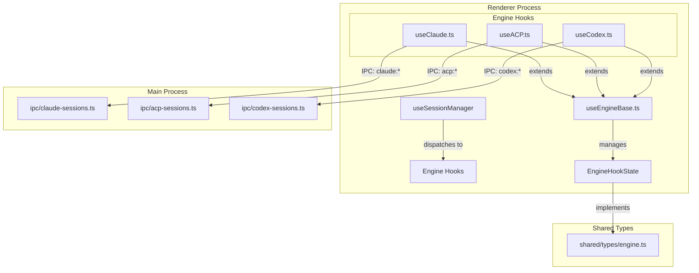

# Session & State Management

Relevant source files

The following files were used as context for generating this wiki page:

- [.claude/skills/release/references/release-notes-template.md](.claude/skills/release/references/release-notes-template.md)
- [CLAUDE.md](CLAUDE.md)
- [electron/src/ipc/claude-sessions.ts](electron/src/ipc/claude-sessions.ts)
- [shared/types/engine.ts](shared/types/engine.ts)
- [src/components/InputBar.test.ts](src/components/InputBar.test.ts)
- [src/components/InputBar.tsx](src/components/InputBar.tsx)
- [src/components/SummaryBlock.tsx](src/components/SummaryBlock.tsx)
- [src/components/TurnChangesSummary.tsx](src/components/TurnChangesSummary.tsx)
- [src/hooks/useAppOrchestrator.ts](src/hooks/useAppOrchestrator.ts)
- [src/hooks/useClaude.ts](src/hooks/useClaude.ts)
- [src/hooks/useCodex.ts](src/hooks/useCodex.ts)
- [src/hooks/useEngineBase.ts](src/hooks/useEngineBase.ts)
- [src/hooks/useSessionManager.ts](src/hooks/useSessionManager.ts)

Harnss employs a sophisticated session management system designed to handle multi-turn AI interactions across different engines (Claude, ACP, Codex) while maintaining high performance and state persistence. The system is built on a "draft-first" philosophy where sessions are initialized eagerly in the UI but only materialized on the backend when the first message is sent.

### System Overview

The state management architecture is divided into three layers:
1.  **Orchestration Layer**: Manages the high-level relationship between Spaces, Projects, and Sessions.
2.  **Manager Layer**: Handles the lifecycle of active sessions, including switching, creation, and background persistence.
3.  **Engine Layer**: Provides the low-level primitive for communication with specific AI protocols (e.g., Anthropic SDK, JSON-RPC).

#### Engine-to-Code Mapping
The following diagram bridges the conceptual engine space to the specific implementation hooks and types used in the codebase.

**Engine Architecture Mapping**

**Sources:** [src/hooks/useSessionManager.ts:47-91](), [src/hooks/useEngineBase.ts:20-48](), [shared/types/engine.ts:58-76](), [electron/src/ipc/claude-sessions.ts:79-111]()

---

### [App Orchestrator & Session Manager](#4.1)

The `useAppOrchestrator` hook acts as the central nervous system of the application, wiring together project management, settings, and session state. It ensures that when a user switches between "Spaces," the correct project and the last active session for that space are restored using the `LAST_SESSION_KEY` pattern.

Key responsibilities include:
*   **Space/Project Resolution**: Mapping the active UI space to a specific filesystem project via `resolveProjectForSpace`.
*   **Session Switching**: Coordinating with `useSessionManager` to swap the active engine context without losing UI state.
*   **Background State**: Utilizing `BackgroundSessionStore` to keep sessions alive and responsive even when they are not currently visible in the primary chat view.

For details, see [App Orchestrator & Session Manager](#4.1).

**Sources:** [src/hooks/useAppOrchestrator.ts:31-60](), [src/hooks/useSessionManager.ts:25-45](), [src/hooks/useSessionManager.ts:101-131]()

---

### [Session Lifecycle: Draft, Materialization & Revival](#4.2)

Harnss uses a unique lifecycle model to ensure the UI feels instantaneous. Every new chat begins as a `DRAFT_ID` session. This allows the user to configure engine settings (model, permission mode, tools) before any backend resources are allocated.

The lifecycle follows these stages:
1.  **Drafting**: The session exists only in the renderer state with ID `DRAFT_ID`.
2.  **Materialization**: Upon the first user message, `useDraftMaterialization` generates a real UUID and triggers the backend `claude:start` or equivalent IPC call.
3.  **Persistence**: Every message turn triggers `useSessionPersistence`, which saves the transcript to the local filesystem.
4.  **Revival**: On app restart, `useSessionRevival` checks the `LAST_SESSION_KEY` and re-hydrates the previous session's state from disk.

For details, see [Session Lifecycle: Draft, Materialization & Revival](#4.2).

**Sources:** [src/hooks/useSessionManager.ts:48-66](), [src/hooks/useClaude.ts:107-118](), [electron/src/ipc/claude-sessions.ts:33-47]()

---

### [Engine Base & Streaming Performance](#4.3)

At the lowest level, all AI engines share the `useEngineBase` hook. This foundation provides a standardized set of states (e.g., `messages`, `isProcessing`, `totalCost`) and a high-performance streaming architecture.

To prevent React rendering bottlenecks during high-speed AI output, Harnss implements:
*   **requestAnimationFrame (rAF) Flushing**: Instead of updating React state on every incoming socket chunk, deltas are pushed to a `StreamingBuffer`. A `scheduleFlush` function then batches these updates to align with the display's refresh rate (60fps).
*   **Stable Refs**: `messagesRef` and `sessionIdRef` are used to ensure that async event listeners always have access to the latest state without triggering unnecessary hook re-runs.
*   **Thinking Throttling**: For engines supporting "thinking" blocks (like Claude 3.7), UI updates are throttled further (e.g., 250ms) when only invisible "thinking" content is arriving, saving CPU cycles.

For details, see [Engine Base & Streaming Performance](#4.3).

**Sources:** [src/hooks/useEngineBase.ts:50-97](), [src/hooks/useClaude.ts:127-159](), [src/hooks/useClaude.ts:161-181](), [src/hooks/useEngineBase.ts:100-107]()

---

### Session State Transitions

The following table describes how the session state is managed across different engine types.

| Feature | Claude Engine | ACP Engine | Codex Engine |
| :--- | :--- | :--- | :--- |
| **Primary State** | `useClaude` | `useACP` | `useCodex` |
| **Persistence** | JSON File | JSON File | JSON File |
| **Streaming** | `StreamingBuffer` | `AcpStreamingBuffer` | `CodexStreamingBuffer` |
| **Permissions** | `PermissionRequest` | `ACPPermissionEvent` | `CodexServerRequest` |
| **IPC Channel** | `claude:*` | `acp:*` | `codex:*` |

**Sources:** [src/hooks/useSessionManager.ts:68-87](), [shared/types/engine.ts:32-41](), [src/hooks/useClaude.ts:83-88]()