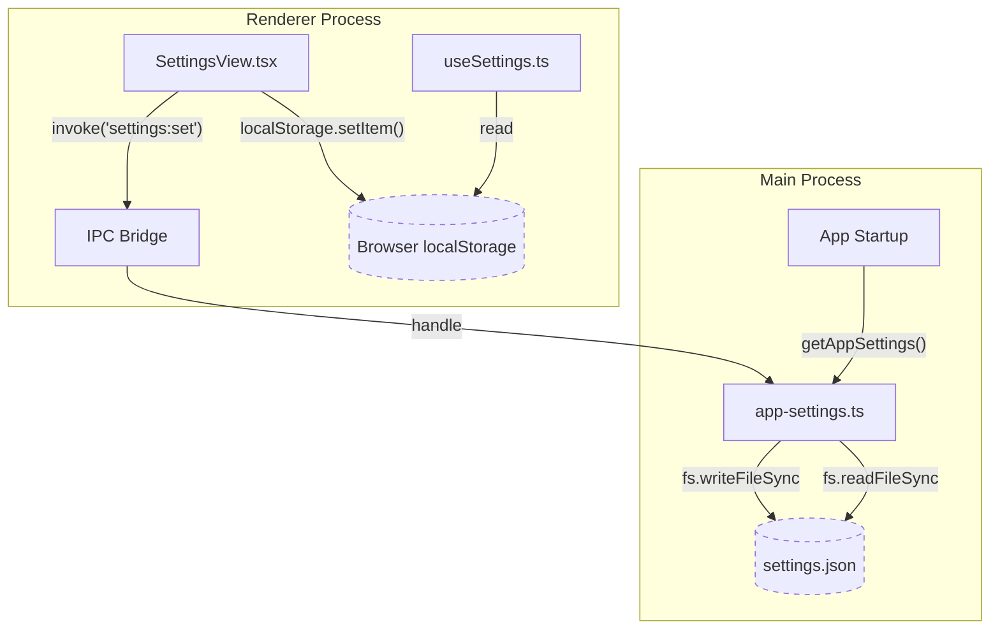

# AppSettings Schema & Persistence

<details>
<summary>Relevant source files</summary>

The following files were used as context for generating this wiki page:

- [electron/src/lib/app-settings.ts](electron/src/lib/app-settings.ts)
- [src/components/ChatHeader.tsx](src/components/ChatHeader.tsx)
- [src/components/SettingsView.tsx](src/components/SettingsView.tsx)
- [src/components/settings/AboutSettings.tsx](src/components/settings/AboutSettings.tsx)
- [src/components/settings/AdvancedSettings.tsx](src/components/settings/AdvancedSettings.tsx)
- [src/components/settings/GeneralSettings.tsx](src/components/settings/GeneralSettings.tsx)
- [src/components/settings/PlaceholderSection.tsx](src/components/settings/PlaceholderSection.tsx)
- [src/hooks/useSettings.ts](src/hooks/useSettings.ts)
- [src/types/ui.ts](src/types/ui.ts)

</details>


Harnss employs a dual-process configuration system designed to balance high-performance UI responsiveness with reliable main-process startup requirements. This system manages application-wide preferences (e.g., binary paths, notification triggers) and project-specific UI states (e.g., panel widths, active tools).

## The Two-Tier Storage Model

Harnss distinguishes between **App Settings** (global configurations required by the main process) and **UI Preferences** (renderer-only state).

### 1. AppSettings (Main Process Persistence)
Global settings are persisted in a JSON file located at `{userData}/openacpui-data/settings.json` [electron/src/lib/app-settings.ts:8-9](). This storage is accessible before any `BrowserWindow` is initialized, which is critical for configurations like `allowPrereleaseUpdates` used by the auto-updater [electron/src/lib/app-settings.ts:4-6]().

*   **Implementation**: Managed by `electron/src/lib/app-settings.ts`.
*   **Defaulting**: The system uses a `DEFAULTS` object and performs a deep merge on complex objects like `notifications` to ensure backward compatibility when new keys are added [electron/src/lib/app-settings.ts:75-121]().
*   **Caching**: The main process maintains an in-memory `cached` object to avoid redundant disk I/O [electron/src/lib/app-settings.ts:93-103]().

### 2. UI Preferences (Renderer localStorage)
Transient UI states, such as panel dimensions, theme selection, and per-project tool configurations, are stored in the renderer's `localStorage` via the `useSettings` hook [src/hooks/useSettings.ts:1-11]().

*   **Scope**: Often scoped to specific projects using a `pid` (Project ID) prefix in the key (e.g., `harnss-${pid}-tool-order`) [src/hooks/useSettings.ts:184-185]().
*   **Normalization**: Helper functions like `normalizeRatios` ensure that UI layouts (like split panes) remain consistent even after window resizing or tool additions [src/hooks/useSettings.ts:34-45]().

### Data Flow Diagram: Settings Persistence
This diagram illustrates the separation between main-process disk persistence and renderer-process local storage.


Sources: [src/components/SettingsView.tsx:127-131](), [electron/src/lib/app-settings.ts:134-145](), [src/hooks/useSettings.ts:7-31]()

## AppSettings Schema

The `AppSettings` interface defines the core configuration surface for the application. It is shared between the main process and renderer to ensure type safety across the IPC bridge.

| Field | Type | Description |
| :--- | :--- | :--- |
| `preferredEditor` | `PreferredEditor` | Target for "Open in Editor" (auto, cursor, code, zed) [src/types/ui.ts:35](). |
| `voiceDictation` | `VoiceDictationMode` | Toggle between native OS and local Whisper model [src/types/ui.ts:37](). |
| `notifications` | `NotificationSettings` | Per-event triggers (always, unfocused, never) for sound and OS alerts [src/types/ui.ts:39](). |
| `claudeBinarySource` | `ClaudeBinarySource` | Resolution strategy for Claude CLI (auto, managed, custom) [src/types/ui.ts:47](). |
| `codexBinarySource` | `CodexBinarySource` | Resolution strategy for Codex CLI [src/types/ui.ts:43](). |
| `analyticsEnabled` | `boolean` | Global toggle for anonymous usage tracking [src/types/ui.ts:55](). |

Sources: [src/types/ui.ts:29-60](), [electron/src/lib/app-settings.ts:35-66]()

## Optimistic Update Pattern

To maintain a lag-free UI, the `SettingsView` component implements an optimistic update pattern when modifying global `AppSettings`.

1.  **Local State Update**: When a user toggles a setting (e.g., `allowPrereleaseUpdates`), the component immediately updates its local React state via `setAppSettings` [src/components/SettingsView.tsx:129]().
2.  **Asynchronous Persistence**: Simultaneously, an IPC call `window.claude.settings.set(patch)` is dispatched to the main process [src/components/SettingsView.tsx:130]().
3.  **Main Process Write**: The main process updates its memory cache and performs a synchronous `fs.writeFileSync` to ensure the change survives a crash or restart [electron/src/lib/app-settings.ts:134-145]().

### Entity Mapping: UI to Persistence Logic
This diagram maps UI components to the specific functions and files responsible for persisting their data.

```mermaid
classDiagram
    class SettingsView {
        +updateAppSettings(patch)
        +setAppSettings(state)
    }
    class AppSettingsModule {
        +getAppSettings() AppSettings
        +setAppSettings(patch) AppSettings
    }
    class useSettingsHook {
        +setTheme(ThemeOption)
        +setRightPanelWidth(number)
    }

    SettingsView ..> AppSettingsModule : "IPC: settings:set"
    SettingsView ..> useSettingsHook : "React Props / Context"
    AppSettingsModule --> "settings.json" : "fs.writeFileSync()"
    useSettingsHook --> "localStorage" : "setItem()"

    note for AppSettingsModule "electron/src/lib/app-settings.ts"
    note for useSettingsHook "src/hooks/useSettings.ts"
    note for SettingsView "src/components/SettingsView.tsx"
```
Sources: [src/components/SettingsView.tsx:127-131](), [electron/src/lib/app-settings.ts:134-145](), [src/hooks/useSettings.ts:89-159]()

## Notification Configuration

The notification system uses a granular schema to control when the OS should alert the user or play a sound. Settings are defined per-event type: `exitPlanMode`, `permissions`, `askUserQuestion`, and `sessionComplete` [src/types/ui.ts:21-26]().

Each event can be configured with a `NotificationTrigger`:
*   **always**: Trigger regardless of app focus.
*   **unfocused**: Only trigger if the Harnss window is not in the foreground.
*   **never**: Completely suppress the notification/sound.

Sources: [src/types/ui.ts:14-19](), [electron/src/lib/app-settings.ts:68-73]()