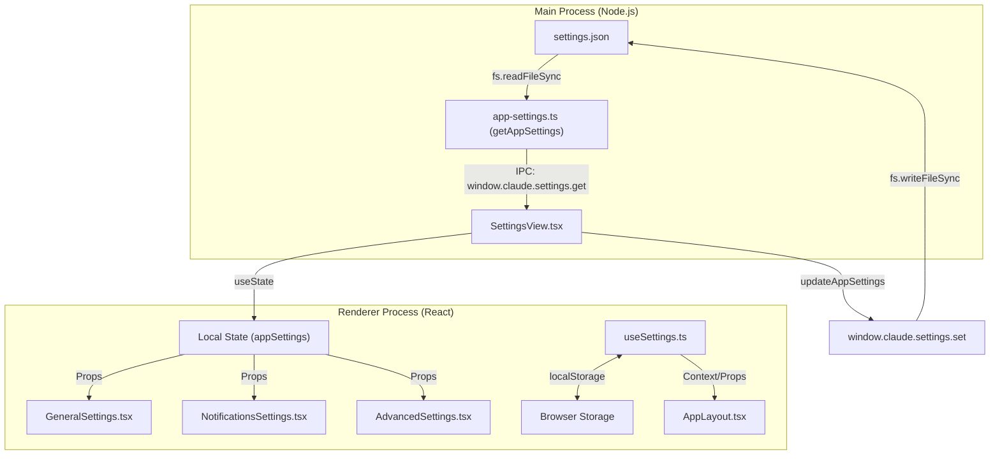
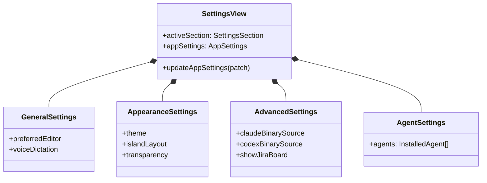

# Settings & Configuration

Relevant source files

The following files were used as context for generating this wiki page:

- [electron/src/lib/app-settings.ts](electron/src/lib/app-settings.ts)
- [src/components/ChatHeader.tsx](src/components/ChatHeader.tsx)
- [src/components/SettingsView.tsx](src/components/SettingsView.tsx)
- [src/components/settings/AboutSettings.tsx](src/components/settings/AboutSettings.tsx)
- [src/components/settings/AdvancedSettings.tsx](src/components/settings/AdvancedSettings.tsx)
- [src/components/settings/PlaceholderSection.tsx](src/components/settings/PlaceholderSection.tsx)
- [src/hooks/useSettings.ts](src/hooks/useSettings.ts)
- [src/types/ui.ts](src/types/ui.ts)

Harnss employs a multi-tiered settings system designed to balance persistence, performance, and user experience across both the Electron main process and the React renderer. The system handles everything from low-level binary paths for AI engines to high-level UI preferences like "Liquid Glass" transparency and theme selection.

### Settings System Overview

The configuration architecture is split into two primary domains:

1.  **Main Process Settings (`AppSettings`)**: Persisted in `settings.json` within the user data directory. These are critical for app startup, such as update policies and AI engine binary locations [electron/src/lib/app-settings.ts:8-9]().
2.  **Renderer UI Settings**: Managed via `localStorage` and the `useSettings` hook. These cover UI state like panel widths, active tools, and layout modes [src/hooks/useSettings.ts:7-11]().

#### High-Level Settings Architecture

The following diagram illustrates the flow of settings from storage to the UI components.

**Settings Data Flow**

Sources: [electron/src/lib/app-settings.ts:95-126](), [src/components/SettingsView.tsx:119-132](), [src/hooks/useSettings.ts:7-31]()

---

### AppSettings Schema & Persistence

The `AppSettings` interface defines the core configuration required by the application's backend and global services. This includes notification triggers, preferred code editors, and the source selection for engine binaries (Claude and Codex) [src/types/ui.ts:29-60]().

The persistence layer in `electron/src/lib/app-settings.ts` ensures that these settings are available synchronously during the Electron startup lifecycle, allowing the `autoUpdater` to check for pre-release versions before the UI has even loaded [electron/src/lib/app-settings.ts:4-7]().

**Key Schema Entities:**
| Entity | Type | Description |
| :--- | :--- | :--- |
| `preferredEditor` | `PreferredEditor` | Target for "Open in Editor" (auto, cursor, code, zed) [src/types/ui.ts:5](). |
| `notifications` | `NotificationSettings` | Per-event triggers (always, unfocused, never) [src/types/ui.ts:14-26](). |
| `claudeBinarySource` | `ClaudeBinarySource` | Logic for finding the Claude CLI (auto, managed, custom) [src/types/ui.ts:9](). |
| `analyticsEnabled` | `boolean` | Opt-in for anonymous PostHog usage tracking [src/types/ui.ts:54](). |

For a deep dive into storage locations and the optimistic update pattern, see **[AppSettings Schema & Persistence](#7.1)**.

---

### Settings UI: Appearance & Navigation

The `SettingsView` component serves as the central hub for user configuration. It utilizes a modular navigation sidebar defined by `NAV_ITEMS`, routing users between specialized sub-components [src/components/SettingsView.tsx:43-55]().

**Settings Entity Mapping**

Sources: [src/components/SettingsView.tsx:33-55](), [src/components/SettingsView.tsx:142-205]()

#### Configuration Sections

- **General**: Core app behavior like the default chat limit and voice dictation mode [src/components/settings/GeneralSettings.tsx]().
- **Appearance**: Controls the visual "Island" vs "Flat" layout, theme (light/dark/system), and macOS "Liquid Glass" transparency [src/components/settings/AppearanceSettings.tsx]().
- **Notifications**: Granular control over OS notifications and sounds for events like "Session Complete" or "Permission Required" [src/components/settings/NotificationsSettings.tsx]().
- **Advanced**: Low-level engine configurations, including custom binary paths for `claude` and `codex` executables [src/components/settings/AdvancedSettings.tsx:133-168]().
- **About**: Displays the current version and project credits [src/components/settings/AboutSettings.tsx:88-100]().

For details on UI components and specific appearance toggles, see **[Settings UI: Appearance, Notifications & Advanced](#7.2)**.

Sources: [src/types/ui.ts:29-60](), [src/components/SettingsView.tsx:1-114](), [electron/src/lib/app-settings.ts:1-89](), [src/hooks/useSettings.ts:89-159]().
