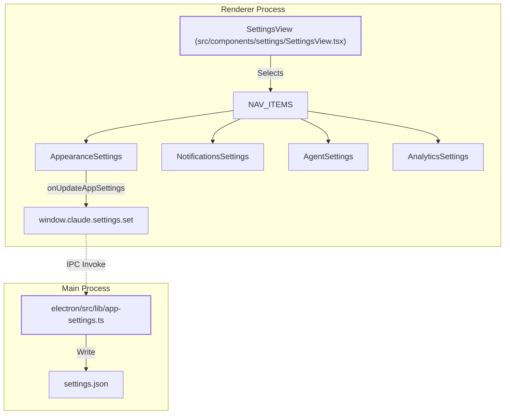
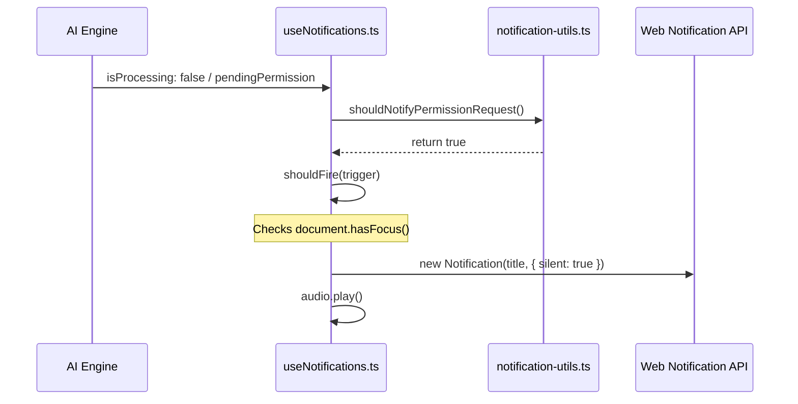

# Settings UI: Appearance, Notifications & Advanced

Relevant source files

The following files were used as context for generating this wiki page:

- [electron/src/lib/posthog.ts](electron/src/lib/posthog.ts)
- [public/sounds/notification.wav](public/sounds/notification.wav)
- [src/components/SpaceBar.tsx](src/components/SpaceBar.tsx)
- [src/components/SpaceCreator.tsx](src/components/SpaceCreator.tsx)
- [src/components/settings/AgentSettings.tsx](src/components/settings/AgentSettings.tsx)
- [src/components/settings/AnalyticsSettings.tsx](src/components/settings/AnalyticsSettings.tsx)
- [src/components/settings/AppearanceSettings.tsx](src/components/settings/AppearanceSettings.tsx)
- [src/components/settings/NotificationsSettings.tsx](src/components/settings/NotificationsSettings.tsx)
- [src/hooks/useNotifications.ts](src/hooks/useNotifications.ts)
- [tsup.electron.config.ts](tsup.electron.config.ts)

The modular `SettingsView` serves as the centralized configuration hub for Harnss. It employs a routing architecture based on `NAV_ITEMS` to switch between specialized sub-panels, including `AppearanceSettings`, `NotificationsSettings`, `AdvancedSettings`, `AnalyticsSettings`, and `AgentSettings`. The system utilizes an optimistic update pattern, where UI state changes are reflected immediately and then persisted to the `settings.json` file via the Electron IPC bridge.

## Navigation and Modular Architecture

The Settings UI is structured as a sidebar-driven modal or view. Navigation is defined by a set of keys that map to specific React components.

| Navigation Key  | Component               | Primary Responsibility                                         |
| :-------------- | :---------------------- | :------------------------------------------------------------- |
| `appearance`    | `AppearanceSettings`    | Themes, Island layout, Glass/Mica transparency, Tool grouping. |
| `notifications` | `NotificationsSettings` | Per-event OS notification and sound triggers.                  |
| `advanced`      | `AdvancedSettings`      | Binary path overrides, protocol-specific configurations.       |
| `analytics`     | `AnalyticsSettings`     | PostHog opt-in/out and anonymous User ID display.              |
| `agents`        | `AgentSettings`         | Custom Agent Client Protocol (ACP) agent management.           |

### Data Flow: Settings Synchronization

The `AppSettings` interface acts as the single source of truth for the renderer. When a user modifies a setting, the UI invokes `onUpdateAppSettings`, which dispatches the change to the main process.

**Natural Language to Code Entity Mapping: Settings Routing**

**Sources:** [src/components/settings/AppearanceSettings.tsx:10-29](), [src/components/settings/NotificationsSettings.tsx:14-17](), [electron/src/lib/app-settings.ts:15-16]()

---

## Appearance Settings

The `AppearanceSettings` component manages the visual aesthetics and layout density of the application.

### Layout Modes

Harnss supports two primary layout philosophies:

1.  **Island Layout**: Panels are rendered with rounded corners and visible gaps, creating a floating effect [src/components/settings/AppearanceSettings.tsx:146-174]().
2.  **Flat Layout**: Panels are flush against each other, maximizing screen real estate.

### Transparency and Effects

The system detects platform support for native transparency effects (Liquid Glass on macOS, Mica/Acrylic on Windows) via the `glassSupported` prop [src/components/settings/AppearanceSettings.tsx:28-29](). Users can toggle `transparency` to enable these native vibrancy effects in the sidebar and titlebar.

### Tool Call Grouping

To manage chat verbosity, the UI provides settings for:

- `autoGroupTools`: Collapses consecutive AI tool calls into a single block [src/components/settings/AppearanceSettings.tsx:99-106]().
- `avoidGroupingEdits`: Forces file modification tools (`EditContent`, `WriteContent`) to remain as standalone rows for better visibility [src/components/settings/AppearanceSettings.tsx:108-117]().

**Sources:** [src/components/settings/AppearanceSettings.tsx:33-51](), [src/components/settings/AppearanceSettings.tsx:98-128]()

---

## Notifications System

The `NotificationsSettings` component allows granular control over how the app alerts the user to AI events.

### Event Types and Triggers

Four primary events can trigger notifications [src/components/settings/NotificationsSettings.tsx:21-49]():

- **Session Complete**: Agent has finished its task.
- **Exit Plan Mode**: Agent has finished a plan and requires approval to execute.
- **Permission Request**: Standard tool execution approval (e.g., `run_command`).
- **Ask User Question**: The agent is blocked awaiting user input.

### Trigger Logic

Each event can be configured with a `NotificationTrigger` for both **OS Notifications** and **Sound** [src/components/settings/NotificationsSettings.tsx:51-55]():

- `always`: Triggers regardless of window focus.
- `unfocused`: Triggers only if the Harnss window is not the active foreground window [src/hooks/useNotifications.ts:42]().
- `never`: Disables the notification entirely.

**Notification Logic Flow**

**Sources:** [src/hooks/useNotifications.ts:38-65](), [src/components/settings/NotificationsSettings.tsx:125-150]()

---

## Agent Settings (ACP)

The `AgentSettings` component manages the registry of Agent Client Protocol (ACP) compatible agents. This allows users to add custom binaries (like `goose` or `gemini-cli`) to Harnss.

### Implementation Details

- **Form Management**: Uses `AgentForm` to capture `binary`, `args`, and `env` pairs [src/components/settings/AgentSettings.tsx:45-53]().
- **Validation**: Prevents reserved IDs (e.g., `claude-code`) and ensures binary paths are provided [src/components/settings/AgentSettings.tsx:211-227]().
- **JSON Import**: Supports `tryParseAgentJson` to allow users to paste raw ACP configurations directly into the UI [src/components/settings/AgentSettings.tsx:69-88]().
- **Built-in Protection**: Agents marked as `builtIn: true` cannot be edited or deleted through the UI [src/components/settings/AgentSettings.tsx:157-181]().

**Sources:** [src/components/settings/AgentSettings.tsx:39-43](), [src/components/settings/AgentSettings.tsx:108-184]()

---

## Analytics and Privacy

The `AnalyticsSettings` component manages the integration with PostHog for usage tracking.

### Privacy Controls

- **Opt-in/Out**: Users can toggle `analyticsEnabled` at any time [src/components/settings/AnalyticsSettings.tsx:62-70]().
- **Anonymous ID**: Displays the `analyticsUserId` (a randomly generated UUID) to the user, ensuring transparency about what identifier is being sent [src/components/settings/AnalyticsSettings.tsx:73-85]().
- **Main Process Sync**: Toggling analytics triggers `reinitPostHog()` in the main process, which either initializes the client or shuts it down and flushes pending events [electron/src/lib/posthog.ts:205-213]().

### Data Collection Scope

Harnss explicitly limits collection to:

- App version and platform [electron/src/lib/posthog.ts:66-70]().
- Daily active user status [electron/src/lib/posthog.ts:105-121]().
- Basic feature usage (which engines are used).
- **Excluded**: Prompts, code, file paths, and API keys are never collected [src/components/settings/AnalyticsSettings.tsx:109-128]().

**Sources:** [src/components/settings/AnalyticsSettings.tsx:16-39](), [electron/src/lib/posthog.ts:28-61](), [electron/src/lib/posthog.ts:84-99]()
