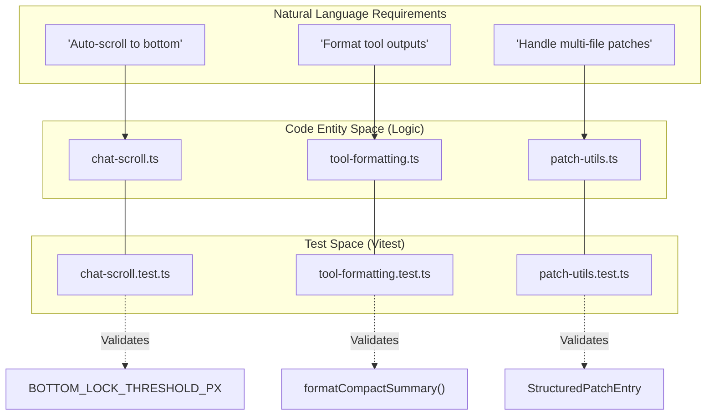
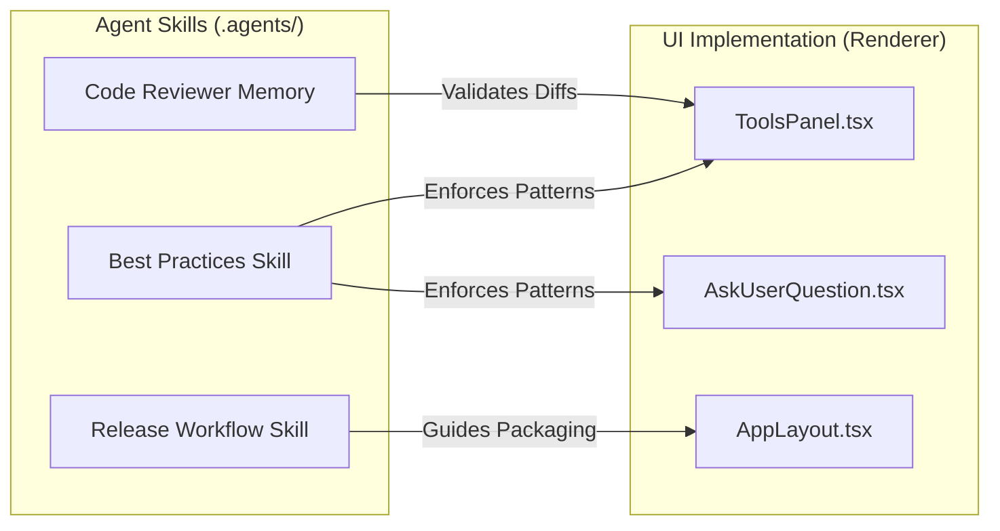

# Testing & Developer Tooling

Relevant source files

The following files were used as context for generating this wiki page:

- [electron/src/lib/__tests__/chat-scroll.test.ts](electron/src/lib/__tests__/chat-scroll.test.ts)
- [src/components/ToolsPanel.tsx](src/components/ToolsPanel.tsx)
- [src/components/lib/tool-formatting.test.ts](src/components/lib/tool-formatting.test.ts)
- [src/components/tool-renderers/AskUserQuestion.tsx](src/components/tool-renderers/AskUserQuestion.tsx)
- [src/lib/ask-user-question.test.ts](src/lib/ask-user-question.test.ts)
- [src/lib/ask-user-question.ts](src/lib/ask-user-question.ts)
- [src/lib/chat-scroll.ts](src/lib/chat-scroll.ts)
- [src/lib/patch-utils.test.ts](src/lib/patch-utils.test.ts)
- [vitest.config.electron.ts](vitest.config.electron.ts)

This section provides an overview of the infrastructure and specialized tooling used to maintain, test, and develop the Harnss codebase. The project employs a dual-process testing strategy to accommodate both the Electron main process and the React renderer, alongside a set of AI "skills" that codify development best practices.

## Test Infrastructure

Harnss uses **Vitest** as its primary testing framework. Because the application spans both Node.js (Main Process) and Browser (Renderer) environments, the test configuration is split to ensure appropriate global mocks and execution environments.

### Main Process & Renderer Testing
The project utilizes a unified Vitest configuration for Electron-related logic and shared utilities. This configuration includes both `electron/src/**/*.test.ts` and `src/**/*.test.{ts,tsx}` to cover the full spectrum of the codebase [vitest.config.electron.ts:11-13](). It uses a `node` environment and automatically restores mocks between tests [vitest.config.electron.ts:13-14]().

### Key Testable Domains
The test suite focuses on critical logic paths that require high reliability:
*   **Patch Utilities**: Logic for identifying multi-file edits and parsing `StructuredPatchEntry` objects [src/lib/patch-utils.test.ts:1-43]().
*   **Chat Scrolling**: Mathematical helpers for "bottom-lock" behavior, ensuring the UI correctly sticks to the bottom during message streaming unless the user manually scrolls up [electron/src/lib/__tests__/chat-scroll.test.ts:1-62]().
*   **Tool Formatting**: Utilities like `formatCompactSummary` which ensure that complex AI tool outputs are summarized accurately in the UI [src/components/lib/tool-formatting.test.ts:1-33]().
*   **Interactive Questions**: Logic for handling `AskUserQuestion` tool calls, including fallback mechanisms for when AI engines do not provide explicit IDs for questions [src/lib/ask-user-question.test.ts:1-142]().

For details on specific test patterns and execution, see [Test Infrastructure](#8.1).

### Infrastructure Mapping

The following diagram illustrates how the test infrastructure bridges the gap between the natural language requirements (e.g., "The chat should auto-scroll") and the underlying code entities.

**Test Architecture Overview**

Sources: [src/lib/chat-scroll.ts:1-3](), [src/lib/patch-utils.test.ts:1-10](), [src/components/lib/tool-formatting.test.ts:3-6](), [vitest.config.electron.ts:1-17]().

## Agent Skills & Coding Guidelines

Harnss is built with "AI-native" development in mind. The repository contains specialized directories (`.agents/` and `.claude/`) that store "skills"—structured instructions and memory for AI agents (like Claude or GitHub Copilot) working on the codebase.

### Development Best Practices
The codebase enforces strict coding standards through these skills, particularly regarding React 19 patterns and Vercel's React best practices. These rules cover:
*   **State Management**: Patterns for using `useAppOrchestrator` and stable references in `useEngineBase`.
*   **UI Components**: Standards for Tailwind CSS usage, accessibility, and the "Island" vs "Flat" layout modes [src/components/ToolsPanel.tsx:105-142]().
*   **Performance**: Guidelines on the `scheduleFlush` mechanism and `StreamingBuffer` to prevent UI jank during high-velocity AI output.

### Release & Review Workflows
Beyond code style, skills define the Harnss release workflow and provide a "code-reviewer" memory. This ensures that AI agents can assist with complex tasks like managing the GitHub Actions CI/CD pipeline or performing automated diff reviews.

For details on the specific rules and how to invoke these skills, see [Agent Skills & Coding Guidelines](#8.2).

### Agent-Code Interaction

This diagram shows how the Agent Skills interact with the actual UI implementation components.

**Agent Skill Integration**

Sources: [src/components/ToolsPanel.tsx:79-89](), [src/components/tool-renderers/AskUserQuestion.tsx:18-25]().

## Developer Utilities

Harnss includes several internal utilities to aid development:
*   **Terminal Themes**: Pre-defined color palettes for dark and light modes used by the `ToolsPanel` to ensure consistency with the Electron shell [src/components/ToolsPanel.tsx:9-59]().
*   **Theme Resolution**: The `getTerminalTheme` function dynamically switches terminal visuals based on the system or app theme [src/components/ToolsPanel.tsx:61-63]().
*   **Interactive Tool Renderers**: Components like `AskUserQuestionContent` allow developers to test complex multi-turn interactions within the chat interface [src/components/tool-renderers/AskUserQuestion.tsx:18-54]().

Sources: [src/components/ToolsPanel.tsx:9-63](), [src/components/tool-renderers/AskUserQuestion.tsx:1-55](), [src/lib/ask-user-question.ts:36-89](), [src/lib/chat-scroll.ts:16-48](), [vitest.config.electron.ts:1-17]().