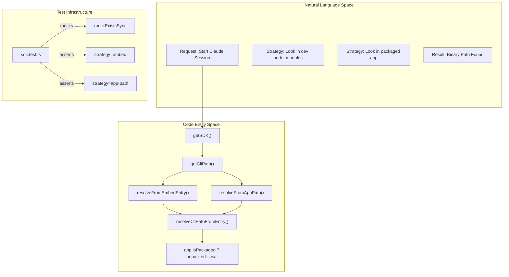
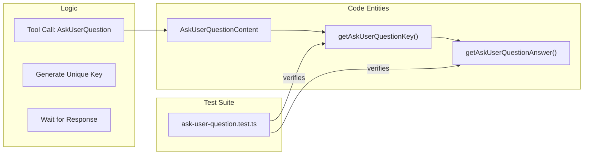

# Test Infrastructure

<details>
<summary>Relevant source files</summary>

The following files were used as context for generating this wiki page:

- [electron/src/ipc/title-gen.ts](electron/src/ipc/title-gen.ts)
- [electron/src/lib/__tests__/chat-scroll.test.ts](electron/src/lib/__tests__/chat-scroll.test.ts)
- [electron/src/lib/__tests__/claude-binary.test.ts](electron/src/lib/__tests__/claude-binary.test.ts)
- [electron/src/lib/__tests__/sdk.test.ts](electron/src/lib/__tests__/sdk.test.ts)
- [electron/src/lib/__tests__/session-derived-data.test.ts](electron/src/lib/__tests__/session-derived-data.test.ts)
- [electron/src/lib/claude-binary.ts](electron/src/lib/claude-binary.ts)
- [electron/src/lib/sdk.ts](electron/src/lib/sdk.ts)
- [src/components/PermissionPrompt.tsx](src/components/PermissionPrompt.tsx)
- [src/components/ToolsPanel.tsx](src/components/ToolsPanel.tsx)
- [src/components/lib/tool-formatting.test.ts](src/components/lib/tool-formatting.test.ts)
- [src/components/tool-renderers/AskUserQuestion.tsx](src/components/tool-renderers/AskUserQuestion.tsx)
- [src/hooks/useGitStatus.ts](src/hooks/useGitStatus.ts)
- [src/lib/ask-user-question.test.ts](src/lib/ask-user-question.test.ts)
- [src/lib/ask-user-question.ts](src/lib/ask-user-question.ts)
- [src/lib/chat-scroll.ts](src/lib/chat-scroll.ts)
- [src/lib/patch-utils.test.ts](src/lib/patch-utils.test.ts)
- [vitest.config.electron.ts](vitest.config.electron.ts)

</details>


Harnss utilizes **Vitest** as its primary testing framework, configured to handle the unique requirements of a dual-process Electron application. The infrastructure is split between standard unit tests for the React renderer and specialized configurations for the Electron main process to ensure native integrations and SDK interactions are verified in a Node.js-compatible environment.

## Test Configuration & Organization

The project uses a unified testing approach but distinguishes between renderer-side logic and main-process logic through configuration.

### Main Process Testing
Main process tests (located in `electron/src/**/*.test.ts`) are executed using `vitest.config.electron.ts`. This configuration sets the test environment to `node` and defines aliases for cross-process module resolution [vitest.config.electron.ts:1-16]().

### Renderer Testing
Renderer tests follow standard Vitest patterns, often involving DOM-related utilities for UI components. Key utility libraries like `patch-utils.ts` and `chat-scroll.ts` are tested here to ensure the logic governing the chat interface and file diffing remains robust.

| Test Category | Configuration File | Environment | Target Files |
|:---|:---|:---|:---|
| **Main Process** | `vitest.config.electron.ts` | `node` | `electron/src/**/*.test.ts` |
| **Renderer/Shared** | Standard Vitest | `jsdom` / `node` | `src/**/*.test.{ts,tsx}` |

**Sources:** [vitest.config.electron.ts:1-16]()

---

## Key Test Suites

### 1. SDK & Binary Resolution
The SDK test suite verifies how Harnss locates the `claude-code` CLI binary across different environments (development vs. packaged ASAR).

*   **Path Mapping:** Tests ensure that in packaged builds, paths inside `app.asar` are correctly redirected to `app.asar.unpacked` so that spawned Node.js child processes can access the binaries [electron/src/lib/__tests__/sdk.test.ts:63-74]().
*   **Resolution Strategy:** The `getCliPath` function is tested against a tiered priority: `embed` resolution → `package` entry → `app-path` fallback [electron/src/lib/__tests__/sdk.test.ts:76-107]().
*   **Environment Injection:** Validates that `clientAppEnv()` correctly identifies the application (e.g., "Harnss/0.16.0") to the Anthropic backend [electron/src/lib/__tests__/sdk.test.ts:122-129]().

**Sources:** [electron/src/lib/sdk.ts:56-62](), [electron/src/lib/__tests__/sdk.test.ts:43-130]()

### 2. Patch & Tool Formatting
These tests ensure that AI-generated file edits are correctly parsed and displayed to the user.

*   **Multi-file Detection:** `patch-utils.test.ts` verifies that `isMultiFileStructuredPatch` accurately distinguishes between multiple hunks in a single file versus edits spanning several files [src/lib/patch-utils.test.ts:8-43]().
*   **Compact Summaries:** `tool-formatting.test.ts` ensures that the UI doesn't miscount single-file edits as "multiple files" when multiple hunks are present [src/components/lib/tool-formatting.test.ts:5-32]().

**Sources:** [src/lib/patch-utils.test.ts:1-43](), [src/components/lib/tool-formatting.test.ts:1-33]()

### 3. Chat Scroll & Virtualization
The chat interface relies on precise scroll logic to maintain "bottom-lock" (staying at the bottom when new messages arrive) while allowing user overrides.

*   **Bottom Lock Logic:** Tests for `shouldUnlockBottomLock` verify that the view only unlocks if there is explicit `hasRecentUserIntent` (user-initiated scroll) [electron/src/lib/__tests__/chat-scroll.test.ts:29-44]().
*   **Scroll Fading:** `getTopScrollProgress` is tested to ensure the top shadow appears smoothly as the user scrolls away from the top of the thread [electron/src/lib/__tests__/chat-scroll.test.ts:54-61]().

**Sources:** [src/lib/chat-scroll.ts:1-48](), [electron/src/lib/__tests__/chat-scroll.test.ts:11-62]()

---

## Natural Language to Code Mapping

### SDK Resolution Flow
The following diagram maps the logical "Find the CLI" process to the internal resolution strategies and their corresponding test mocks.

Title: SDK Binary Resolution Flow

**Sources:** [electron/src/lib/sdk.ts:115-127](), [electron/src/lib/__tests__/sdk.test.ts:76-107]()

### Permission & Interaction Pattern
This diagram illustrates how user questions (from tools like `AskUserQuestion`) are tracked from the tool call through to the UI response.

Title: AskUserQuestion Data Flow

**Sources:** [src/components/tool-renderers/AskUserQuestion.tsx:18-54](), [src/lib/ask-user-question.ts:1-26]()

---

## Testing Patterns

### Mocking Electron & FS
Main process tests frequently mock `electron` and `fs` to simulate different environment states (e.g., packaged vs. unpackaged) without requiring a full Electron runtime.

[electron/src/lib/__tests__/sdk.test.ts:20-28]()
```typescript
vi.mock("electron", () => ({
  app: mockApp,
}));

vi.mock("fs", () => ({
  default: {
    existsSync: mockExistsSync,
  },
}));
```

### Snapshotting UI Logic
For complex string formatting (like `formatCompactSummary`), tests use explicit expectations to ensure the AI's tool output is rendered concisely in the chat bubbles.

**Sources:** [electron/src/lib/__tests__/sdk.test.ts:1-131](), [src/components/lib/tool-formatting.test.ts:5-32]()