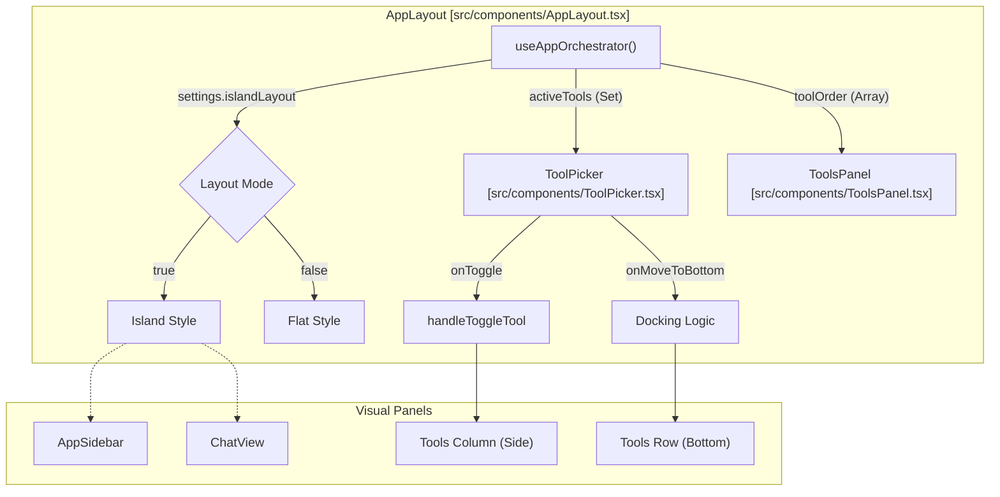
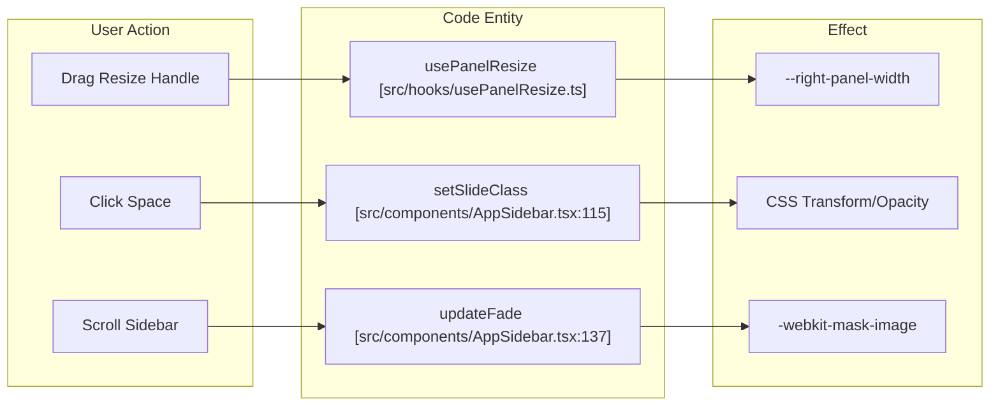

# App Layout & Panel System

Relevant source files

The following files were used as context for generating this wiki page:

- [electron/src/lib/__tests__/layout-constants.test.ts](electron/src/lib/__tests__/layout-constants.test.ts)
- [src/components/AppLayout.tsx](src/components/AppLayout.tsx)
- [src/components/AppSidebar.tsx](src/components/AppSidebar.tsx)
- [src/components/ToolPicker.tsx](src/components/ToolPicker.tsx)
- [src/lib/layout-constants.ts](src/lib/layout-constants.ts)

The Harnss interface is orchestrated by the `AppLayout` component, which manages a sophisticated multi-pane environment. It supports dynamic layout modes (Island vs. Flat), flexible tool docking, and a resilient panel lifecycle where tools remain mounted to preserve state even when hidden.

## 1. Layout Orchestration & Modes

The system supports two primary visual architectures defined by the `islandLayout` setting. This choice propagates through the entire component tree via `AppLayout` to adjust spacing, border radii, and resize handle behavior [src/components/AppLayout.tsx:56-159]().

### Layout Mode Comparison

| Feature | Island Layout | Flat Layout |
| :--- | :--- | :--- |
| **Spacing** | Uses `ISLAND_GAP` (6px) between panes [src/lib/layout-constants.ts:6]() | Edge-to-edge panes with 1px borders |
| **Radii** | `ISLAND_RADIUS` (12px) for main containers [src/lib/layout-constants.ts:10]() | Sharp corners (0px) |
| **Resize Handles** | Transparent 4px hit area (`ISLAND_PANEL_GAP`) [src/lib/layout-constants.ts:25]() | 1px solid borders [src/lib/layout-constants.ts:26]() |
| **Sidebars** | Detached floating appearance | Integrated flush sidebar |

### Dynamic CSS Variable Injection
To ensure native-feeling titlebars, `AppLayout` injects dynamic CSS variables for tinting. When "Glass" transparency is enabled on macOS or Windows, the `useSpaceTheme` hook calculates optimal background colors based on the active Space's theme and the system's dark/light mode [src/components/AppLayout.tsx:81-88]().

**Sources:** [src/components/AppLayout.tsx:56-159](), [src/lib/layout-constants.ts:1-40]().

---

## 2. Panel System Architecture

The layout is divided into three functional zones: the **Sidebar**, the **Chat Column**, and the **Tools Area**. The Tools Area is further divided into a vertical side column and a horizontal bottom row.

### Data Flow & Component Mapping
The following diagram illustrates how `AppLayout` maps internal state to the physical layout components.

**Layout Entity Mapping**

**Sources:** [src/components/AppLayout.tsx:56-159](), [src/components/ToolPicker.tsx:91-110]().

---

## 3. Tool Docking & Lifecycle

Harnss employs an "Always-Mounted" lifecycle for tool panels. Unlike traditional tabs that unmount content, panels like the `TerminalPanel`, `BrowserPanel`, and `FilesPanel` are kept in the DOM but hidden via CSS (`display: none` or width/height 0) [src/components/AppLayout.tsx:430-550]().

### Side vs. Bottom Docking
Users can choose where tools appear using the `ToolPicker`. 
- **Side Column:** Managed by `ToolsPanel`. Ideal for `FilesPanel` or `GitPanel`.
- **Bottom Row:** Docked below the `ChatView`. Ideal for `TerminalPanel` or `BrowserPanel`.

### Resizing Implementation
Resizing is handled by the `usePanelResize` hook, which manages mouse event listeners and persistence [src/components/AppLayout.tsx:7]().
- **Horizontal Resizing:** Adjusts the width of the right-side tools column.
- **Vertical Resizing:** Adjusts the height of the bottom tools row.
- **Constraints:** Minimum widths and heights are enforced via `MIN_TOOLS_PANEL_WIDTH` (280px) and `MIN_BOTTOM_TOOLS_HEIGHT` (120px) [src/lib/layout-constants.ts:15-17]().

**Sources:** [src/components/AppLayout.tsx:430-550](), [src/lib/layout-constants.ts:14-20]().

---

## 4. UI Polish & Visual Effects

### Scroll Fades
The `AppSidebar` implements a "mask-image" based scroll fade. This creates a smooth transparency gradient at the top and bottom of the project list, which dynamically appears or disappears based on the scroll position [src/components/AppSidebar.tsx:132-175]().

### Transition Animations
When switching between "Spaces," the sidebar content performs a directional slide animation (`space-slide-from-right` or `space-slide-from-left`) based on the relative order of the spaces [src/components/AppSidebar.tsx:114-130]().

### Progress Indicators
The `ToolPicker` includes a `ToolProgressRing` component. This SVG-based circular progress bar wraps tool icons (like the Tasks icon) to show real-time completion status of background AI operations [src/components/ToolPicker.tsx:15-54]().

**Entity Relationship: UI Interaction to Code**

**Sources:** [src/components/AppSidebar.tsx:114-175](), [src/components/ToolPicker.tsx:15-54]().