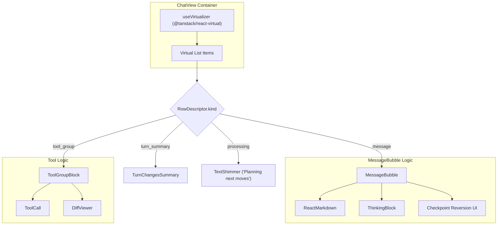
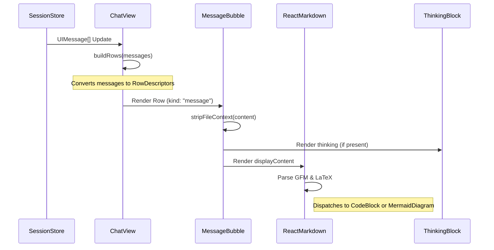

# Chat Interface: ChatView & MessageBubble

Relevant source files

The following files were used as context for generating this wiki page:

- [src/components/BottomComposer.test.tsx](src/components/BottomComposer.test.tsx)
- [src/components/BottomComposer.tsx](src/components/BottomComposer.tsx)
- [src/components/ChatView.tsx](src/components/ChatView.tsx)
- [src/components/CopyButton.tsx](src/components/CopyButton.tsx)
- [src/components/DiffViewer.tsx](src/components/DiffViewer.tsx)
- [src/components/MermaidDiagram.test.tsx](src/components/MermaidDiagram.test.tsx)
- [src/components/MermaidDiagram.tsx](src/components/MermaidDiagram.tsx)
- [src/components/MessageBubble.tsx](src/components/MessageBubble.tsx)
- [src/components/ThinkingBlock.tsx](src/components/ThinkingBlock.tsx)
- [src/lib/thinking-animation.test.ts](src/lib/thinking-animation.test.ts)
- [src/lib/thinking-animation.ts](src/lib/thinking-animation.ts)

The chat interface is the primary surface for human-AI interaction in Harnss. It provides a virtualized, high-performance message thread capable of rendering complex markdown, LaTeX, Mermaid diagrams, and interactive tool blocks while maintaining scroll stability during high-frequency streaming.

## ChatView: Virtualized Message Thread

`ChatView` manages the rendering of the conversation history using `@tanstack/react-virtual`. Instead of rendering all messages in the DOM, it uses a windowing strategy to handle thousands of messages with minimal memory overhead [src/components/ChatView.tsx:4-4]().

### RowDescriptor Model

To handle different types of content (messages, tool groups, and summaries) within a single virtualized list, `ChatView` transforms the flat `UIMessage[]` array into a `RowDescriptor[]` [src/components/ChatView.tsx:28-32]().

| Kind           | Description                                                                 | Source                                |
| :------------- | :-------------------------------------------------------------------------- | :------------------------------------ |
| `message`      | A standard user or assistant message.                                       | [src/components/ChatView.tsx:29-29]() |
| `tool_group`   | A collection of related tool calls and results (e.g., multiple file reads). | [src/components/ChatView.tsx:30-30]() |
| `turn_summary` | A summary of changes made during a specific turn.                           | [src/components/ChatView.tsx:31-31]() |
| `processing`   | A visual indicator that the AI is currently planning or working.            | [src/components/ChatView.tsx:32-32]() |

The `buildRows` function iterates through messages and applies grouping logic, specifically collapsing finalized tool sequences into a single `tool_group` row to reduce visual clutter [src/components/ChatView.tsx:41-87]().

### Scroll Management & User Intent

Scroll behavior is governed by a "bottom-lock" mechanism. The view stays pinned to the bottom during streaming unless the user manually scrolls up, indicating "user scroll intent" [src/lib/chat-scroll:1-23]().

- **Bottom Lock Threshold**: Defined by `BOTTOM_LOCK_THRESHOLD_PX` [src/components/ChatView.tsx:18-18]().
- **Intent Detection**: The system tracks the time and distance of manual scrolls to determine if it should release the lock [src/components/ChatView.tsx:19-23]().
- **Resize Handling**: The `CHAT_CONTENT_RESIZED_EVENT` triggers re-calculation of virtualized offsets when content (like an image or diff) changes size after initial render [src/components/ChatView.tsx:24-24]().

### ChatView Rendering Architecture

The following diagram illustrates how the `ChatView` orchestrates different components based on the `RowDescriptor`.

**ChatView Component Dispatch**

Sources: [src/components/ChatView.tsx:41-108](), [src/components/ChatView.tsx:125-203]()

---

## MessageBubble: Content Rendering

`MessageBubble` is responsible for rendering individual messages, including markdown parsing, syntax highlighting, and specialized badges [src/components/MessageBubble.tsx:177-186]().

### Markdown & LaTeX

Content is processed via `react-markdown` with the `remark-gfm` plugin [src/components/MessageBubble.tsx:3-4]().

- **Syntax Highlighting**: Fenced code blocks are rendered using `SyntaxHighlighter` with the `oneDark` theme [src/components/MessageBubble.tsx:5-6]().
- **Context Handling**: A custom `IsBlockCodeContext` is used to distinguish between inline code and block-level code components [src/components/MessageBubble.tsx:32-34]().

### Mention Badges & Context Stripping

User messages often contain raw XML context tags (e.g., `<file path="...">`).

- **`stripFileContext`**: Removes these internal XML tags from the visible UI to keep the chat clean [src/components/MessageBubble.tsx:116-121]().
- **`renderWithMentions`**: Converts `@path/to/file` or `[[element:...]]` strings into interactive styled badges with file/folder icons [src/components/MessageBubble.tsx:124-159]().

### Mermaid Diagrams

When a message contains a `mermaid` code fence, `MessageBubble` delegates rendering to the `MermaidDiagram` component [src/components/MessageBubble.tsx:21-21]().

- **Caching**: Rendered SVGs are cached in `mermaidSvgCache` to prevent expensive re-renders during virtualized list scrolling [src/components/MermaidDiagram.tsx:11-11]().
- **Theming**: The component dynamically injects theme variables (colors, font sizes) into the Mermaid configuration based on the current app theme (Light/Dark) [src/components/MermaidDiagram.tsx:38-198]().
- **Streaming State**: Raw source is shown while the message is streaming; the diagram is only rendered once the block is complete [src/components/MermaidDiagram.test.tsx:36-43]().

### ThinkingBlock

For models that support internal reasoning (like Claude 3.7 Sonnet), the `ThinkingBlock` renders a collapsible section [src/components/ThinkingBlock.tsx:20-20]().

- **Append-only Animation**: The `advanceThinkingAnimationState` ensures that as new "thoughts" stream in, they are appended without causing the entire text block to jitter or re-scroll [src/lib/thinking-animation.ts:35-89]().
- **Auto-scroll**: The inner thinking container automatically scrolls to the bottom as content arrives, unless the user has manually scrolled up to read earlier thoughts [src/components/ThinkingBlock.tsx:42-48]().

---

## Interactive Features

### Checkpoint Reversion UI

Assistant messages that modify the filesystem include a reversion UI, allowing users to undo changes [src/components/MessageBubble.tsx:167-170]().

- **Revert files only**: Restores the project files to the state they were in before that message was processed [src/components/MessageBubble.tsx:167-168]().
- **Full Revert**: Restores files and also truncates the chat history at that point [src/components/MessageBubble.tsx:169-170]().

### Tool Grouping

Tool calls are often repetitive (e.g., a series of `read_file` calls). `ChatView` uses `computeToolGroups` to cluster these into a `ToolGroupBlock` [src/components/ChatView.tsx:15-15]().

- **Expansion**: Tools can be set to `autoExpandTools` via settings [src/components/ChatView.tsx:115-115]().
- **Finalization**: Groups are only collapsed once the entire sequence of tool calls and results is finalized [src/components/ChatView.tsx:55-64]().

### Component Association Map

The following table maps conceptual UI elements to their implementation files.

| UI Concept        | Code Entity      | File Path                             |
| :---------------- | :--------------- | :------------------------------------ |
| Virtualized List  | `useVirtualizer` | [src/components/ChatView.tsx]()       |
| Markdown Parser   | `ReactMarkdown`  | [src/components/MessageBubble.tsx]()  |
| Code Diff View    | `DiffViewer`     | [src/components/DiffViewer.tsx]()     |
| Reasoning/Thought | `ThinkingBlock`  | [src/components/ThinkingBlock.tsx]()  |
| Diagram Engine    | `mermaid`        | [src/components/MermaidDiagram.tsx]() |
| User Input Area   | `BottomComposer` | [src/components/BottomComposer.tsx]() |

### Data Flow: From Message to Render

**Message Processing Pipeline**

Sources: [src/components/ChatView.tsx:41-87](), [src/components/MessageBubble.tsx:188-203](), [src/lib/thinking-animation.ts:35-50]()
