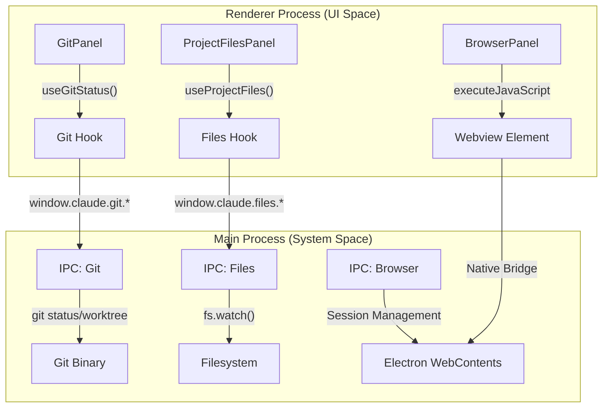

# Developer Tool Panels

Relevant source files

The following files were used as context for generating this wiki page:

- [electron/src/ipc/files.ts](electron/src/ipc/files.ts)
- [public/icon.png](public/icon.png)
- [src/components/BrowserPanel.tsx](src/components/BrowserPanel.tsx)
- [src/components/FilesPanel.tsx](src/components/FilesPanel.tsx)
- [src/components/ProjectFilesPanel.tsx](src/components/ProjectFilesPanel.tsx)
- [src/components/TodoPanel.tsx](src/components/TodoPanel.tsx)
- [src/components/git/CommitInput.tsx](src/components/git/CommitInput.tsx)
- [src/components/git/GitPanel.tsx](src/components/git/GitPanel.tsx)
- [src/hooks/useProjectFiles.ts](src/hooks/useProjectFiles.ts)

Developer Tool Panels are dockable, specialized UI components located in the side columns or bottom row of the Harnss interface. They provide real-time visibility into the project state, AI planning progress, and system resources, bridging the gap between the chat-based agent interaction and the local development environment.

## Overview of Panel Architecture

The panel system is managed by the `AppLayout` and uses a set of shared hooks for data synchronization. Most panels follow a pattern of subscribing to IPC events from the Electron main process to maintain a "live" view of the filesystem, git status, or terminal output.

### Data Flow and Synchronization

The following diagram illustrates how the frontend panels interact with the main process to reflect the current state of a project.

**Diagram: Panel State Synchronization**

Sources: [src/hooks/useProjectFiles.ts:17-103](), [src/components/git/GitPanel.tsx:47-47](), [electron/src/ipc/files.ts:123-158]().

---

## GitPanel: Worktree and Commit Management

The `GitPanel` provides a high-level interface for managing Git worktrees and staging changes. It is particularly focused on supporting the "multi-worktree" workflow often used by agents to isolate experimental changes.

### Key Capabilities

- **Worktree Management**: Allows creating, removing, and switching between Git worktrees via `handleCreateWorktree` and `handleRemoveWorktree` [src/components/git/GitPanel.tsx:127-186]().
- **Commit Input**: A specialized `CommitInput` component that supports AI-generated commit messages. It calls `window.claude.git.generateCommitMessage`, which respects rules defined in `CLAUDE.md` [src/components/git/CommitInput.tsx:48-66]().
- **Live Status**: Uses the `useGitStatus` hook to poll and subscribe to repository changes [src/components/git/GitPanel.tsx:47-47]().

Sources: [src/components/git/GitPanel.tsx:1-46](), [src/components/git/CommitInput.tsx:20-137]().

---

## BrowserPanel: Element Grabbing and Navigation

The `BrowserPanel` encapsulates an Electron `<webview>` to allow users (and agents) to interact with web applications. It includes a sophisticated "Element Inspector" for "grabbing" DOM elements to be used as context in the chat.

### Element Grabbing Workflow

1. **Inspect Mode**: When `inspectMode` is toggled, the panel injects an inspector script into the webview [src/components/BrowserPanel.tsx:102-102]().
2. **Script Injection**: It uses `getInspectorScript` to enable hover highlighting and click-to-grab behavior within the guest page [src/components/BrowserPanel.tsx:3-3]().
3. **Data Extraction**: Once an element is selected, the `onElementGrab` callback returns a `GrabbedElement` containing the HTML structure and metadata to the main input bar [src/components/BrowserPanel.tsx:54-54]().

### Tab Management

The panel maintains its own `tabs` state and persistent `history` in `localStorage` [src/components/BrowserPanel.tsx:100-131](). It supports standard navigation features like back, forward, reload, and a "Start Page" with history suggestions [src/components/BrowserPanel.tsx:184-201]().

Sources: [src/components/BrowserPanel.tsx:1-131](), [src/components/BrowserPanel.tsx:151-214]().

---

## FilesPanel and ProjectFilesPanel

Harnss distinguishes between "Open Files" (files currently relevant to the session) and "Project Files" (the entire file tree).

### ProjectFilesPanel (The Explorer)

This panel provides a recursive view of the project directory.

- **Efficient Loading**: Uses `useProjectFiles` to fetch a flattened file list and then converts it to a tree structure using `buildFileTree` [src/hooks/useProjectFiles.ts:17-38]().
- **Live Watching**: In the main process, `startProjectWatcher` uses `fs.watch` with a debounce timer (200ms) to notify the UI of changes without overwhelming the IPC bridge [electron/src/ipc/files.ts:123-150]().
- **Filtering**: Supports real-time search with auto-expansion of matching directories [src/components/ProjectFilesPanel.tsx:70-92]().

### FilesPanel (Session Context)

The `FilesPanel` displays files that have been read or written during the current AI session.

- **Access Types**: Visualizes whether a file was read, written, or modified using icons defined in `ACCESS_ICON` [src/components/FilesPanel.tsx:150-153]().
- **Session Linking**: Clicking a file in this panel triggers `onScrollToToolCall`, scrolling the chat view to the specific tool call that last touched that file [src/components/FilesPanel.tsx:109-113]().

Sources: [src/components/ProjectFilesPanel.tsx:62-214](), [src/components/FilesPanel.tsx:32-145](), [electron/src/ipc/files.ts:123-170]().

---

## TodoPanel: Plan Progress

The `TodoPanel` visualizes the "Plan" generated by the AI agent. It tracks the lifecycle of a task from pending to completion.

### Implementation Details

- **Data Source**: It extracts `TodoItem` objects from the message history using `getTodoItems` [src/components/TodoPanel.tsx:103-104]().
- **Visual Progress**: Features an SVG `ProgressRing` that calculates the percentage of `completed` vs `total` steps [src/components/TodoPanel.tsx:12-78]().
- **Status Mapping**:
  - `completed`: Rendered with `CheckCircle2` [src/components/TodoPanel.tsx:82-87]().
  - `in_progress`: Rendered with an animated `Loader2` [src/components/TodoPanel.tsx:89-94]().

Sources: [src/components/TodoPanel.tsx:1-196]().

---

## Summary of Panel Components

| Panel          | Primary Code Entity | Responsibility                                                     |
| :------------- | :------------------ | :----------------------------------------------------------------- |
| **Git**        | `GitPanel`          | Worktree switching, AI commit generation, branch management.       |
| **Browser**    | `BrowserPanel`      | Webview navigation, DOM element "grabbing" for context.            |
| **Files**      | `ProjectFilesPanel` | Recursive project explorer with native `fs.watch` integration.     |
| **Open Files** | `FilesPanel`        | Chronological list of files accessed/modified in the current turn. |
| **Tasks**      | `TodoPanel`         | Step-by-step progress tracking of the AI's execution plan.         |
| **Terminal**   | `TerminalPanel`     | Integrated PTY access (see Section 2.2).                           |

Sources: [src/components/git/GitPanel.tsx:38-46](), [src/components/BrowserPanel.tsx:99-105](), [src/components/ProjectFilesPanel.tsx:62-67](), [src/components/FilesPanel.tsx:32-39](), [src/components/TodoPanel.tsx:103-110]().
