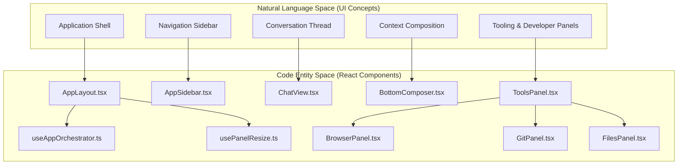
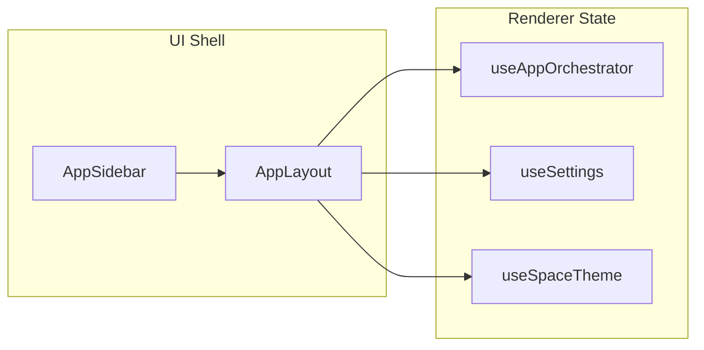

# UI Architecture & Components

Relevant source files

The following files were used as context for generating this wiki page:

- [electron/src/lib/**tests**/layout-constants.test.ts](electron/src/lib/__tests__/layout-constants.test.ts)
- [src/components/AppLayout.tsx](src/components/AppLayout.tsx)
- [src/components/AppSidebar.tsx](src/components/AppSidebar.tsx)
- [src/components/ui/text-shimmer.tsx](src/components/ui/text-shimmer.tsx)
- [src/index.css](src/index.css)
- [src/lib/background-claude-handler.ts](src/lib/background-claude-handler.ts)
- [src/lib/layout-constants.ts](src/lib/layout-constants.ts)
- [src/lib/streaming-buffer.test.ts](src/lib/streaming-buffer.test.ts)
- [src/lib/streaming-buffer.ts](src/lib/streaming-buffer.ts)

The Harnss UI is a high-performance React application running within an Electron renderer process. It is designed to handle high-frequency streaming updates from multiple AI engines while maintaining a responsive, multi-pane layout. The architecture emphasizes a "shell" approach where the core layout orchestrates several specialized, always-mounted panels.

### System Overview Diagram

This diagram maps the high-level UI regions to their primary React component implementations.

**Sources:** [src/components/AppLayout.tsx:56-79](), [src/components/AppSidebar.tsx:45-75](), [src/components/ToolsPanel.tsx:30-40]()

---

## [App Layout & Panel System](#5.1)

The `AppLayout` serves as the root container for the entire workspace. It utilizes a custom `usePanelResize` hook to manage the flexible distribution of space between the sidebar, the central chat view, and the auxiliary tool panels.

The system supports two primary visual modes:

- **Island Mode:** A modern, floating-pane aesthetic with rounded corners (`ISLAND_RADIUS`) and defined gaps (`ISLAND_GAP`) between panels.
- **Flat Mode:** A traditional edge-to-edge layout for maximum screen real estate.

The layout dynamically calculates minimum window widths based on platform-specific requirements (e.g., `WINDOWS_FRAME_BUFFER_WIDTH` for Win32) to ensure the UI remains functional.

For details, see [App Layout & Panel System](#5.1).

**Sources:** [src/components/AppLayout.tsx:56-88](), [src/lib/layout-constants.ts:1-12](), [src/lib/layout-constants.ts:40-52]()

---

## [Chat Interface: ChatView & MessageBubble](#5.2)

The `ChatView` is the primary interaction surface. Because AI conversations can grow to hundreds of messages with large tool outputs, it employs a virtualized list via `@tanstack/react-virtual`.

Key architectural features include:

- **RowDescriptor Model:** A normalization layer that converts raw session messages into renderable rows, grouping consecutive tool calls into `ToolGroupBlock` components.
- **Streaming Performance:** Uses a `StreamingBuffer` to handle incremental text and "thinking" deltas. It employs a `mergeStreamingChunk` strategy to detect and deduplicate overlapping content snapshots sent by AI SDKs.

For details, see [Chat Interface: ChatView & MessageBubble](#5.2).

**Sources:** [src/components/ChatView.tsx:21-40](), [src/lib/streaming-buffer.ts:7-26](), [src/lib/streaming-buffer.ts:65-90]()

---

## [Input Bar & Message Composition](#5.3)

The `BottomComposer` manages the `InputBar`, a sophisticated `contentEditable` component. It handles complex message preparation, including:

- **Context Attachment:** Managing "grabbed" elements from the browser, image attachments, and @-mentions for files or folders.
- **Protocol Wrapping:** Before sending, the composer runs an extraction pipeline to wrap content in XML structures expected by the underlying AI engines.

For details, see [Input Bar & Message Composition](#5.3).

**Sources:** [src/components/BottomComposer.tsx:22-40](), [src/components/AppLayout.tsx:108-117]()

---

## [Sidebar, Spaces & Project Navigation](#5.4)

`AppSidebar` provides the hierarchical navigation for Harnss. It organizes work into **Spaces** (logical groupings), **Projects** (file-system backed directories), and **Sessions** (individual chat threads).

The sidebar features:

- **SpaceBar:** A vertical strip for switching between high-level contexts.
- **Dynamic CSS Masking:** Implements "scroll fades" using `linear-gradient` masks to provide visual cues when content extends beyond the viewport.
- **State Polling:** Lightweight polling (every 5s) to sync settings like `defaultChatLimit` from the main process without requiring a full app reload.

For details, see [Sidebar, Spaces & Project Navigation](#5.4).

**Sources:** [src/components/AppSidebar.tsx:7-43](), [src/components/AppSidebar.tsx:87-96](), [src/components/AppSidebar.tsx:170-174]()

---

## [Tool Renderers & Diff Viewers](#5.5)

AI tool calls (like `write_to_file` or `bash`) are not just text; they are rendered as interactive cards within the chat thread. The `ToolGroupBlock` dispatches these calls to specific renderers:

- **EditContent/WriteContent:** Normalizes patch entries into a `StructuredPatchEntry`.
- **DiffViewer:** Provides side-by-side or unified diff views for file changes.

For details, see [Tool Renderers & Diff Viewers](#5.5).

**Sources:** [src/components/ToolsPanel.tsx:30-40](), [src/lib/background-claude-handler.ts:115-132]()

---

## [Developer Tool Panels](#5.6)

Harnss includes a suite of dockable panels that provide deep integration with the developer's environment. These panels are managed by the `ToolsPanel` and are often "always-mounted" to preserve state (like terminal history or browser scroll position).

| Panel        | Implementation  | Key Responsibility                                         |
| :----------- | :-------------- | :--------------------------------------------------------- |
| **Git**      | `GitPanel`      | Worktree management, diffing, and committing.              |
| **Browser**  | `BrowserPanel`  | Electron `<webview>` for web testing and element grabbing. |
| **Files**    | `FilesPanel`    | Project-wide file tree and search.                         |
| **Terminal** | `TerminalPanel` | Integrated shell access via `node-pty`.                    |
| **MCP**      | `McpPanel`      | Management of Model Context Protocol servers.              |

For details, see [Developer Tool Panels](#5.6).

**Sources:** [src/components/AppLayout.tsx:30-35](), [src/components/GitPanel.tsx:1-10](), [src/components/BrowserPanel.tsx:1-10]()

---

### UI State & The Orchestrator

The UI is driven by the `useAppOrchestrator` hook, which serves as the central "brain" for the renderer process. It connects the UI components to the underlying engine sessions, project management logic, and Electron IPC bridges.

**Sources:** [src/components/AppLayout.tsx:5-7](), [src/components/AppLayout.tsx:57-79]()
