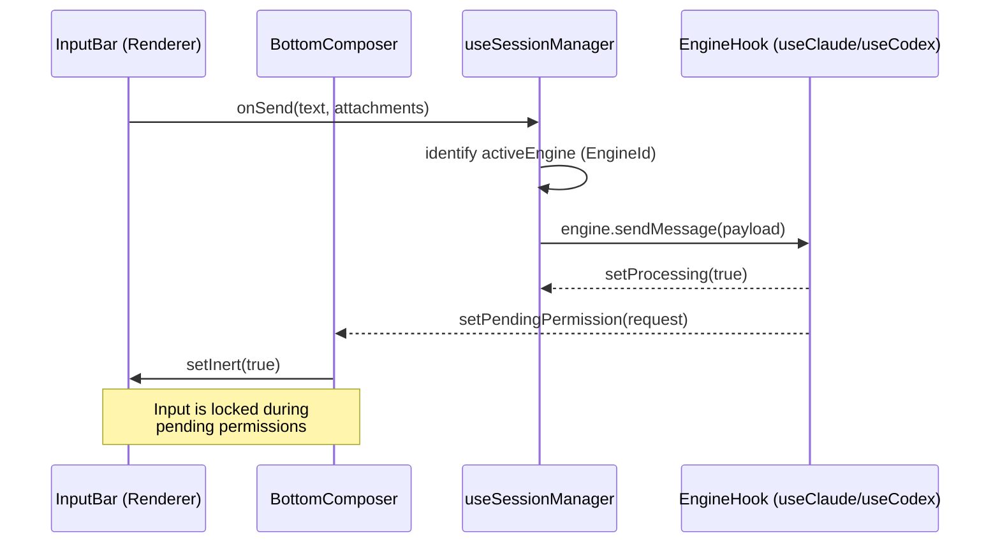

# Input Bar & Message Composition

<details>
<summary>Relevant source files</summary>

The following files were used as context for generating this wiki page:

- [shared/types/engine.ts](shared/types/engine.ts)
- [src/components/BottomComposer.test.tsx](src/components/BottomComposer.test.tsx)
- [src/components/BottomComposer.tsx](src/components/BottomComposer.tsx)
- [src/components/ChatHeader.tsx](src/components/ChatHeader.tsx)
- [src/components/InputBar.test.ts](src/components/InputBar.test.ts)
- [src/components/InputBar.tsx](src/components/InputBar.tsx)
- [src/hooks/useCodex.ts](src/hooks/useCodex.ts)
- [src/hooks/useSessionManager.ts](src/hooks/useSessionManager.ts)
- [src/hooks/useSettings.ts](src/hooks/useSettings.ts)

</details>

The Input Bar is the primary interface for user interaction within Harnss, responsible for capturing multi-modal input (text, images, files) and transforming it into a structured format suitable for the active AI engine. It manages complex UI states including @-mentions, slash commands, and voice dictation while providing real-time feedback on context usage and model settings.

## Architecture & Data Flow

The composition pipeline follows a multi-step extraction and wrapping process. Before a message is dispatched via the `onSend` callback, the raw `contentEditable` HTML is parsed to extract metadata and attachments.

### Composition Pipeline

1.  **Input Capture**: The `InputBar` component utilizes a `contentEditable` div to allow for rich text and inline "chips" (e.g., file mentions) [src/components/InputBar.tsx:104]().
2.  **Metadata Extraction**: The system scans the input for `@-mentions` (files/folders) and `slash commands` [src/components/InputBar.tsx:44]().
3.  **Attachment Handling**: Images and "grabbed" elements from the `BrowserPanel` are staged in local state [src/components/InputBar.tsx:44]().
4.  **XML Wrapping**: For engines like Claude, the context (files, folder structures) is wrapped in XML tags (e.g., `<file>`, `<context>`) to provide clear structural boundaries for the LLM.
5.  **Dispatch**: The final payload is passed to `useSessionManager`, which routes it to the specific engine hook (`useClaude`, `useACP`, or `useCodex`) [src/hooks/useSessionManager.ts:48-87]().

### Natural Language to Code Entity Mapping (Composition)

The following diagram illustrates how user-facing UI elements in the Input Bar map to specific code structures and state managers.

Title: Input Bar UI to Code Mapping

```mermaid
graph TD
    subgraph "Natural Language Space (UI)"
        A["'@' Mention Chip"]
        B["'/clear' Command"]
        C["Voice Mic Button"]
        D["Image Attachment"]
    end

    subgraph "Code Entity Space (Implementation)"
        E["MentionData / FileRef"]
        F["SlashCommand Interface"]
        G["useSpeechRecognition Hook"]
        H["ImageAttachment Type"]
    end

    A -->|"Parsed by"| E
    B -->|"Validated by"| F
    C -->|"Managed by"| G
    D -->|"Stored in"| H

    E --- [src/types/ui.ts:1]
    F --- [shared/types/engine.ts:5]
    G --- [src/hooks/useSpeechRecognition.ts:1]
    H --- [src/types/ui.ts:1]
```

Sources: [src/components/InputBar.tsx:44-47](), [shared/types/engine.ts:5-20](), [src/hooks/useSessionManager.ts:34]().

## Key Features & Implementation

### Slash Commands

Slash commands provide a shortcut for engine-specific actions. They are normalized across different backends via the `SlashCommand` interface [shared/types/engine.ts:5-20]().

- **Local Commands**: Commands like `/clear` are handled locally by the renderer to reset session state [src/components/InputBar.test.ts:4-8]().
- **Engine Commands**: Commands like `/compact` (Claude) or `$jira` (Codex) are dynamically fetched from the active engine hook [src/hooks/useCodex.ts:100]().
- **Replacement Logic**: The `getSlashCommandReplacement` helper determines how a selected command is inserted into the text buffer [src/components/InputBar.test.ts:41-48]().

### Deep Folder Mode & Context Warning

When a user mentions a folder, the Input Bar calculates the potential context size.

- **Context Usage**: Real-time token counting is displayed using `formatTokenCount` [src/components/InputBar.tsx:84-88]().
- **Visual Indicators**: The UI changes color (Green → Amber → Red) based on the percentage of the model's context window used, determined by `getContextColor` and `getContextStrokeColor` [src/components/InputBar.tsx:90-100]().

### Multi-Engine Controls

The Input Bar dynamically adapts its controls based on the active `EngineId` [shared/types/engine.ts:33]().

| Engine     | Primary Controls                   | Permission Modes                           |
| :--------- | :--------------------------------- | :----------------------------------------- |
| **Claude** | Model Selection, Effort (High/Low) | Default (Ask), Accept Edits, Allow All     |
| **Codex**  | Model Selection, Plan Mode Toggle  | policy: "on-request", "untrusted", "never" |
| **ACP**    | Agent Selection, Config Options    | Ask, Auto Accept, Allow All                |

Sources: [src/components/InputBar.tsx:54-82](), [src/hooks/useSessionManager.ts:48-66]().

## Message Processing Flow

The transition from the Input Bar to the AI Engine involves the `BottomComposer`, which acts as a layout wrapper that prioritizes `PermissionPrompt` when the engine requires user intervention [src/components/BottomComposer.tsx:13-38]().

Title: Message Dispatch Sequence



Sources: [src/components/BottomComposer.tsx:22-35](), [src/hooks/useSessionManager.ts:89-91](), [src/hooks/useEngineBase.ts:80-94]().

## Technical Components Reference

### `InputBar.tsx`

The core component managing the `contentEditable` state. It includes:

- `ModelDropdown`: A reusable sub-component for switching models and "Reasoning Effort" [src/components/InputBar.tsx:105-127]().
- `useSpeechRecognition`: Integrates Web Speech API for voice-to-text composition [src/components/InputBar.tsx:47]().

### `useEngineBase.ts`

A foundational hook providing shared state for all engines, including the `scheduleFlush` mechanism which uses `requestAnimationFrame` to batch UI updates and prevent React 19 rendering bottlenecks [src/hooks/useCodex.ts:80-93]().

### `BottomComposer.tsx`

A container that manages the visibility toggle between the `InputBar` and the `PermissionPrompt`. When `pendingPermission` is present, the `InputBar` is marked as `inert` and `aria-hidden` to prevent interaction during sensitive tool-call approvals [src/components/BottomComposer.tsx:29-35]().

Sources: [src/components/InputBar.tsx:1-53](), [src/components/BottomComposer.tsx:1-38](), [src/hooks/useCodex.ts:72-93]().
