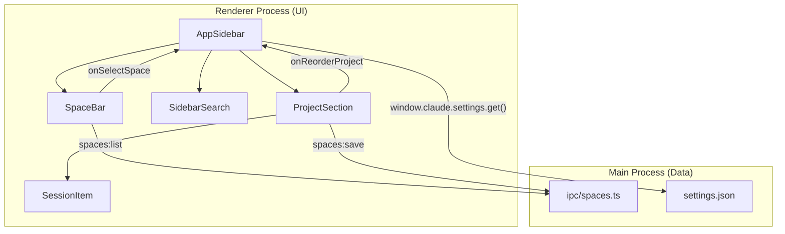
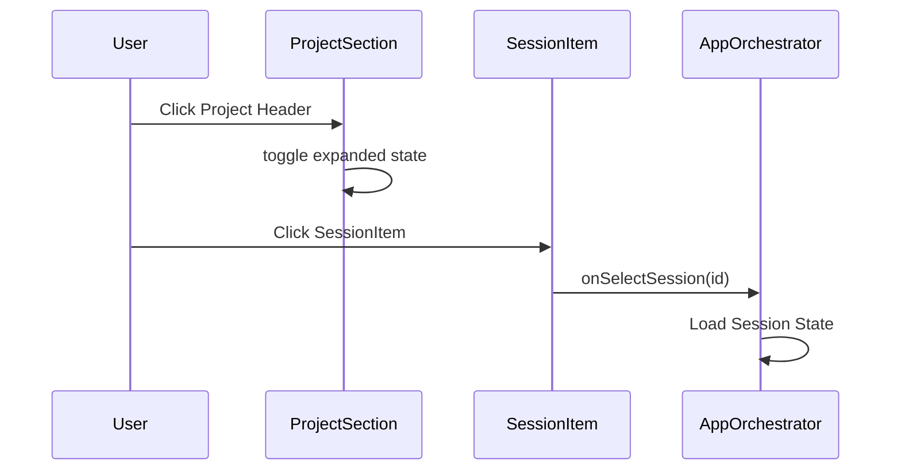

# Sidebar, Spaces & Project Navigation

Relevant source files

The following files were used as context for generating this wiki page:

- [electron/src/ipc/spaces.ts](electron/src/ipc/spaces.ts)
- [electron/src/lib/__tests__/layout-constants.test.ts](electron/src/lib/__tests__/layout-constants.test.ts)
- [src/components/AppSidebar.tsx](src/components/AppSidebar.tsx)
- [src/components/IconPicker.tsx](src/components/IconPicker.tsx)
- [src/components/JiraBoardPanel.tsx](src/components/JiraBoardPanel.tsx)
- [src/components/SidebarSearch.tsx](src/components/SidebarSearch.tsx)
- [src/components/SpaceBar.tsx](src/components/SpaceBar.tsx)
- [src/components/SpaceCreator.tsx](src/components/SpaceCreator.tsx)
- [src/components/settings/AgentSettings.tsx](src/components/settings/AgentSettings.tsx)
- [src/components/sidebar/ProjectSection.tsx](src/components/sidebar/ProjectSection.tsx)
- [src/components/sidebar/SessionItem.tsx](src/components/sidebar/SessionItem.tsx)
- [src/lib/icon-utils.ts](src/lib/icon-utils.ts)
- [src/lib/layout-constants.ts](src/lib/layout-constants.ts)

The Harnss sidebar provides a hierarchical navigation system composed of **Spaces**, **Projects**, and **Sessions**. It is designed for high-density information management while maintaining a fluid, aesthetic user experience through advanced CSS masking, transition animations, and real-time settings synchronization.

## AppSidebar Structure

The `AppSidebar` is the primary container for navigation, housing the `SpaceBar`, `SidebarSearch`, and a scrollable list of `ProjectSection` components [src/components/AppSidebar.tsx:45-75]().

### Hierarchy & Data Flow
The navigation follows a strict three-tier hierarchy:
1.  **Space**: A high-level container (e.g., "Work", "Personal", "Open Source") identified by a `Space` object [electron/src/ipc/spaces.ts:7-15]().
2.  **Project**: A logical grouping of related chat sessions, belonging to exactly one Space [src/components/AppSidebar.tsx:98-106]().
3.  **Session**: An individual chat thread (`ChatSession`) belonging to a Project [src/components/sidebar/ProjectSection.tsx:105]().

### Layout Constants
The sidebar width and minimum window dimensions are governed by constants to ensure layout stability across platforms [src/lib/layout-constants.ts:5-52]().

| Constant | Value | Description |
| :--- | :--- | :--- |
| `APP_SIDEBAR_WIDTH` | `280` | Fixed width of the sidebar when open. |
| `ISLAND_GAP` | `6` | Padding used in "Island" layout mode. |
| `getBootstrapMinWindowWidth` | Computed | Calculates the minimum window width required to display all panels without overlap. |

**Component Relationship Diagram**
The following diagram illustrates how the React components map to the data hierarchy and the IPC layer.

Sources: [src/components/AppSidebar.tsx:7-11](), [src/lib/layout-constants.ts:5-52](), [electron/src/ipc/spaces.ts:45-69]().

---

## Space Management

Spaces allow users to partition their work. Each space has a name, an icon (Emoji or Lucide), and a color theme defined by OKLCH values [electron/src/ipc/spaces.ts:7-15]().

### SpaceBar & SpaceCreator
*   **SpaceBar**: A horizontal navigation strip at the top of the sidebar. It uses a `scrollRef` to detect overflow and renders `ChevronLeft`/`ChevronRight` buttons only when content is scrollable [src/components/SpaceBar.tsx:68-79]().
*   **SpaceCreator**: A modal dialog for creating or editing spaces. It features a "Hero Preview" that live-renders the selected color and icon using a glassmorphic effect [src/components/SpaceCreator.tsx:144-183]().
*   **Icon Resolution**: Icons are resolved via `resolveLucideIcon`, which handles both modern PascalCase and legacy kebab-case names stored in the database [src/lib/icon-utils.ts:23-31]().

### Space Transition Animations
When a user switches spaces, the `AppSidebar` triggers a slide animation. The direction (left or right) is determined by comparing the `order` property of the previous and next space [src/components/AppSidebar.tsx:117-130]().

Sources: [src/components/SpaceBar.tsx:51-120](), [src/components/SpaceCreator.tsx:84-142](), [src/components/AppSidebar.tsx:113-130](), [src/lib/icon-utils.ts:23-31]().

---

## Project & Session Navigation

Projects act as folders for sessions. The `ProjectSection` component manages the expansion state and pagination of sessions [src/components/sidebar/ProjectSection.tsx:124-132]().

### Session Grouping & Pagination
Sessions are grouped by date (Today, Yesterday, Last 7 Days, Older) using `groupSessionsByDate` [src/components/sidebar/ProjectSection.tsx:48-79](). 
*   **Pagination**: The sidebar initially shows a limited number of chats (defaulting to `defaultChatLimit`). Users can load more sessions, which increments the `visibleCount` [src/components/sidebar/ProjectSection.tsx:131-150]().
*   **Sorting**: Sessions are sorted by `lastMessageAt` or `createdAt` [src/components/sidebar/ProjectSection.tsx:44-46]().

### Session Indicators
The `SessionItem` displays the status of a chat thread:
*   **Pulsing Amber Dot**: Indicates a pending permission request [src/components/sidebar/SessionItem.tsx:70-75]().
*   **Spinner**: Indicates the AI engine is currently processing [src/components/sidebar/SessionItem.tsx:76-77]().
*   **Engine Icon**: Displays the icon of the agent or engine (e.g., Claude, Codex) associated with the session [src/components/sidebar/SessionItem.tsx:79-84]().

**Navigation Data Flow**

Sources: [src/components/sidebar/ProjectSection.tsx:208-216](), [src/components/sidebar/SessionItem.tsx:62-64]().

---

## UI Polish & Interaction

### Scroll Fade Masking
The sidebar uses a dynamic CSS mask to fade content at the top and bottom edges.
1.  **Detection**: A `ResizeObserver` and scroll listener monitor the `viewport` of the `ScrollArea` [src/components/AppSidebar.tsx:147-163]().
2.  **State**: `fadeTop` and `fadeBottom` booleans are updated if the scroll position is more than 4px from the edge [src/components/AppSidebar.tsx:142-145]().
3.  **Implementation**: A `linear-gradient` is applied to the `maskImage` property, creating a smooth transparency transition [src/components/AppSidebar.tsx:170-174]().

### Drag-and-Drop
The sidebar supports native HTML5 drag-and-drop for organization:
*   **Project Reordering**: Projects can be dragged and dropped onto other projects within the same space to trigger `onReorderProject` [src/components/sidebar/ProjectSection.tsx:202-207]().
*   **Move to Space**: Projects can be dragged onto icons in the `SpaceBar`. The `onDrop` handler extracts the project ID via `application/x-project-id` and moves it to the target space [src/components/SpaceBar.tsx:173-180]().

### Settings Polling
To ensure the sidebar reflects changes made in the settings view (like the `defaultChatLimit`) without requiring a refresh, `AppSidebar` polls the main process every 5 seconds [src/components/AppSidebar.tsx:87-96]().

Sources: [src/components/AppSidebar.tsx:87-174](), [src/components/SpaceBar.tsx:173-180](), [src/components/sidebar/ProjectSection.tsx:202-207]().