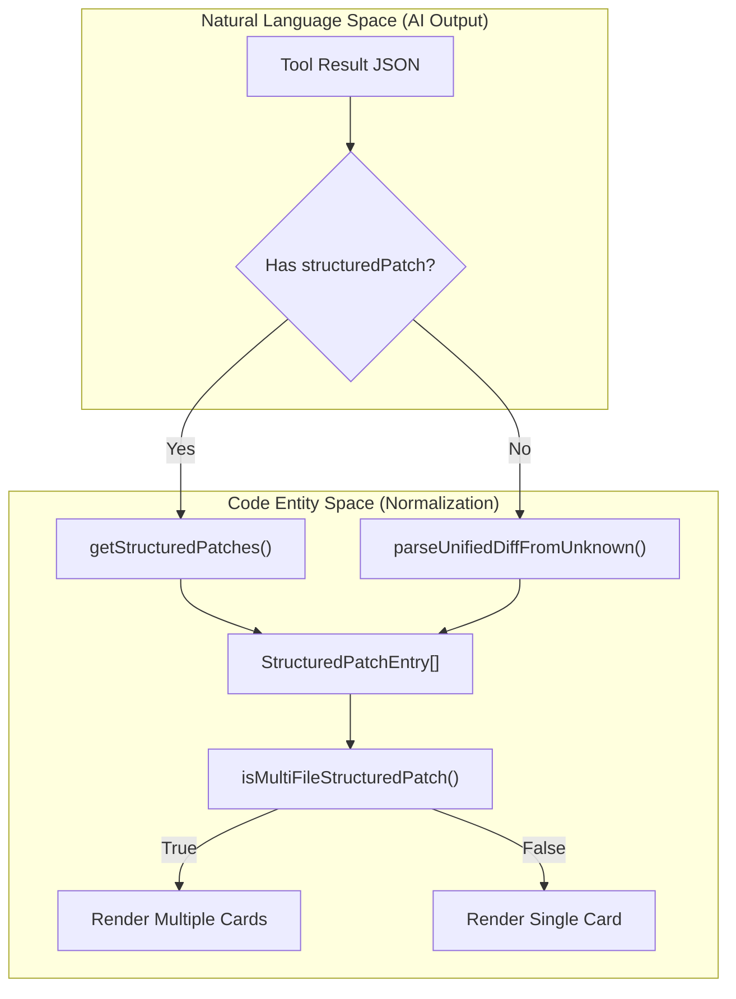

# Tool Renderers & Diff Viewers

<details>
<summary>Relevant source files</summary>

The following files were used as context for generating this wiki page:

- [src/components/CopyButton.tsx](src/components/CopyButton.tsx)
- [src/components/DiffViewer.tsx](src/components/DiffViewer.tsx)
- [src/components/MermaidDiagram.test.tsx](src/components/MermaidDiagram.test.tsx)
- [src/components/MermaidDiagram.tsx](src/components/MermaidDiagram.tsx)
- [src/components/ToolCall.tsx](src/components/ToolCall.tsx)
- [src/components/ToolGroupBlock.tsx](src/components/ToolGroupBlock.tsx)
- [src/components/ToolsPanel.tsx](src/components/ToolsPanel.tsx)
- [src/components/lib/tool-formatting.test.ts](src/components/lib/tool-formatting.test.ts)
- [src/components/lib/tool-formatting.ts](src/components/lib/tool-formatting.ts)
- [src/components/tool-renderers/EditContent.tsx](src/components/tool-renderers/EditContent.tsx)
- [src/components/tool-renderers/WriteContent.tsx](src/components/tool-renderers/WriteContent.tsx)
- [src/lib/background-session-store.ts](src/lib/background-session-store.ts)
- [src/lib/patch-utils.test.ts](src/lib/patch-utils.test.ts)
- [src/lib/patch-utils.ts](src/lib/patch-utils.ts)
- [src/lib/turn-changes.ts](src/lib/turn-changes.ts)

</details>

Interactive cards in Harnss transform raw AI tool calls and JSON results into human-readable, actionable UI components. This system handles the normalization of disparate engine outputs (Claude, Codex, ACP), provides high-fidelity code diffs, and manages the lifecycle of multi-file operations.

## Tool Normalization & Patch Entry Chain

Harnss uses a structured normalization layer to handle file modifications across different AI engines. While Claude might return a single hunk and Codex might return a collection of multi-file edits, the `StructuredPatchEntry` interface provides a unified shape for the UI to consume.

### StructuredPatchEntry

Defined in `src/lib/patch-utils.ts`, this interface represents a single file change within a tool result.

| Field                     | Description                                          |
| :------------------------ | :--------------------------------------------------- |
| `filePath` / `path`       | The absolute or relative path to the file.           |
| `kind`                    | The type of operation: `add`, `delete`, or `update`. |
| `diff`                    | A raw unified diff string (e.g., `diff --git ...`).  |
| `oldString` / `newString` | The complete content before and after the change.    |
| `lines`                   | Individual hunk lines for granular rendering.        |

Sources: [src/lib/patch-utils.ts:15-27](), [src/lib/patch-utils.ts:32-38]()

### The Normalization Flow

When a tool result arrives, the `getStructuredPatches` utility extracts the patch array. If the engine (like Codex) provides a `structuredPatch` field, it is used directly; otherwise, the system attempts to derive patches from raw `content` or `detailedContent`.



Sources: [src/lib/patch-utils.ts:32-74](), [src/components/tool-renderers/EditContent.tsx:46-63]()

---

## Core Renderers

### EditContent & WriteContent

These components handle the primary "Edit" and "Write" tools. They implement a deep fallback chain to ensure that even if an engine provides malformed data, the user sees a diff or the resulting code.

1.  **Multi-file Branch**: If `isMultiFileStructuredPatch` is true, the component maps over `validPatches` and renders a `PatchEntryDiff` (for Edits) or `PatchEntryWrite` (for Writes) for each file [src/components/tool-renderers/EditContent.tsx:49-63]().
2.  **Single-file Branch**: It attempts to resolve the `oldString` and `newString` by checking `toolResult`, `toolInput`, and parsing raw diffs via `parseUnifiedDiffFromUnknown` [src/components/tool-renderers/EditContent.tsx:93-109]().
3.  **Fallback**: If no strings can be reconstructed, it falls back to `UnifiedPatchViewer` to show the raw diff text, or `GenericContent` for raw JSON [src/components/tool-renderers/EditContent.tsx:111-123]().

Sources: [src/components/tool-renderers/EditContent.tsx:46-133](), [src/components/tool-renderers/WriteContent.tsx:58-127]()

### DiffViewer

The `DiffViewer` is the high-fidelity engine for showing code changes. It provides:

- **Syntax Highlighting**: Uses `Prism` via `SyntaxHighlighter` with theme-aware styles (`oneDark`/`oneLight`) [src/components/DiffViewer.tsx:84-88]().
- **Context Management**: Collapses large files to show only the changed lines plus a configurable number of context lines (default 3) [src/components/DiffViewer.tsx:47-48]().
- **Word-level Diffs**: Uses the `diff` library (`diffLines`, `diffWords`) to highlight specific character changes within a line [src/components/DiffViewer.tsx:2-3]().
- **Full File Reconstruction**: If only a hunk is provided, it attempts to `readFile` via the IPC bridge to reconstruct the full file context for better highlighting [src/components/DiffViewer.tsx:91-108]().

Sources: [src/components/DiffViewer.tsx:80-200]()

---

## Formatting & Summaries

To keep the chat interface clean, tool calls are rendered as `Collapsible` cards. The `formatCompactSummary` function generates the text displayed when a tool is collapsed.

### Summary Logic

The summary logic varies by tool type:

- **Edit/Write**: Shows the filename (e.g., `App.tsx`) or a file count (e.g., `3 files`) [src/components/lib/tool-formatting.ts:66-72]().
- **Search (Grep/Glob)**: Shows the pattern and a result suffix like `→ 5 files` [src/components/lib/tool-formatting.ts:74-79]().
- **MCP Tools**: Delegates to `getMcpCompactSummary` or strips the `mcp__` prefix [src/components/lib/tool-formatting.ts:35-45]().
- **Tasks**: Shows the subagent type and description (e.g., `coder: fix the bug`) [src/components/lib/tool-formatting.ts:120-149]().

Sources: [src/components/lib/tool-formatting.ts:8-89]()

---

## Tool Interaction Lifecycle

Tool cards transition through states based on the engine's streaming progress.

```mermaid
stateDiagram-v2
    [*] --> Running: Tool Call Received
    Running --> Success: toolResult Arrives
    Running --> Error: toolError Arrives

    state Running {
        direction LR
        "TextShimmer" --> "getToolLabel(active)"
    }

    state Success {
        direction TB
        "formatCompactSummary" --> "Auto-Expand (2s)"
        "Auto-Expand (2s)" --> "Auto-Collapse"
        "User Toggle" --> [*]: Manual Override
    }
```

### Auto-Expansion Logic

In `ToolCall.tsx`, a `useEffect` hook manages the visual lifecycle:

1.  **Initial State**: Tool is collapsed unless it is an "Edit-like" tool [src/components/ToolCall.tsx:56-58]().
2.  **Result Arrival**: When `hasResult` becomes true, the card auto-expands to show the change [src/components/ToolCall.tsx:72-75]().
3.  **Transient Display**: After 2 seconds, the card auto-collapses unless the user has manually interacted with it (`userToggled.current`) [src/components/ToolCall.tsx:76-79]().

Sources: [src/components/ToolCall.tsx:55-128]()

---

## Technical Components Reference

### ToolGroupBlock

Groups multiple consecutive tool calls into a single visual block to reduce vertical noise in the chat thread. It is used extensively in Codex and ACP turns where an agent might perform several `Read` operations before an `Edit`.

### BashContent

Renders terminal output from `bash` or `cmd` tools. It uses a specialized terminal-like theme (`DARK_TERMINAL_THEME` / `LIGHT_TERMINAL_THEME`) to match the app's `TerminalPanel`.

Sources: [src/components/ToolsPanel.tsx:9-59]()

### UnifiedPatchViewer

A lighter-weight diff viewer used when only a raw unified diff string is available and full string reconstruction is not possible or required.

Sources: [src/components/tool-renderers/EditContent.tsx:115-120](), [src/components/tool-renderers/WriteContent.tsx:92-94]()

---

**Sources:**

- `src/components/lib/tool-formatting.ts`
- `src/components/tool-renderers/EditContent.tsx`
- `src/components/tool-renderers/WriteContent.tsx`
- `src/lib/patch-utils.ts`
- `src/components/DiffViewer.tsx`
- `src/components/ToolCall.tsx`
- `src/components/ToolsPanel.tsx`
