# Data Flow and Message Types

<details>
<summary>Relevant source files</summary>

The following files were used as context for generating this wiki page:

- [docs/api/ai.md](docs/api/ai.md)
- [docs/getting-started/overview.md](docs/getting-started/overview.md)
- [docs/guides/client-tools.md](docs/guides/client-tools.md)
- [docs/guides/server-tools.md](docs/guides/server-tools.md)
- [docs/guides/streaming.md](docs/guides/streaming.md)
- [docs/guides/tool-approval.md](docs/guides/tool-approval.md)
- [docs/guides/tool-architecture.md](docs/guides/tool-architecture.md)
- [docs/guides/tools.md](docs/guides/tools.md)
- [docs/protocol/chunk-definitions.md](docs/protocol/chunk-definitions.md)
- [docs/protocol/http-stream-protocol.md](docs/protocol/http-stream-protocol.md)
- [docs/protocol/sse-protocol.md](docs/protocol/sse-protocol.md)
- [packages/typescript/ai-anthropic/src/text/text-provider-options.ts](packages/typescript/ai-anthropic/src/text/text-provider-options.ts)
- [packages/typescript/ai-openai/src/text/text-provider-options.ts](packages/typescript/ai-openai/src/text/text-provider-options.ts)
- [packages/typescript/ai/src/types.ts](packages/typescript/ai/src/types.ts)

</details>

This page explains how data flows through TanStack AI from user input to AI response, and the three distinct message representations used at different layers of the system: `UIMessage` (client UI layer), `ModelMessage` (server core layer), and `StreamChunk` (transport layer).

For information about the streaming protocols that transmit these messages, see [Server-Sent Events (SSE) Protocol](#5.1) and [HTTP Stream Protocol](#5.2). For details about the tool system and how tool calls are represented in these message types, see [Tool System](#3.2).

---

## Overview of Core Types

TanStack AI uses five fundamental types that work together to enable type-safe AI interactions:

| Type               | Location              | Purpose                          | Key Characteristics                                                 |
| ------------------ | --------------------- | -------------------------------- | ------------------------------------------------------------------- |
| **`ModelMessage`** | `@tanstack/ai`        | Server-side conversation history | Simple, flat structure; role-based; provider-agnostic               |
| **`UIMessage`**    | `@tanstack/ai-client` | Client-side UI rendering         | Parts-based structure; rich metadata; progressive updates           |
| **`Tool`**         | `@tanstack/ai`        | Function calling definitions     | Schema-based; supports server/client implementations; approval flow |
| **`ContentPart`**  | `@tanstack/ai`        | Multimodal message content       | Discriminated union; supports text, image, audio, video, document   |
| **`StreamChunk`**  | `@tanstack/ai`        | Transport protocol               | Discriminated union; delta-based; real-time updates                 |

These types flow through the system as data moves from user input through the server to the LLM and back to the UI.

**Sources:** [packages/typescript/ai/src/types.ts:1-1031](), [packages/typescript/ai-client/src/types.ts:1-277]()

---

## Data Flow Architecture

### Complete Request-Response Cycle

```mermaid
sequenceDiagram
    participant User
    participant UIMessage["UIMessage<br/>(Client)"]
    participant ModelMessage["ModelMessage<br/>(Server)"]
    participant AIAdapter["AIAdapter<br/>(Adapter Layer)"]
    participant LLM["LLM Service"]
    participant StreamChunk["StreamChunk<br/>(Transport)"]
    participant ChatClient["ChatClient<br/>(Client Processor)"]

    User->>UIMessage: "types message"
    UIMessage->>ModelMessage: "uiMessageToModelMessages()"
    Note over UIMessage,ModelMessage: "Strips UI-only parts<br/>(thinking, metadata)"

    ModelMessage->>AIAdapter: "messages array"
    AIAdapter->>LLM: "Provider-specific format<br/>(OpenAI/Anthropic/etc.)"

    LLM-->>AIAdapter: "Raw stream chunks"
    AIAdapter-->>StreamChunk: "Normalize to StreamChunk"
    Note over AIAdapter,StreamChunk: "ContentStreamChunk<br/>ToolCallStreamChunk<br/>ThinkingStreamChunk<br/>DoneStreamChunk"

    StreamChunk-->>ChatClient: "Process chunks"
    ChatClient->>UIMessage: "Update parts array"
    Note over ChatClient,UIMessage: "Incremental updates<br/>to TextPart, ToolCallPart, etc."

    UIMessage-->>User: "Display updated message"
```

**Sources:** [docs/protocol/chunk-definitions.md:1-446](), [packages/typescript/ai/src/core/chat.ts:80-214]()

---

## UIMessage: Client-Side Message Format

`UIMessage` is a parts-based message format optimized for building chat interfaces. A single message contains multiple parts that can be text, thinking, tool calls, or tool results.

### Structure

```typescript
interface UIMessage<TTools extends ReadonlyArray<AnyClientTool> = any> {
  id: string
  role: 'user' | 'assistant'
  parts: Array<MessagePart<TTools>>
  createdAt?: Date
}

type MessagePart<TTools> =
  | TextPart
  | ThinkingPart
  | ToolCallPart<TTools>
  | ToolResultPart
```

**Sources:** [packages/typescript/ai-client/src/types.ts:127-132](), [packages/typescript/ai-client/src/types.ts:117-121]()

### Part Types

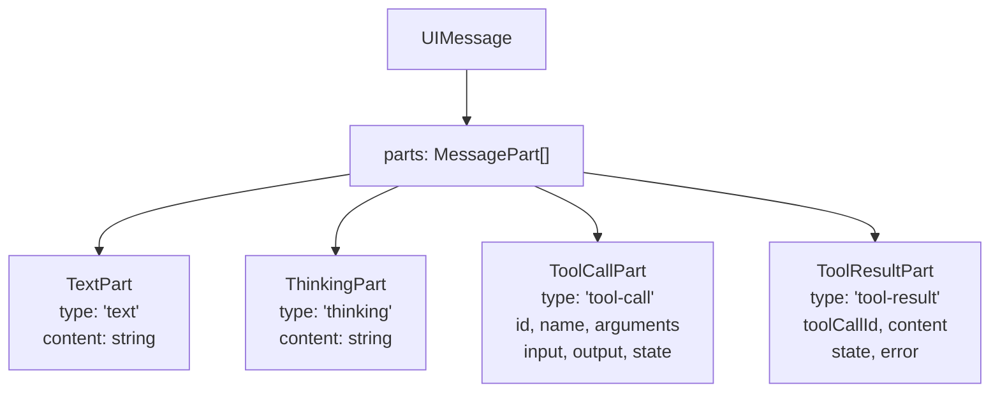

**Sources:** [packages/typescript/ai-client/src/types.ts:32-121]()

### Part Details

| Part Type                  | Fields                                                                       | Purpose                                                     |
| -------------------------- | ---------------------------------------------------------------------------- | ----------------------------------------------------------- |
| **`TextPart`**             | `type`, `content`                                                            | Standard message text                                       |
| **`ThinkingPart`**         | `type`, `content`                                                            | Model's reasoning process (UI-only, not sent back to model) |
| **`ToolCallPart<TTools>`** | `type`, `id`, `name`, `arguments`, `input?`, `output?`, `state`, `approval?` | Tool invocations with state tracking and typed input/output |
| **`ToolResultPart`**       | `type`, `toolCallId`, `content`, `state`, `error?`                           | Tool execution results                                      |

**Key Features:**

- **Progressive updates**: Parts are updated incrementally as chunks arrive
- **State tracking**: Tool calls track execution state (`awaiting-input`, `input-streaming`, `input-complete`, etc.)
- **Type safety**: When using typed tools, `ToolCallPart<TTools>` creates a discriminated union where `name` is the discriminant, enabling proper type narrowing
- **UI-optimized**: Thinking parts, collapsible sections, and rich metadata for rendering

**Sources:** [packages/typescript/ai-client/src/types.ts:32-121](), [packages/typescript/ai-react-ui/src/chat-message.tsx:14-136]()

### Example: Multi-Part Message

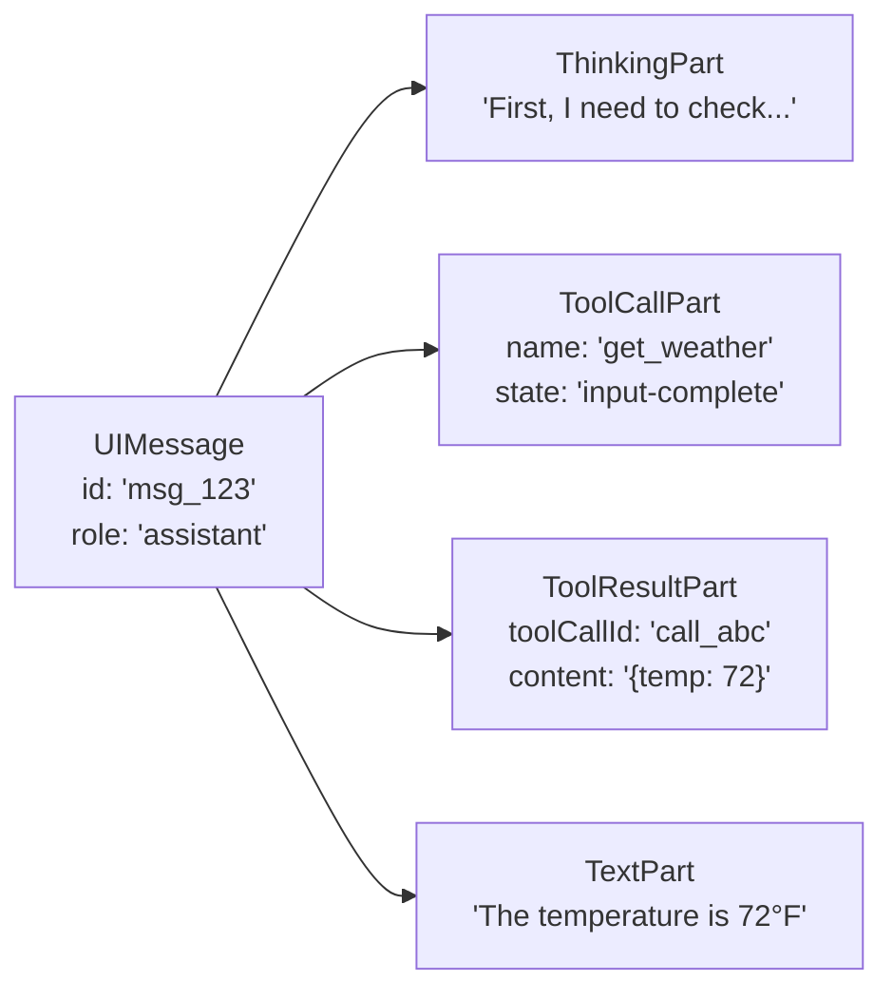

**Sources:** [packages/typescript/ai-react-ui/src/chat-message.tsx:91-136]()

---

## ModelMessage: Server-Side Message Format

`ModelMessage` is the internal server-side format defined in `@tanstack/ai` and used by the `chat()` function for conversation management. It has a simple, flat structure optimized for processing and conversion to provider-specific formats.

### Structure

```typescript
interface ModelMessage<TContent = string | null | Array<ContentPart>> {
  role: 'user' | 'assistant' | 'tool'
  content: TContent
  toolCallId?: string // For tool result messages
  toolCalls?: ToolCall[] // For assistant messages calling tools
  name?: string // Optional message name
}

interface ToolCall {
  id: string
  type: 'function'
  function: {
    name: string
    arguments: string // JSON string
  }
}
```

The `content` field can be:

- A simple string for text-only messages
- `null` for tool-related messages without text content
- An array of `ContentPart` for multimodal messages (see [ContentPart section](#contentpart-multimodal-content-types))

**Sources:** [packages/typescript/ai/src/types.ts:232-243](), [packages/typescript/ai/src/types.ts:87-94]()

### Comparison with UIMessage

#### Structure Comparison Diagram

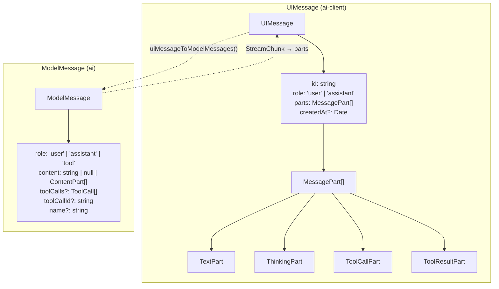

#### Key Differences Table

| Aspect              | UIMessage                                    | ModelMessage                             |
| ------------------- | -------------------------------------------- | ---------------------------------------- |
| Package             | `@tanstack/ai-client`                        | `@tanstack/ai`                           |
| Structure           | Parts-based (array of different part types)  | Flat (simple properties)                 |
| Tool representation | Separate `ToolCallPart` and `ToolResultPart` | `toolCalls` array and `toolCallId` field |
| Thinking content    | Dedicated `ThinkingPart`                     | Not included (UI-only)                   |
| Use case            | Rendering, state management, UI updates      | LLM conversation, adapter conversion     |
| Metadata            | Rich (createdAt, part states, approval)      | Minimal (role, content, tool info)       |
| Roles               | `'user'` or `'assistant'`                    | `'user'`, `'assistant'`, or `'tool'`     |

**Sources:** [packages/typescript/ai/src/types.ts:232-243](), [packages/typescript/ai-client/src/types.ts:127-132]()

---

## Tool: Function Calling Type

The `Tool` interface defines the structure for function calling capabilities. Tools are defined once using `toolDefinition()` from `@tanstack/ai` and can be implemented for server-side or client-side execution.

### Structure

```typescript
interface Tool<
  TInput extends SchemaInput = SchemaInput,
  TOutput extends SchemaInput = SchemaInput,
  TName extends string = string,
> {
  name: TName // Unique tool identifier
  description: string // LLM uses this to decide when to call
  inputSchema?: TInput // Zod schema or JSONSchema for input
  outputSchema?: TOutput // Zod schema or JSONSchema for output
  execute?: (args: any) => Promise<any> | any // Server-side implementation
  needsApproval?: boolean // Requires user approval before execution
  metadata?: Record<string, any> // Additional metadata
}
```

### Schema Types

Tools support two schema formats:

```typescript
type SchemaInput = StandardJSONSchemaV1<any, any> | JSONSchema

// Infer TypeScript type from schema
type InferSchemaType<T> =
  T extends StandardJSONSchemaV1<infer TInput, unknown> ? TInput : unknown
```

#### Standard JSON Schema Support

Libraries that implement the Standard JSON Schema specification:

- **Zod v4.2+** (native support)
- **ArkType v2.1.28+** (native support)
- **Valibot v1.2+** (via `toStandardJsonSchema()`)

Plain `JSONSchema` objects are also supported but don't provide compile-time type inference.

### Tool Definition Flow

#### Tool Definition Diagram

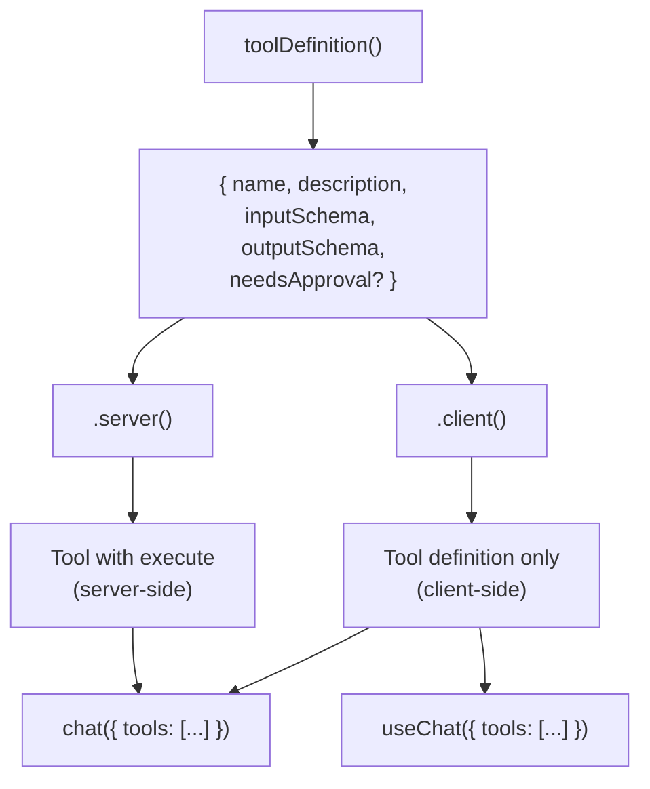

### Tool Call Lifecycle

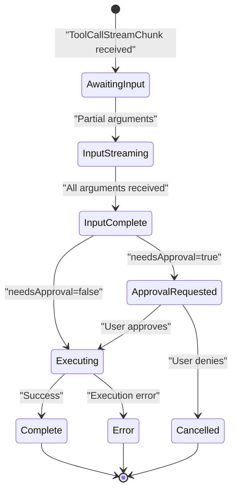

### Usage Example

```typescript
// Define tool schema
const getWeatherDef = toolDefinition({
  name: 'get_weather',
  description: 'Get current weather for a location',
  inputSchema: z.object({
    location: z.string().describe('City name'),
    unit: z.enum(['celsius', 'fahrenheit']).optional(),
  }),
  outputSchema: z.object({
    temperature: z.number(),
    conditions: z.string(),
  }),
})

// Server implementation
const getWeather = getWeatherDef.server(async ({ location, unit }) => {
  const data = await fetchWeather(location, unit)
  return { temperature: data.temp, conditions: data.conditions }
})

// Use in chat()
chat({
  adapter: openaiText('gpt-5.2'),
  messages,
  tools: [getWeather], // Automatic execution on server
})
```

**Sources:** [packages/typescript/ai/src/types.ts:328-438](), [packages/typescript/ai/src/types.ts:67-85](), [docs/guides/tools.md:1-335]()

---

## ContentPart: Multimodal Content Types

`ContentPart` is a discriminated union representing different modalities of content that can be included in messages. This enables multimodal AI interactions with text, images, audio, video, and documents.

### Structure

```typescript
type ContentPart<
  TTextMeta = unknown,
  TImageMeta = unknown,
  TAudioMeta = unknown,
  TVideoMeta = unknown,
  TDocumentMeta = unknown,
> =
  | TextPart<TTextMeta>
  | ImagePart<TImageMeta>
  | AudioPart<TAudioMeta>
  | VideoPart<TVideoMeta>
  | DocumentPart<TDocumentMeta>
```

### Supported Modalities

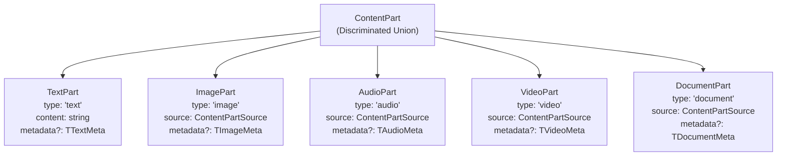

### ContentPartSource

All non-text modalities use `ContentPartSource` to specify content location:

```typescript
interface ContentPartSource {
  type: 'data' | 'url'
  value: string // base64 string (data) or URL (url)
}
```

### Provider-Specific Metadata

Each content part supports provider-specific metadata through generics:

```typescript
// OpenAI image detail level
type OpenAIImageMeta = { detail?: 'auto' | 'low' | 'high' }

// Anthropic document media type
type AnthropicDocumentMeta = { media_type?: string }

// Example message with metadata
const message: ModelMessage<ContentPart<unknown, OpenAIImageMeta>[]> = {
  role: 'user',
  content: [
    { type: 'text', content: 'Describe this image' },
    {
      type: 'image',
      source: { type: 'url', value: 'https://...' },
      metadata: { detail: 'high' }, // OpenAI-specific
    },
  ],
}
```

### Input Modality Constraints

Models specify which modalities they support via `InputModalitiesTypes`:

```typescript
type InputModalitiesTypes = {
  inputModalities: ReadonlyArray<Modality>
  messageMetadataByModality: DefaultMessageMetadataByModality
}

// Constrain content to only allowed modalities
type ConstrainedContent<TInputModalitiesTypes> =
  | string
  | null
  | Array<ContentPartForInputModalitiesTypes<TInputModalitiesTypes>>
```

This ensures type safety by preventing unsupported content types from being passed to models.

**Sources:** [packages/typescript/ai/src/types.ts:100-231](), [packages/typescript/ai/src/types.ts:108-127](), [docs/guides/multimodal.md:1-200]()

---

## StreamChunk: Transport Layer Format

`StreamChunk` is a discriminated union representing the different types of data that flow between server and client during streaming. Each chunk type has a `type` field that enables type-safe handling.

### StreamChunk Union Type

```typescript
type StreamChunk =
  | ContentStreamChunk
  | ThinkingStreamChunk
  | ToolCallStreamChunk
  | ToolInputAvailableStreamChunk
  | ApprovalRequestedStreamChunk
  | ToolResultStreamChunk
  | DoneStreamChunk
  | ErrorStreamChunk
```

**Sources:** [docs/protocol/chunk-definitions.md:250-258](), [docs/protocol/chunk-definitions.md:404-418]()

### Base Structure

All chunks share a common base:

```typescript
interface BaseStreamChunk {
  type: StreamChunkType
  id: string // Message/response ID
  model: string // Model identifier (e.g., "gpt-4o")
  timestamp: number // Unix timestamp in milliseconds
}
```

**Sources:** [docs/protocol/chunk-definitions.md:11-23]()

### Chunk Type Reference

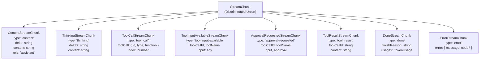

**Sources:** [docs/protocol/chunk-definitions.md:11-446]()

### Detailed Chunk Specifications

#### ContentStreamChunk

Emitted incrementally as the model generates text.

| Field     | Type          | Description                  |
| --------- | ------------- | ---------------------------- |
| `type`    | `'content'`   | Chunk type discriminator     |
| `delta`   | `string`      | New text since last chunk    |
| `content` | `string`      | Full accumulated text so far |
| `role`    | `'assistant'` | Message role                 |

**Sources:** [docs/protocol/chunk-definitions.md:40-70]()

#### ThinkingStreamChunk

Emitted when models expose their reasoning process (e.g., Claude with extended thinking, o1 models).

| Field     | Type         | Description                  |
| --------- | ------------ | ---------------------------- |
| `type`    | `'thinking'` | Chunk type discriminator     |
| `delta`   | `string?`    | Incremental thinking token   |
| `content` | `string`     | Accumulated thinking content |

**Note:** Thinking content is UI-only and excluded from messages sent back to the model.

**Sources:** [docs/protocol/chunk-definitions.md:72-101]()

#### ToolCallStreamChunk

Emitted when the model calls a tool/function.

| Field                         | Type          | Description                   |
| ----------------------------- | ------------- | ----------------------------- |
| `type`                        | `'tool_call'` | Chunk type discriminator      |
| `toolCall`                    | `object`      | Tool call details             |
| `toolCall.id`                 | `string`      | Unique tool call ID           |
| `toolCall.type`               | `'function'`  | Tool type                     |
| `toolCall.function.name`      | `string`      | Tool name                     |
| `toolCall.function.arguments` | `string`      | JSON string (may be partial)  |
| `index`                       | `number`      | Index for parallel tool calls |

**Sources:** [docs/protocol/chunk-definitions.md:103-146]()

#### ToolInputAvailableStreamChunk

Signals that tool inputs are complete and ready for client-side execution (only for tools without server-side `execute` function).

| Field        | Type                     | Description              |
| ------------ | ------------------------ | ------------------------ |
| `type`       | `'tool-input-available'` | Chunk type discriminator |
| `toolCallId` | `string`                 | Tool call ID             |
| `toolName`   | `string`                 | Tool to execute          |
| `input`      | `any`                    | Parsed tool arguments    |

**Sources:** [docs/protocol/chunk-definitions.md:148-182]()

#### ApprovalRequestedStreamChunk

Emitted when a tool requires user approval before execution.

| Field                    | Type                   | Description                |
| ------------------------ | ---------------------- | -------------------------- |
| `type`                   | `'approval-requested'` | Chunk type discriminator   |
| `toolCallId`             | `string`               | Tool call ID               |
| `toolName`               | `string`               | Tool requiring approval    |
| `input`                  | `any`                  | Arguments for review       |
| `approval`               | `object`               | Approval metadata          |
| `approval.id`            | `string`               | Unique approval request ID |
| `approval.needsApproval` | `true`                 | Always true                |

**Sources:** [docs/protocol/chunk-definitions.md:184-227]()

#### DoneStreamChunk

Marks successful stream completion.

| Field                    | Type             | Description              |
| ------------------------ | ---------------- | ------------------------ |
| `type`                   | `'done'`         | Chunk type discriminator |
| `finishReason`           | `string \| null` | Completion reason        |
| `usage`                  | `object?`        | Token usage statistics   |
| `usage.promptTokens`     | `number`         | Input tokens             |
| `usage.completionTokens` | `number`         | Output tokens            |
| `usage.totalTokens`      | `number`         | Total tokens             |

**Finish reasons:** `'stop'`, `'length'`, `'content_filter'`, `'tool_calls'`, `null`

**Sources:** [docs/protocol/chunk-definitions.md:260-304]()

#### ErrorStreamChunk

Emitted when an error occurs during streaming.

| Field           | Type      | Description              |
| --------------- | --------- | ------------------------ |
| `type`          | `'error'` | Chunk type discriminator |
| `error.message` | `string`  | Human-readable error     |
| `error.code`    | `string?` | Optional error code      |

**Sources:** [docs/protocol/chunk-definitions.md:306-346]()

---

## End-to-End Data Flow with Type Transformations

### Outbound Flow: User Input to LLM

```mermaid
sequenceDiagram
    participant User
    participant useChat["useChat hook"]
    participant ChatClient["ChatClient"]
    participant ConnectionAdapter["ConnectionAdapter<br/>(fetchServerSentEvents)"]
    participant APIRoute["API Route<br/>/api/chat"]
    participant ChatEngine["ChatEngine"]
    participant AIAdapter["AIAdapter<br/>(OpenAI/Anthropic)"]
    participant LLM["LLM Service"]

    User->>useChat: "sendMessage('Hello')"
    useChat->>ChatClient: "sendMessage()"
    ChatClient->>ChatClient: "Create UIMessage<br/>{ role: 'user', parts: [{ type: 'text', content: 'Hello' }] }"

    ChatClient->>ConnectionAdapter: "connect(messages, body, signal)"
    Note over ChatClient,ConnectionAdapter: "Convert UIMessage[] to ModelMessage[]<br/>via uiMessageToModelMessages()"

    ConnectionAdapter->>APIRoute: "POST { messages: ModelMessage[] }"

    APIRoute->>ChatEngine: "chat({ messages: ModelMessage[] })"
    ChatEngine->>AIAdapter: "chatStream({ messages })"

    Note over AIAdapter: "Convert ModelMessage[] to<br/>provider-specific format"
    AIAdapter->>LLM: "Provider API request<br/>(OpenAI/Anthropic/etc.)"
```

**Sources:** [packages/typescript/ai/src/core/chat.ts:80-214](), [docs/guides/connection-adapters.md:1-229]()

### Inbound Flow: LLM Response to UI

```mermaid
sequenceDiagram
    participant LLM["LLM Service"]
    participant AIAdapter["AIAdapter"]
    participant ChatEngine["ChatEngine"]
    participant APIRoute["API Route"]
    participant ConnectionAdapter["ConnectionAdapter"]
    participant ChatClient["ChatClient"]
    participant StreamProcessor["StreamProcessor"]
    participant UIMessage["UIMessage"]

    LLM-->>AIAdapter: "Raw stream chunk"
    AIAdapter-->>ChatEngine: "StreamChunk<br/>(normalized)"

    Note over AIAdapter,ChatEngine: "ContentStreamChunk<br/>{ type: 'content', delta: 'Hello', content: 'Hello' }"

    ChatEngine-->>APIRoute: "yield chunk"
    APIRoute-->>ConnectionAdapter: "SSE: data: {...}\
\
"

    ConnectionAdapter-->>ChatClient: "Parse SSE → StreamChunk"
    ChatClient->>StreamProcessor: "Process chunk"

    Note over StreamProcessor: "Apply ChunkStrategy<br/>(ImmediateStrategy/BatchStrategy/etc.)"

    StreamProcessor->>UIMessage: "Update parts array"

    alt "ContentStreamChunk"
        StreamProcessor->>UIMessage: "Update TextPart.content"
    else "ThinkingStreamChunk"
        StreamProcessor->>UIMessage: "Update ThinkingPart.content"
    else "ToolCallStreamChunk"
        StreamProcessor->>UIMessage: "Update ToolCallPart state/arguments"
    else "DoneStreamChunk"
        StreamProcessor->>UIMessage: "Mark complete"
    end

    UIMessage-->>ChatClient: "Trigger re-render"
```

**Sources:** [packages/typescript/ai/src/core/chat.ts:187-214](), [packages/typescript/ai/src/core/chat.ts:216-239]()

---

## Message Transformation Pipeline

### UIMessage to ModelMessage Conversion

The `uiMessageToModelMessages()` function converts client `UIMessage` objects to server `ModelMessage` objects by:

1. **Stripping UI-only parts**: `ThinkingPart` is excluded (not sent back to model)
2. **Flattening structure**: Parts are converted to flat properties
3. **Extracting tool metadata**: Tool calls and results are extracted into top-level fields

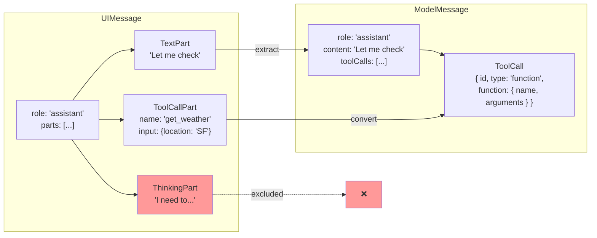

**Transformation rules:**

| UIMessage Part   | ModelMessage Field                   | Notes                                 |
| ---------------- | ------------------------------------ | ------------------------------------- |
| `TextPart`       | `content`                            | Concatenated if multiple text parts   |
| `ThinkingPart`   | _(excluded)_                         | UI-only, not sent to model            |
| `ToolCallPart`   | `toolCalls[]`                        | Converted to `ToolCall` objects       |
| `ToolResultPart` | Separate message with `role: 'tool'` | Creates new message with `toolCallId` |

**Sources:** [packages/typescript/ai/src/core/chat.ts:49-78](), [packages/typescript/ai-client/src/types.ts:32-132]()

### StreamChunk to UIMessage Conversion

The `ChatClient` processes incoming `StreamChunk` objects and updates `UIMessage` parts incrementally:

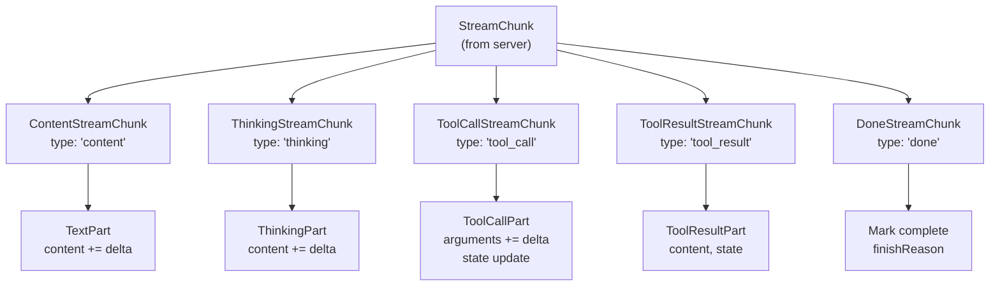

**Processing logic per chunk type:**

| StreamChunk Type                | UIMessage Update                                                       |
| ------------------------------- | ---------------------------------------------------------------------- |
| `ContentStreamChunk`            | Update or create `TextPart`, append `delta` to `content`               |
| `ThinkingStreamChunk`           | Update or create `ThinkingPart`, append `delta` to `content`           |
| `ToolCallStreamChunk`           | Update or create `ToolCallPart`, append to `arguments`, update `state` |
| `ToolInputAvailableStreamChunk` | Update `ToolCallPart` state, parse `input`                             |
| `ApprovalRequestedStreamChunk`  | Update `ToolCallPart` with `approval` metadata                         |
| `ToolResultStreamChunk`         | Create or update `ToolResultPart`                                      |
| `DoneStreamChunk`               | Mark message complete, store finish reason                             |
| `ErrorStreamChunk`              | Set error state                                                        |

**Sources:** [packages/typescript/ai/src/core/chat.ts:216-354](), [packages/typescript/ai-client/src/types.ts:14-132]()

---

## Provider-Specific Format Conversion

Each `AIAdapter` converts `ModelMessage[]` to its provider's specific format.

### Format Comparison

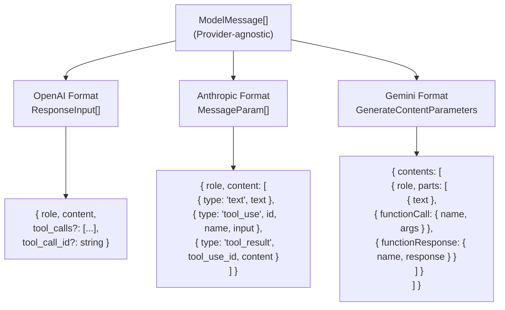

**Key differences:**

| Provider      | Message Structure                       | Tool Call Format                                    | Tool Result Format                                      |
| ------------- | --------------------------------------- | --------------------------------------------------- | ------------------------------------------------------- |
| **OpenAI**    | Flat messages with `role` and `content` | `tool_calls` array at message level                 | Separate message with `role: 'tool'` and `tool_call_id` |
| **Anthropic** | Messages with content blocks array      | `tool_use` content block with `id`, `name`, `input` | `tool_result` content block with `tool_use_id`          |
| **Gemini**    | Contents with parts array               | `functionCall` part with `name`, `args`             | `functionResponse` part with `name`, `response`         |

**Sources:** [packages/typescript/ai-anthropic/tests/anthropic-adapter.test.ts:155-182](), [docs/adapters/openai.md:1-187](), [docs/adapters/anthropic.md:1-193]()

---

## Chunk Processing and State Management

### Server-Side Stream Processing

The `chat()` function in `packages/typescript/ai/src/core/chat.ts` orchestrates the streaming process. It is an async generator that yields `StreamChunk` objects.

#### chat() Function Flow

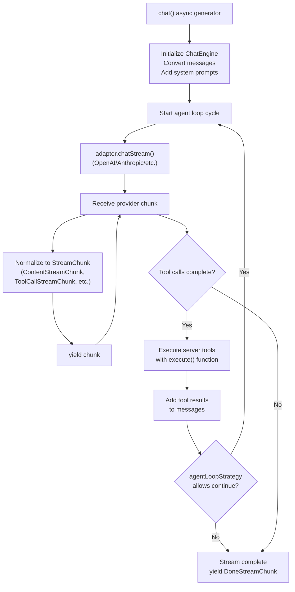

**Key Components:**

| Component                      | File Location                                         | Purpose                      |
| ------------------------------ | ----------------------------------------------------- | ---------------------------- |
| `chat()` function              | [packages/typescript/ai/src/core/chat.ts:1-815]()     | Main orchestration generator |
| `AIAdapter.chatStream()`       | [packages/typescript/ai/src/types.ts:1-1031]()        | Provider-specific streaming  |
| `toServerSentEventsResponse()` | [packages/typescript/ai/src/streaming/sse.ts:1-100]() | Convert to SSE response      |
| `AgentLoopStrategy`            | [packages/typescript/ai/src/types.ts:538-560]()       | Control tool execution loops |

**Sources:** [packages/typescript/ai/src/core/chat.ts:1-815](), [packages/typescript/ai/src/types.ts:538-560]()

### Client-Side Stream Processing

The `ChatClient` class in `@tanstack/ai-client` processes incoming `StreamChunk` objects and updates `UIMessage` objects. It is used by framework-specific hooks like `useChat()`.

#### ChatClient Processing Flow

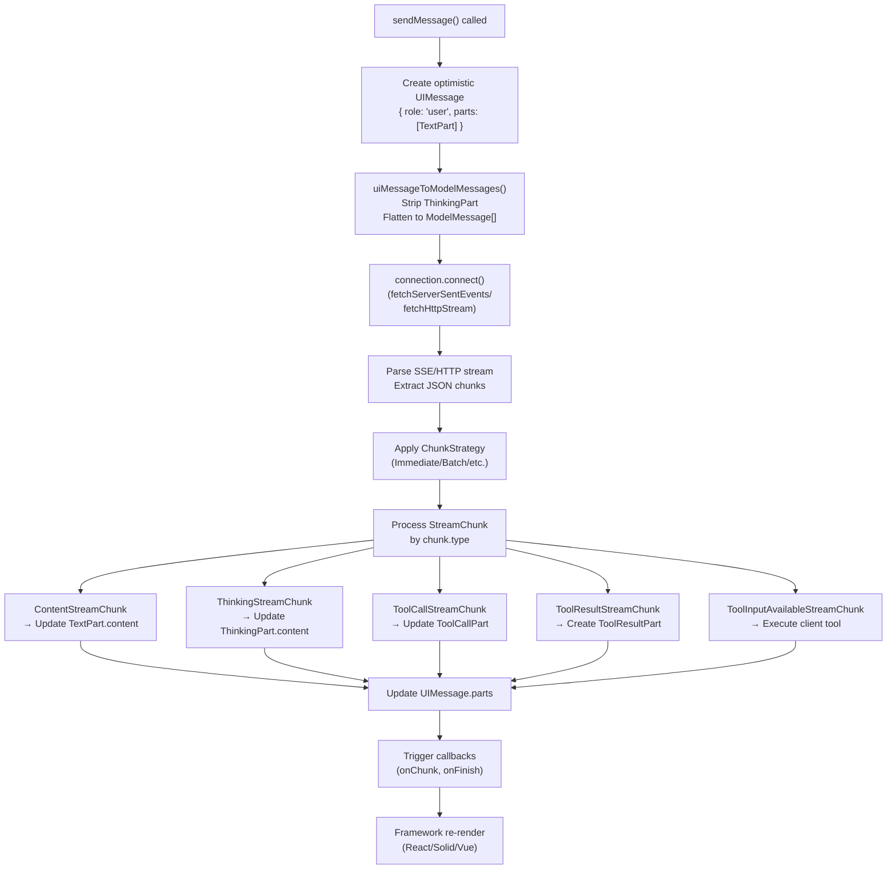

**Key Components:**

| Component                    | File Location                                                      | Purpose                   |
| ---------------------------- | ------------------------------------------------------------------ | ------------------------- |
| `ChatClient` class           | [packages/typescript/ai-client/src/chat-client.ts:1-500]()         | Main client state manager |
| `fetchServerSentEvents()`    | [packages/typescript/ai-client/src/connection-adapters.ts:1-200]() | SSE connection adapter    |
| `fetchHttpStream()`          | [packages/typescript/ai-client/src/connection-adapters.ts:1-200]() | HTTP stream adapter       |
| `uiMessageToModelMessages()` | [packages/typescript/ai-client/src/utils.ts:1-100]()               | Message conversion        |
| `useChat()` hook             | [packages/typescript/ai-react/src/use-chat.ts:1-300]()             | React integration         |

**Chunk Processing Strategies:**

The client can apply different strategies to control how chunks are processed:

| Strategy               | Implementation                  | Use Case                |
| ---------------------- | ------------------------------- | ----------------------- |
| `ImmediateStrategy`    | Process every chunk immediately | Lowest latency          |
| `BatchStrategy`        | Buffer by time or count         | Reduce render frequency |
| `PunctuationStrategy`  | Wait for sentence boundaries    | Natural pauses          |
| `WordBoundaryStrategy` | Wait for complete words         | Prevent mid-word cuts   |

**Sources:** [packages/typescript/ai-client/src/chat-client.ts:1-500](), [packages/typescript/ai-client/src/connection-adapters.ts:1-200](), [docs/api/ai-client.md:1-400]()

---

## Type Safety with Discriminated Unions

Both `StreamChunk` and `ToolCallPart` use discriminated unions to enable type-safe narrowing.

### StreamChunk Discrimination

```typescript
function handleChunk(chunk: StreamChunk) {
  switch (chunk.type) {
    case 'content':
      // TypeScript knows: chunk is ContentStreamChunk
      console.log(chunk.delta, chunk.content)
      break
    case 'thinking':
      // TypeScript knows: chunk is ThinkingStreamChunk
      console.log(chunk.content)
      break
    case 'tool_call':
      // TypeScript knows: chunk is ToolCallStreamChunk
      console.log(chunk.toolCall.function.name)
      break
    case 'done':
      // TypeScript knows: chunk is DoneStreamChunk
      console.log(chunk.finishReason, chunk.usage)
      break
    // ... other cases
  }
}
```

**Sources:** [docs/protocol/chunk-definitions.md:420-437]()

### ToolCallPart Discrimination with Typed Tools

When using `clientTools()` and `createChatClientOptions()`, the `ToolCallPart.name` field becomes a discriminated union:

```typescript
const tools = clientTools(
  updateUIDef.client((input) => ({ success: true })),
  saveToStorageDef.client((input) => ({ saved: true }))
)

const chatOptions = createChatClientOptions({
  connection: fetchServerSentEvents('/api/chat'),
  tools,
})

type ChatMessages = InferChatMessages<typeof chatOptions>

// In component:
messages.forEach((message: ChatMessages[number]) => {
  message.parts.forEach((part) => {
    if (part.type === 'tool-call' && part.name === 'update_ui') {
      // ✅ TypeScript knows:
      // - part.name is literally 'update_ui'
      // - part.input is typed from updateUIDef's inputSchema
      // - part.output is typed from updateUIDef's outputSchema

      console.log(part.input.message) // ✅ Typed!
      if (part.output) {
        console.log(part.output.success) // ✅ Typed!
      }
    }
  })
})
```

**Sources:** [packages/typescript/ai-client/src/types.ts:42-102](), [packages/typescript/ai-client/src/types.ts:219-276]()

---

## Summary

TanStack AI uses three distinct message representations to optimize for different concerns:

1. **`UIMessage`**: Parts-based, rich metadata, optimized for rendering and state management
2. **`ModelMessage`**: Simple, flat structure for conversation management and adapter conversion
3. **`StreamChunk`**: Discriminated union for incremental, real-time updates over the wire

Data flows through transformations at each boundary:

- User input → `UIMessage` → `ModelMessage` → Provider format → LLM
- LLM → Provider format → `StreamChunk` → `UIMessage` parts → UI update

The system maintains type safety throughout using discriminated unions, enabling proper type narrowing in TypeScript and ensuring that tool inputs, outputs, and states are fully typed when using the isomorphic tool system.

**Sources:** [docs/protocol/chunk-definitions.md:1-446](), [packages/typescript/ai-client/src/types.ts:1-277](), [packages/typescript/ai/src/core/chat.ts:1-815](), [docs/reference/interfaces/ModelMessage.md:1-65]()
