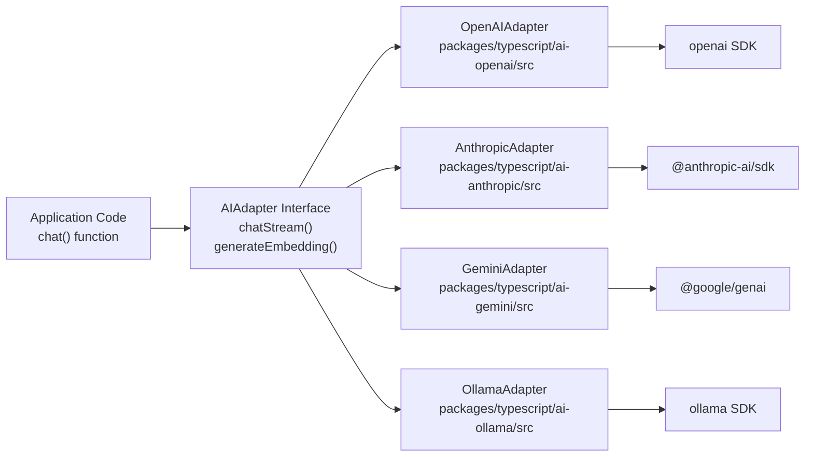
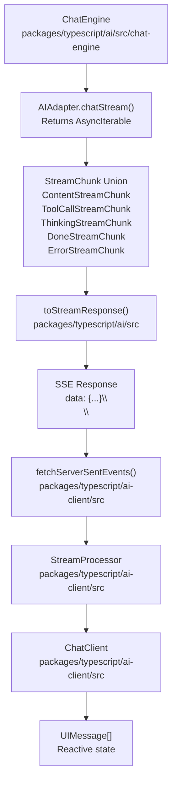
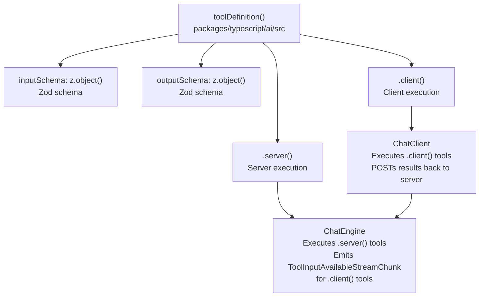
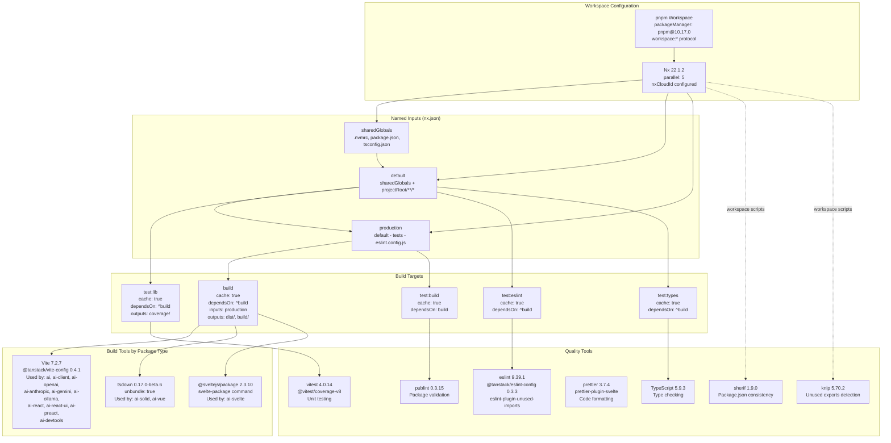
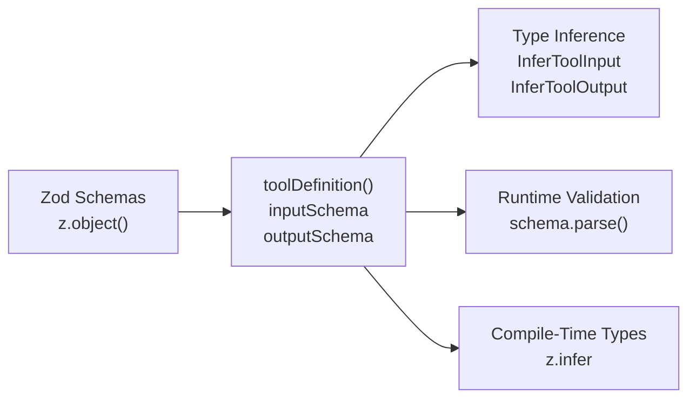
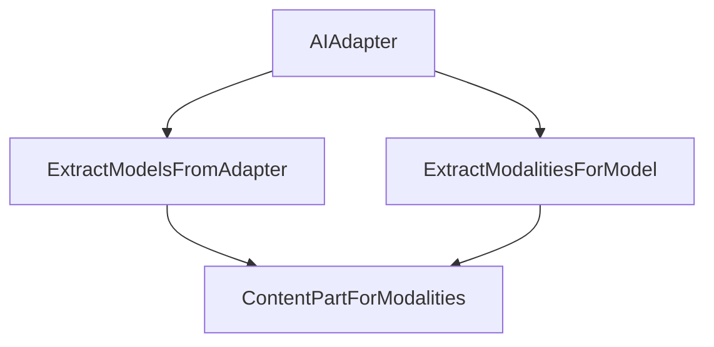

# Architecture

<details>
<summary>Relevant source files</summary>

The following files were used as context for generating this wiki page:

- [.github/workflows/autofix.yml](.github/workflows/autofix.yml)
- [.github/workflows/release.yml](.github/workflows/release.yml)
- [README.md](README.md)
- [nx.json](nx.json)
- [package.json](package.json)
- [packages/typescript/ai-anthropic/package.json](packages/typescript/ai-anthropic/package.json)
- [packages/typescript/ai-client/README.md](packages/typescript/ai-client/README.md)
- [packages/typescript/ai-devtools/README.md](packages/typescript/ai-devtools/README.md)
- [packages/typescript/ai-gemini/README.md](packages/typescript/ai-gemini/README.md)
- [packages/typescript/ai-gemini/package.json](packages/typescript/ai-gemini/package.json)
- [packages/typescript/ai-ollama/README.md](packages/typescript/ai-ollama/README.md)
- [packages/typescript/ai-ollama/package.json](packages/typescript/ai-ollama/package.json)
- [packages/typescript/ai-openai/README.md](packages/typescript/ai-openai/README.md)
- [packages/typescript/ai-openai/package.json](packages/typescript/ai-openai/package.json)
- [packages/typescript/ai-react-ui/README.md](packages/typescript/ai-react-ui/README.md)
- [packages/typescript/ai-react-ui/package.json](packages/typescript/ai-react-ui/package.json)
- [packages/typescript/ai-react/README.md](packages/typescript/ai-react/README.md)
- [packages/typescript/ai-react/package.json](packages/typescript/ai-react/package.json)
- [packages/typescript/ai-solid-ui/package.json](packages/typescript/ai-solid-ui/package.json)
- [packages/typescript/ai-solid/package.json](packages/typescript/ai-solid/package.json)
- [packages/typescript/ai-solid/tsdown.config.ts](packages/typescript/ai-solid/tsdown.config.ts)
- [packages/typescript/ai-svelte/package.json](packages/typescript/ai-svelte/package.json)
- [packages/typescript/ai-vue-ui/package.json](packages/typescript/ai-vue-ui/package.json)
- [packages/typescript/ai-vue/package.json](packages/typescript/ai-vue/package.json)
- [packages/typescript/ai/README.md](packages/typescript/ai/README.md)
- [packages/typescript/react-ai-devtools/README.md](packages/typescript/react-ai-devtools/README.md)
- [packages/typescript/solid-ai-devtools/README.md](packages/typescript/solid-ai-devtools/README.md)
- [pnpm-lock.yaml](pnpm-lock.yaml)
- [scripts/generate-docs.ts](scripts/generate-docs.ts)

</details>

This document describes the high-level architecture of TanStack AI, including its layered design, package organization, core patterns, and data flow. For detailed information about specific packages, see [Package Organization](#2.1). For message type transformations and data flow details, see [Data Flow and Message Types](#2.2).

## Purpose and Scope

TanStack AI is organized as a monorepo containing 20+ packages that work together to provide a complete AI chat and streaming solution. The architecture is designed around:

- **Framework agnosticism** - Core functionality runs anywhere JavaScript runs
- **Streaming-first** - All operations support real-time incremental updates
- **Type safety** - Strong TypeScript types from definition through execution
- **Extensibility** - Clean adapter pattern for integrating new AI providers

## Layered Architecture

TanStack AI follows a layered architecture where each layer has distinct responsibilities and clear boundaries:

**Layered Architecture Diagram**

```mermaid
graph TB
    subgraph "Layer 5: Developer Tools"
        DEVTOOLS_CORE["@tanstack/ai-devtools<br/>packages/typescript/ai-devtools"]
        REACT_DEVTOOLS["@tanstack/react-ai-devtools<br/>packages/typescript/react-ai-devtools"]
        SOLID_DEVTOOLS["@tanstack/solid-ai-devtools<br/>packages/typescript/solid-ai-devtools"]
        PREACT_DEVTOOLS["@tanstack/preact-ai-devtools<br/>packages/typescript/preact-ai-devtools"]
    end

    subgraph "Layer 4: UI Components"
        REACT_UI["@tanstack/ai-react-ui<br/>packages/typescript/ai-react-ui<br/>react-markdown, rehype-highlight"]
        SOLID_UI["@tanstack/ai-solid-ui<br/>packages/typescript/ai-solid-ui<br/>solid-markdown, rehype-highlight"]
        VUE_UI["@tanstack/ai-vue-ui<br/>packages/typescript/ai-vue-ui<br/>@crazydos/vue-markdown"]
    end

    subgraph "Layer 3: Framework Integrations"
        AI_REACT["@tanstack/ai-react<br/>packages/typescript/ai-react<br/>useChat(), built with Vite"]
        AI_SOLID["@tanstack/ai-solid<br/>packages/typescript/ai-solid<br/>useChat(), built with tsdown"]
        AI_VUE["@tanstack/ai-vue<br/>packages/typescript/ai-vue<br/>useChat(), built with tsdown"]
        AI_SVELTE["@tanstack/ai-svelte<br/>packages/typescript/ai-svelte<br/>useChat(), built with @sveltejs/package"]
        AI_PREACT["@tanstack/ai-preact<br/>packages/typescript/ai-preact<br/>useChat(), built with Vite"]
    end

    subgraph "Layer 2: Client Library"
        AI_CLIENT["@tanstack/ai-client<br/>packages/typescript/ai-client<br/>ChatClient, fetchServerSentEvents(),<br/>StreamProcessor, clientTools()"]
    end

    subgraph "Layer 1: Server Core"
        AI_CORE["@tanstack/ai<br/>packages/typescript/ai<br/>chat(), toolDefinition(),<br/>toServerSentEventsResponse(),<br/>generate(), summarize()"]
    end

    subgraph "Layer 0: AI Provider Adapters"
        OPENAI["@tanstack/ai-openai<br/>packages/typescript/ai-openai<br/>openaiText(), openaiEmbed()"]
        ANTHROPIC["@tanstack/ai-anthropic<br/>packages/typescript/ai-anthropic<br/>anthropicText()"]
        GEMINI["@tanstack/ai-gemini<br/>packages/typescript/ai-gemini<br/>geminiText(), geminiImage()"]
        OLLAMA["@tanstack/ai-ollama<br/>packages/typescript/ai-ollama<br/>ollamaText()"]
        GROK["@tanstack/ai-grok<br/>packages/typescript/ai-grok<br/>grokText()"]
    end

    OPENAI --> AI_CORE
    ANTHROPIC --> AI_CORE
    GEMINI --> AI_CORE
    OLLAMA --> AI_CORE
    GROK --> AI_CORE

    AI_CLIENT --> AI_CORE

    AI_REACT --> AI_CLIENT
    AI_SOLID --> AI_CLIENT
    AI_VUE --> AI_CLIENT
    AI_SVELTE --> AI_CLIENT
    AI_PREACT --> AI_CLIENT

    REACT_UI --> AI_REACT
    REACT_UI --> AI_CLIENT
    SOLID_UI --> AI_SOLID
    SOLID_UI --> AI_CLIENT
    VUE_UI --> AI_VUE

    DEVTOOLS_CORE --> AI_CORE
    REACT_DEVTOOLS --> DEVTOOLS_CORE
    SOLID_DEVTOOLS --> DEVTOOLS_CORE
    PREACT_DEVTOOLS --> DEVTOOLS_CORE
```



**Sources:** [package.json:1-72](), [pnpm-lock.yaml:1-100](), [packages/typescript/ai-solid-ui/package.json:1-62](), [packages/typescript/ai-react-ui/package.json:1-63](), [packages/typescript/ai-vue-ui/package.json:1-59]()

### Layer Responsibilities

| Layer                               | Packages                                                                                                              | Primary Responsibilities                                                                         | Key Exports                                                                               |
| ----------------------------------- | --------------------------------------------------------------------------------------------------------------------- | ------------------------------------------------------------------------------------------------ | ----------------------------------------------------------------------------------------- |
| **Layer 0: AI Provider Adapters**   | `@tanstack/ai-openai`, `@tanstack/ai-anthropic`, `@tanstack/ai-gemini`, `@tanstack/ai-ollama`, `@tanstack/ai-grok`    | Implement adapter interface, translate between provider APIs and normalized `StreamChunk` format | `openaiText()`, `anthropicText()`, `geminiText()`, `ollamaText()`, `grokText()`           |
| **Layer 1: Server Core**            | `@tanstack/ai`                                                                                                        | Core orchestration, tool execution, agent loops, stream generation, multimodal content handling  | `chat()`, `generate()`, `toolDefinition()`, `toServerSentEventsResponse()`, `summarize()` |
| **Layer 2: Client Library**         | `@tanstack/ai-client`                                                                                                 | Headless state management, connection adapters, stream processing, client-side tool execution    | `ChatClient`, `fetchServerSentEvents()`, `fetchHttpStream()`, `clientTools()`             |
| **Layer 3: Framework Integrations** | `@tanstack/ai-react`, `@tanstack/ai-solid`, `@tanstack/ai-vue`, `@tanstack/ai-svelte`, `@tanstack/ai-preact`          | Framework-specific hooks/primitives/composables, reactivity integration, lifecycle management    | `useChat()` hook/primitive/composable in each package                                     |
| **Layer 4: UI Components**          | `@tanstack/ai-react-ui`, `@tanstack/ai-solid-ui`, `@tanstack/ai-vue-ui`                                               | Pre-built UI components, markdown rendering with rehype plugins, syntax highlighting             | Component libraries with markdown processing pipelines                                    |
| **Layer 5: Developer Tools**        | `@tanstack/ai-devtools`, `@tanstack/react-ai-devtools`, `@tanstack/solid-ai-devtools`, `@tanstack/preact-ai-devtools` | Event tracking, debugging UI, conversation inspection, devtools panel integration                | `aiDevtoolsPlugin()`, `AiDevtoolsCore` component                                          |

**Sources:** [pnpm-lock.yaml:600-950](), [package.json:1-72](), [packages/typescript/ai-openai/package.json:1-55](), [packages/typescript/ai-client/package.json:1-53]()

## Package Dependency Graph

The following diagram shows the complete package dependency structure in the monorepo, including workspace dependencies and external SDKs:

**Complete Package Dependency Graph**

```mermaid
graph TB
    subgraph "Core SDK"
        AI_CORE["@tanstack/ai<br/>packages/typescript/ai<br/>Dependencies: partial-json,<br/>@tanstack/devtools-event-client"]
    end

    subgraph "Client Layer"
        AI_CLIENT["@tanstack/ai-client<br/>packages/typescript/ai-client<br/>Peer: @tanstack/ai"]
    end

    subgraph "Provider Adapters"
        AI_OPENAI["@tanstack/ai-openai<br/>packages/typescript/ai-openai<br/>Dependencies: openai SDK<br/>Peer: @tanstack/ai"]
        AI_ANTHROPIC["@tanstack/ai-anthropic<br/>packages/typescript/ai-anthropic<br/>Dependencies: @anthropic-ai/sdk<br/>Peer: @tanstack/ai"]
        AI_GEMINI["@tanstack/ai-gemini<br/>packages/typescript/ai-gemini<br/>Dependencies: @google/genai<br/>Peer: @tanstack/ai"]
        AI_OLLAMA["@tanstack/ai-ollama<br/>packages/typescript/ai-ollama<br/>Dependencies: ollama SDK<br/>Peer: @tanstack/ai"]
        AI_GROK["@tanstack/ai-grok<br/>packages/typescript/ai-grok<br/>Dependencies: openai SDK<br/>Peer: @tanstack/ai"]
    end

    subgraph "Framework Integrations"
        AI_REACT["@tanstack/ai-react<br/>packages/typescript/ai-react<br/>Dependency: @tanstack/ai-client<br/>Peers: react, @tanstack/ai"]
        AI_SOLID["@tanstack/ai-solid<br/>packages/typescript/ai-solid<br/>Dependency: @tanstack/ai-client<br/>Peers: solid-js, @tanstack/ai"]
        AI_VUE["@tanstack/ai-vue<br/>packages/typescript/ai-vue<br/>Dependency: @tanstack/ai-client<br/>Peers: vue, @tanstack/ai"]
        AI_SVELTE["@tanstack/ai-svelte<br/>packages/typescript/ai-svelte<br/>Dependency: @tanstack/ai-client<br/>Peers: svelte, @tanstack/ai"]
        AI_PREACT["@tanstack/ai-preact<br/>packages/typescript/ai-preact<br/>Dependencies: @tanstack/ai,<br/>@tanstack/ai-client<br/>Peer: preact"]
    end

    subgraph "UI Components"
        AI_REACT_UI["@tanstack/ai-react-ui<br/>packages/typescript/ai-react-ui<br/>Dependencies: react-markdown,<br/>rehype-highlight, rehype-sanitize,<br/>remark-gfm<br/>Peers: react, @tanstack/ai-react"]
        AI_SOLID_UI["@tanstack/ai-solid-ui<br/>packages/typescript/ai-solid-ui<br/>Dependencies: solid-markdown,<br/>rehype-highlight, rehype-sanitize,<br/>remark-gfm<br/>Peers: solid-js, @tanstack/ai-solid"]
        AI_VUE_UI["@tanstack/ai-vue-ui<br/>packages/typescript/ai-vue-ui<br/>Dependencies: @crazydos/vue-markdown,<br/>rehype-highlight, rehype-sanitize,<br/>remark-gfm<br/>Peers: vue, @tanstack/ai-vue"]
    end

    subgraph "Developer Tools"
        AI_DEVTOOLS["@tanstack/ai-devtools<br/>packages/typescript/ai-devtools<br/>Dependencies: @tanstack/ai,<br/>@tanstack/devtools-ui,<br/>goober, solid-js"]
        REACT_DEVTOOLS["@tanstack/react-ai-devtools<br/>packages/typescript/react-ai-devtools<br/>Dependency: @tanstack/ai-devtools"]
        SOLID_DEVTOOLS["@tanstack/solid-ai-devtools<br/>packages/typescript/solid-ai-devtools<br/>Dependency: @tanstack/ai-devtools"]
        PREACT_DEVTOOLS["@tanstack/preact-ai-devtools<br/>packages/typescript/preact-ai-devtools<br/>Dependency: @tanstack/ai-devtools"]
    end

    AI_CLIENT --> AI_CORE

    AI_OPENAI --> AI_CORE
    AI_ANTHROPIC --> AI_CORE
    AI_GEMINI --> AI_CORE
    AI_OLLAMA --> AI_CORE
    AI_GROK --> AI_CORE

    AI_REACT --> AI_CLIENT
    AI_SOLID --> AI_CLIENT
    AI_VUE --> AI_CLIENT
    AI_SVELTE --> AI_CLIENT
    AI_PREACT --> AI_CLIENT
    AI_PREACT --> AI_CORE

    AI_REACT_UI --> AI_REACT
    AI_SOLID_UI --> AI_SOLID
    AI_VUE_UI --> AI_VUE

    AI_DEVTOOLS --> AI_CORE
    REACT_DEVTOOLS --> AI_DEVTOOLS
    SOLID_DEVTOOLS --> AI_DEVTOOLS
    PREACT_DEVTOOLS --> AI_DEVTOOLS
```



**Sources:** [pnpm-lock.yaml:600-950](), [packages/typescript/ai-openai/package.json:42-44](), [packages/typescript/ai-anthropic/package.json:42-44](), [packages/typescript/ai-gemini/package.json:42-44](), [packages/typescript/ai-ollama/package.json:43-45](), [packages/typescript/ai-react/package.json:43-45](), [packages/typescript/ai-solid/package.json:41-43](), [packages/typescript/ai-vue/package.json:41-43](), [packages/typescript/ai-svelte/package.json:45-47](), [packages/typescript/ai-react-ui/package.json:40-46](), [packages/typescript/ai-solid-ui/package.json:43-49](), [packages/typescript/ai-vue-ui/package.json:41-48]()

## Core Architectural Patterns

### Adapter Pattern

The adapter pattern enables provider-agnostic application code by normalizing different AI provider APIs into a common interface:



**Key characteristics:**

- All adapters implement the `AIAdapter` interface from `@tanstack/ai`
- Adapters convert `ModelMessage[]` arrays to provider-specific formats
- Adapters normalize provider responses into `StreamChunk` unions
- Application code calls `chat({ adapter: openai(), model: 'gpt-4o' })` without provider-specific logic

**Sources:** [packages/typescript/ai-openai/package.json:42-44](), [packages/typescript/ai-anthropic/package.json:42-44](), [packages/typescript/ai-gemini/package.json:42-44](), [packages/typescript/ai-ollama/package.json:43-46]()

### Streaming-First Design

All data flows through `AsyncIterable<StreamChunk>` interfaces, enabling real-time progressive updates:



**Key components:**

- **`ChatEngine`**: Orchestrates adapter calls and tool execution, yields `StreamChunk` objects
- **`toStreamResponse()`**: Converts `AsyncIterable<StreamChunk>` to HTTP `Response` with SSE format
- **`fetchServerSentEvents()`**: Client-side parser for SSE streams, yields `StreamChunk` objects
- **`StreamProcessor`**: Applies buffering strategies (immediate, batch, punctuation, word boundary)
- **`ChatClient`**: Maintains `UIMessage[]` state, processes chunks into message parts

**Sources:** [packages/typescript/ai/package.json:1-65](), [packages/typescript/ai-client/package.json:1-53]()

### Isomorphic Tool System

Tools are defined once with `toolDefinition()` and can execute on server, client, or both:



**Execution modes:**

1. **Server-only**: Tool has `.server()` implementation only, executes in `ChatEngine`
2. **Client-only**: Tool has no `.server()` implementation, `ChatEngine` emits `ToolInputAvailableStreamChunk`, client executes and POSTs result
3. **Hybrid**: Tool has both implementations, server uses `.server()`, client can use `.client()` for preview/simulation
4. **Approval-required**: Tool with `needsApproval: true` emits `ApprovalRequestedStreamChunk`, pauses stream until user approves

**Sources:** [packages/typescript/ai/package.json:1-65](), [packages/typescript/ai-client/package.json:1-53]()

## End-to-End Data Flow

The following diagram shows the complete request/response flow through the TanStack AI system, mapping natural language concepts to concrete code entities:

**Complete Request/Response Flow**

```mermaid
sequenceDiagram
    participant User["User Browser"]
    participant useChat["useChat()<br/>@tanstack/ai-react/src/useChat.ts<br/>or @tanstack/ai-solid/src/useChat.ts"]
    participant ChatClient["ChatClient<br/>@tanstack/ai-client/src/ChatClient.ts"]
    participant fetchSSE["fetchServerSentEvents()<br/>@tanstack/ai-client/src/fetchServerSentEvents.ts"]
    participant APIRoute["Server API Route<br/>/api/chat or /api/chat.ts<br/>Application code"]
    participant chat["chat()<br/>@tanstack/ai/src/chat.ts"]
    participant Adapter["openaiText() / anthropicText()<br/>@tanstack/ai-openai/src/adapters.ts<br/>or @tanstack/ai-anthropic/src/adapters.ts"]
    participant toSSE["toServerSentEventsResponse()<br/>@tanstack/ai/src/toServerSentEventsResponse.ts"]
    participant LLM["AI Provider API<br/>OpenAI API / Anthropic API"]

    User->>useChat: "sendMessage('Hello')"
    useChat->>ChatClient: "sendMessage('Hello')"
    ChatClient->>ChatClient: "Create UIMessage with parts"
    ChatClient->>fetchSSE: "POST /api/chat with ModelMessage[]"
    fetchSSE->>APIRoute: "HTTP POST body: { messages, conversationId }"

    APIRoute->>chat: "chat({ adapter: openaiText(), model: 'gpt-4o', messages })"
    chat->>Adapter: "adapter.generate({ model, messages, tools })"
    Adapter->>LLM: "Provider-specific API request (OpenAI format)"

    loop "Streaming response chunks"
        LLM-->>Adapter: "Provider chunk (e.g., ChatCompletionChunk)"
        Adapter->>Adapter: "Normalize to StreamChunk union"
        Adapter-->>chat: "ContentStreamChunk | ToolCallStreamChunk | ThinkingStreamChunk"
        chat->>toSSE: "yield chunk to toServerSentEventsResponse()"
        toSSE-->>fetchSSE: "data: {\"type\":\"content-stream-chunk\",...}\\
\\
"
        fetchSSE->>fetchSSE: "Parse SSE event to StreamChunk object"
        fetchSSE-->>ChatClient: "StreamChunk object"
        ChatClient->>ChatClient: "StreamProcessor.processChunk()<br/>Update UIMessage.parts"
        ChatClient-->>useChat: "State update triggers re-render"
        useChat-->>User: "Display incremental text"
    end

    LLM-->>Adapter: "Stream complete"
    Adapter-->>chat: "DoneStreamChunk"
    chat->>toSSE: "yield DoneStreamChunk"
    toSSE-->>fetchSSE: "data: {\"type\":\"done-stream-chunk\",...}\\
\\
"
    fetchSSE-->>ChatClient: "DoneStreamChunk"
    ChatClient->>ChatClient: "Mark conversation complete, isLoading = false"
    ChatClient-->>useChat: "Final state update"
    useChat-->>User: "Display final message"
```

**Sources:** [packages/typescript/ai-react/package.json:43-50](), [packages/typescript/ai-client/package.json:1-53](), [packages/typescript/ai-openai/package.json:42-48](), [packages/typescript/ai-anthropic/package.json:42-48]()

## Monorepo Build System

TanStack AI uses pnpm workspaces with Nx for task orchestration and caching. The build system employs multiple build tools depending on the package type.

**Build System Architecture**



**Sources:** [nx.json:1-74](), [package.json:1-72](), [pnpm-lock.yaml:1-100]()

### Build Configuration by Package Type

| Package Type            | Build Tool        | Configuration                                       | Output Format                    | Packages                                                                            |
| ----------------------- | ----------------- | --------------------------------------------------- | -------------------------------- | ----------------------------------------------------------------------------------- |
| **Core & Adapters**     | Vite              | `@tanstack/vite-config`                             | ESM only, `dist/esm/`            | `ai`, `ai-client`, `ai-openai`, `ai-anthropic`, `ai-gemini`, `ai-ollama`, `ai-grok` |
| **React Integrations**  | Vite              | `@tanstack/vite-config`                             | ESM only, `dist/esm/`            | `ai-react`, `ai-react-ui`, `ai-preact`                                              |
| **Solid Integrations**  | tsdown            | `unbundle: true`, `dts: true`                       | ESM, unbundled, `dist/`          | `ai-solid`, `ai-solid-ui` (uses Vite)                                               |
| **Vue Integrations**    | tsdown            | `unbundle: true`, `dts: true`                       | ESM, unbundled, `dist/`          | `ai-vue`, `ai-vue-ui` (uses Vite)                                                   |
| **Svelte Integrations** | @sveltejs/package | `svelte-package -i src -o dist`                     | ESM with Svelte exports, `dist/` | `ai-svelte`                                                                         |
| **Devtools**            | Vite              | `@tanstack/vite-config`, vite-plugin-solid for core | ESM only, `dist/esm/`            | `ai-devtools`, `react-ai-devtools`, `solid-ai-devtools`, `preact-ai-devtools`       |

**Sources:** [packages/typescript/ai-solid/package.json:24-32](), [packages/typescript/ai-vue/package.json:24-32](), [packages/typescript/ai-svelte/package.json:27-36](), [packages/typescript/ai-solid/tsdown.config.ts:1-15](), [pnpm-lock.yaml:26-76]()

### Nx Task Orchestration

The build system uses Nx for task scheduling with the following key features:

1. **Dependency-based execution**: `dependsOn: ["^build"]` ensures dependencies build first
2. **Parallel execution**: Up to 5 tasks run concurrently (`parallel: 5` in `nx.json`)
3. **Input-based caching**: Tasks cache based on `namedInputs` (sharedGlobals, default, production)
4. **Affected analysis**: `nx affected` runs tasks only for changed packages and their dependents
5. **Cloud caching**: Optional Nx Cloud integration via `nxCloudId: "6928ccd60a2e27ab22f38ad0"`

**Workspace-level scripts:**

```typescript
// From package.json
'test:pr' // Runs affected tests for PRs
'test:ci' // Runs all tests in CI
'test:lib' // Unit tests with vitest
'test:eslint' // Linting with eslint
'test:types' // Type checking with tsc
'test:build' // Package validation with publint
'build' // Build affected packages
'build:all' // Build all packages
'watch' // Build all and watch for changes
```

**Sources:** [nx.json:1-74](), [package.json:15-39]()

### Quality Gates

The monorepo enforces consistency through multiple quality tools:

| Tool         | Purpose                                                                       | Configuration                                  | Run Frequency                            |
| ------------ | ----------------------------------------------------------------------------- | ---------------------------------------------- | ---------------------------------------- |
| **sherif**   | Validates package.json consistency across workspace, checks version alignment | `sherif 1.9.0`                                 | On every test run (`test:sherif` target) |
| **knip**     | Detects unused exports, dependencies, and dead code                           | `knip 5.70.2`                                  | On every test run (`test:knip` target)   |
| **publint**  | Validates package.json exports and ensures correct package structure          | `publint 0.3.15`                               | Per-package `test:build` target          |
| **eslint**   | Lints TypeScript/JavaScript code with TanStack-specific rules                 | `@tanstack/eslint-config 0.3.3`                | Per-package `test:eslint` target         |
| **prettier** | Formats code consistently, including Svelte files                             | `prettier 3.7.4` with `prettier-plugin-svelte` | On autofix.ci and manually               |

**Sources:** [package.json:48-70](), [nx.json:40-72]()

## Type Safety Architecture

The system maintains end-to-end type safety through several mechanisms:

### Schema-Based Types



**Key type utilities:**

- **`InferToolInput<T>`**: Extracts input type from tool definition
- **`InferToolOutput<T>`**: Extracts output type from tool definition
- **`z.infer<typeof schema>`**: Zod's built-in type inference
- Runtime validation via `schema.parse()` ensures types match actual data

### Per-Model Type Safety



**Type narrowing:**

- Adapters declare supported models and their modalities
- `chat()` function constrains `model` parameter to valid models for the adapter
- `ModelMessage.content` type is constrained to valid `ContentPart` types for the model's modalities
- TypeScript narrows types based on model selection

**Sources:** [packages/typescript/ai/package.json:57-60]()

## Summary

TanStack AI's architecture is built on:

1. **Layered design** - Clear separation between server core, client library, framework integrations, and UI
2. **Adapter pattern** - Normalized interface for multiple AI providers
3. **Streaming-first** - `AsyncIterable<StreamChunk>` throughout the system
4. **Isomorphic tools** - Single definition, multiple execution contexts
5. **Type safety** - Zod schemas provide runtime validation and compile-time types
6. **Monorepo efficiency** - Nx caching and affected analysis minimize build times

For details on how packages are organized and their interdependencies, see [Package Organization](#2.1). For information about message type transformations and data flow specifics, see [Data Flow and Message Types](#2.2).

**Sources:** [package.json:1-69](), [nx.json:1-74](), [pnpm-lock.yaml:1-866]()
