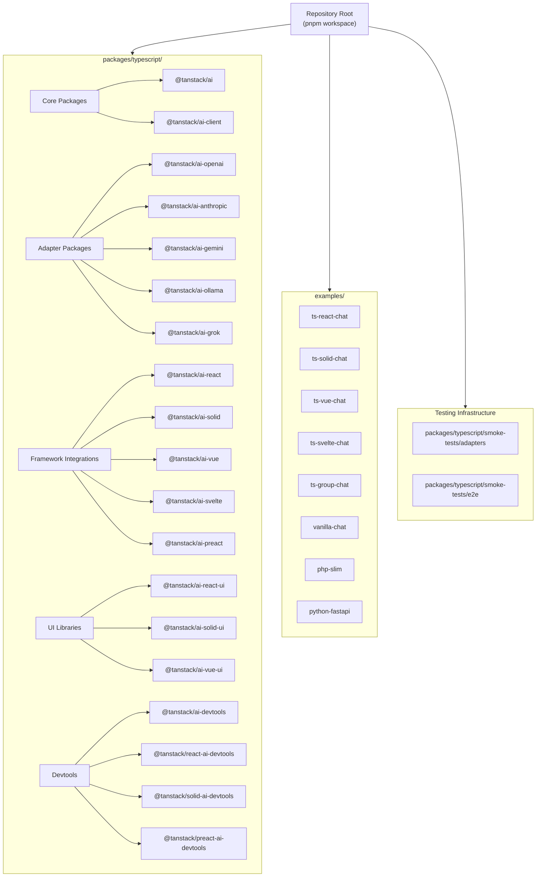
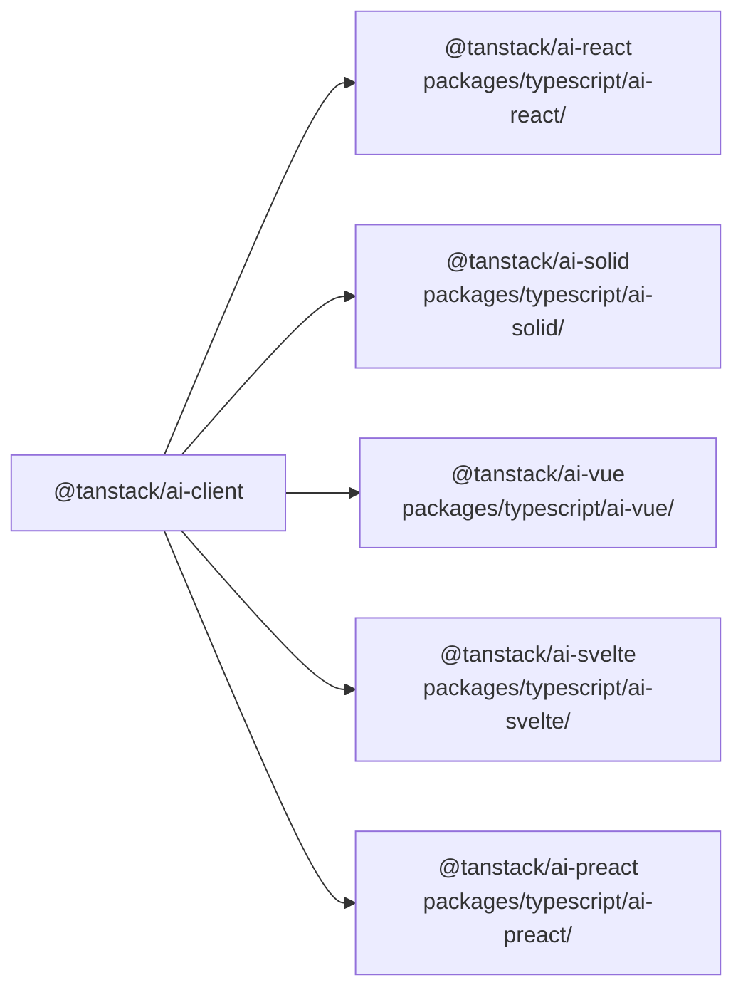
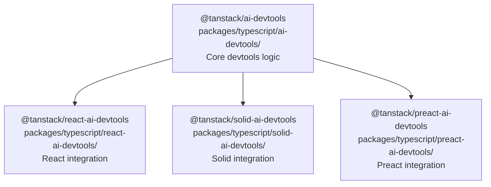
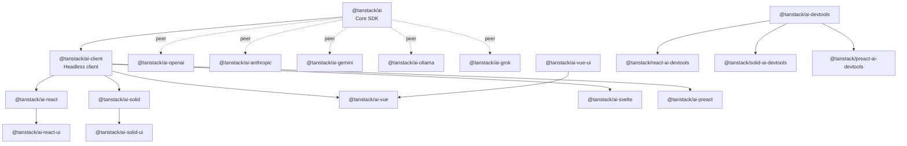

# Package Organization

<details>
<summary>Relevant source files</summary>

The following files were used as context for generating this wiki page:

- [.github/workflows/autofix.yml](.github/workflows/autofix.yml)
- [.github/workflows/release.yml](.github/workflows/release.yml)
- [README.md](README.md)
- [nx.json](nx.json)
- [package.json](package.json)
- [packages/typescript/ai-anthropic/package.json](packages/typescript/ai-anthropic/package.json)
- [packages/typescript/ai-client/README.md](packages/typescript/ai-client/README.md)
- [packages/typescript/ai-devtools/README.md](packages/typescript/ai-devtools/README.md)
- [packages/typescript/ai-gemini/README.md](packages/typescript/ai-gemini/README.md)
- [packages/typescript/ai-gemini/package.json](packages/typescript/ai-gemini/package.json)
- [packages/typescript/ai-ollama/README.md](packages/typescript/ai-ollama/README.md)
- [packages/typescript/ai-ollama/package.json](packages/typescript/ai-ollama/package.json)
- [packages/typescript/ai-openai/README.md](packages/typescript/ai-openai/README.md)
- [packages/typescript/ai-openai/package.json](packages/typescript/ai-openai/package.json)
- [packages/typescript/ai-react-ui/README.md](packages/typescript/ai-react-ui/README.md)
- [packages/typescript/ai-react-ui/package.json](packages/typescript/ai-react-ui/package.json)
- [packages/typescript/ai-react/README.md](packages/typescript/ai-react/README.md)
- [packages/typescript/ai-react/package.json](packages/typescript/ai-react/package.json)
- [packages/typescript/ai-solid-ui/package.json](packages/typescript/ai-solid-ui/package.json)
- [packages/typescript/ai-solid/package.json](packages/typescript/ai-solid/package.json)
- [packages/typescript/ai-solid/tsdown.config.ts](packages/typescript/ai-solid/tsdown.config.ts)
- [packages/typescript/ai-svelte/package.json](packages/typescript/ai-svelte/package.json)
- [packages/typescript/ai-vue-ui/package.json](packages/typescript/ai-vue-ui/package.json)
- [packages/typescript/ai-vue/package.json](packages/typescript/ai-vue/package.json)
- [packages/typescript/ai/README.md](packages/typescript/ai/README.md)
- [packages/typescript/react-ai-devtools/README.md](packages/typescript/react-ai-devtools/README.md)
- [packages/typescript/solid-ai-devtools/README.md](packages/typescript/solid-ai-devtools/README.md)
- [pnpm-lock.yaml](pnpm-lock.yaml)
- [scripts/generate-docs.ts](scripts/generate-docs.ts)

</details>

This document describes the monorepo structure of TanStack AI, including the workspace configuration, package categories, dependency management using the `workspace:*` protocol, and the build tooling assigned to different package types. For information about the build system and task orchestration, see [Nx Configuration and Task Orchestration](#9.2). For details about CI/CD workflows, see [CI/CD and Release Process](#9.6).

## Monorepo Structure

The TanStack AI repository is organized as a pnpm workspace monorepo managed by Nx. The repository contains over 40 packages organized into logical groups under the [packages/typescript/]() directory, plus example applications under [examples/]().

### Repository Layout



**Sources:** [pnpm-lock.yaml:10-950](), [package.json:1-72]()

## Package Categories

### Core Packages

The foundation layer provides framework-agnostic functionality.

| Package               | Location                           | Purpose                                                                           |
| --------------------- | ---------------------------------- | --------------------------------------------------------------------------------- |
| `@tanstack/ai`        | [packages/typescript/ai/]()        | Core SDK with `chat()`, `toolDefinition()`, streaming utilities, type definitions |
| `@tanstack/ai-client` | [packages/typescript/ai-client/]() | Headless client for state management, connection adapters, message handling       |

**Dependency relationship:** `@tanstack/ai-client` depends on `@tanstack/ai` via `workspace:*` protocol.

**Sources:** [pnpm-lock.yaml:600-649](), [packages/typescript/ai-client/package.json]()

### AI Provider Adapters

Five official adapter packages implement provider-specific integrations.

| Package                  | Location                              | Provider          | Key Dependencies            |
| ------------------------ | ------------------------------------- | ----------------- | --------------------------- |
| `@tanstack/ai-openai`    | [packages/typescript/ai-openai/]()    | OpenAI GPT models | `openai@^6.9.1`             |
| `@tanstack/ai-anthropic` | [packages/typescript/ai-anthropic/]() | Anthropic Claude  | `@anthropic-ai/sdk@^0.71.0` |
| `@tanstack/ai-gemini`    | [packages/typescript/ai-gemini/]()    | Google Gemini     | `@google/genai@^1.30.0`     |
| `@tanstack/ai-ollama`    | [packages/typescript/ai-ollama/]()    | Ollama (local)    | `ollama@^0.6.3`             |
| `@tanstack/ai-grok`      | [packages/typescript/ai-grok/]()      | xAI Grok          | `openai@^6.9.1`             |

All adapters have a peer dependency on `@tanstack/ai` via `workspace:^` protocol.

**Sources:** [packages/typescript/ai-openai/package.json:1-55](), [packages/typescript/ai-anthropic/package.json:1-54](), [packages/typescript/ai-gemini/package.json:1-53](), [packages/typescript/ai-ollama/package.json:1-54](), [pnpm-lock.yaml:619-750]()

### Framework Integration Packages

Framework-specific packages wrap `@tanstack/ai-client` with reactive bindings.



| Package               | Build Tool        | Framework Version | Exports                |
| --------------------- | ----------------- | ----------------- | ---------------------- |
| `@tanstack/ai-react`  | Vite              | React >=18.0.0    | `useChat()` hook       |
| `@tanstack/ai-solid`  | tsdown            | Solid >=1.9.10    | `useChat()` primitive  |
| `@tanstack/ai-vue`    | tsdown            | Vue >=3.5.0       | `useChat()` composable |
| `@tanstack/ai-svelte` | @sveltejs/package | Svelte ^5.0.0     | `useChat()` binding    |
| `@tanstack/ai-preact` | Vite              | Preact >=10.26.9  | `useChat()` hook       |

**Sources:** [packages/typescript/ai-react/package.json:1-60](), [packages/typescript/ai-solid/package.json:1-59](), [packages/typescript/ai-vue/package.json:1-59](), [packages/typescript/ai-svelte/package.json:1-64](), [pnpm-lock.yaml:752-803]()

### UI Component Libraries

Pre-built component packages with markdown rendering.

| Package                 | Location                             | Markdown Library                | Rehype/Remark Plugins                                     |
| ----------------------- | ------------------------------------ | ------------------------------- | --------------------------------------------------------- |
| `@tanstack/ai-react-ui` | [packages/typescript/ai-react-ui/]() | `react-markdown@^10.1.0`        | rehype-highlight, rehype-raw, rehype-sanitize, remark-gfm |
| `@tanstack/ai-solid-ui` | [packages/typescript/ai-solid-ui/]() | `solid-markdown@^2.1.0`         | rehype-highlight, rehype-raw, rehype-sanitize, remark-gfm |
| `@tanstack/ai-vue-ui`   | [packages/typescript/ai-vue-ui/]()   | `@crazydos/vue-markdown@^1.1.4` | rehype-highlight, rehype-raw, rehype-sanitize, remark-gfm |

All UI packages share the same rehype/remark plugin dependencies for consistent markdown processing.

**Sources:** [packages/typescript/ai-react-ui/package.json:1-63](), [packages/typescript/ai-solid-ui/package.json:1-62](), [packages/typescript/ai-vue-ui/package.json:1-59](), [pnpm-lock.yaml:805-844]()

### Developer Tools



The core devtools package (`@tanstack/ai-devtools`) provides framework-agnostic monitoring capabilities. Framework-specific packages wrap this core with integration points for React, Solid, and Preact devtools ecosystems.

**Sources:** [pnpm-lock.yaml:651-680]()

### Testing Infrastructure

| Package             | Location                                      | Type       | Purpose                       |
| ------------------- | --------------------------------------------- | ---------- | ----------------------------- |
| Adapter Smoke Tests | [packages/typescript/smoke-tests/adapters/]() | CLI runner | Tests all AI adapter packages |
| E2E Smoke Tests     | [packages/typescript/smoke-tests/e2e/]()      | Playwright | End-to-end workflow tests     |

**Sources:** [pnpm-lock.yaml]()

### Example Applications

| Name           | Location                     | Framework              | Key Features                  |
| -------------- | ---------------------------- | ---------------------- | ----------------------------- |
| ts-react-chat  | [examples/ts-react-chat/]()  | React (TanStack Start) | Full-stack chat with devtools |
| ts-solid-chat  | [examples/ts-solid-chat/]()  | Solid (TanStack Start) | Full-stack chat with devtools |
| ts-vue-chat    | [examples/ts-vue-chat/]()    | Vue 3 + Express        | Separate frontend/backend     |
| ts-svelte-chat | [examples/ts-svelte-chat/]() | Svelte 5 (SvelteKit)   | SvelteKit integration         |
| ts-group-chat  | [examples/ts-group-chat/]()  | React (TanStack Start) | Multi-agent conversation      |
| vanilla-chat   | [examples/vanilla-chat/]()   | Vanilla JS             | Framework-agnostic usage      |
| php-slim       | [examples/php-slim/]()       | PHP Slim               | PHP backend example           |
| python-fastapi | [examples/python-fastapi/]() | Python FastAPI         | Python backend example        |

**Sources:** [pnpm-lock.yaml:81-598]()

## Workspace Protocol and Dependencies

### Workspace Protocol Usage

The monorepo uses pnpm's `workspace:*` and `workspace:^` protocols to reference local packages.

**Pattern 1: `workspace:*` (exact version)**
Used for direct dependencies where the consuming package requires the exact local version:

```json
{
  "dependencies": {
    "@tanstack/ai-client": "workspace:*"
  }
}
```

Example: [packages/typescript/ai-react/package.json:43-44]()

**Pattern 2: `workspace:^` (caret range)**
Used for peer dependencies where the consuming package is compatible with any minor version:

```json
{
  "peerDependencies": {
    "@tanstack/ai": "workspace:^"
  }
}
```

Example: [packages/typescript/ai-openai/package.json:45-47]()

**Sources:** [packages/typescript/ai-react/package.json:43-45](), [packages/typescript/ai-openai/package.json:45-47]()

### Dependency Graph



Solid lines represent direct dependencies (`workspace:*`). Dashed lines represent peer dependencies (`workspace:^`).

**Sources:** [pnpm-lock.yaml:600-950]()

## Build Tool Assignments

Different package types use specialized build tools optimized for their requirements.

### Vite (Primary Builder)

Used for most packages requiring ESM output with tree-shaking:

| Package                  | Config File                                              | Output               |
| ------------------------ | -------------------------------------------------------- | -------------------- |
| `@tanstack/ai`           | Uses `@tanstack/vite-config`                             | ESM in [dist/esm/]() |
| `@tanstack/ai-openai`    | [packages/typescript/ai-openai/package.json:26]()        | ESM in [dist/esm/]() |
| `@tanstack/ai-anthropic` | [packages/typescript/ai-anthropic/package.json:33]()     | ESM in [dist/esm/]() |
| `@tanstack/ai-gemini`    | [packages/typescript/ai-gemini/package.json:26]()        | ESM in [dist/esm/]() |
| `@tanstack/ai-ollama`    | [packages/typescript/ai-ollama/package.json:26]()        | ESM in [dist/esm/]() |
| `@tanstack/ai-grok`      | [packages/typescript/ai-grok/package.json:713-715]()     | ESM in [dist/esm/]() |
| `@tanstack/ai-client`    | [packages/typescript/ai-client/package.json:644-646]()   | ESM in [dist/esm/]() |
| `@tanstack/ai-react`     | [packages/typescript/ai-react/package.json:33]()         | ESM in [dist/esm/]() |
| `@tanstack/ai-preact`    | [packages/typescript/ai-preact/package.json:773-775]()   | ESM in [dist/esm/]() |
| `@tanstack/ai-react-ui`  | [packages/typescript/ai-react-ui/package.json:23]()      | ESM in [dist/esm/]() |
| `@tanstack/ai-solid-ui`  | [packages/typescript/ai-solid-ui/package.json:25]()      | Source in [src/]()   |
| `@tanstack/ai-vue-ui`    | [packages/typescript/ai-vue-ui/package.json:24]()        | ESM in [dist/esm/]() |
| `@tanstack/ai-devtools`  | [packages/typescript/ai-devtools/package.json:675-677]() | ESM in [dist/esm/]() |

**Sources:** [package.json:54](), [packages/typescript/ai-openai/package.json:26](), [packages/typescript/ai-react/package.json:33]()

### tsdown (Solid and Vue)

Used for packages requiring unbundled output for optimal tree-shaking:

| Package              | Config                                            | Options                             |
| -------------------- | ------------------------------------------------- | ----------------------------------- |
| `@tanstack/ai-solid` | [packages/typescript/ai-solid/tsdown.config.ts]() | `unbundle: true`, `format: ['esm']` |
| `@tanstack/ai-vue`   | Similar to Solid                                  | `unbundle: true`, `format: ['esm']` |

The `unbundle: true` option preserves the original file structure, allowing bundlers to perform more aggressive tree-shaking.

**Sources:** [packages/typescript/ai-solid/package.json:31](), [packages/typescript/ai-solid/tsdown.config.ts:1-15]()

### @sveltejs/package (Svelte)

Svelte-specific package builder for component libraries:

| Package               | Build Command                   | Output                                    |
| --------------------- | ------------------------------- | ----------------------------------------- |
| `@tanstack/ai-svelte` | `svelte-package -i src -o dist` | [dist/]() with Svelte-optimized structure |

**Sources:** [packages/typescript/ai-svelte/package.json:35]()

### Build Tool Summary Table

| Build Tool        | Packages Using It       | Primary Use Case                        |
| ----------------- | ----------------------- | --------------------------------------- |
| Vite              | 15+ packages            | Standard ESM bundling with tree-shaking |
| tsdown            | 2 packages (Solid, Vue) | Unbundled ESM for maximum tree-shaking  |
| @sveltejs/package | 1 package (Svelte)      | Svelte component library packaging      |

**Sources:** [packages/typescript/ai-solid/package.json:31](), [packages/typescript/ai-svelte/package.json:35](), [packages/typescript/ai-react/package.json:33]()

## Package Naming Conventions

All packages follow consistent naming patterns:

| Pattern                             | Example                       | Description                   |
| ----------------------------------- | ----------------------------- | ----------------------------- |
| `@tanstack/ai`                      | Core                          | Main SDK package              |
| `@tanstack/ai-*`                    | `@tanstack/ai-client`         | Core functionality extensions |
| `@tanstack/ai-{provider}`           | `@tanstack/ai-openai`         | Provider adapters             |
| `@tanstack/ai-{framework}`          | `@tanstack/ai-react`          | Framework integrations        |
| `@tanstack/ai-{framework}-ui`       | `@tanstack/ai-react-ui`       | Framework UI components       |
| `@tanstack/{framework}-ai-devtools` | `@tanstack/react-ai-devtools` | Framework-specific devtools   |

**Exception:** Core devtools package uses `@tanstack/ai-devtools` pattern.

**Sources:** [pnpm-lock.yaml:600-950]()

## Package.json Scripts

The root [package.json]() defines workspace-wide scripts executed via Nx:

| Script        | Command                            | Purpose                           |
| ------------- | ---------------------------------- | --------------------------------- |
| `test:ci`     | `nx run-many --targets=...`        | Run all quality checks            |
| `test:pr`     | `nx affected --targets=...`        | Run checks on affected packages   |
| `test:eslint` | `nx affected --target=test:eslint` | Lint affected packages            |
| `test:lib`    | `nx affected --targets=test:lib`   | Run unit tests                    |
| `test:build`  | `nx affected --target=test:build`  | Validate build output             |
| `test:types`  | `nx affected --targets=test:types` | Type checking                     |
| `test:knip`   | `knip`                             | Detect unused exports             |
| `test:sherif` | `sherif`                           | Validate package.json consistency |
| `build`       | `nx affected --targets=build`      | Build affected packages           |
| `build:all`   | `nx run-many --targets=build`      | Build all packages                |

Individual packages define their own script implementations that Nx orchestrates. For example, `@tanstack/ai-react` defines `"test:lib": "vitest run"` in [packages/typescript/ai-react/package.json:29]().

**Sources:** [package.json:15-39](), [packages/typescript/ai-react/package.json:29]()

## Package Exports Configuration

Packages use the `exports` field for precise control over entry points:

**Pattern 1: Single Entry Point (Adapters)**

```json
{
  "exports": {
    ".": {
      "types": "./dist/esm/index.d.ts",
      "import": "./dist/esm/index.js"
    }
  }
}
```

Example: [packages/typescript/ai-openai/package.json:15-20]()

**Pattern 2: Source Exports (Solid UI)**

```json
{
  "exports": {
    ".": {
      "solid": "./src/index.ts",
      "types": "./src/index.ts",
      "import": "./src/index.ts"
    }
  }
}
```

Example: [packages/typescript/ai-solid-ui/package.json:13-19]()

**Pattern 3: Svelte-Specific**

```json
{
  "exports": {
    ".": {
      "types": "./dist/index.d.ts",
      "svelte": "./dist/index.js",
      "import": "./dist/index.js"
    }
  }
}
```

Example: [packages/typescript/ai-svelte/package.json:16-22]()

**Sources:** [packages/typescript/ai-openai/package.json:15-20](), [packages/typescript/ai-solid-ui/package.json:13-19](), [packages/typescript/ai-svelte/package.json:16-22]()
