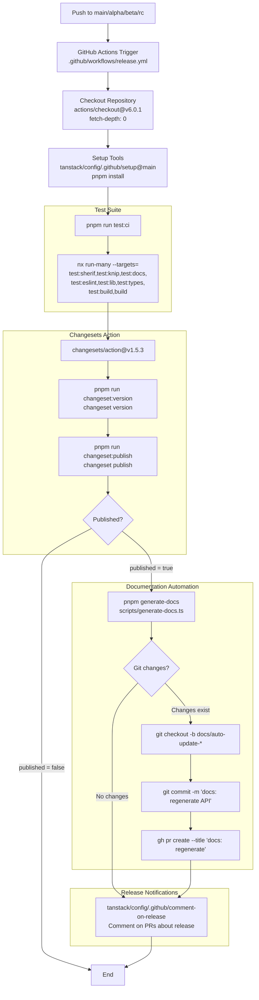
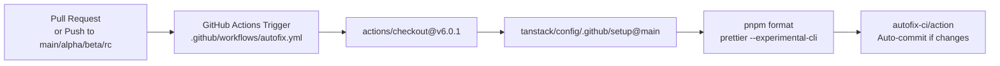
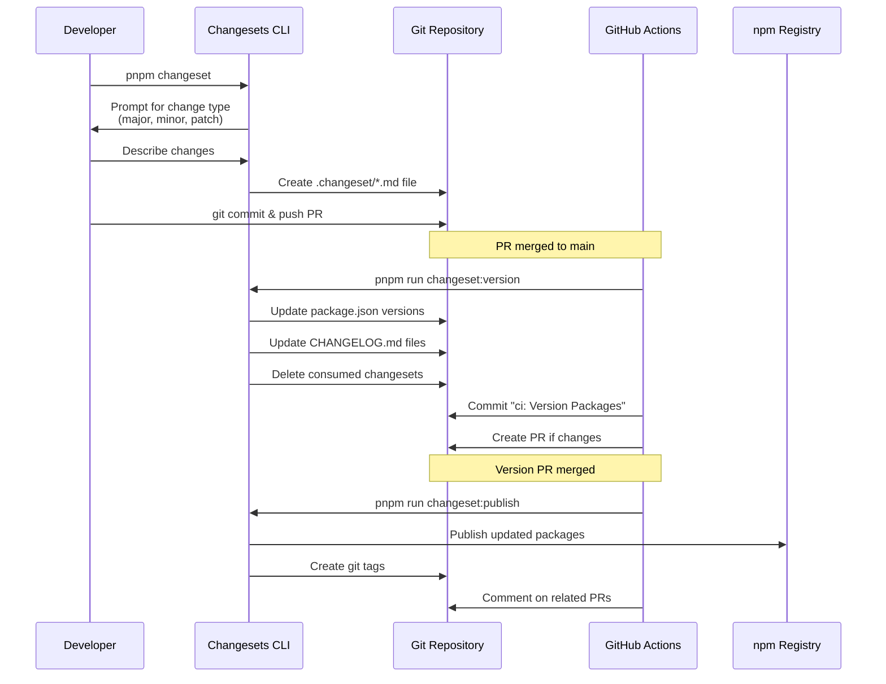
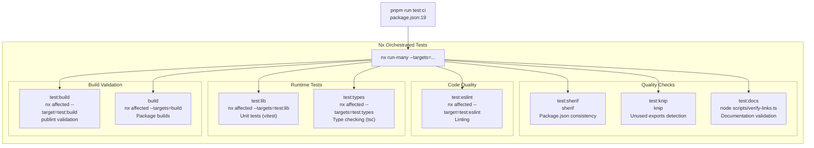
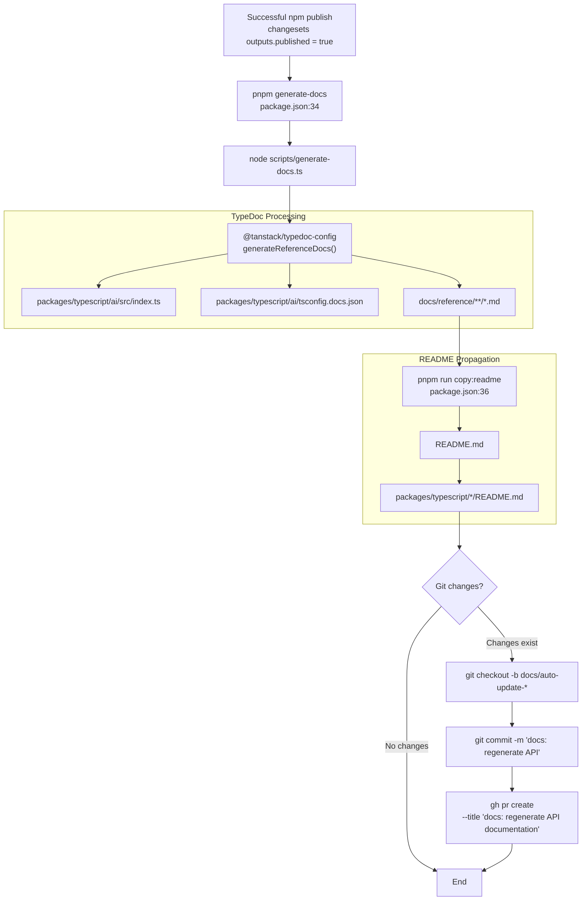

# CI/CD and Release Process

<details>
<summary>Relevant source files</summary>

The following files were used as context for generating this wiki page:

- [.github/workflows/autofix.yml](.github/workflows/autofix.yml)
- [.github/workflows/release.yml](.github/workflows/release.yml)
- [examples/ts-svelte-chat/CHANGELOG.md](examples/ts-svelte-chat/CHANGELOG.md)
- [examples/ts-svelte-chat/package.json](examples/ts-svelte-chat/package.json)
- [examples/ts-vue-chat/CHANGELOG.md](examples/ts-vue-chat/CHANGELOG.md)
- [examples/ts-vue-chat/package.json](examples/ts-vue-chat/package.json)
- [nx.json](nx.json)
- [package.json](package.json)
- [packages/typescript/ai-gemini/CHANGELOG.md](packages/typescript/ai-gemini/CHANGELOG.md)
- [packages/typescript/ai-openai/CHANGELOG.md](packages/typescript/ai-openai/CHANGELOG.md)
- [packages/typescript/ai-solid/tsdown.config.ts](packages/typescript/ai-solid/tsdown.config.ts)
- [packages/typescript/smoke-tests/adapters/CHANGELOG.md](packages/typescript/smoke-tests/adapters/CHANGELOG.md)
- [packages/typescript/smoke-tests/adapters/package.json](packages/typescript/smoke-tests/adapters/package.json)
- [packages/typescript/smoke-tests/e2e/CHANGELOG.md](packages/typescript/smoke-tests/e2e/CHANGELOG.md)
- [packages/typescript/smoke-tests/e2e/package.json](packages/typescript/smoke-tests/e2e/package.json)
- [pnpm-lock.yaml](pnpm-lock.yaml)
- [scripts/generate-docs.ts](scripts/generate-docs.ts)

</details>

This document describes the continuous integration, continuous delivery, and release automation infrastructure for the TanStack AI monorepo. It covers GitHub Actions workflows, the Changesets-based versioning system, automated testing, quality gates, and documentation generation that occur during the development and release lifecycle.

For information about the testing infrastructure itself (test frameworks, smoke tests, E2E tests), see [Testing Infrastructure](#9.3). For details on quality tools like eslint and knip, see [Code Quality Tools](#9.4).

## Overview

TanStack AI uses a fully automated CI/CD pipeline built on GitHub Actions and Changesets. The system handles automated testing on pull requests, version management, npm publishing, and documentation generation. The pipeline ensures that all packages in the monorepo are versioned together with proper dependency tracking and that releases only occur after comprehensive testing.

**Sources:** [.github/workflows/release.yml:1-65](), [package.json:37-39]()

## Release Workflow Architecture

The following diagram shows the complete release workflow from code push to npm publication:



**Sources:** [.github/workflows/release.yml:19-65](), [package.json:15-39]()

## GitHub Actions Workflows

### Release Workflow

The main release workflow is defined in [.github/workflows/release.yml:1-65](). Key configuration:

| Configuration         | Value                                                               | Purpose                                  |
| --------------------- | ------------------------------------------------------------------- | ---------------------------------------- |
| **Trigger**           | Push to `main`, `alpha`, `beta`, `rc`                               | Automatic releases on protected branches |
| **Concurrency Group** | `${{ github.workflow }}-${{ github.event.number \|\| github.ref }}` | Prevents concurrent releases             |
| **Permissions**       | `contents: write`, `id-token: write`, `pull-requests: write`        | Required for publishing and PR creation  |
| **Runs On**           | `ubuntu-latest`                                                     | Standard Linux runner                    |
| **Nx Cloud Token**    | `${{ secrets.NX_CLOUD_ACCESS_TOKEN }}`                              | Enables distributed caching              |

The workflow executes the following steps:

1. **Checkout**: Uses `actions/checkout@v6.0.1` with `fetch-depth: 0` to get full git history (required for Changesets)
2. **Setup Tools**: Uses `tanstack/config/.github/setup@main` which installs Node.js and runs `pnpm install`
3. **Run Tests**: Executes `pnpm run test:ci` which runs all quality checks
4. **Changesets Version/Publish**: Handled by `changesets/action@v1.5.3` with custom scripts
5. **Generate Docs**: Runs `pnpm generate-docs` after successful publish
6. **Create PR**: Creates automated PR with updated documentation
7. **Comment on Release**: Notifies PRs that their changes were released

**Sources:** [.github/workflows/release.yml:20-65]()

### Autofix Workflow

The autofix workflow automatically applies code formatting on pull requests:



This workflow ensures consistent formatting without requiring manual intervention. It uses:

- **Trigger**: `pull_request` and pushes to protected branches
- **Formatter**: Prettier with experimental CLI and `--ignore-unknown` flag
- **Auto-commit**: `autofix-ci/action` with commit message `'ci: apply automated fixes'`

**Sources:** [.github/workflows/autofix.yml:1-30]()

## Changesets-Based Versioning

TanStack AI uses Changesets for semantic versioning and changelog generation. The system tracks changes at the package level and handles inter-package dependencies automatically.

### Changeset Dependencies

The repository uses these Changesets-related packages:

| Package                                        | Version   | Purpose                         |
| ---------------------------------------------- | --------- | ------------------------------- |
| `@changesets/cli`                              | `^2.29.8` | Core Changesets CLI tool        |
| `@svitejs/changesets-changelog-github-compact` | `^1.2.0`  | Compact GitHub changelog format |

**Sources:** [pnpm-lock.yaml:14-22]()

### Changeset Workflow



**Sources:** [package.json:37-39](), [.github/workflows/release.yml:33-43]()

### Changeset Scripts

The root [package.json:37-39]() defines these Changesets-related scripts:

1. **`changeset`**: Interactive CLI for creating new changesets

   ```bash
   pnpm changeset
   ```

2. **`changeset:version`**: Updates versions and changelogs

   ```bash
   changeset version && pnpm install --no-frozen-lockfile && pnpm format
   ```

   - Runs `changeset version` to bump package versions
   - Updates `pnpm-lock.yaml` with `--no-frozen-lockfile`
   - Formats updated files with Prettier

3. **`changeset:publish`**: Publishes packages to npm
   ```bash
   changeset publish
   ```

   - Publishes all packages with updated versions
   - Creates git tags for releases

**Sources:** [package.json:37-39]()

### Changeset Files and Changelog Format

Changeset files are stored in `.changeset/*.md` and follow this format:

```markdown
---
'@tanstack/ai': patch
'@tanstack/ai-client': patch
---

Brief description of the change
```

The generated CHANGELOG.md files use the compact GitHub format provided by `@svitejs/changesets-changelog-github-compact`, which creates entries like:

```markdown
## 0.2.2

### Patch Changes

- Fix thinking output for Gemini Text adapter ([#210](https://github.com/TanStack/ai/pull/210))

- Updated dependencies [[`7573619`](https://github.com/TanStack/ai/commit/7573619...)]:
  - @tanstack/ai@0.2.2
```

**Sources:** [packages/typescript/ai-gemini/CHANGELOG.md:1-75](), [pnpm-lock.yaml:20-22]()

## Testing and Quality Gates

Before any release can proceed, the CI pipeline runs a comprehensive test suite coordinated by Nx.

### Test Suite Execution



**Sources:** [package.json:18-19](), [nx.json:27-73]()

### Nx Task Dependencies and Caching

Nx orchestrates test execution with intelligent caching and dependency tracking. Key configuration from [nx.json:27-73]():

| Target        | Cache | Depends On | Inputs                                     | Outputs                  |
| ------------- | ----- | ---------- | ------------------------------------------ | ------------------------ |
| `test:lib`    | ✓     | `^build`   | `default`, `^production`                   | `{projectRoot}/coverage` |
| `test:types`  | ✓     | `^build`   | `default`, `^production`                   | -                        |
| `test:eslint` | ✓     | `^build`   | `default`, `^production`, workspace eslint | -                        |
| `test:build`  | ✓     | `build`    | `production`                               | -                        |
| `build`       | ✓     | `^build`   | `production`, `^production`                | `dist`, `build`          |
| `test:sherif` | ✓     | -          | `**/package.json`                          | -                        |
| `test:knip`   | ✓     | -          | `**/*`                                     | -                        |

The `^` prefix in `dependsOn` means "dependencies of this project", ensuring correct build order.

**Named Inputs** define reusable input patterns:

```json
{
  "sharedGlobals": [
    "{workspaceRoot}/.nvmrc",
    "{workspaceRoot}/package.json",
    "{workspaceRoot}/tsconfig.json"
  ],
  "default": ["sharedGlobals", "{projectRoot}/**/*", "!{projectRoot}/**/*.md"],
  "production": [
    "default",
    "!{projectRoot}/tests/**/*",
    "!{projectRoot}/eslint.config.js"
  ]
}
```

Nx runs up to 5 tasks in parallel as configured in [nx.json:6]() with `"parallel": 5`.

**Sources:** [nx.json:1-74]()

## Documentation Generation

Documentation is automatically generated and updated after successful releases.

### TypeDoc Generation Pipeline



**Sources:** [.github/workflows/release.yml:43-58](), [package.json:34-36](), [scripts/generate-docs.ts:1-36]()

### TypeDoc Configuration

The [scripts/generate-docs.ts:1-36]() file configures TypeDoc generation:

```typescript
const packages = [
  {
    name: 'ai',
    entryPoints: ['packages/typescript/ai/src/index.ts'],
    tsconfig: 'packages/typescript/ai/tsconfig.docs.json',
    outputDir: 'docs/reference',
    exclude: [
      '**/*.spec.ts',
      '**/*.test.ts',
      '**/__tests__/**',
      '**/node_modules/**',
      '**/dist/**',
    ],
  },
]
```

The script uses `generateReferenceDocs()` from `@tanstack/typedoc-config` to:

1. Parse TypeScript source files
2. Extract API documentation from JSDoc comments
3. Generate markdown files in `docs/reference/`

After TypeDoc generation, the `copy:readme` script propagates the root `README.md` to all package directories for npm registry display.

**Sources:** [scripts/generate-docs.ts:7-32](), [package.json:36]()

## Pull Request Automation

The CI/CD system includes several automated workflows for pull requests:

### PR Test Workflow

When running tests on PRs, the system uses `test:pr` instead of `test:ci`:

```bash
nx affected --targets=test:sherif,test:knip,test:docs,test:eslint,test:lib,test:types,test:build,build
```

The key difference is `nx affected` which only runs tests for packages affected by the PR changes, significantly reducing CI time.

**Sources:** [package.json:18]()

### Release Comments

After a successful release, the workflow comments on all PRs that contributed to the release:

```yaml
- name: Comment on PRs about release
  if: steps.changesets.outputs.published == 'true'
  uses: tanstack/config/.github/comment-on-release@main
  with:
    published-packages: ${{ steps.changesets.outputs.publishedPackages }}
```

This uses the `publishedPackages` output from the Changesets action, which is a JSON array of packages that were published.

**Sources:** [.github/workflows/release.yml:61-65]()

## npm Publishing Configuration

All packages in the monorepo use the `workspace:*` protocol for internal dependencies, which Changesets automatically converts to proper version ranges during publishing.

### Workspace Dependencies Example

From [examples/ts-react-chat/package.json]():

```json
{
  "dependencies": {
    "@tanstack/ai": "workspace:*",
    "@tanstack/ai-anthropic": "workspace:*",
    "@tanstack/ai-client": "workspace:*"
  }
}
```

During `changeset publish`, these become actual version ranges like:

```json
{
  "dependencies": {
    "@tanstack/ai": "^0.2.2",
    "@tanstack/ai-anthropic": "^0.2.0",
    "@tanstack/ai-client": "^0.2.2"
  }
}
```

**Sources:** [pnpm-lock.yaml:98-106]()

## Concurrency and Safety

### Concurrency Groups

Both workflows use concurrency groups to prevent conflicts:

```yaml
concurrency:
  group: ${{ github.workflow }}-${{ github.event.number || github.ref }}
  cancel-in-progress: true
```

This ensures:

- Only one release workflow runs per branch at a time
- If a new push occurs during a workflow, the old workflow is cancelled
- Each PR has its own concurrency group via `github.event.number`

**Sources:** [.github/workflows/release.yml:7-9](), [.github/workflows/autofix.yml:8-10]()

### Repository Ownership Guard

The release workflow only runs for the official TanStack organization:

```yaml
if: github.repository_owner == 'TanStack'
```

This prevents accidental publishes from forks.

**Sources:** [.github/workflows/release.yml:22]()

## Environment Variables and Secrets

The CI/CD pipeline uses the following secrets and environment variables:

| Name                    | Type                  | Purpose                                                                                     |
| ----------------------- | --------------------- | ------------------------------------------------------------------------------------------- |
| `NX_CLOUD_ACCESS_TOKEN` | Secret                | Enables Nx Cloud distributed caching                                                        |
| `GITHUB_TOKEN`          | Auto-provided         | Used by Changesets for creating tags and releases                                           |
| `GH_TOKEN`              | Auto-provided         | Used by `gh` CLI for PR creation                                                            |
| `NPM_TOKEN`             | Implicitly configured | Required by Changesets for npm publishing (via `id-token: write` permission for provenance) |

The workflow uses OpenID Connect (OIDC) for npm publishing with `id-token: write` permission, which provides provenance attestation without requiring a long-lived npm token.

**Sources:** [.github/workflows/release.yml:11-16]()

## Release Branch Strategy

The repository supports multiple release channels via branch-based releases:

| Branch  | Purpose            | Release Tag |
| ------- | ------------------ | ----------- |
| `main`  | Stable releases    | `latest`    |
| `alpha` | Alpha pre-releases | `alpha`     |
| `beta`  | Beta pre-releases  | `beta`      |
| `rc`    | Release candidates | `rc`        |

Changesets automatically determines the npm dist-tag based on the branch name and any pre-release configuration.

**Sources:** [.github/workflows/release.yml:5]()
