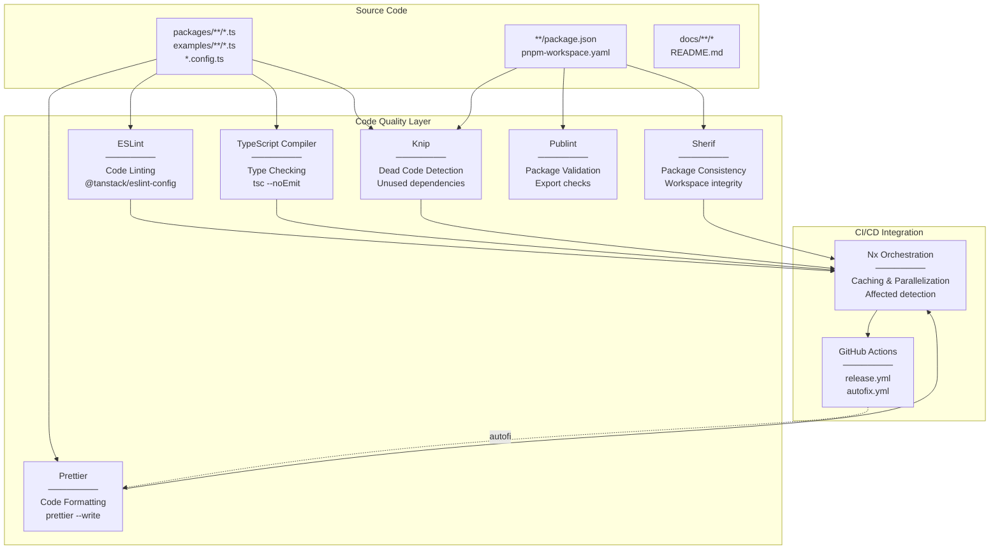
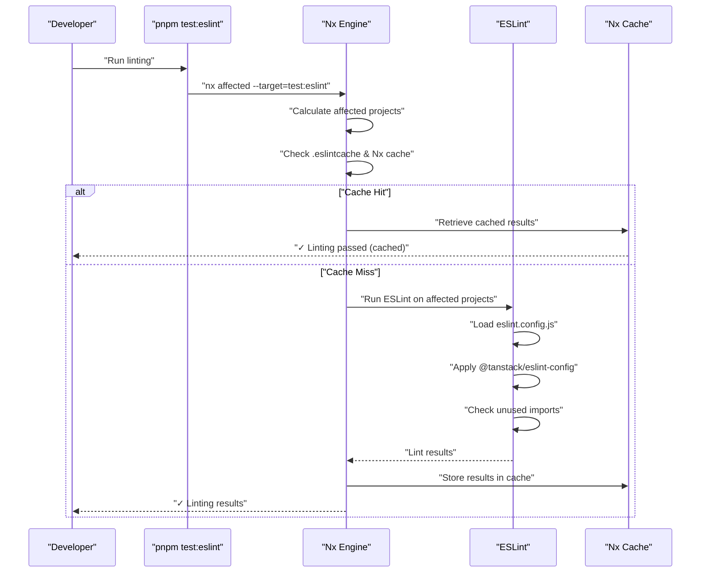
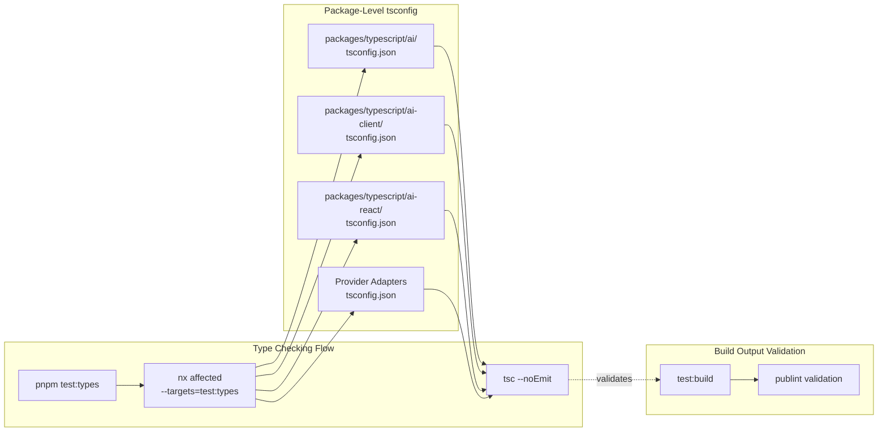
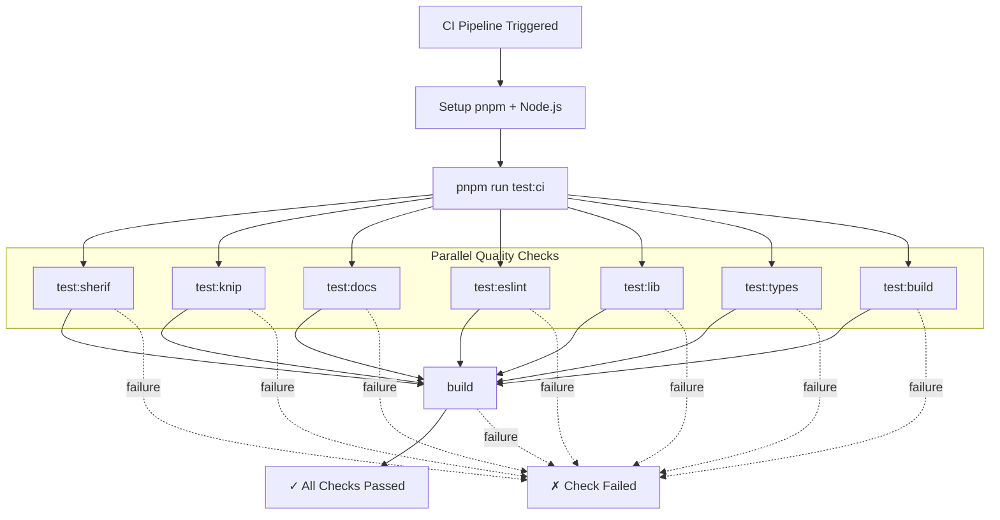
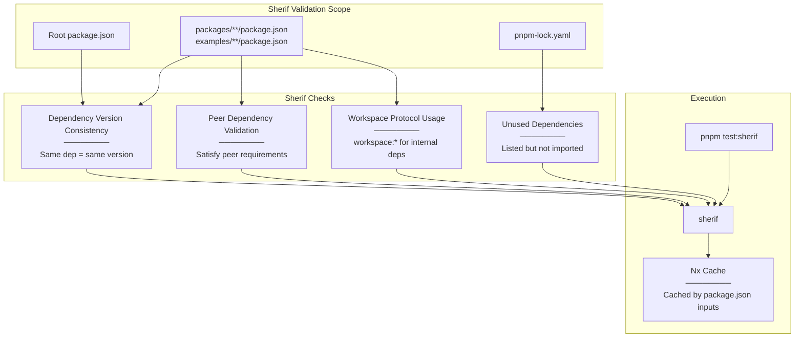
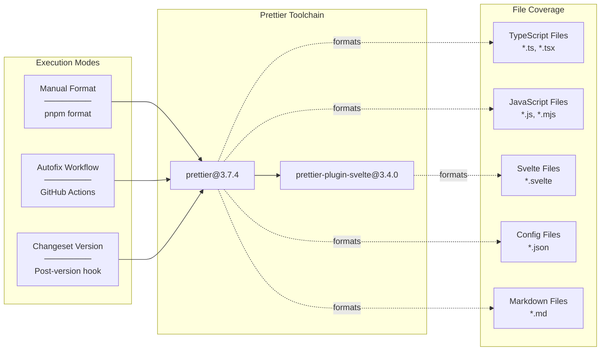
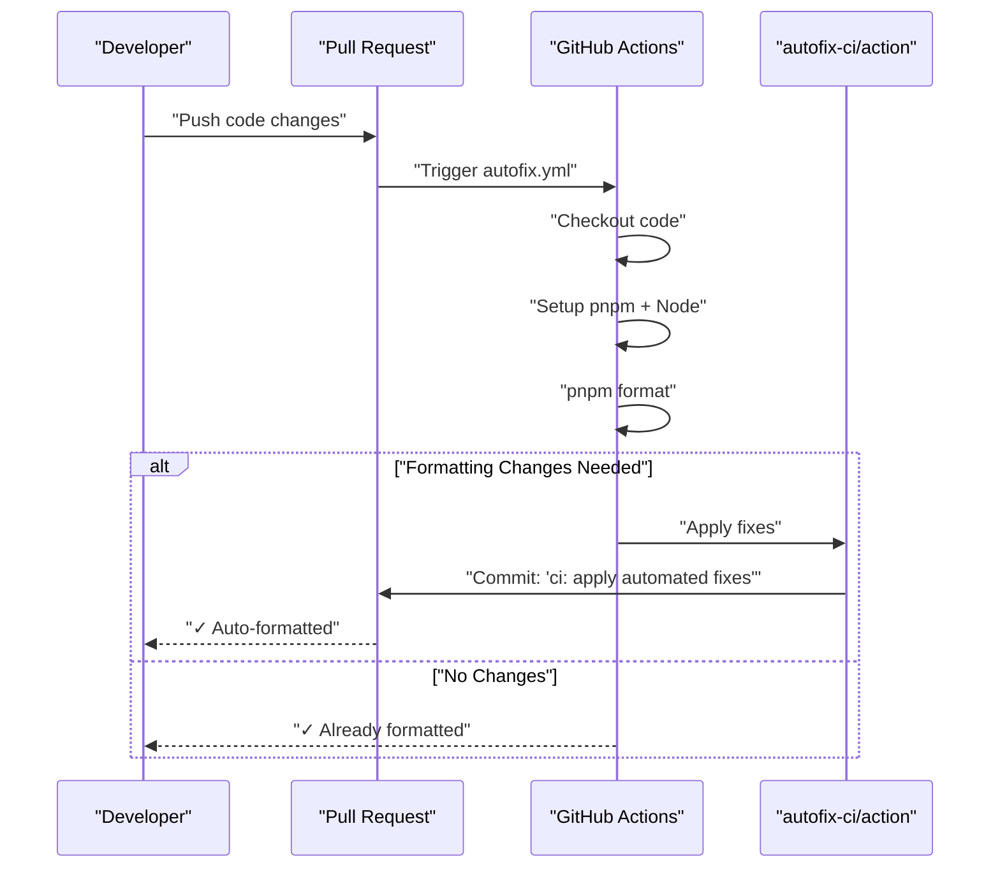

# Code Quality Tools

<details>
<summary>Relevant source files</summary>

The following files were used as context for generating this wiki page:

- [.github/workflows/autofix.yml](.github/workflows/autofix.yml)
- [.github/workflows/release.yml](.github/workflows/release.yml)
- [nx.json](nx.json)
- [package.json](package.json)
- [packages/typescript/ai-anthropic/package.json](packages/typescript/ai-anthropic/package.json)
- [packages/typescript/ai-gemini/package.json](packages/typescript/ai-gemini/package.json)
- [packages/typescript/ai-ollama/package.json](packages/typescript/ai-ollama/package.json)
- [packages/typescript/ai-openai/package.json](packages/typescript/ai-openai/package.json)
- [packages/typescript/ai-react-ui/package.json](packages/typescript/ai-react-ui/package.json)
- [packages/typescript/ai-react/package.json](packages/typescript/ai-react/package.json)
- [packages/typescript/ai-solid-ui/package.json](packages/typescript/ai-solid-ui/package.json)
- [packages/typescript/ai-solid/package.json](packages/typescript/ai-solid/package.json)
- [packages/typescript/ai-solid/tsdown.config.ts](packages/typescript/ai-solid/tsdown.config.ts)
- [packages/typescript/ai-svelte/package.json](packages/typescript/ai-svelte/package.json)
- [packages/typescript/ai-vue-ui/package.json](packages/typescript/ai-vue-ui/package.json)
- [packages/typescript/ai-vue/package.json](packages/typescript/ai-vue/package.json)
- [pnpm-lock.yaml](pnpm-lock.yaml)
- [scripts/generate-docs.ts](scripts/generate-docs.ts)

</details>

This document describes the automated code quality enforcement tools used in the TanStack AI monorepo. These tools ensure consistent code style, detect unused code, validate package dependencies, and catch type errors before they reach production. For information about the CI/CD pipelines that run these tools, see [CI/CD and Release Process](#9.6). For details about testing infrastructure, see [Testing Infrastructure](#9.3).

## Quality Tool Ecosystem

The TanStack AI monorepo employs five primary code quality tools, each serving a distinct purpose:



**Roles**: `ESLint` enforces coding standards and catches common errors, `TypeScript` performs static type checking, `Knip` detects unused files/dependencies/exports, `Sherif` validates workspace package consistency, `Prettier` enforces consistent formatting, and `Publint` validates package exports for NPM publishing. All tools integrate with `Nx` for intelligent caching and affected project detection.

**Sources**: [package.json:15-46](), [pnpm-lock.yaml:23-67](), [nx.json:27-73]()

---

## ESLint Configuration

ESLint provides code linting with a shared configuration package maintained by the TanStack organization:

| Configuration Aspect | Value                                                    | Location                 |
| -------------------- | -------------------------------------------------------- | ------------------------ |
| Config Package       | `@tanstack/eslint-config@0.3.3`                          | [pnpm-lock.yaml:23-25]() |
| ESLint Version       | `9.39.1`                                                 | [pnpm-lock.yaml:35-37]() |
| Plugin               | `eslint-plugin-unused-imports@4.3.0`                     | [pnpm-lock.yaml:38-40]() |
| Execution Command    | `nx affected --target=test:eslint --exclude=examples/**` | [package.json:20]()      |
| Nx Cache Strategy    | `true`                                                   | [nx.json:40-44]()        |

The linting workflow runs only on packages (not examples) and utilizes Nx's affected detection to lint only changed projects:



**Dependencies Configuration**: The `test:eslint` target depends on the `^build` target of parent packages ([nx.json:40-44]()), ensuring that dependent packages are built before linting runs. This is necessary because ESLint may need to resolve types from built packages.

**Inputs**: The linting task considers three input categories: `default` (all project files except markdown), `^production` (production files from dependencies), and the workspace-level `eslint.config.js` ([nx.json:40-44]()).

**Sources**: [package.json:20](), [nx.json:40-44](), [pnpm-lock.yaml:23-40]()

---

## TypeScript Type Checking

TypeScript provides static type analysis across all packages in the monorepo:



**Execution**: Type checking runs via `nx affected --targets=test:types --exclude=examples/**` ([package.json:26]()), excluding example applications. The Nx configuration specifies that type checking depends on `^build` ([nx.json:45-49]()), ensuring parent packages are built before type checking their consumers.

**TypeScript Version**: The monorepo standardizes on TypeScript `5.9.3` ([pnpm-lock.yaml:71-73]()), locked across all packages to prevent version conflicts.

**Caching Strategy**: Type checking results are cached based on `default` and `^production` inputs ([nx.json:45-49]()), meaning the cache invalidates when source files change or when production dependencies are modified.

**Sources**: [package.json:26](), [nx.json:45-49](), [pnpm-lock.yaml:71-73]()

---

## Knip: Dead Code Detection

Knip analyzes the codebase to detect unused files, dependencies, exports, and configuration:

### Knip Detection Capabilities

| Detection Type       | Description                               | Impact                              |
| -------------------- | ----------------------------------------- | ----------------------------------- |
| Unused Files         | Files not imported by any entry point     | Build size, maintenance burden      |
| Unused Dependencies  | `package.json` dependencies not imported  | Installation time, security surface |
| Unused Exports       | Exported members never imported elsewhere | API surface clarity                 |
| Unused Configuration | Config files for tools not in use         | Configuration complexity            |

**Execution**: Knip runs via `knip` command ([package.json:27]()) and is included in the CI test suite ([package.json:19]()). Unlike other tools, Knip does not use `nx affected` but instead analyzes the entire workspace ([nx.json:65-68]()).

**Configuration**: Knip is configured at version `5.73.4` ([pnpm-lock.yaml:44-46]()) and requires `@types/node` and `typescript` as peer dependencies, indicating it performs type-aware analysis.

**Nx Integration**: The `test:knip` target uses cache but includes `{workspaceRoot}/**/*` as inputs ([nx.json:65-68]()), meaning it re-runs when any file in the workspace changes. This is necessary because Knip needs a holistic view of the codebase.

**CI Integration Flow**:



**Sources**: [package.json:27](), [nx.json:65-68](), [pnpm-lock.yaml:44-46](), [.github/workflows/release.yml:31-32]()

---

## Sherif: Package Consistency Validation

Sherif enforces consistency rules across the monorepo's `package.json` files:



**Version**: Sherif `1.9.0` is used ([pnpm-lock.yaml:65-67]()).

**Execution**: Runs via `sherif` command ([package.json:21]()) and is included in all CI checks ([package.json:19]()).

**Nx Caching**: The `test:sherif` target caches results based on `{workspaceRoot}/**/package.json` inputs ([nx.json:69-72]()), re-running only when any `package.json` file changes in the workspace.

**Workspace Protocol**: Sherif validates that internal dependencies use `workspace:*` or `workspace:^` protocol. Examples from the codebase:

- [pnpm-lock.yaml:98-100](): `@tanstack/ai: workspace:*` in examples
- [pnpm-lock.yaml:637-639](): `@tanstack/ai: workspace:*` in ai-client
- [pnpm-lock.yaml:754-756](): `@tanstack/ai: workspace:^` in ai-preact

**Sources**: [package.json:21](), [nx.json:69-72](), [pnpm-lock.yaml:65-67]()

---

## Prettier: Automated Code Formatting

Prettier enforces consistent code formatting across the entire codebase:

### Prettier Configuration



**Format Command**: `prettier --experimental-cli --ignore-unknown '**/*' --write` ([package.json:33]()) formats all files, ignoring unknown file types.

**Svelte Support**: The `prettier-plugin-svelte@3.4.0` ([pnpm-lock.yaml:59-61]()) enables Prettier to format Svelte components in the monorepo.

**Autofix Workflow**: The repository includes an automated fix workflow that runs on pull requests and pushes:



**Changeset Integration**: After version bumps via Changesets, the workflow runs `pnpm format` to ensure `package.json` and `CHANGELOG.md` files are properly formatted ([package.json:39]()).

**Sources**: [package.json:33](), [pnpm-lock.yaml:56-61](), [.github/workflows/autofix.yml:1-30]()

---

## Publint: Package Export Validation

Publint validates that package exports are correctly configured for NPM publishing:

**Version**: `publint@0.3.16` ([pnpm-lock.yaml:62-64]())

**Purpose**: Publint checks that:

- Package `exports` field is correctly configured
- TypeScript types are properly exposed
- ESM/CJS dual publishing works correctly
- Entry points resolve correctly

**Integration**: Some packages use Publint through build tools. For example, `ai-solid` uses `tsdown` with Publint integration:

```typescript
// packages/typescript/ai-solid/tsdown.config.ts
publint: {
  strict: true,
}
```

This configuration ([packages/typescript/ai-solid/tsdown.config.ts:12-14]()) runs Publint validation during the build process with strict mode enabled.

**Sources**: [pnpm-lock.yaml:62-64](), [packages/typescript/ai-solid/tsdown.config.ts:12-14]()

---

## Quality Tool Integration Summary

The following table summarizes how each quality tool integrates with the build system:

| Tool       | Nx Target     | Depends On | Inputs                                                       | Outputs | Exclusions    |
| ---------- | ------------- | ---------- | ------------------------------------------------------------ | ------- | ------------- |
| ESLint     | `test:eslint` | `^build`   | `default`, `^production`, `{workspaceRoot}/eslint.config.js` | None    | `examples/**` |
| TypeScript | `test:types`  | `^build`   | `default`, `^production`                                     | None    | `examples/**` |
| Knip       | `test:knip`   | None       | `{workspaceRoot}/**/*`                                       | None    | None          |
| Sherif     | `test:sherif` | None       | `{workspaceRoot}/**/package.json`                            | None    | None          |
| Build Test | `test:build`  | `build`    | `production`                                                 | None    | `examples/**` |

**Parallel Execution**: Nx runs multiple targets in parallel with a limit of 5 concurrent tasks ([nx.json:6]()). The CI pipeline executes all quality checks concurrently before proceeding to the final build:

```
test:sherif ─┐
test:knip   ─┤
test:docs   ─┼──> (Parallel) ──> Final build
test:eslint ─┤
test:lib    ─┤
test:types  ─┤
test:build  ─┘
```

**Caching**: All quality tool targets have `cache: true` ([nx.json:29-72]()), enabling Nx to skip redundant checks when inputs haven't changed. The cache is shared across CI runs via Nx Cloud ([nx.json:4]()).

**Sources**: [nx.json:27-73](), [package.json:18-27](), [.github/workflows/release.yml:31-32]()
