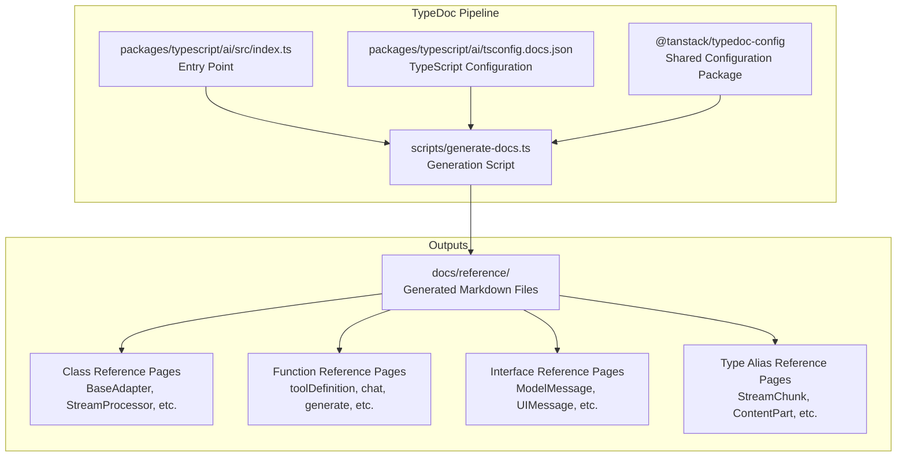
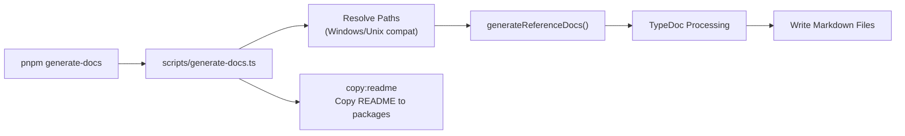
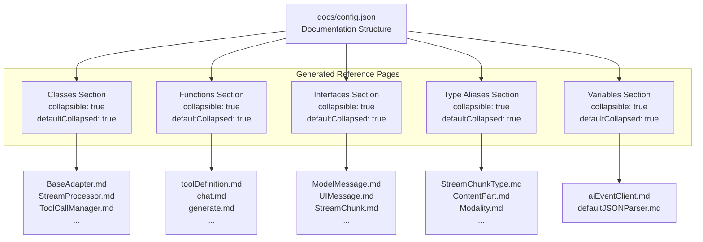
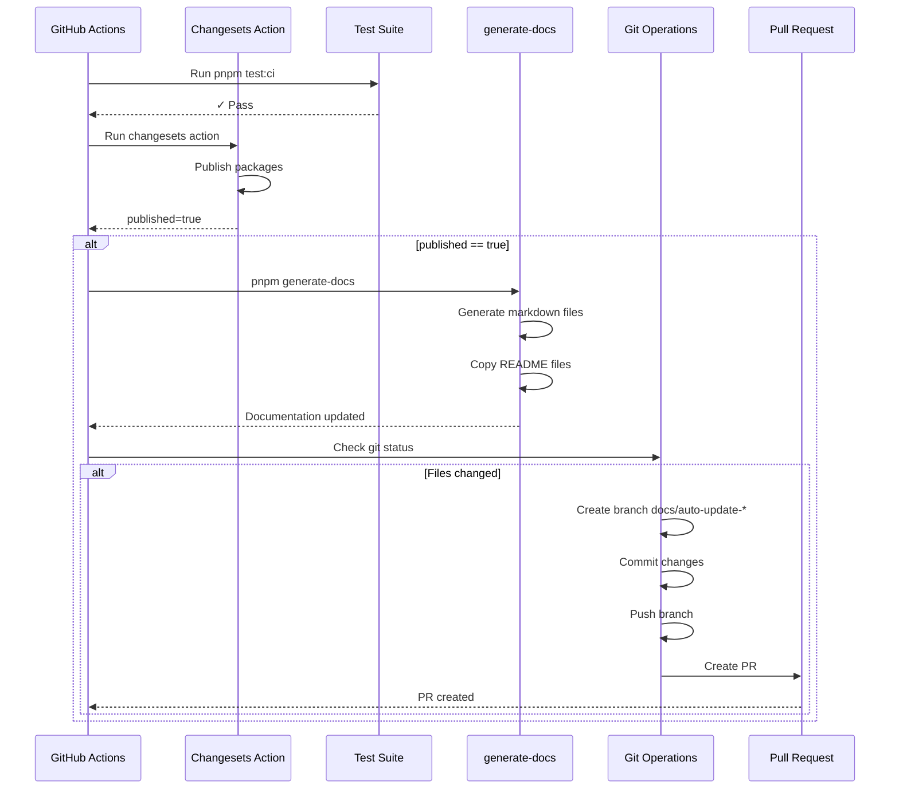
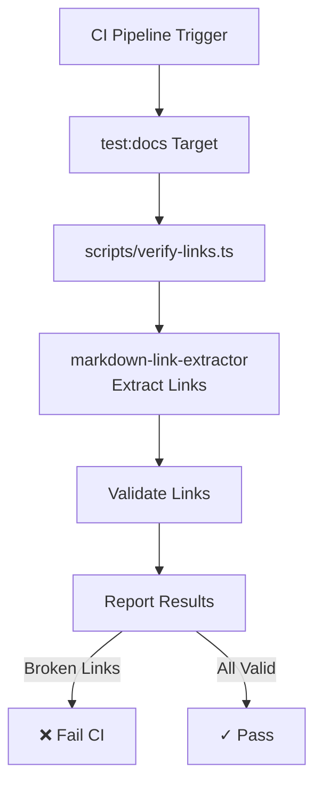
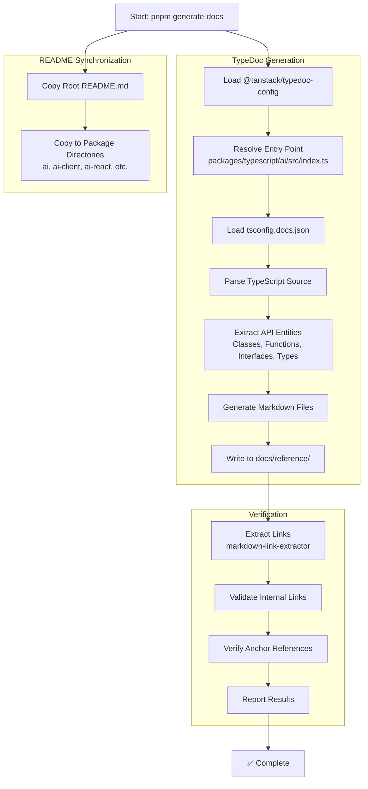

# Documentation Generation

<details>
<summary>Relevant source files</summary>

The following files were used as context for generating this wiki page:

- [.github/workflows/autofix.yml](.github/workflows/autofix.yml)
- [.github/workflows/release.yml](.github/workflows/release.yml)
- [docs/community-adapters/decart.md](docs/community-adapters/decart.md)
- [docs/community-adapters/guide.md](docs/community-adapters/guide.md)
- [docs/config.json](docs/config.json)
- [docs/guides/structured-outputs.md](docs/guides/structured-outputs.md)
- [nx.json](nx.json)
- [package.json](package.json)
- [packages/typescript/ai-solid/tsdown.config.ts](packages/typescript/ai-solid/tsdown.config.ts)
- [pnpm-lock.yaml](pnpm-lock.yaml)
- [scripts/generate-docs.ts](scripts/generate-docs.ts)

</details>

This page documents the automated API reference generation system in TanStack AI. This system uses TypeDoc to extract API documentation from TypeScript source code and generate markdown files for the documentation website.

For information about the CI/CD pipeline that triggers documentation generation, see [CI/CD and Release Process](#9.6). For documentation structure configuration, this page covers the `docs/config.json` file.

## Overview

TanStack AI uses TypeDoc to automatically generate API reference documentation from TypeScript source code. The documentation generation system:

- Extracts types, classes, functions, and interfaces from `@tanstack/ai` package
- Generates markdown files in the `docs/reference` directory
- Runs as part of the release workflow after package publication
- Maintains synchronization between code and documentation
- Verifies internal links to prevent broken references

## TypeDoc Configuration

The documentation generation system is built on `@tanstack/typedoc-config`, a shared TypeDoc configuration package used across TanStack projects.



**Sources:** [scripts/generate-docs.ts:1-37](), [pnpm-lock.yaml:26-28](), [package.json:34]()

## Generation Script

The `generate-docs` script is the entry point for documentation generation. It configures TypeDoc to process the core `@tanstack/ai` package and outputs markdown files.

### Package Configuration

[scripts/generate-docs.ts:8-30]() defines the package configuration:

| Property      | Value                                         | Purpose                                 |
| ------------- | --------------------------------------------- | --------------------------------------- |
| `name`        | `'ai'`                                        | Package identifier                      |
| `entryPoints` | `['packages/typescript/ai/src/index.ts']`     | Entry point for API extraction          |
| `tsconfig`    | `'packages/typescript/ai/tsconfig.docs.json'` | TypeScript compilation settings         |
| `outputDir`   | `'docs/reference'`                            | Output directory for markdown           |
| `exclude`     | `['**/*.spec.ts', '**/*.test.ts', ...]`       | Excludes test files and build artifacts |

The script uses `generateReferenceDocs()` from `@tanstack/typedoc-config` to process the package configuration and generate documentation.



**Sources:** [scripts/generate-docs.ts:1-37](), [package.json:34-36]()

## Documentation Structure

The generated documentation follows a hierarchical structure defined in `docs/config.json`. This configuration file defines the navigation structure for the documentation website.

### Reference Documentation Sections

[docs/config.json:167-596]() defines collapsible sections for different API entity types:

| Section               | Count | Example Entries                                                    |
| --------------------- | ----- | ------------------------------------------------------------------ |
| Class References      | 9     | `BaseAdapter`, `StreamProcessor`, `ToolCallManager`                |
| Function References   | 24    | `toolDefinition`, `chat`, `generate`, `toServerSentEventsResponse` |
| Interface References  | 55    | `ModelMessage`, `UIMessage`, `StreamChunk`, `Tool`                 |
| Type Alias References | 18    | `StreamChunkType`, `ContentPart`, `Modality`                       |
| Variable References   | 2     | `aiEventClient`, `defaultJSONParser`                               |

Each entry in the documentation structure maps to a generated markdown file in `docs/reference/`.



**Sources:** [docs/config.json:167-596](), [scripts/generate-docs.ts:21]()

## CI/CD Integration

Documentation generation is integrated into the release workflow and runs automatically after successful package publication.

### Release Workflow Integration

[.github/workflows/release.yml:43-60]() defines the documentation generation steps:

1. **Conditional Execution**: Documentation generation only runs if `steps.changesets.outputs.published == 'true'`
2. **Generation**: Executes `pnpm generate-docs` to create updated reference documentation
3. **Commit Detection**: Checks if any files changed with `git status --porcelain`
4. **Branch Creation**: Creates a timestamped branch: `docs/auto-update-{timestamp}`
5. **PR Creation**: Opens a pull request with title "docs: regenerate API documentation"

This ensures documentation stays synchronized with published package versions without blocking the release process.



**Sources:** [.github/workflows/release.yml:43-60](), [package.json:34]()

## Link Verification

The documentation system includes automated link verification to prevent broken internal references.

### verify-links Script

The `test:docs` script validates documentation links:

[package.json:28]()

```
"test:docs": "node scripts/verify-links.ts"
```

This script uses the `markdown-link-extractor` package [pnpm-lock.yaml:47-49]() to:

- Extract all markdown links from documentation files
- Verify internal links point to valid files
- Validate anchor references within documents
- Report broken links that need fixing

Link verification runs as part of the CI test suite [.github/workflows/release.yml:32]() and as an Nx target [nx.json:61-64]().



**Sources:** [package.json:28](), [pnpm-lock.yaml:47-49](), [nx.json:61-64]()

## README Synchronization

The documentation generation process includes copying the root README.md to all published packages.

### copy:readme Script

[package.json:36]() defines the README synchronization:

```bash
cp README.md packages/typescript/ai/README.md &&
cp README.md packages/typescript/ai-devtools/README.md &&
cp README.md packages/typescript/preact-ai-devtools/README.md &&
# ... copies to all packages
```

This ensures:

- Each npm package displays consistent README content
- Package pages on npmjs.com show unified branding
- Installation instructions are consistent across packages

The README copy operation runs as part of `generate-docs` [package.json:34](), ensuring documentation and READMEs are updated together.

| Target Package          | README Path                                 |
| ----------------------- | ------------------------------------------- |
| `@tanstack/ai`          | `packages/typescript/ai/README.md`          |
| `@tanstack/ai-devtools` | `packages/typescript/ai-devtools/README.md` |
| `@tanstack/ai-client`   | `packages/typescript/ai-client/README.md`   |
| `@tanstack/ai-react`    | `packages/typescript/ai-react/README.md`    |
| `@tanstack/ai-openai`   | `packages/typescript/ai-openai/README.md`   |
| `@tanstack/ai-gemini`   | `packages/typescript/ai-gemini/README.md`   |
| ...                     | ...                                         |

**Sources:** [package.json:34-36]()

## Nx Task Configuration

Documentation-related tasks are configured in Nx for caching and dependency management.

### test:docs Target

[nx.json:61-64]() defines the `test:docs` target:

```json
{
  "test:docs": {
    "cache": true,
    "inputs": ["{workspaceRoot}/docs/**/*"]
  }
}
```

This configuration:

- Enables caching of link verification results
- Tracks all files in the `docs/` directory as inputs
- Invalidates cache when any documentation file changes
- Allows parallel execution with other test targets

The target is included in the CI test suite via [package.json:19]():

```
"test:ci": "nx run-many --targets=test:sherif,test:knip,test:docs,test:eslint,test:lib,test:types,test:build,build"
```

**Sources:** [nx.json:61-64](), [package.json:18-19]()

## Generation Workflow

The complete documentation generation workflow combines multiple steps:



**Sources:** [scripts/generate-docs.ts:1-37](), [package.json:34-36](), [.github/workflows/release.yml:43-60]()

## NPM Scripts

The following npm scripts manage documentation generation:

| Script             | Command                                                 | Purpose                                 |
| ------------------ | ------------------------------------------------------- | --------------------------------------- |
| `generate-docs`    | `node scripts/generate-docs.ts && pnpm run copy:readme` | Generate API docs and copy README       |
| `sync-docs-config` | `node scripts/sync-docs-config.ts`                      | Synchronize documentation configuration |
| `copy:readme`      | `cp README.md packages/...`                             | Copy README to all packages             |
| `test:docs`        | `node scripts/verify-links.ts`                          | Verify documentation links              |

These scripts are invoked through:

- Manual execution: `pnpm generate-docs`
- CI pipeline: After successful release [.github/workflows/release.yml:45]()
- Test suite: `pnpm test:docs` in CI [.github/workflows/release.yml:32]()

**Sources:** [package.json:28-36](), [.github/workflows/release.yml:43-60]()
