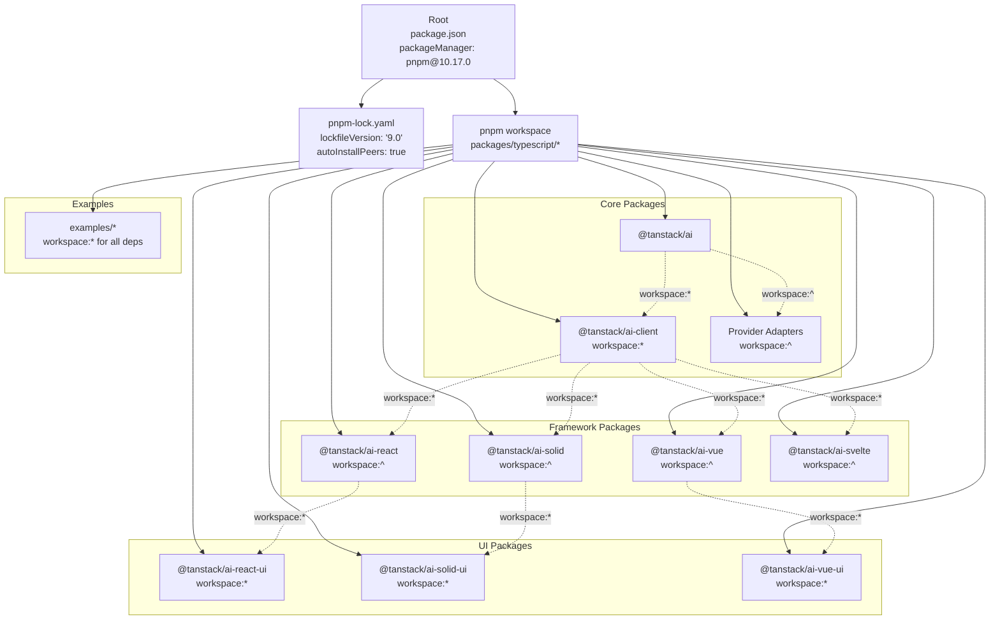
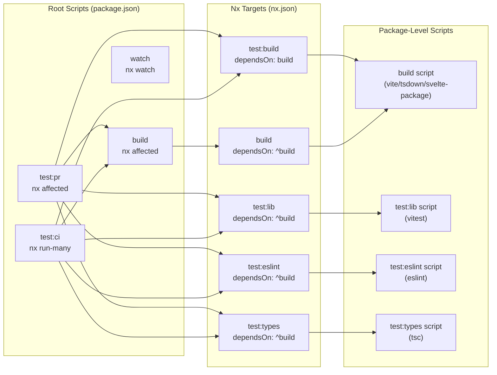
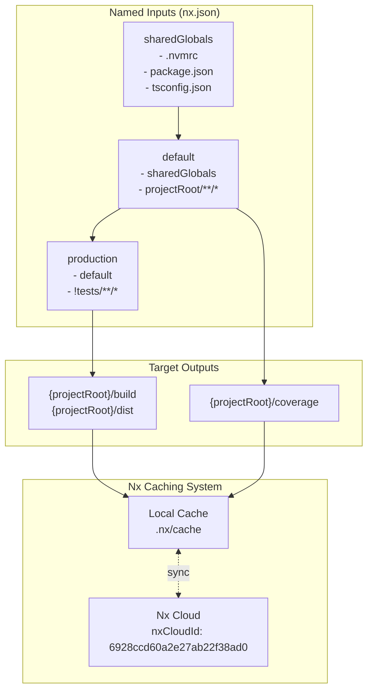
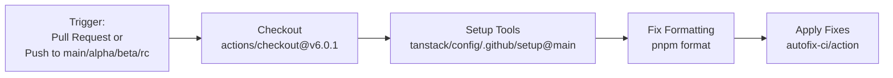
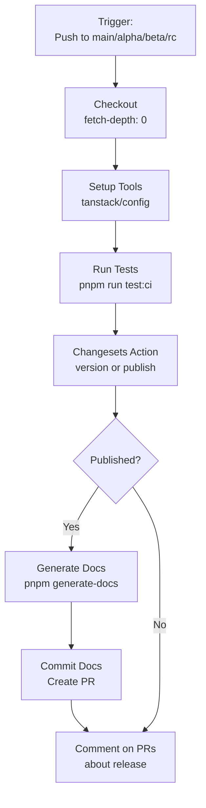
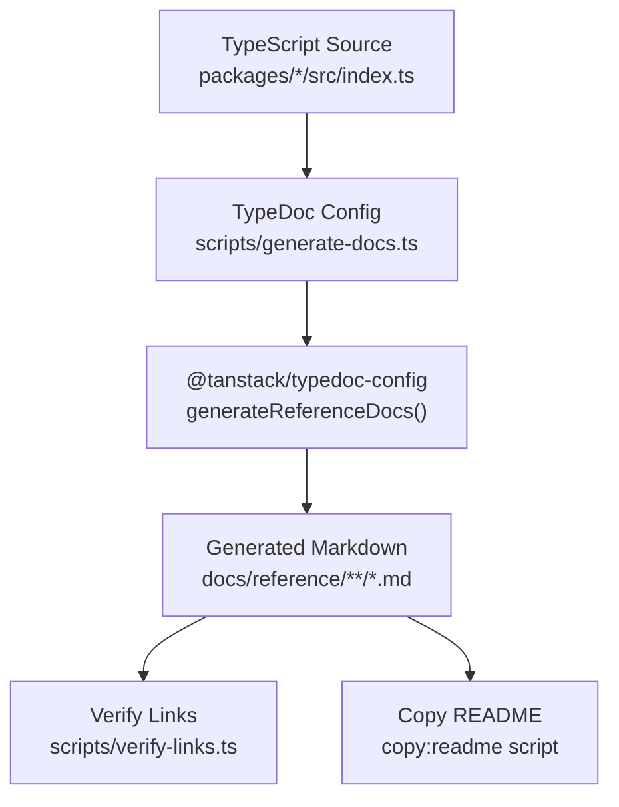

# Build System and Infrastructure

Relevant source files

The following files were used as context for generating this wiki page:

- [.github/workflows/autofix.yml](.github/workflows/autofix.yml)
- [.github/workflows/release.yml](.github/workflows/release.yml)
- [examples/ts-svelte-chat/CHANGELOG.md](examples/ts-svelte-chat/CHANGELOG.md)
- [examples/ts-svelte-chat/package.json](examples/ts-svelte-chat/package.json)
- [examples/ts-vue-chat/CHANGELOG.md](examples/ts-vue-chat/CHANGELOG.md)
- [examples/ts-vue-chat/package.json](examples/ts-vue-chat/package.json)
- [nx.json](nx.json)
- [package.json](package.json)
- [packages/typescript/ai-gemini/CHANGELOG.md](packages/typescript/ai-gemini/CHANGELOG.md)
- [packages/typescript/ai-openai/CHANGELOG.md](packages/typescript/ai-openai/CHANGELOG.md)
- [packages/typescript/ai-solid/tsdown.config.ts](packages/typescript/ai-solid/tsdown.config.ts)
- [packages/typescript/smoke-tests/adapters/CHANGELOG.md](packages/typescript/smoke-tests/adapters/CHANGELOG.md)
- [packages/typescript/smoke-tests/adapters/package.json](packages/typescript/smoke-tests/adapters/package.json)
- [packages/typescript/smoke-tests/e2e/CHANGELOG.md](packages/typescript/smoke-tests/e2e/CHANGELOG.md)
- [packages/typescript/smoke-tests/e2e/package.json](packages/typescript/smoke-tests/e2e/package.json)
- [pnpm-lock.yaml](pnpm-lock.yaml)
- [scripts/generate-docs.ts](scripts/generate-docs.ts)

This document provides an overview of the monorepo build infrastructure used by TanStack AI, including the key tooling choices (pnpm, Nx, Vite), how they integrate, and the overall build and release workflow. For detailed information about specific aspects, see:

- [Nx Configuration and Task Orchestration](#9.1)
- [Build Configuration](#9.2)
- [Testing Infrastructure](#9.3)
- [Code Quality Tools](#9.4)
- [Documentation Generation](#9.5)
- [CI/CD and Release Process](#9.6)

The build system is designed to provide fast, reliable builds with comprehensive caching, efficient task orchestration, and automated quality checks across all packages in the monorepo.

## Build System Architecture

TanStack AI uses a modern monorepo architecture built on three foundational technologies:

**pnpm Workspaces** manages package dependencies and provides workspace protocol support (`workspace:*`), ensuring all internal dependencies resolve to local versions during development while allowing semantic versioning for published packages.

**Nx** provides task orchestration, computational caching (local and distributed via Nx Cloud), and affected detection to run only necessary tasks when code changes. Nx is configured at [nx.json:1-74]() with targets defined for build, test, and quality checks. The system limits parallel task execution to 5 concurrent jobs at [nx.json:6]() to balance resource usage and throughput.

**Multiple Build Tools** are used based on package requirements:

- **Vite** for most TypeScript packages
- **tsdown** for Solid.js and Vue packages (supports JSX preservation)
- **@sveltejs/package** for Svelte packages

Sources: [package.json:1-72](), [nx.json:1-74](), [pnpm-lock.yaml:1-10]()

## Monorepo Structure and Package Manager

**Workspace Dependencies** use two protocols:

- `workspace:*` - Always uses the exact local version (for tightly coupled packages)
- `workspace:^` - Uses compatible semver range in published versions (for adapter packages)

The root `package.json` defines `packageManager: "pnpm@10.17.0"` at [package.json:8]() to ensure consistent package manager versions across all environments. The `pnpm-lock.yaml` uses lockfile version 9.0 with `autoInstallPeers: true` at [pnpm-lock.yaml:3-4]().

Sources: [package.json:1-72](), [pnpm-lock.yaml:1-10](), [pnpm-lock.yaml:98-100]()

## Task Orchestration and Scripts

The build system uses a hierarchical script structure. Root-level scripts in `package.json` invoke Nx commands, which orchestrate package-level targets with dependency management and caching.

**Key Root Scripts:**

- `test:pr` - Runs all affected targets for pull request validation at [package.json:18]()
- `test:ci` - Runs all targets for continuous integration at [package.json:19]()
- `build` - Builds affected packages with caching at [package.json:29]()
- `build:all` - Builds all packages without affected detection at [package.json:30]()
- `watch` - Watches for changes and rebuilds at [package.json:31]()

**Nx Target Dependencies:**
All test targets depend on `^build` (upstream builds must complete first), ensuring packages are built before testing. The `test:build` target depends on `build` (same package) to validate that built artifacts are correct. These dependencies are defined at [nx.json:28-54]().

Sources: [package.json:15-39](), [nx.json:27-60]()

## Build Configuration by Package Type

Different package types use specialized build tools optimized for their requirements:

| Package Type    | Build Tool        | Configuration           | Output                 |
| --------------- | ----------------- | ----------------------- | ---------------------- |
| Core TypeScript | Vite              | `@tanstack/vite-config` | ESM/CJS, types         |
| Solid.js        | tsdown            | `tsdown.config.ts`      | ESM, unbundled JSX     |
| Vue             | tsdown            | `tsdown.config.ts`      | ESM, unbundled JSX     |
| Svelte          | @sveltejs/package | SvelteKit adapter       | ESM, Svelte components |
| React           | Vite              | `@tanstack/vite-config` | ESM/CJS, types         |

**Vite Configuration** - Most packages use `@tanstack/vite-config` version 0.4.1 as specified at [package.json:29-31](). This provides standardized build configuration for:

- ESM and CJS output formats
- TypeScript declaration generation
- Source maps
- Tree-shaking optimization

**tsdown Configuration** - Solid and Vue packages use tsdown version 0.17.x. Example configuration at [packages/typescript/ai-solid/tsdown.config.ts:1-15]() shows:

- `entry: ['./src/index.ts']` - Single entry point at [packages/typescript/ai-solid/tsdown.config.ts:4]()
- `format: ['esm']` - ESM output only at [packages/typescript/ai-solid/tsdown.config.ts:5]()
- `unbundle: true` - Preserves JSX for framework compilers at [packages/typescript/ai-solid/tsdown.config.ts:6]()
- `dts: true` - Generates type declarations at [packages/typescript/ai-solid/tsdown.config.ts:7]()
- `sourcemap: true` - Generates source maps at [packages/typescript/ai-solid/tsdown.config.ts:8]()
- `clean: true` - Cleans output directory before build at [packages/typescript/ai-solid/tsdown.config.ts:9]()
- `minify: false` - No minification (for development) at [packages/typescript/ai-solid/tsdown.config.ts:10]()
- `fixedExtension: false` - Uses Node.js module resolution at [packages/typescript/ai-solid/tsdown.config.ts:11]()
- `publint: { strict: true }` - Validates package exports at [packages/typescript/ai-solid/tsdown.config.ts:12-14]()

**Svelte Package** - Svelte integration uses `@sveltejs/package` for SvelteKit-compatible packaging at [pnpm-lock.yaml:884-886]().

Sources: [package.json:29-31](), [packages/typescript/ai-solid/tsdown.config.ts:1-15](), [pnpm-lock.yaml:869-871](), [pnpm-lock.yaml:919-921]()

## Caching Strategy

Nx provides two-tier caching:

**Local Cache** stores task outputs in `.nx/cache` directory. Each task's cache key is computed from its inputs (source files, dependencies, configuration). When inputs match a previous run, Nx restores outputs from cache instead of re-executing.

**Distributed Cache** via Nx Cloud (ID: `6928ccd60a2e27ab22f38ad0` at [nx.json:4]()) shares cache across CI runs and developers. This is enabled via `NX_CLOUD_ACCESS_TOKEN` environment variable in GitHub Actions at [.github/workflows/release.yml:12]().

**Named Inputs** define what affects cache invalidation:

- `sharedGlobals` - Root-level files that affect all projects at [nx.json:11-15]()
- `default` - Includes shared globals and all project files at [nx.json:16-20]()
- `production` - Excludes tests and configuration at [nx.json:21-26]()

**Cache Configuration per Target:**

- `build` - Caches to `{projectRoot}/build` and `{projectRoot}/dist` at [nx.json:59]()
- `test:lib` - Caches to `{projectRoot}/coverage` at [nx.json:32]()
- All test and build targets have `cache: true` enabled

Sources: [nx.json:1-74](), [.github/workflows/release.yml:11-12]()

## Development Dependencies and Tools

The root `package.json` defines shared development dependencies used across all packages:

**Build and Bundling:**

- `vite`: ^7.2.7 - Build tool at [package.json:69]()
- `@tanstack/vite-config`: 0.4.1 - Shared Vite configuration at [package.json:54]()
- `typescript`: 5.9.3 - TypeScript compiler at [package.json:68]()

**Task Orchestration:**

- `nx`: 22.1.2 - Monorepo task runner at [package.json:61]()

**Testing:**

- `vitest`: ^4.0.14 - Test runner at [package.json:70]()
- `happy-dom`: ^20.0.10 - DOM implementation for tests at [package.json:58]()

**Code Quality:**

- `eslint`: ^9.39.1 - JavaScript/TypeScript linter at [package.json:56]()
- `prettier`: ^3.7.4 - Code formatter at [package.json:63]()
- `publint`: ^0.3.15 - Package validation at [package.json:65]()
- `sherif`: ^1.9.0 - Dependency consistency checker at [package.json:66]()
- `knip`: ^5.70.2 - Unused dependency detector at [package.json:59]()

**Release Management:**

- `@changesets/cli`: ^2.29.8 - Version and changelog management at [package.json:49]()

**Documentation:**

- `@tanstack/typedoc-config`: 0.3.1 - API documentation generation at [package.json:53]()

Sources: [package.json:48-71]()

## Quality Check Pipeline

```mermaid
graph TB
    subgraph "test:ci / test:pr"
        SHERIF["test:sherif<br/>sherif"]
        KNIP["test:knip<br/>knip"]
        DOCS["test:docs<br/>verify-links.ts"]
        ESLINT["test:eslint<br/>nx affected"]
        LIB["test:lib<br/>nx affected"]
        TYPES["test:types<br/>nx affected"]
        BUILD["test:build<br/>nx affected"]
        FINAL_BUILD["build<br/>nx affected"]
    end

    subgraph "Sherif Checks"
        SHERIF_DEPS["Dependency consistency<br/>across workspaces"]
    end

    subgraph "Knip Checks"
        KNIP_UNUSED["Unused dependencies<br/>and exports"]
    end

    subgraph "Doc Checks"
        DOCS_LINKS["Broken markdown links<br/>in docs/"]
    end

    subgraph "Package Checks"
        ESLINT_PKG["ESLint per package<br/>excludes examples"]
        LIB_PKG["Vitest per package<br/>excludes examples"]
        TYPES_PKG["tsc per package<br/>excludes examples"]
        BUILD_PKG["publint per package<br/>excludes examples"]
    end

    SHERIF --> SHERIF_DEPS
    KNIP --> KNIP_UNUSED
    DOCS --> DOCS_LINKS

    ESLINT --> ESLINT_PKG
    LIB --> LIB_PKG
    TYPES --> TYPES_PKG
    BUILD --> BUILD_PKG

    SHERIF_DEPS --> FINAL_BUILD
    KNIP_UNUSED --> FINAL_BUILD
    DOCS_LINKS --> FINAL_BUILD
    ESLINT_PKG --> FINAL_BUILD
    LIB_PKG --> FINAL_BUILD
    TYPES_PKG --> FINAL_BUILD
    BUILD_PKG --> FINAL_BUILD
```

The quality check pipeline runs in both CI and PR contexts. The `test:pr` script at [package.json:18]() uses `nx affected` to run only checks for packages affected by changes, while `test:ci` at [package.json:19]() uses `nx run-many` to check all packages.

**Workspace-Level Checks:**

- `test:sherif` - Validates dependency version consistency across all `package.json` files using `sherif` at [package.json:21]()
- `test:knip` - Detects unused dependencies and exports using `knip` at [package.json:27]()
- `test:docs` - Verifies markdown links in documentation at [package.json:28]()

**Package-Level Checks:**

- `test:eslint` - Runs ESLint, excludes examples at [package.json:20]()
- `test:lib` - Runs Vitest unit tests, excludes examples at [package.json:22]()
- `test:types` - Type-checks with TypeScript compiler at [package.json:26]()
- `test:build` - Validates built artifacts with publint at [package.json:25]()

All package-level checks exclude `examples/**` to focus on library code quality. The Nx configuration at [nx.json:27-73]() defines these targets with appropriate caching and dependency management.

Sources: [package.json:15-29](), [nx.json:27-73]()

## CI/CD Workflows

Two GitHub Actions workflows automate code quality and releases:

### Autofix Workflow

The autofix workflow at [.github/workflows/autofix.yml:1-30]() automatically formats code using Prettier:

- Triggers on pull requests and pushes to release branches at [.github/workflows/autofix.yml:3-6]()
- Runs `pnpm format` which executes Prettier at [.github/workflows/autofix.yml:25]()
- Auto-commits fixes using `autofix-ci/action` at [.github/workflows/autofix.yml:27]()

### Release Workflow

The release workflow at [.github/workflows/release.yml:1-65]() handles versioning and publishing:

1. **Test Phase** - Runs full test suite with `pnpm run test:ci` at [.github/workflows/release.yml:32]()

2. **Version/Publish Phase** - Uses Changesets action at [.github/workflows/release.yml:33-42]() to:
   - Run `pnpm run changeset:version` to update package versions and CHANGELOG files
   - Run `pnpm run changeset:publish` to publish to npm with provenance
   - Create "ci: Version Packages" PR if unpublished changesets exist
   - Output `published` flag for conditional steps

3. **Documentation Phase** - If packages were published at [.github/workflows/release.yml:43-60]():
   - Generates API docs with `pnpm generate-docs` using TypeDoc at [.github/workflows/release.yml:45]()
   - Creates PR with regenerated documentation at [.github/workflows/release.yml:46-58]()

4. **Notification Phase** - Comments on related PRs about the release at [.github/workflows/release.yml:61-64]()

The workflow uses Nx Cloud token for distributed caching at [.github/workflows/release.yml:12]() and requires write permissions for contents, id-token (npm provenance), and pull-requests at [.github/workflows/release.yml:14-17]().

Sources: [.github/workflows/autofix.yml:1-30](), [.github/workflows/release.yml:1-65]()

## Version Management with Changesets

The project uses Changesets for semantic versioning and changelog generation:

**Changeset Scripts:**

- `changeset` - CLI for creating changesets at [package.json:37]()
- `changeset:version` - Updates versions and regenerates CHANGELOGs at [package.json:39]()
- `changeset:publish` - Publishes packages to npm at [package.json:38]()

The `changeset:version` script at [package.json:39]() runs:

1. `changeset version` - Consumes changesets and updates package.json files
2. `pnpm install --no-frozen-lockfile` - Updates lockfile with new versions
3. `pnpm format` - Formats updated files

The changelog format is configured to use `@svitejs/changesets-changelog-github-compact` at [package.json:51]() for concise GitHub-integrated changelogs.

Sources: [package.json:37-39](), [package.json:51]()

## Documentation Generation

Documentation generation uses TypeDoc with a custom configuration:

**Generation Script** at [scripts/generate-docs.ts:1-36]() defines:

- Package entry points (e.g., `packages/typescript/ai/src/index.ts` at line 11-15)
- TSConfig paths (e.g., `packages/typescript/ai/tsconfig.docs.json` at line 17-20)
- Output directory (`docs/reference` at line 21)
- Exclusions for test files and build artifacts at [scripts/generate-docs.ts:22-28]()

**Package Configuration** uses `@tanstack/typedoc-config` version 0.3.1 at [package.json:53]() which provides:

- Standardized TypeDoc settings
- `generateReferenceDocs()` function at [scripts/generate-docs.ts:32]()
- Markdown output format

**Verification** - The `test:docs` script at [package.json:28]() runs `scripts/verify-links.ts` to check for broken links in generated documentation. This is cached by Nx based on `{workspaceRoot}/docs/**/*` inputs at [nx.json:61-63]().

**README Distribution** - The `copy:readme` script at [package.json:36]() copies the root README.md to all published packages, ensuring consistent documentation across npm packages.

The full generation pipeline runs via `generate-docs` script at [package.json:34]() which calls both generation and README copying.

Sources: [scripts/generate-docs.ts:1-36](), [package.json:28](), [package.json:34-36](), [nx.json:61-63]()
