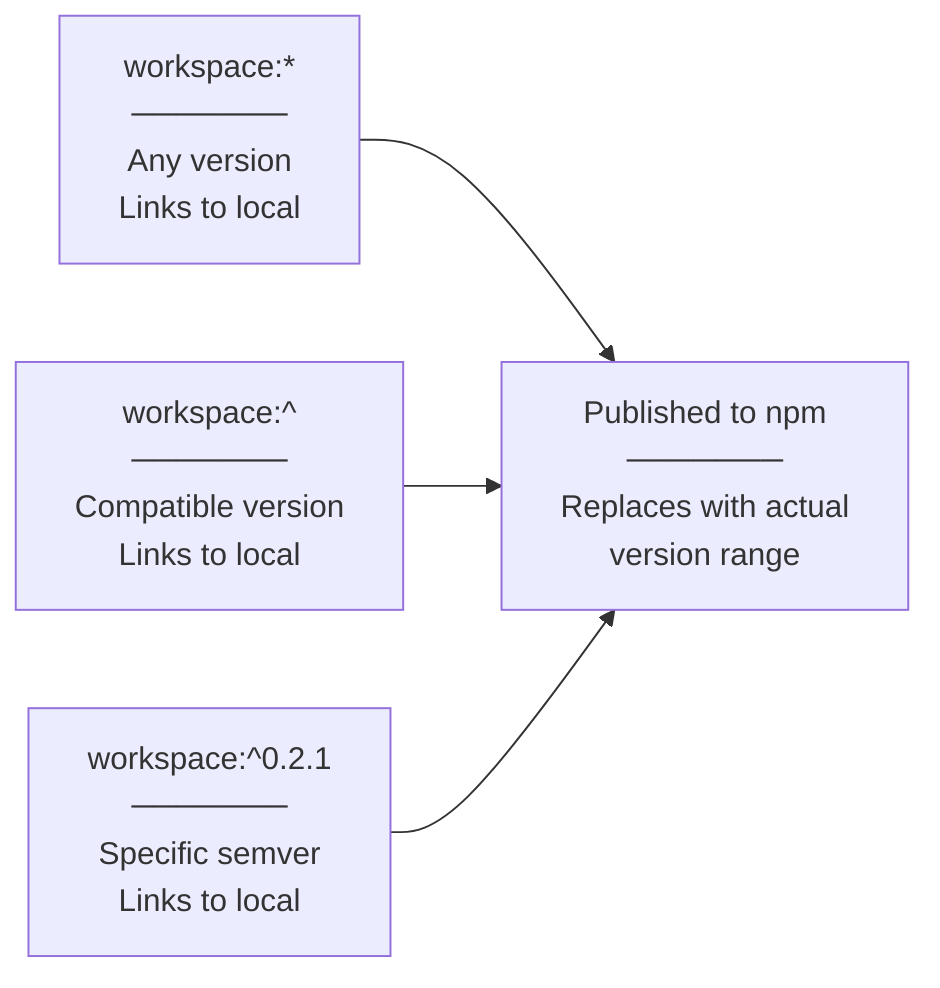
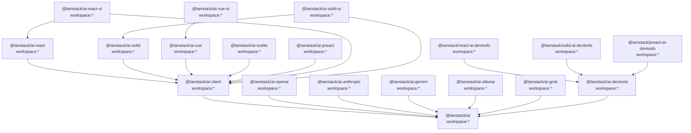
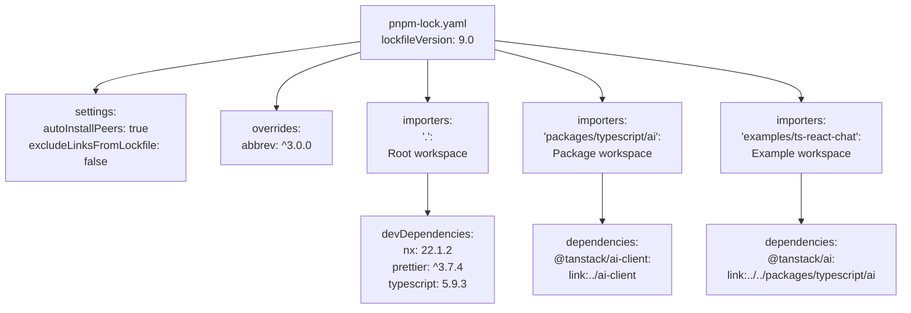
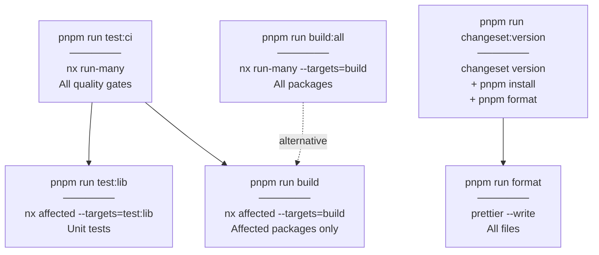

# Monorepo Configuration

<details>
<summary>Relevant source files</summary>

The following files were used as context for generating this wiki page:

- [.github/workflows/autofix.yml](.github/workflows/autofix.yml)
- [.github/workflows/release.yml](.github/workflows/release.yml)
- [nx.json](nx.json)
- [package.json](package.json)
- [packages/typescript/ai-anthropic/package.json](packages/typescript/ai-anthropic/package.json)
- [packages/typescript/ai-gemini/package.json](packages/typescript/ai-gemini/package.json)
- [packages/typescript/ai-ollama/package.json](packages/typescript/ai-ollama/package.json)
- [packages/typescript/ai-openai/package.json](packages/typescript/ai-openai/package.json)
- [packages/typescript/ai-react-ui/package.json](packages/typescript/ai-react-ui/package.json)
- [packages/typescript/ai-react/package.json](packages/typescript/ai-react/package.json)
- [packages/typescript/ai-solid-ui/package.json](packages/typescript/ai-solid-ui/package.json)
- [packages/typescript/ai-solid/package.json](packages/typescript/ai-solid/package.json)
- [packages/typescript/ai-solid/tsdown.config.ts](packages/typescript/ai-solid/tsdown.config.ts)
- [packages/typescript/ai-svelte/package.json](packages/typescript/ai-svelte/package.json)
- [packages/typescript/ai-vue-ui/package.json](packages/typescript/ai-vue-ui/package.json)
- [packages/typescript/ai-vue/package.json](packages/typescript/ai-vue/package.json)
- [pnpm-lock.yaml](pnpm-lock.yaml)
- [scripts/generate-docs.ts](scripts/generate-docs.ts)

</details>

This document describes the monorepo's package management configuration using pnpm workspaces. It covers the workspace protocol syntax, package linking patterns, and dependency management strategies across all packages in the repository.

For information about build orchestration and task dependencies, see [Nx Configuration and Task Orchestration](#9.2). For details on CI/CD workflows, see [CI/CD and Release Process](#9.6).

## Package Manager Selection

TanStack AI uses **pnpm** version 10.17.0 as its package manager, specified via the `packageManager` field in [package.json:8](). pnpm provides efficient disk space usage through content-addressable storage and strict dependency resolution, which prevents phantom dependencies that can occur with npm or yarn.

The root configuration enables auto-installation of peer dependencies and includes workspace links in the lockfile:

```yaml
settings:
  autoInstallPeers: true
  excludeLinksFromLockfile: false
```

Sources: [pnpm-lock.yaml:3-5](), [package.json:8]()

## Workspace Protocol

The monorepo uses the **workspace protocol** (`workspace:*`, `workspace:^`) to declare internal dependencies between packages. This protocol instructs pnpm to link local packages instead of fetching them from npm during development, while ensuring the correct version ranges are published to npm.

### Protocol Variants



**Sources:** [package.json files across packages]()

| Protocol      | Meaning                      | Published As                  | Usage Pattern                         |
| ------------- | ---------------------------- | ----------------------------- | ------------------------------------- |
| `workspace:*` | Link any local version       | Exact version (e.g., `0.2.1`) | Core packages depending on each other |
| `workspace:^` | Link with compatible version | Semver range (e.g., `^0.2.1`) | Peer dependencies, adapter packages   |

The distinction matters during publishing: `workspace:*` becomes an exact version pin, while `workspace:^` becomes a semver-compatible range.

**Sources:** [packages/typescript/ai-client/package.json:637-639](), [packages/typescript/ai-grok/package.json:700-702]()

## Package Dependency Graph

The workspace protocol creates a directed acyclic graph of dependencies between packages. Core packages serve as dependency roots, with framework integrations and adapters building on top of them.



**Sources:** [packages/typescript/ai-client/package.json:637-639](), [packages/typescript/ai-react/package.json:43-44](), [packages/typescript/ai-openai/package.json:42-47](), [packages/typescript/ai-react-ui/package.json:48-52]()

### Core Dependencies

Core packages use `workspace:*` to ensure exact version linking during development:

- **@tanstack/ai-client** depends on `@tanstack/ai` with `workspace:*`
- Framework integrations (**@tanstack/ai-react**, **@tanstack/ai-solid**, **@tanstack/ai-vue**, **@tanstack/ai-svelte**, **@tanstack/ai-preact**) all depend on `@tanstack/ai-client` with `workspace:*`

**Sources:** [packages/typescript/ai-client/package.json:637-639](), [packages/typescript/ai-react/package.json:43-44]()

### Peer Dependencies

Adapter packages and UI libraries use `workspace:^` for peer dependencies to express version compatibility:

```json
"peerDependencies": {
  "@tanstack/ai": "workspace:^"
}
```

This pattern appears in:

- All provider adapters: `@tanstack/ai-openai`, `@tanstack/ai-anthropic`, `@tanstack/ai-gemini`, `@tanstack/ai-ollama`, `@tanstack/ai-grok`
- UI component libraries: `@tanstack/ai-react-ui`, `@tanstack/ai-solid-ui`, `@tanstack/ai-vue-ui`

**Sources:** [packages/typescript/ai-openai/package.json:45-47](), [packages/typescript/ai-react-ui/package.json:48-52](), [packages/typescript/ai-solid-ui/package.json:50-53]()

## Lockfile Structure

The `pnpm-lock.yaml` file maintains a snapshot of the entire dependency tree. It uses a structured format with importers for each workspace package.



**Sources:** [pnpm-lock.yaml:1-10]()

### Importer Structure

Each workspace package is represented as an importer in the lockfile. The structure follows this pattern:

```yaml
importers:
  packages/typescript/ai-react:
    dependencies:
      '@tanstack/ai-client':
        specifier: workspace:*
        version: link:../ai-client
```

The `specifier` preserves the workspace protocol from `package.json`, while `version` shows the actual resolution (a symbolic link to the local package).

**Sources:** [pnpm-lock.yaml:777-781]()

### Example Application Linking

Example applications also use the workspace protocol to consume local packages:

```yaml
examples/ts-react-chat:
  dependencies:
    '@tanstack/ai':
      specifier: workspace:*
      version: link:../../packages/typescript/ai
    '@tanstack/ai-anthropic':
      specifier: workspace:*
      version: link:../../packages/typescript/ai-anthropic
```

This ensures example applications always test against the current local development version rather than published npm versions.

**Sources:** [pnpm-lock.yaml:192-197]()

## Dependency Management Patterns

### Direct vs. Peer Dependencies

The monorepo follows a clear pattern for when to use direct dependencies vs. peer dependencies:

| Dependency Type                          | Usage                                     | Example                                                      |
| ---------------------------------------- | ----------------------------------------- | ------------------------------------------------------------ |
| **Direct dependency** with `workspace:*` | Package needs functionality at runtime    | `@tanstack/ai-react` depends on `@tanstack/ai-client`        |
| **Peer dependency** with `workspace:^`   | Package extends/adapts core functionality | `@tanstack/ai-openai` peer-depends on `@tanstack/ai`         |
| **Dev dependency** with `workspace:*`    | Package needs types/testing utilities     | `@tanstack/ai-react` dev-depends on `@tanstack/ai` for types |

**Sources:** [packages/typescript/ai-react/package.json:43-52](), [packages/typescript/ai-openai/package.json:45-50]()

### Version Overrides

The root `package.json` specifies pnpm overrides for security fixes or compatibility:

```json
"pnpm": {
  "overrides": {
    "abbrev": "^3.0.0"
  }
}
```

This forces all transitive dependencies to use at least version 3.0.0 of the `abbrev` package, overriding whatever version individual packages might request.

**Sources:** [package.json:10-14](), [pnpm-lock.yaml:7-8]()

## Monorepo Root Scripts

The root `package.json` defines workspace-wide scripts that operate across multiple packages:



**Sources:** [package.json:15-40]()

### Nx Integration

Root scripts delegate to Nx for parallel execution and caching. The `--exclude=examples/**` flag prevents example applications from being included in quality gates:

```bash
pnpm test:lib       # nx affected --targets=test:lib --exclude=examples/**
pnpm test:eslint    # nx affected --target=test:eslint --exclude=examples/**
pnpm test:build     # nx affected --target=test:build --exclude=examples/**
```

**Sources:** [package.json:20-26]()

### Workspace Scripts vs. Package Scripts

Scripts in the root `package.json` orchestrate tasks across the workspace, while individual package `package.json` files define package-specific tasks:

**Root-level scripts:**

- `test:ci` - Run all quality checks across workspace
- `build:all` - Build all packages
- `generate-docs` - Generate API documentation
- `changeset:version` - Bump package versions

**Package-level scripts** (e.g., in [packages/typescript/ai-react/package.json:25-33]()):

- `clean` - Remove build artifacts
- `test:lib` - Run unit tests
- `build` - Build the package
- `test:types` - Type-check the package

**Sources:** [package.json:15-40](), [packages/typescript/ai-react/package.json:25-33]()

## Special Build Configurations

Some packages use alternative build tools instead of the standard Vite configuration:

### Solid Package Build

`@tanstack/ai-solid` uses **tsdown** for building to preserve Solid.js reactivity. The configuration is defined in [packages/typescript/ai-solid/tsdown.config.ts:1-15]():

```typescript
export default defineConfig({
  entry: ['./src/index.ts'],
  format: ['esm'],
  unbundle: true, // Preserve individual module files
  dts: true, // Generate .d.ts files
  sourcemap: true,
  clean: true,
  minify: false,
  fixedExtension: false,
  publint: {
    strict: true,
  },
})
```

The `unbundle: true` option is critical for Solid.js, as bundling can interfere with its fine-grained reactivity system.

**Sources:** [packages/typescript/ai-solid/package.json:26-31](), [packages/typescript/ai-solid/tsdown.config.ts:1-15]()

### Svelte Package Build

`@tanstack/ai-svelte` uses **svelte-package** to properly compile Svelte components:

```json
"scripts": {
  "build": "svelte-package -i src -o dist"
}
```

This tool ensures Svelte-specific directives and component exports are correctly processed.

**Sources:** [packages/typescript/ai-svelte/package.json:35]()

## Nx Integration Points

The root `package.json` declares certain scripts as Nx-aware via the `nx` configuration block:

```json
"nx": {
  "includedScripts": [
    "test:docs",
    "test:knip",
    "test:sherif"
  ]
}
```

This tells Nx that these scripts exist at the root level and should be tracked for caching and affected detection. For full Nx configuration details, see [Nx Configuration and Task Orchestration](#9.2).

**Sources:** [package.json:41-47]()
