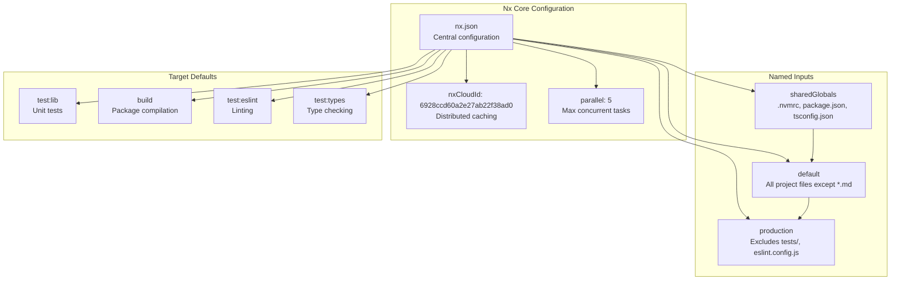
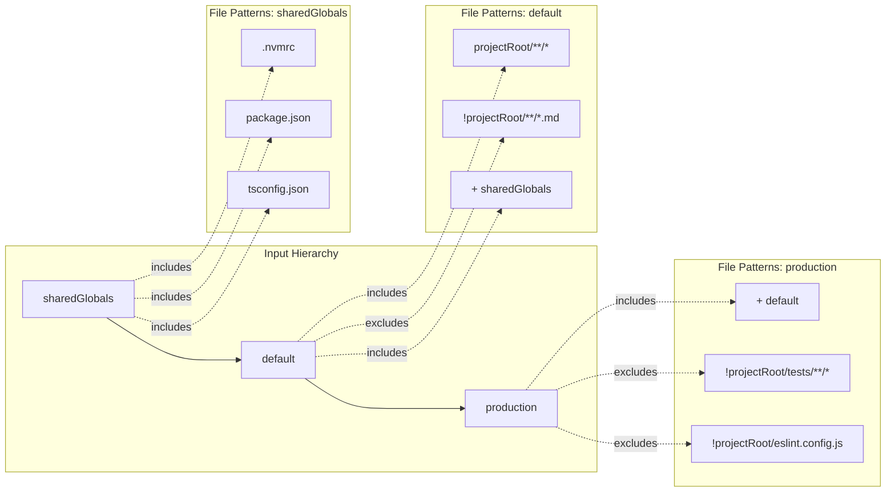
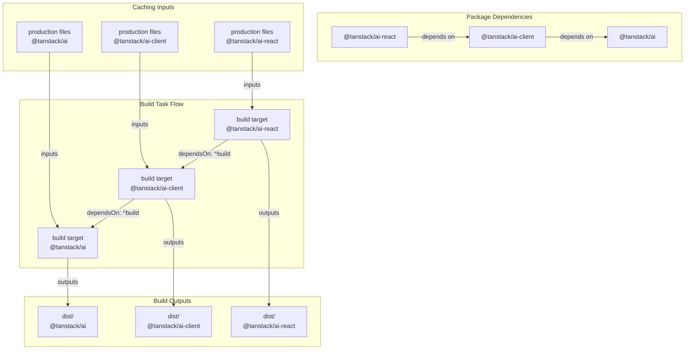
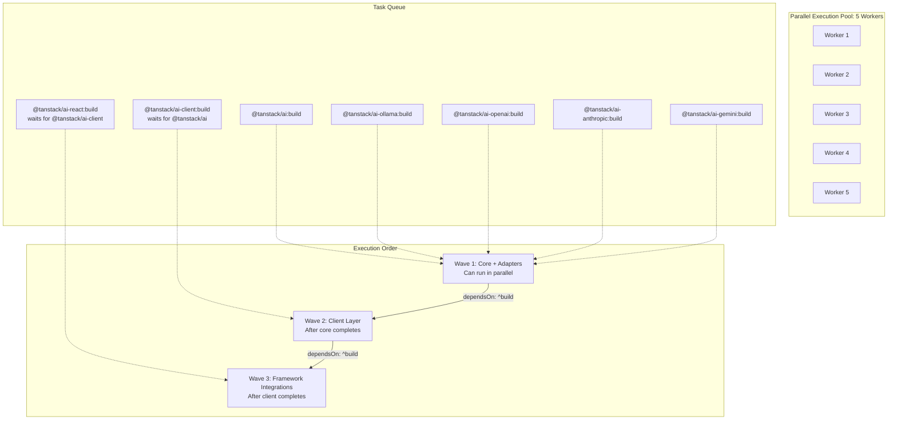
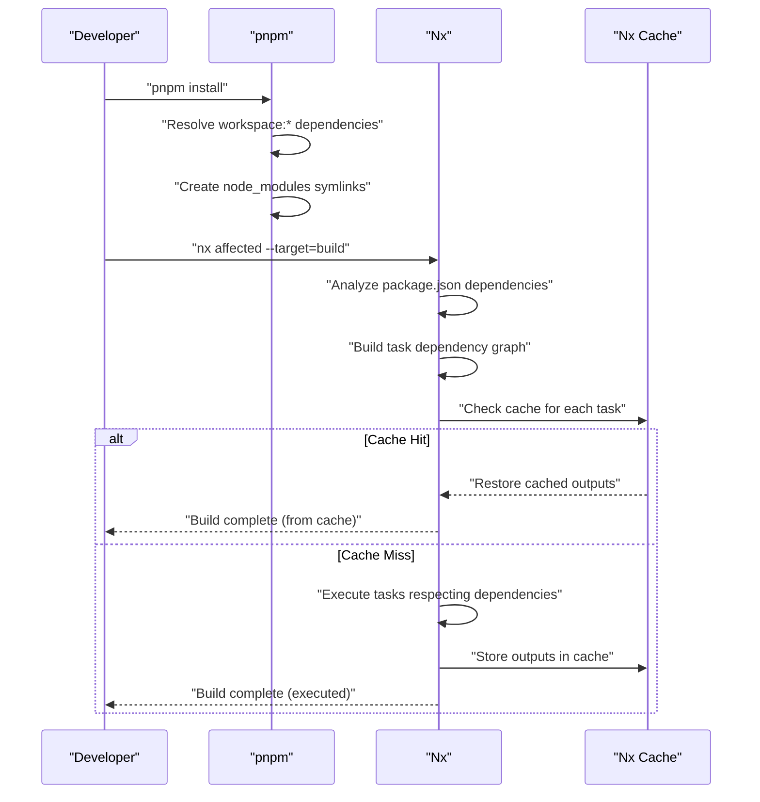
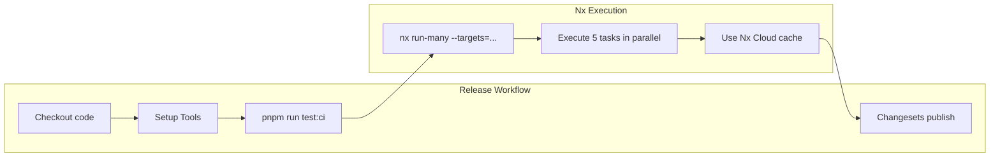
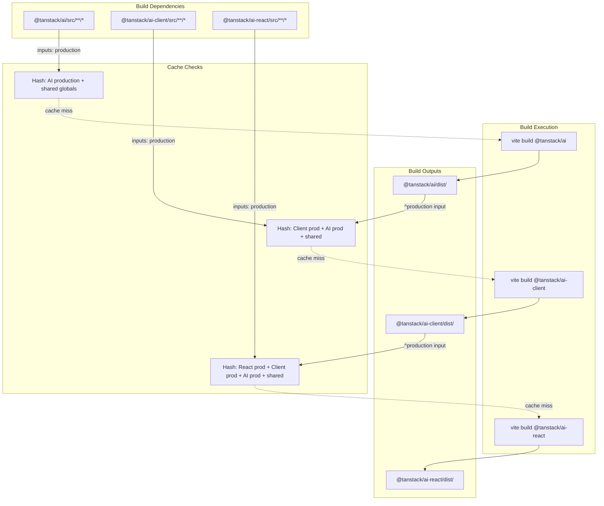

# Nx Configuration and Task Orchestration

<details>
<summary>Relevant source files</summary>

The following files were used as context for generating this wiki page:

- [.github/workflows/autofix.yml](.github/workflows/autofix.yml)
- [.github/workflows/release.yml](.github/workflows/release.yml)
- [nx.json](nx.json)
- [package.json](package.json)
- [packages/typescript/ai-solid/tsdown.config.ts](packages/typescript/ai-solid/tsdown.config.ts)
- [pnpm-lock.yaml](pnpm-lock.yaml)
- [scripts/generate-docs.ts](scripts/generate-docs.ts)

</details>

## Purpose and Scope

This document describes the Nx task orchestration system used in the TanStack AI monorepo. Nx manages task execution, dependency resolution, distributed caching, and parallel execution across the 40+ packages in the workspace. For general monorepo configuration including pnpm workspace setup, see [Monorepo Configuration](#9.1). For CI/CD pipeline implementation, see [CI/CD and Release Process](#9.6).

## Nx Configuration Structure

The Nx configuration is defined in [nx.json:1-74]() at the repository root. Nx is configured to work alongside pnpm workspaces, providing task orchestration without replacing package management.



**Sources:** [nx.json:1-74]()

### Key Configuration Properties

| Property              | Value                        | Purpose                                                              |
| --------------------- | ---------------------------- | -------------------------------------------------------------------- |
| `defaultBase`         | `"main"`                     | Base branch for affected command comparisons                         |
| `nxCloudId`           | `"6928ccd60a2e27ab22f38ad0"` | Nx Cloud workspace identifier for distributed caching                |
| `useInferencePlugins` | `false`                      | Disables automatic plugin inference, requires explicit configuration |
| `parallel`            | `5`                          | Maximum number of tasks to run concurrently                          |

The `tui.enabled: false` configuration [nx.json:7-9]() disables the terminal UI, which is appropriate for CI environments.

**Sources:** [nx.json:1-9]()

## Named Inputs System

Named inputs define patterns for determining when task cache should be invalidated. They create a hierarchy of input specifications that tasks can reference.



### Named Input Definitions

**`sharedGlobals`** [nx.json:11-15]()

```
{workspaceRoot}/.nvmrc
{workspaceRoot}/package.json
{workspaceRoot}/tsconfig.json
```

Tracks workspace-level configuration files that affect all packages. Changes to these files invalidate all caches.

**`default`** [nx.json:16-20]()

```
sharedGlobals
{projectRoot}/**/*
!{projectRoot}/**/*.md
```

Includes all project files except markdown documentation. Used for tasks that need access to source code but don't care about documentation changes.

**`production`** [nx.json:21-26]()

```
default
!{projectRoot}/tests/**/*
!{projectRoot}/eslint.config.js
```

Excludes test files and ESLint configuration. Used for build tasks where test changes shouldn't invalidate production builds.

**Sources:** [nx.json:10-26]()

## Target Defaults and Task Configuration

Target defaults define shared configuration for task types across all projects. Each target specifies caching behavior, input patterns, output directories, and dependency relationships.

### Task Dependency Matrix

| Target          | Cache | Depends On | Inputs                                       | Outputs                                     |
| --------------- | ----- | ---------- | -------------------------------------------- | ------------------------------------------- |
| `test:lib`      | ✓     | `^build`   | `default`, `^production`                     | `{projectRoot}/coverage`                    |
| `test:coverage` | ✓     | `^build`   | `default`, `^production`                     | `{projectRoot}/coverage`                    |
| `test:eslint`   | ✓     | `^build`   | `default`, `^production`, `eslint.config.js` | -                                           |
| `test:types`    | ✓     | `^build`   | `default`, `^production`                     | -                                           |
| `test:build`    | ✓     | `build`    | `production`                                 | -                                           |
| `build`         | ✓     | `^build`   | `production`, `^production`                  | `{projectRoot}/build`, `{projectRoot}/dist` |
| `test:docs`     | ✓     | -          | `{workspaceRoot}/docs/**/*`                  | -                                           |
| `test:knip`     | ✓     | -          | `{workspaceRoot}/**/*`                       | -                                           |
| `test:sherif`   | ✓     | -          | `{workspaceRoot}/**/package.json`            | -                                           |

The `^` prefix in `dependsOn` means "all dependencies' versions of this target must complete first" [nx.json:30]().

**Sources:** [nx.json:27-73]()

### Build Task Configuration



The `build` target [nx.json:55-60]() demonstrates sophisticated input tracking:

- `inputs: ["production", "^production"]` - Track both the package's own production files AND its dependencies' production files
- `dependsOn: ["^build"]` - Ensures all dependency packages are built first
- `outputs: ["{projectRoot}/build", "{projectRoot}/dist"]` - Caches compiled artifacts

This configuration ensures that if `@tanstack/ai` is rebuilt, all downstream packages (`@tanstack/ai-client`, `@tanstack/ai-react`, etc.) are also rebuilt.

**Sources:** [nx.json:55-60](), [pnpm-lock.yaml:600-804]()

### Test Task Configuration

The `test:lib` target [nx.json:28-33]() orchestrates unit testing:

```json
{
  "cache": true,
  "dependsOn": ["^build"],
  "inputs": ["default", "^production"],
  "outputs": ["{projectRoot}/coverage"]
}
```

This configuration means:

- Test results are cached based on source files (`default` input)
- Dependencies' production builds (`^production`) also affect cache
- Tests cannot run until dependencies are built (`dependsOn: ["^build"]`)
- Coverage reports are cached in the `coverage/` directory

**Sources:** [nx.json:28-33]()

### Workspace-Level Tasks

Three special tasks run at workspace level rather than per-package:

**`test:docs`** [nx.json:61-64]()

```json
{
  "cache": true,
  "inputs": ["{workspaceRoot}/docs/**/*"]
}
```

Validates documentation links. Only invalidates cache when documentation files change.

**`test:knip`** [nx.json:65-68]()

```json
{
  "cache": true,
  "inputs": ["{workspaceRoot}/**/*"]
}
```

Detects unused exports and dead code across the entire workspace.

**`test:sherif`** [nx.json:69-73]()

```json
{
  "cache": true,
  "inputs": ["{workspaceRoot}/**/package.json"]
}
```

Validates `package.json` consistency across all packages.

These tasks are registered with Nx in [package.json:41-46]():

```json
"nx": {
  "includedScripts": [
    "test:docs",
    "test:knip",
    "test:sherif"
  ]
}
```

**Sources:** [nx.json:61-73](), [package.json:41-46]()

## Task Execution Patterns

### Affected Command Pattern

The repository uses two primary execution strategies based on context:

**Pull Request Testing** [package.json:18]()

```bash
nx affected --targets=test:sherif,test:knip,test:docs,test:eslint,test:lib,test:types,test:build,build
```

The `affected` command runs tasks only for packages that changed in the current branch compared to `main` [nx.json:3](). This significantly reduces CI time for focused changes.

**Full CI Testing** [package.json:19]()

```bash
nx run-many --targets=test:sherif,test:knip,test:docs,test:eslint,test:lib,test:types,test:build,build
```

The `run-many` command executes tasks for all packages in the workspace. Used for release workflows and comprehensive validation.

**Sources:** [package.json:15-39]()

### Parallel Execution



Nx executes up to 5 tasks concurrently [nx.json:6](). Tasks without dependencies can run in parallel (e.g., all adapter packages), while tasks with dependencies queue until prerequisites complete.

**Sources:** [nx.json:6](), [pnpm-lock.yaml:600-950]()

## Integration with pnpm Workspace

Nx operates as a task runner on top of pnpm's package management. Package dependencies defined in `package.json` files [pnpm-lock.yaml:99-106]() inform Nx's task dependency graph.

### Dependency Resolution Flow



The `workspace:*` protocol [pnpm-lock.yaml:99]() ensures pnpm links local packages. Nx then uses these dependency relationships to determine task execution order via the `dependsOn: ["^build"]` configuration [nx.json:57]().

**Sources:** [pnpm-lock.yaml:99-106](), [nx.json:55-60]()

## Caching Strategy

Nx implements two caching layers:

### Local Cache

Task outputs are cached locally in `.nx/cache/` directory. Cache invalidation is determined by:

1. Input files matching named input patterns
2. Task configuration in `nx.json`
3. Dependency task outputs (for `^production` inputs)

### Distributed Cache (Nx Cloud)

The workspace is connected to Nx Cloud [nx.json:4]() for distributed caching. This enables:

- **Cache Sharing**: Team members and CI can share task results
- **CI Efficiency**: Pull requests can restore tasks from `main` branch builds
- **Remote Task Execution**: Nx Cloud can execute tasks remotely (not currently configured)

The `NX_CLOUD_ACCESS_TOKEN` environment variable [.github/workflows/release.yml:12]() authenticates with Nx Cloud in CI.

**Sources:** [nx.json:4](), [.github/workflows/release.yml:11-12]()

## CI/CD Integration

### GitHub Actions Workflow



The release workflow [.github/workflows/release.yml:32]() runs `pnpm run test:ci`, which expands to:

```bash
nx run-many --targets=test:sherif,test:knip,test:docs,test:eslint,test:lib,test:types,test:build,build
```

This executes all quality checks and builds for every package, leveraging:

- Nx Cloud distributed cache for speed
- Parallel execution (5 concurrent tasks)
- Task dependency ordering to ensure correct build sequence

**Sources:** [.github/workflows/release.yml:19-65](), [package.json:19]()

### Autofix Workflow

The autofix workflow [.github/workflows/autofix.yml:1-30]() runs formatting tasks but doesn't use Nx task orchestration. It directly executes `pnpm format` to apply code formatting fixes.

**Sources:** [.github/workflows/autofix.yml:1-30]()

## Build Task Orchestration Example

The build process for `@tanstack/ai-react` demonstrates the full orchestration system:



The orchestration ensures:

1. `@tanstack/ai` builds first (no dependencies)
2. `@tanstack/ai-client` waits for `@tanstack/ai` build completion
3. `@tanstack/ai-react` waits for `@tanstack/ai-client` build completion
4. Changes to `@tanstack/ai` invalidate caches for all downstream packages
5. Changes to test files don't invalidate production builds (due to `production` input pattern)

**Sources:** [nx.json:55-60](), [pnpm-lock.yaml:777-803]()

## Performance Characteristics

The Nx configuration achieves efficient task execution through:

| Optimization        | Implementation               | Benefit                              |
| ------------------- | ---------------------------- | ------------------------------------ |
| Parallel Execution  | `parallel: 5`                | Independent tasks run concurrently   |
| Smart Caching       | Named inputs with exclusions | Avoid unnecessary rebuilds           |
| Distributed Cache   | Nx Cloud integration         | Share results across machines        |
| Affected Analysis   | `nx affected` command        | Only process changed packages        |
| Dependency Ordering | `dependsOn: ["^build"]`      | Prevent incorrect execution order    |
| Input Minimization  | `production` excludes tests  | Test changes don't invalidate builds |

In a typical pull request affecting 3 packages:

- Without Nx: All 40+ packages build serially (~10-15 minutes)
- With Nx: Only 3 packages + dependencies build, using cache and parallelization (~2-3 minutes)

**Sources:** [nx.json:1-74](), [package.json:15-39]()
