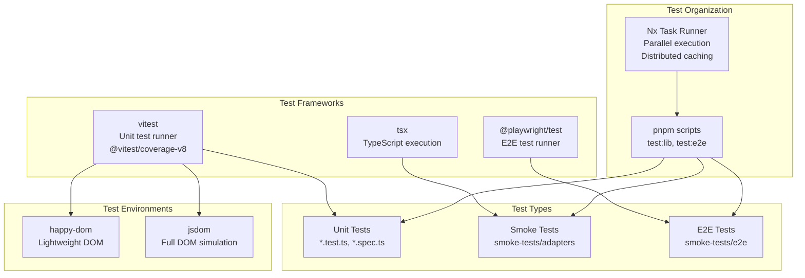
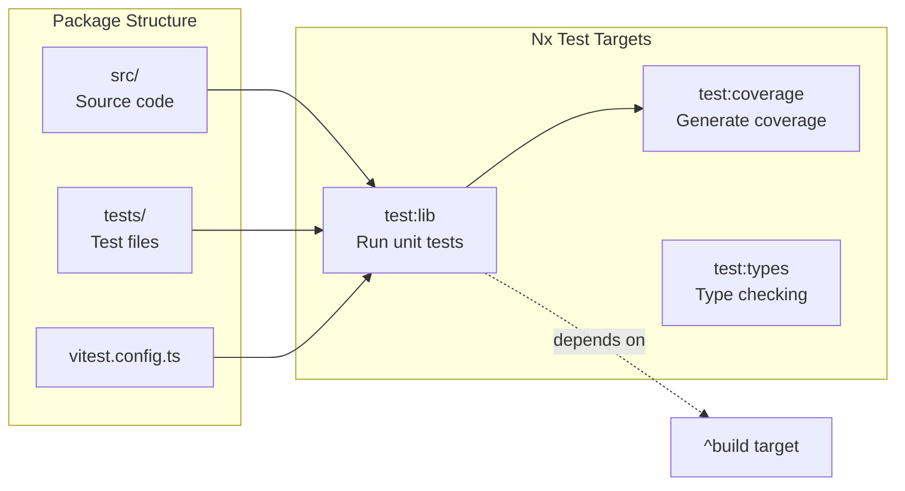
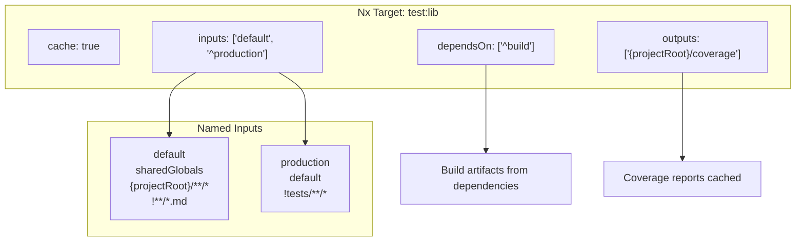
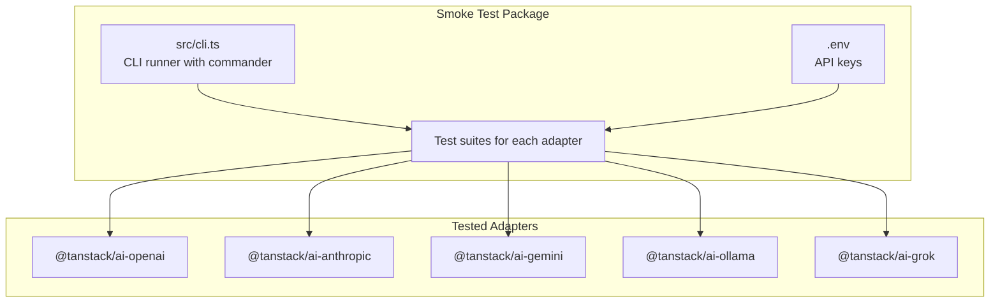
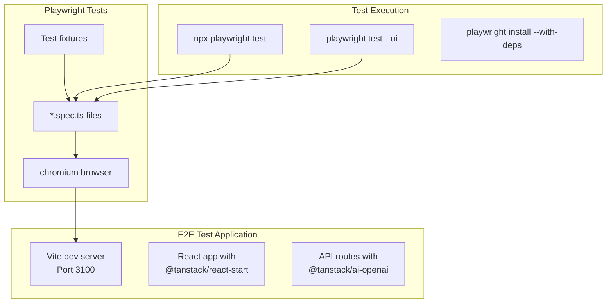
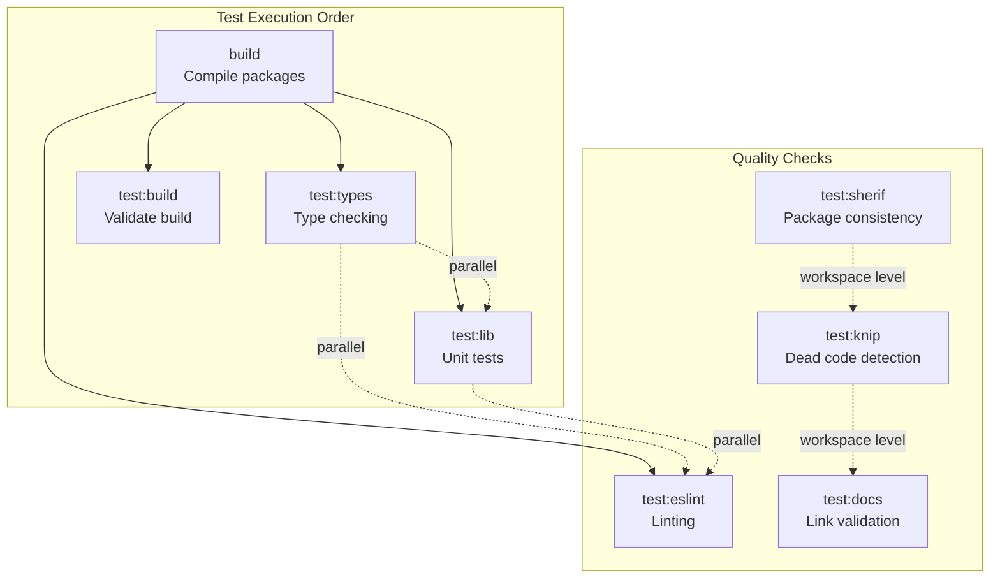
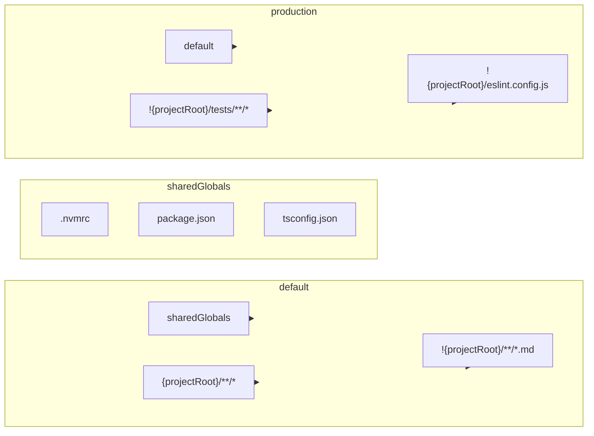
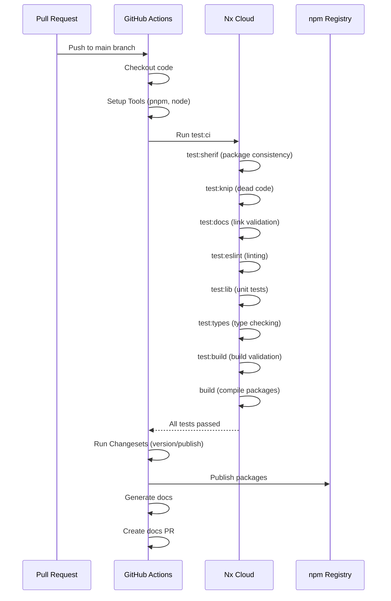

# Testing Infrastructure

<details>
<summary>Relevant source files</summary>

The following files were used as context for generating this wiki page:

- [.github/workflows/autofix.yml](.github/workflows/autofix.yml)
- [.github/workflows/release.yml](.github/workflows/release.yml)
- [examples/ts-react-chat/src/lib/model-selection.ts](examples/ts-react-chat/src/lib/model-selection.ts)
- [examples/ts-react-chat/src/routes/api.tanchat.ts](examples/ts-react-chat/src/routes/api.tanchat.ts)
- [examples/ts-svelte-chat/CHANGELOG.md](examples/ts-svelte-chat/CHANGELOG.md)
- [examples/ts-svelte-chat/package.json](examples/ts-svelte-chat/package.json)
- [examples/ts-vue-chat/CHANGELOG.md](examples/ts-vue-chat/CHANGELOG.md)
- [examples/ts-vue-chat/package.json](examples/ts-vue-chat/package.json)
- [nx.json](nx.json)
- [package.json](package.json)
- [packages/typescript/ai-gemini/CHANGELOG.md](packages/typescript/ai-gemini/CHANGELOG.md)
- [packages/typescript/ai-gemini/src/adapters/text.ts](packages/typescript/ai-gemini/src/adapters/text.ts)
- [packages/typescript/ai-gemini/src/model-meta.ts](packages/typescript/ai-gemini/src/model-meta.ts)
- [packages/typescript/ai-gemini/src/text/text-provider-options.ts](packages/typescript/ai-gemini/src/text/text-provider-options.ts)
- [packages/typescript/ai-gemini/tests/gemini-adapter.test.ts](packages/typescript/ai-gemini/tests/gemini-adapter.test.ts)
- [packages/typescript/ai-openai/CHANGELOG.md](packages/typescript/ai-openai/CHANGELOG.md)
- [packages/typescript/ai-openai/live-tests/tool-test-empty-object.ts](packages/typescript/ai-openai/live-tests/tool-test-empty-object.ts)
- [packages/typescript/ai-solid/tsdown.config.ts](packages/typescript/ai-solid/tsdown.config.ts)
- [packages/typescript/ai/src/activities/chat/stream/processor.ts](packages/typescript/ai/src/activities/chat/stream/processor.ts)
- [packages/typescript/smoke-tests/adapters/CHANGELOG.md](packages/typescript/smoke-tests/adapters/CHANGELOG.md)
- [packages/typescript/smoke-tests/adapters/package.json](packages/typescript/smoke-tests/adapters/package.json)
- [packages/typescript/smoke-tests/e2e/CHANGELOG.md](packages/typescript/smoke-tests/e2e/CHANGELOG.md)
- [packages/typescript/smoke-tests/e2e/package.json](packages/typescript/smoke-tests/e2e/package.json)
- [pnpm-lock.yaml](pnpm-lock.yaml)
- [scripts/generate-docs.ts](scripts/generate-docs.ts)

</details>

This document describes the testing infrastructure for TanStack AI, including unit testing, adapter smoke tests, end-to-end testing, and test organization. The codebase employs a multi-layered testing strategy to ensure reliability across adapters, framework integrations, and full user workflows.

For information about code quality tools like linting and type checking, see [Code Quality Tools](#9.4). For CI/CD integration, see [CI/CD and Release Process](#9.6).

## Overview

TanStack AI uses three primary testing layers:

1. **Unit Tests**: Package-level tests using vitest for core functionality, adapters, and framework integrations
2. **Adapter Smoke Tests**: CLI-based integration tests that validate all AI provider adapters against live APIs
3. **E2E Tests**: Full-stack Playwright tests that validate complete user workflows

All tests are orchestrated through Nx task runners with distributed caching enabled.

**Sources**: [package.json:1-72](), [nx.json:1-75]()

## Testing Stack



**Sources**: [pnpm-lock.yaml:41-79](), [package.json:15-32]()

## Unit Testing with Vitest

### Configuration

Unit tests use **vitest** as the test runner with coverage reporting via **@vitest/coverage-v8**. Each package contains its own test files and vitest configuration.

| Component       | Technology          | Purpose                                            |
| --------------- | ------------------- | -------------------------------------------------- |
| Test Runner     | vitest 4.0.14+      | Fast unit test execution with native ESM support   |
| Coverage        | @vitest/coverage-v8 | V8-based code coverage reporting                   |
| DOM Environment | happy-dom / jsdom   | Simulated browser environments for framework tests |

**Sources**: [pnpm-lock.yaml:77-79](), [packages/typescript/ai/package.json:612-614]()

### Test Organization



Tests follow the naming convention `*.test.ts` or `*.spec.ts` and are located in `tests/` directories or co-located with source files.

**Sources**: [nx.json:27-39](), [packages/typescript/ai-gemini/tests/gemini-adapter.test.ts:1-347]()

### Example: Adapter Unit Tests

Adapter tests validate provider-specific functionality by mocking SDK clients:

```
packages/typescript/ai-gemini/tests/gemini-adapter.test.ts
├── Mock GoogleGenAI SDK
├── Test chat streaming with provider options mapping
├── Test structured output generation
├── Test tool calling functionality
└── Validate chunk processing
```

The Gemini adapter test demonstrates the pattern used across all provider adapters:

[packages/typescript/ai-gemini/tests/gemini-adapter.test.ts:15-51]() - Mock setup using `vi.hoisted()` and `vi.mock()`

[packages/typescript/ai-gemini/tests/gemini-adapter.test.ts:76-132]() - Provider options mapping test

[packages/typescript/ai-gemini/tests/gemini-adapter.test.ts:254-319]() - Streaming chunk validation

**Sources**: [packages/typescript/ai-gemini/tests/gemini-adapter.test.ts:1-347]()

### Test Execution

Tests are executed via Nx with caching:

```
# Run all unit tests
pnpm test:lib

# Run tests for affected packages only
pnpm test:pr

# Run with coverage
pnpm test:coverage

# Watch mode during development
pnpm test:lib:dev
```

**Sources**: [package.json:17-24]()

### Nx Test Configuration



The `test:lib` target configuration ensures tests only run after dependencies are built and caches results based on source changes.

**Sources**: [nx.json:28-33]()

## Adapter Smoke Tests

### Overview

The adapter smoke tests package (`@tanstack/tests-adapters`) provides CLI-based integration tests for all AI provider adapters. These tests validate adapters against live API endpoints.



**Sources**: [packages/typescript/smoke-tests/adapters/package.json:1-30]()

### Package Configuration

The smoke tests package has minimal dependencies focused on execution:

| Dependency               | Purpose                                 |
| ------------------------ | --------------------------------------- |
| `@tanstack/ai`           | Core SDK for chat() function            |
| `@tanstack/ai-openai`    | OpenAI adapter                          |
| `@tanstack/ai-anthropic` | Anthropic adapter                       |
| `@tanstack/ai-gemini`    | Gemini adapter                          |
| `@tanstack/ai-ollama`    | Ollama adapter                          |
| `@tanstack/ai-grok`      | Grok adapter                            |
| `commander`              | CLI argument parsing                    |
| `tsx`                    | TypeScript execution without build step |
| `zod`                    | Schema validation for tool definitions  |

**Sources**: [packages/typescript/smoke-tests/adapters/package.json:13-28]()

### Execution

```bash
# Run smoke tests
cd packages/typescript/smoke-tests/adapters
pnpm start

# Type checking
pnpm typecheck
```

These tests require API keys to be configured in environment variables. They test core functionality like:

- Basic chat completion
- Streaming responses
- Tool calling
- Structured output
- Multi-modal inputs

**Sources**: [packages/typescript/smoke-tests/adapters/package.json:9-11]()

## End-to-End Testing with Playwright

### Overview

The E2E test suite (`@tanstack/smoke-tests-e2e`) validates complete user workflows using Playwright. It tests the full stack from UI interactions through to AI responses.



**Sources**: [packages/typescript/smoke-tests/e2e/package.json:1-39]()

### Stack Configuration

The E2E test app uses a production-like stack:

| Component      | Technology                                  |
| -------------- | ------------------------------------------- |
| Framework      | `@tanstack/react-start` with React 19       |
| Routing        | `@tanstack/react-router`                    |
| Server         | `@tanstack/nitro-v2-vite-plugin`            |
| AI Integration | `@tanstack/ai-openai`, `@tanstack/ai-react` |
| Styling        | `@tailwindcss/vite`                         |
| Test Runner    | `@playwright/test`                          |

**Sources**: [packages/typescript/smoke-tests/e2e/package.json:15-28]()

### Test Scripts

```bash
# Start dev server (port 3100)
pnpm dev

# Build production bundle
pnpm build

# Run E2E tests
pnpm test:e2e

# Run with Playwright UI
pnpm test:e2e:ui

# Install Playwright browsers
pnpm postinstall
```

The `postinstall` script automatically installs Playwright's Chromium browser with system dependencies, ensuring tests can run in CI environments.

**Sources**: [packages/typescript/smoke-tests/e2e/package.json:7-13]()

### Test Coverage

E2E tests validate:

- Complete chat workflows (user input → AI response)
- Tool calling with approval flows
- Multi-turn conversations
- Error handling and retry logic
- Framework integration (React hooks, state management)
- SSE streaming and connection management

**Sources**: [packages/typescript/smoke-tests/e2e/package.json:4-5]()

## Test Organization via Nx

### Nx Task Dependencies



**Sources**: [nx.json:27-73]()

### Caching Strategy

Nx caches test results based on input patterns:

| Target          | Inputs                                       | Outputs                  | Cache |
| --------------- | -------------------------------------------- | ------------------------ | ----- |
| `test:lib`      | `default`, `^production`                     | `{projectRoot}/coverage` | ✓     |
| `test:coverage` | `default`, `^production`                     | `{projectRoot}/coverage` | ✓     |
| `test:eslint`   | `default`, `^production`, `eslint.config.js` | none                     | ✓     |
| `test:types`    | `default`, `^production`                     | none                     | ✓     |
| `test:build`    | `production`                                 | none                     | ✓     |

The `^` prefix indicates inputs from upstream dependencies. This ensures tests invalidate when dependencies change.

**Sources**: [nx.json:28-54]()

### Named Inputs



The `production` input pattern excludes test files and linting configs, meaning production builds don't invalidate when only tests change.

**Sources**: [nx.json:10-26]()

## CI/CD Integration

### Release Workflow

The GitHub Actions release workflow runs the complete test suite before publishing:



**Sources**: [.github/workflows/release.yml:1-65]()

### Test Execution in CI

```bash
# CI test command
pnpm run test:ci

# Expands to Nx command
nx run-many --targets=test:sherif,test:knip,test:docs,test:eslint,test:lib,test:types,test:build,build
```

This runs all quality checks and tests across all packages in parallel (max 5 concurrent), using Nx Cloud for distributed caching.

**Sources**: [package.json:19](), [.github/workflows/release.yml:31-32]()

### Parallel Execution

Nx executes tests in parallel with a concurrency limit:

```json
{
  "parallel": 5
}
```

This balances resource usage with execution speed. Test results are cached in Nx Cloud (ID: `6928ccd60a2e27ab22f38ad0`).

**Sources**: [nx.json:6](), [nx.json:4]()

## Coverage Reporting

### Configuration

Coverage is collected via `@vitest/coverage-v8` with per-package configuration:

```
packages/typescript/ai/
├── src/           (source to cover)
├── tests/         (test files)
└── coverage/      (generated reports)
```

Coverage artifacts are cached by Nx to avoid regeneration:

```json
{
  "outputs": ["{projectRoot}/coverage"]
}
```

**Sources**: [nx.json:32](), [packages/typescript/ai/package.json:612-614]()

### Running Coverage

```bash
# Generate coverage for affected packages
pnpm test:coverage

# Coverage is cached per package
# Nx will restore from cache if inputs haven't changed
```

Coverage reports include:

- Line coverage
- Branch coverage
- Function coverage
- Statement coverage

**Sources**: [package.json:24]()

## Test Environments

### DOM Simulation

Framework integration tests require DOM environments:

| Environment | Use Case                         | Packages                                           |
| ----------- | -------------------------------- | -------------------------------------------------- |
| `happy-dom` | Lightweight DOM for simple tests | Default for most packages                          |
| `jsdom`     | Full DOM simulation              | Framework integration tests requiring browser APIs |

**Sources**: [pnpm-lock.yaml:41-43](), [pnpm-lock.yaml:671-674]()

### Browser Testing

E2E tests use real Chromium browsers via Playwright:

```bash
# Install browser with system dependencies
npx playwright install --with-deps chromium
```

This ensures tests run in an environment matching production user agents.

**Sources**: [packages/typescript/smoke-tests/e2e/package.json:13]()

## Test Script Reference

### Root Scripts

| Script          | Purpose             | Execution              |
| --------------- | ------------------- | ---------------------- |
| `test`          | Alias for `test:ci` | Full test suite        |
| `test:pr`       | PR validation tests | Affected packages only |
| `test:ci`       | CI test suite       | All packages           |
| `test:eslint`   | Run ESLint          | Affected packages      |
| `test:sherif`   | Package consistency | Workspace level        |
| `test:lib`      | Unit tests          | Affected packages      |
| `test:lib:dev`  | Watch mode          | Affected packages      |
| `test:coverage` | Generate coverage   | Affected packages      |
| `test:build`    | Build validation    | Affected packages      |
| `test:types`    | Type checking       | Affected packages      |
| `test:knip`     | Dead code detection | Workspace level        |
| `test:docs`     | Link validation     | Workspace level        |

**Sources**: [package.json:17-28]()

### Nx Affected vs Run-Many

```bash
# Run only affected packages (for PRs)
nx affected --targets=test:lib

# Run all packages (for CI)
nx run-many --targets=test:lib
```

The `test:pr` script uses `affected` to run only tests impacted by changes, while `test:ci` runs everything.

**Sources**: [package.json:18-19]()

## Summary

TanStack AI's testing infrastructure provides comprehensive coverage across three layers:

1. **Unit tests** validate individual packages with vitest
2. **Adapter smoke tests** verify provider integrations against live APIs
3. **E2E tests** confirm full user workflows with Playwright

Nx orchestrates test execution with intelligent caching and parallel processing, while GitHub Actions ensures all tests pass before releases. This multi-layered approach maintains high code quality across the 40+ packages in the monorepo.

**Sources**: [package.json:1-72](), [nx.json:1-75](), [.github/workflows/release.yml:1-65]()
