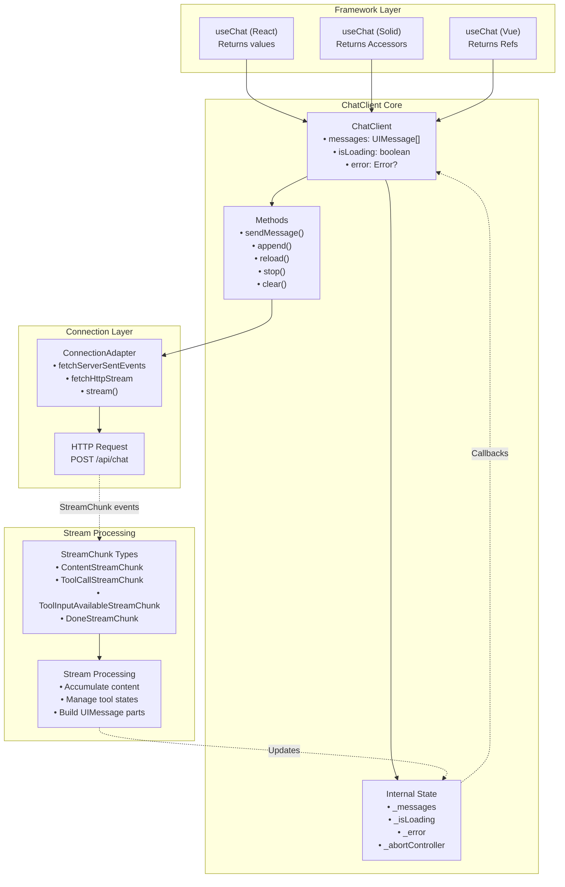
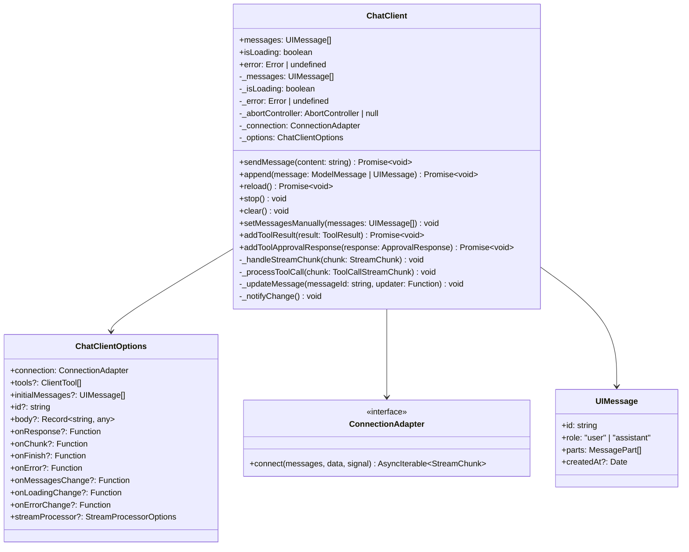
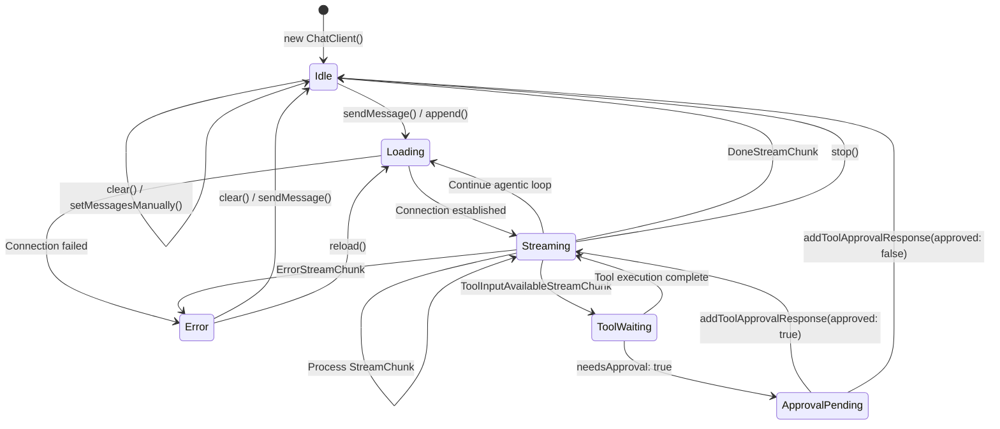
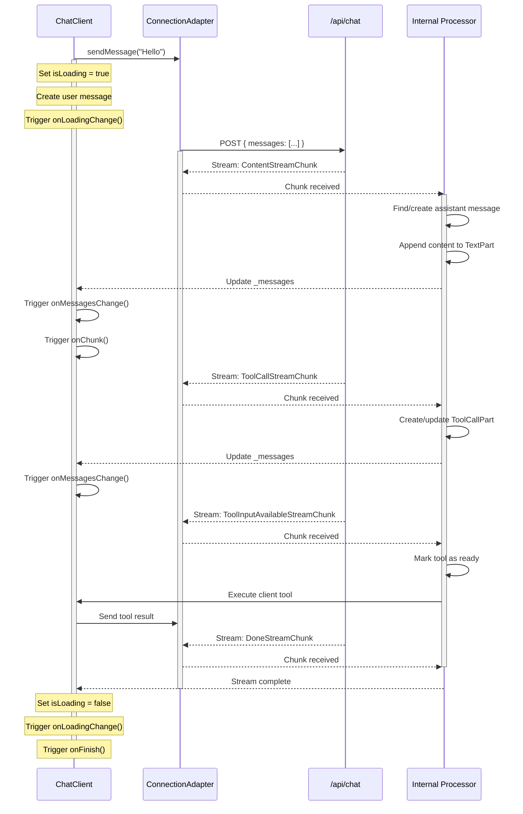
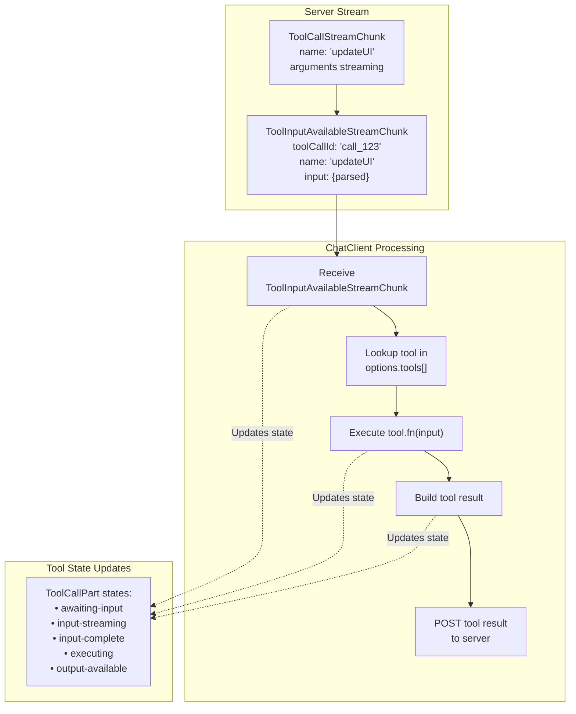
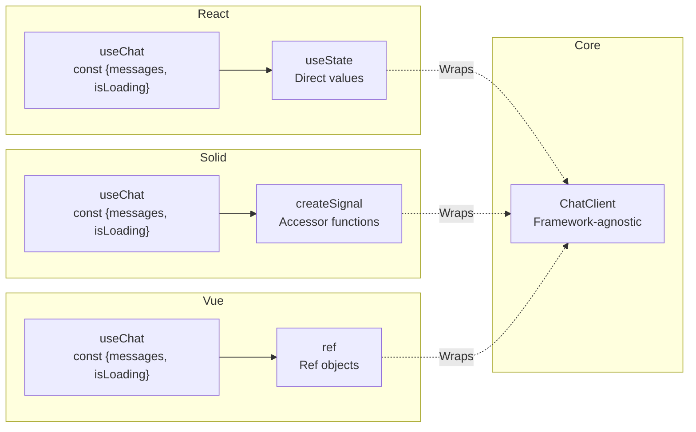

# ChatClient

<details>
<summary>Relevant source files</summary>

The following files were used as context for generating this wiki page:

- [README.md](README.md)
- [docs/api/ai.md](docs/api/ai.md)
- [docs/getting-started/overview.md](docs/getting-started/overview.md)
- [docs/guides/client-tools.md](docs/guides/client-tools.md)
- [docs/guides/server-tools.md](docs/guides/server-tools.md)
- [docs/guides/streaming.md](docs/guides/streaming.md)
- [docs/guides/tool-approval.md](docs/guides/tool-approval.md)
- [docs/guides/tool-architecture.md](docs/guides/tool-architecture.md)
- [docs/guides/tools.md](docs/guides/tools.md)
- [docs/protocol/chunk-definitions.md](docs/protocol/chunk-definitions.md)
- [docs/protocol/http-stream-protocol.md](docs/protocol/http-stream-protocol.md)
- [docs/protocol/sse-protocol.md](docs/protocol/sse-protocol.md)
- [examples/vanilla-chat/package.json](examples/vanilla-chat/package.json)
- [packages/typescript/ai-client/README.md](packages/typescript/ai-client/README.md)
- [packages/typescript/ai-client/package.json](packages/typescript/ai-client/package.json)
- [packages/typescript/ai-devtools/README.md](packages/typescript/ai-devtools/README.md)
- [packages/typescript/ai-devtools/package.json](packages/typescript/ai-devtools/package.json)
- [packages/typescript/ai-gemini/README.md](packages/typescript/ai-gemini/README.md)
- [packages/typescript/ai-ollama/README.md](packages/typescript/ai-ollama/README.md)
- [packages/typescript/ai-openai/README.md](packages/typescript/ai-openai/README.md)
- [packages/typescript/ai-react-ui/README.md](packages/typescript/ai-react-ui/README.md)
- [packages/typescript/ai-react/README.md](packages/typescript/ai-react/README.md)
- [packages/typescript/ai/README.md](packages/typescript/ai/README.md)
- [packages/typescript/ai/package.json](packages/typescript/ai/package.json)
- [packages/typescript/react-ai-devtools/README.md](packages/typescript/react-ai-devtools/README.md)
- [packages/typescript/react-ai-devtools/package.json](packages/typescript/react-ai-devtools/package.json)
- [packages/typescript/solid-ai-devtools/README.md](packages/typescript/solid-ai-devtools/README.md)
- [packages/typescript/solid-ai-devtools/package.json](packages/typescript/solid-ai-devtools/package.json)

</details>

The `ChatClient` class is the core state management abstraction in `@tanstack/ai-client`, providing a framework-agnostic API for managing chat messages, streaming responses, and tool execution. It serves as the foundation for framework-specific integrations like `useChat` in React, Solid, Vue, and Svelte.

For information about connection adapters (SSE, HTTP Stream, custom), see [Connection Adapters](#4.2). For details on client-side tool execution, see [Client-Side Tools](#4.3). For type helpers like `clientTools()` and `createChatClientOptions()`, see [Type Helpers](#4.4).

## Architecture Overview

`ChatClient` sits between the transport layer (connection adapters) and the UI layer (framework hooks). It handles the bidirectional data flow: converting outgoing user messages to the server's expected format and transforming incoming `StreamChunk` events into `UIMessage` objects that UI components can render.



**ChatClient Architecture Diagram** - Shows how ChatClient bridges framework bindings and connection adapters

Sources: [packages/typescript/ai-client/package.json:1-53](), [packages/typescript/ai-preact/src/use-chat.ts:39-67](), [docs/api/ai-client.md:15-33](), [docs/api/ai-react.md:19-49](), [docs/api/ai-solid.md:19-49]()

## Class Structure

The `ChatClient` class exposes a public API for managing chat state and interacting with the server. It maintains internal state and provides callback hooks for reactive updates.



**ChatClient Class Diagram** - Core structure showing public API and internal state

Sources: [docs/api/ai-client.md:15-133](), [packages/typescript/ai-preact/src/types.ts:1-99]()

## Constructor Options

The `ChatClient` constructor accepts a `ChatClientOptions` object that configures connection, tools, callbacks, and initial state.

| Option             | Type                     | Required | Description                               |
| ------------------ | ------------------------ | -------- | ----------------------------------------- |
| `connection`       | `ConnectionAdapter`      | Yes      | Adapter for streaming (SSE, HTTP, custom) |
| `tools`            | `ClientTool[]`           | No       | Array of client tool implementations      |
| `initialMessages`  | `UIMessage[]`            | No       | Initial messages to populate chat         |
| `id`               | `string`                 | No       | Unique identifier for this chat instance  |
| `body`             | `Record<string, any>`    | No       | Additional data sent with each request    |
| `onResponse`       | `(response) => void`     | No       | Called when response stream starts        |
| `onChunk`          | `(chunk) => void`        | No       | Called for each stream chunk              |
| `onFinish`         | `(messages) => void`     | No       | Called when response completes            |
| `onError`          | `(error) => void`        | No       | Called when error occurs                  |
| `onMessagesChange` | `(messages) => void`     | No       | Called when messages array changes        |
| `onLoadingChange`  | `(isLoading) => void`    | No       | Called when loading state changes         |
| `onErrorChange`    | `(error) => void`        | No       | Called when error state changes           |
| `streamProcessor`  | `StreamProcessorOptions` | No       | Stream processing configuration           |

**Constructor Options Reference Table**

Sources: [docs/api/ai-client.md:36-50](), [packages/typescript/ai-preact/src/types.ts:11-30]()

### Basic Instantiation

```typescript
import { ChatClient, fetchServerSentEvents } from '@tanstack/ai-client'

const client = new ChatClient({
  connection: fetchServerSentEvents('/api/chat'),
  initialMessages: [],
  onMessagesChange: (messages) => {
    console.log('Messages updated:', messages)
  },
})
```

Sources: [docs/api/ai-client.md:19-33](), [packages/typescript/ai-preact/src/use-chat.ts:39-67]()

### With Client Tools

```typescript
import {
  ChatClient,
  fetchServerSentEvents,
  clientTools,
} from '@tanstack/ai-client'

const tools = clientTools(
  updateUIDef.client((input) => {
    // Client tool implementation
    return { success: true }
  })
)

const client = new ChatClient({
  connection: fetchServerSentEvents('/api/chat'),
  tools,
})
```

Sources: [docs/api/ai-client.md:180-218](), [docs/guides/client-tools.md:116-170](), [packages/typescript/ai-preact/src/use-chat.ts:47-67]()

## Core Methods

### sendMessage()

Sends a user message and triggers a response from the server. This is the primary method for adding user input to the conversation.

```typescript
await client.sendMessage('Hello, how are you?')
```

**Behavior:**

1. Creates a new `UIMessage` with `role: "user"` and a single `TextPart`
2. Appends the message to `messages` array
3. Calls `_notifyChange()` to trigger `onMessagesChange` callback
4. Initiates connection via `ConnectionAdapter`
5. Processes incoming `StreamChunk` events to build assistant response

Sources: [docs/api/ai-client.md:53-59]()

### append()

Appends a message to the conversation without triggering a new response. Accepts either `ModelMessage` (server format) or `UIMessage` (client format).

```typescript
await client.append({
  role: 'user',
  content: 'Additional context',
})

// Or with UIMessage format
await client.append({
  id: 'msg-123',
  role: 'assistant',
  parts: [{ type: 'text', content: 'Response' }],
})
```

**Use Cases:**

- Restoring chat history from storage
- Adding system messages
- Manually constructing multi-part messages

Sources: [docs/api/ai-client.md:61-70]()

### reload()

Removes the last assistant message and regenerates it by re-sending the conversation history to the server.

```typescript
await client.reload()
```

**Behavior:**

1. Finds the last assistant message in `messages` array
2. Removes it from the array
3. Calls connection adapter with updated message history
4. Processes new response stream

Sources: [docs/api/ai-client.md:72-78]()

### stop()

Aborts the current streaming response immediately using the internal `AbortController`.

```typescript
client.stop()
```

**Behavior:**

1. Calls `_abortController.abort()`
2. Sets `isLoading` to `false`
3. Triggers `onLoadingChange` callback
4. Leaves the partially received message in the `messages` array

Sources: [docs/api/ai-client.md:80-86]()

### clear()

Clears all messages from the conversation.

```typescript
client.clear()
```

**Behavior:**

1. Sets `messages` to empty array `[]`
2. Triggers `onMessagesChange` callback
3. Does not affect loading or error state

Sources: [docs/api/ai-client.md:88-94]()

### setMessagesManually()

Manually replaces the entire messages array. Useful for implementing undo/redo or restoring from snapshots.

```typescript
client.setMessagesManually([
  { id: '1', role: 'user', parts: [{ type: 'text', content: 'Hello' }] },
  { id: '2', role: 'assistant', parts: [{ type: 'text', content: 'Hi!' }] },
])
```

Sources: [docs/api/ai-client.md:96-102]()

### addToolResult()

Manually adds a tool execution result. Primarily used when implementing custom tool execution flows.

```typescript
await client.addToolResult({
  toolCallId: "call_123",
  tool: "searchProducts",
  output: { products: [...] },
  state: "output-available",
});
```

**Note:** When using client tools with automatic execution, this is handled internally and typically not called directly.

Sources: [docs/api/ai-client.md:104-115]()

### addToolApprovalResponse()

Responds to a tool approval request when a tool has `needsApproval: true`.

```typescript
await client.addToolApprovalResponse({
  id: 'approval_123',
  approved: true,
})
```

**Behavior:**

1. Updates the corresponding `ToolCallPart` approval state
2. If approved, triggers tool execution
3. If denied, marks tool call as cancelled
4. Continues conversation with updated state

Sources: [docs/api/ai-client.md:117-126](), [docs/guides/client-tools.md:233-262]()

## Properties

The `ChatClient` exposes three reactive properties that reflect the current state:

| Property    | Type                 | Description                               |
| ----------- | -------------------- | ----------------------------------------- |
| `messages`  | `UIMessage[]`        | Array of all messages in the conversation |
| `isLoading` | `boolean`            | `true` when a response is being generated |
| `error`     | `Error \| undefined` | Current error, if any                     |

**Public Properties Reference Table**

```typescript
console.log(client.messages) // Array of UIMessage objects
console.log(client.isLoading) // true or false
console.log(client.error) // Error object or undefined
```

Sources: [docs/api/ai-client.md:128-133]()

## Message State Management

`ChatClient` maintains internal state (`_messages`, `_isLoading`, `_error`) and synchronizes it with public properties. Changes trigger registered callbacks, enabling reactive UI updates.



**ChatClient State Machine** - Lifecycle states and transitions during chat interactions

Sources: [docs/api/ai-client.md:15-133](), [docs/guides/client-tools.md:43-53](), [packages/typescript/ai-preact/src/use-chat.ts:1-162]()

## Stream Processing Flow

When `sendMessage()` or `append()` triggers a server request, `ChatClient` processes the incoming stream chunk-by-chunk, building up the assistant's response incrementally.



**Stream Processing Sequence** - How ChatClient processes incoming StreamChunk events

Sources: [docs/api/ai-client.md:36-50](), [docs/guides/client-tools.md:10-33](), [docs/guides/streaming.md:9-27]()

## Message Part Accumulation

`ChatClient` accumulates `StreamChunk` events into structured `MessagePart` objects within `UIMessage` instances. Each chunk type updates specific parts:

| StreamChunk Type                | Updates                         | Resulting Part Type          |
| ------------------------------- | ------------------------------- | ---------------------------- |
| `ContentStreamChunk`            | Appends text to content buffer  | `TextPart`                   |
| `ThinkingStreamChunk`           | Appends to thinking content     | `ThinkingPart`               |
| `ToolCallStreamChunk`           | Streams tool name and arguments | `ToolCallPart`               |
| `ToolInputAvailableStreamChunk` | Marks tool input complete       | Updates `ToolCallPart.state` |
| `ToolResultStreamChunk`         | Adds execution result           | `ToolResultPart`             |
| `DoneStreamChunk`               | Finalizes message               | No new parts                 |
| `ErrorStreamChunk`              | Sets error state                | No new parts                 |

**StreamChunk to MessagePart Mapping**

Sources: [docs/api/ai-client.md:240-331](), [docs/api/ai.md:221-239]()

## Tool Execution Flow

When the server sends a `ToolInputAvailableStreamChunk` for a client tool, `ChatClient` automatically executes the matching tool implementation and sends the result back to the server.



**Client Tool Execution Flow** - Automatic execution when ToolInputAvailableStreamChunk is received

Sources: [docs/guides/client-tools.md:43-53](), [docs/guides/client-tools.md:200-209](), [docs/api/ai-client.md:46-48]()

## Error Handling

`ChatClient` captures errors at multiple stages and surfaces them through the `error` property and `onError` callback.

**Error Sources:**

- Connection failures (network issues, timeout)
- Server-side errors (returned as `ErrorStreamChunk`)
- Tool execution failures
- JSON parsing errors (malformed tool arguments)

**Behavior:**

1. Set `error` property to `Error` instance
2. Set `isLoading` to `false`
3. Trigger `onErrorChange(error)` callback
4. Trigger `onError(error)` callback
5. Preserve messages up to the point of failure

```typescript
const client = new ChatClient({
  connection: fetchServerSentEvents('/api/chat'),
  onError: (error) => {
    console.error('Chat error:', error)
    // Show error notification to user
  },
})
```

Sources: [docs/api/ai-client.md:44-47](), [packages/typescript/ai-preact/src/use-chat.ts:53-55]()

## Callback Hooks

`ChatClient` provides granular callback hooks for observing state changes and stream events:

| Callback           | When Triggered             | Use Case                                |
| ------------------ | -------------------------- | --------------------------------------- |
| `onResponse`       | Response stream starts     | Log request timing                      |
| `onChunk`          | Each stream chunk received | Debug stream processing                 |
| `onFinish`         | Response completes         | Update analytics, save history          |
| `onError`          | Error occurs               | Display error notification              |
| `onMessagesChange` | Messages array updates     | Update UI (framework bindings use this) |
| `onLoadingChange`  | Loading state changes      | Show/hide loading indicator             |
| `onErrorChange`    | Error state changes        | Show/hide error banner                  |

**Callback Hooks Reference**

Sources: [docs/api/ai-client.md:42-50](), [packages/typescript/ai-preact/src/use-chat.ts:47-67]()

## Framework Integration

Framework-specific packages (`@tanstack/ai-react`, `@tanstack/ai-solid`, `@tanstack/ai-vue`) wrap `ChatClient` in hooks/primitives that provide reactive bindings:

- **React**: `useChat` returns direct values with React's useState
- **Solid**: `useChat` returns `Accessor` functions for reactive signals
- **Vue**: `useChat` returns `Ref` objects for Vue's reactivity



**Framework Wrapper Pattern** - How different frameworks adapt ChatClient for reactive updates

Sources: [docs/api/ai-react.md:15-94](), [docs/api/ai-solid.md:15-96](), [docs/api/ai-preact.md:15-94](), [packages/typescript/ai-preact/src/use-chat.ts:14-162]()

## Usage Patterns

### Basic Chat Interface

```typescript
const client = new ChatClient({
  connection: fetchServerSentEvents('/api/chat'),
  onMessagesChange: (messages) => {
    renderMessages(messages)
  },
  onLoadingChange: (isLoading) => {
    toggleLoadingIndicator(isLoading)
  },
})

// Send user message
await client.sendMessage('What is TypeScript?')
```

Sources: [docs/api/ai-client.md:19-33](), [examples/vanilla-chat/package.json:1-18]()

### Chat with History Restoration

```typescript
const savedMessages = loadFromLocalStorage('chat-history')

const client = new ChatClient({
  connection: fetchServerSentEvents('/api/chat'),
  initialMessages: savedMessages,
  onMessagesChange: (messages) => {
    saveToLocalStorage('chat-history', messages)
  },
})
```

Sources: [docs/api/ai-client.md:38-39]()

### Chat with Tool Approval

```typescript
const client = new ChatClient({
  connection: fetchServerSentEvents('/api/chat'),
  onMessagesChange: (messages) => {
    messages.forEach((message) => {
      message.parts.forEach((part) => {
        if (
          part.type === 'tool-call' &&
          part.state === 'approval-requested' &&
          part.approval
        ) {
          showApprovalDialog(part.approval.id, part.name)
        }
      })
    })
  },
})

// User approves the tool
await client.addToolApprovalResponse({
  id: approvalId,
  approved: true,
})
```

Sources: [docs/api/ai-react.md:168-217](), [docs/api/ai-preact.md:168-217](), [docs/guides/client-tools.md:233-262]()

## Type Safety

`ChatClient` leverages TypeScript generics to provide type-safe tool definitions. When using `createChatClientOptions()` with `clientTools()`, the `UIMessage` type automatically includes discriminated unions for tool names, inputs, and outputs:

```typescript
import {
  createChatClientOptions,
  clientTools,
  InferChatMessages,
} from '@tanstack/ai-client'

const tools = clientTools(
  updateUIDef.client((input) => ({ success: true })),
  saveToStorageDef.client((input) => ({ saved: true }))
)

const chatOptions = createChatClientOptions({
  connection: fetchServerSentEvents('/api/chat'),
  tools,
})

// Extract fully typed message structure
type ChatMessages = InferChatMessages<typeof chatOptions>

// TypeScript now knows:
// - All possible tool names ("updateUI" | "saveToStorage")
// - Input type for each tool (from inputSchema)
// - Output type for each tool (from outputSchema)
```

Sources: [docs/api/ai-client.md:220-236](), [docs/api/ai-react.md:19-49](), [docs/api/ai-preact.md:19-49](), [packages/typescript/ai-preact/src/types.ts:26-30]()

## Next Steps

- For connection adapter details, see [Connection Adapters](#4.2)
- For client tool execution, see [Client-Side Tools](#4.3)
- For type helpers and inference, see [Type Helpers](#4.4)
- For React integration, see [@tanstack/ai-react](#6.1)
- For Solid integration, see [@tanstack/ai-solid](#6.2)
- For Vue integration, see [@tanstack/ai-vue](#6.3)

Sources: [docs/api/ai-client.md:348-351]()
