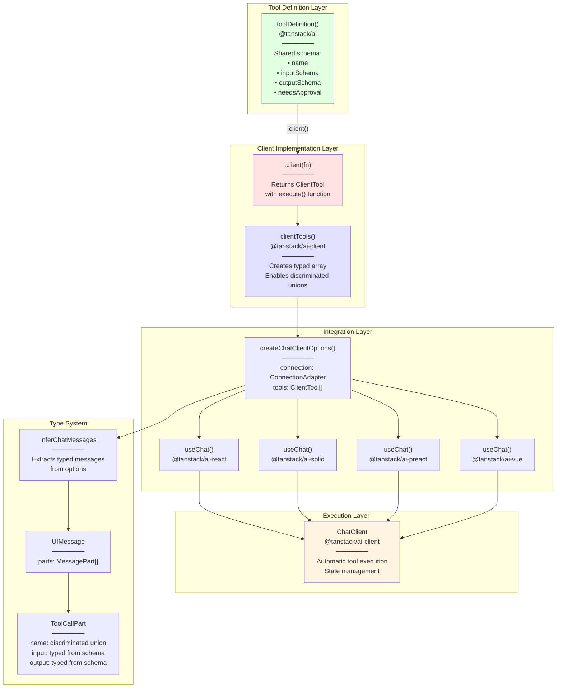
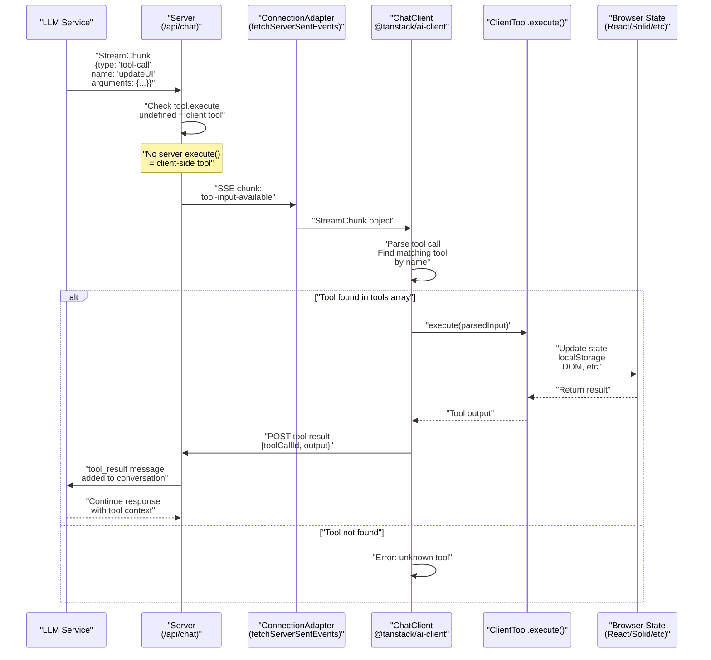

# Client-Side Tools

<details>
<summary>Relevant source files</summary>

The following files were used as context for generating this wiki page:

- [docs/api/ai.md](docs/api/ai.md)
- [docs/getting-started/overview.md](docs/getting-started/overview.md)
- [docs/guides/client-tools.md](docs/guides/client-tools.md)
- [docs/guides/server-tools.md](docs/guides/server-tools.md)
- [docs/guides/streaming.md](docs/guides/streaming.md)
- [docs/guides/tool-approval.md](docs/guides/tool-approval.md)
- [docs/guides/tool-architecture.md](docs/guides/tool-architecture.md)
- [docs/guides/tools.md](docs/guides/tools.md)
- [docs/protocol/chunk-definitions.md](docs/protocol/chunk-definitions.md)
- [docs/protocol/http-stream-protocol.md](docs/protocol/http-stream-protocol.md)
- [docs/protocol/sse-protocol.md](docs/protocol/sse-protocol.md)
- [examples/ts-react-chat/src/lib/model-selection.ts](examples/ts-react-chat/src/lib/model-selection.ts)
- [examples/ts-react-chat/src/routes/api.tanchat.ts](examples/ts-react-chat/src/routes/api.tanchat.ts)
- [packages/typescript/ai-anthropic/src/text/text-provider-options.ts](packages/typescript/ai-anthropic/src/text/text-provider-options.ts)
- [packages/typescript/ai-gemini/src/adapters/text.ts](packages/typescript/ai-gemini/src/adapters/text.ts)
- [packages/typescript/ai-gemini/src/model-meta.ts](packages/typescript/ai-gemini/src/model-meta.ts)
- [packages/typescript/ai-gemini/src/text/text-provider-options.ts](packages/typescript/ai-gemini/src/text/text-provider-options.ts)
- [packages/typescript/ai-gemini/tests/gemini-adapter.test.ts](packages/typescript/ai-gemini/tests/gemini-adapter.test.ts)
- [packages/typescript/ai-openai/live-tests/tool-test-empty-object.ts](packages/typescript/ai-openai/live-tests/tool-test-empty-object.ts)
- [packages/typescript/ai-openai/src/text/text-provider-options.ts](packages/typescript/ai-openai/src/text/text-provider-options.ts)
- [packages/typescript/ai/src/activities/chat/stream/processor.ts](packages/typescript/ai/src/activities/chat/stream/processor.ts)
- [packages/typescript/ai/src/types.ts](packages/typescript/ai/src/types.ts)

</details>

This document explains the client-side tool execution system in TanStack AI. Client tools are functions that execute in the browser to perform operations like UI updates, local storage access, and browser API interactions.

For information about server-side tool execution, see [Server Tools](#3.2). For the overall tool architecture and isomorphic tool definitions, see [Isomorphic Tool System](#3.2). For framework-agnostic state management, see [ChatClient](#4.1).

## Purpose and Scope

Client tools enable AI models to interact with browser-side functionality through a type-safe, framework-agnostic execution system. This document covers:

- Creating client tool implementations using `.client()`
- Automatic execution flow when the LLM calls client tools
- Type safety system via `clientTools()` and `InferChatMessages`
- Tool lifecycle states and state management
- Integration with React, Solid, Preact, Vue, and Svelte

## Client Tool Architecture



**Title:** Client Tool Type Safety Architecture

**Sources:** [docs/guides/client-tools.md:1-330](), [docs/api/ai-client.md:180-237](), [packages/typescript/ai-preact/src/types.ts:1-99]()

## Execution Flow



**Title:** Client Tool Automatic Execution Sequence

**Sources:** [docs/guides/client-tools.md:9-55](), [packages/typescript/ai-preact/src/use-chat.ts:39-68]()

## Creating Client Tool Implementations

### Step 1: Define Tool Schema

Tool definitions are shared between server and client using `toolDefinition()` from `@tanstack/ai`:

```typescript
// Defined in a shared location accessible to both server and client
const updateUIDef = toolDefinition({
  name: "update_ui",
  description: "Update the UI with new information",
  inputSchema: z.object({
    message: z.string(),
    type: z.enum(["success", "error", "info\
```
