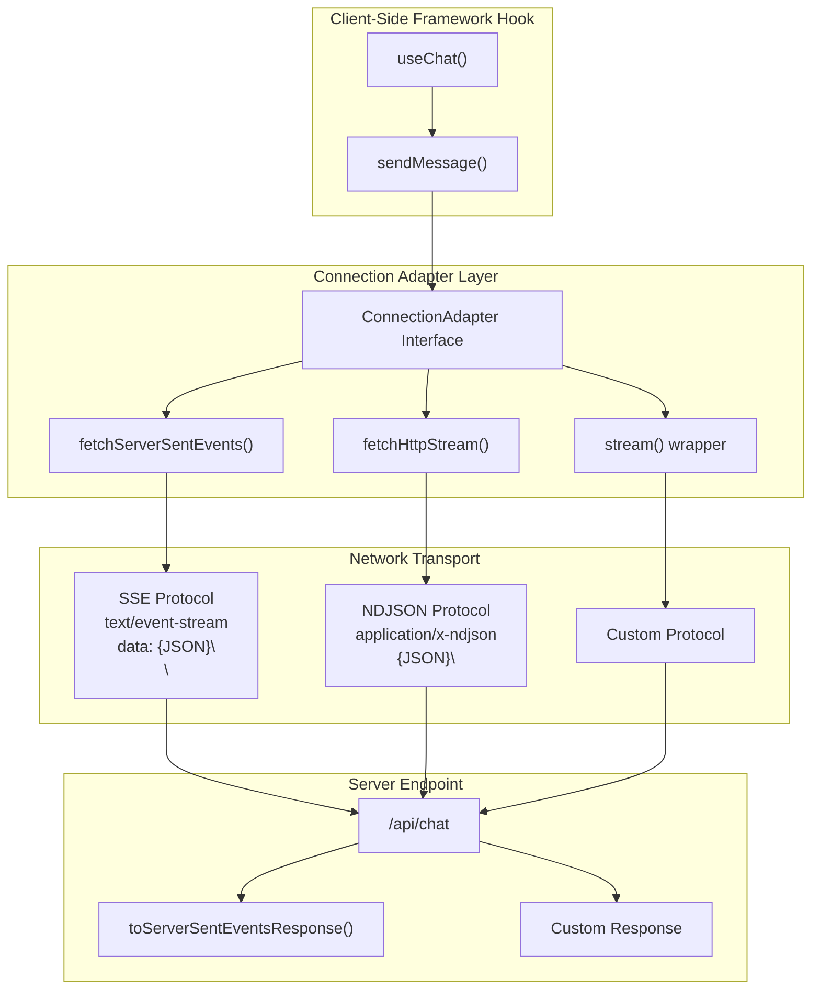
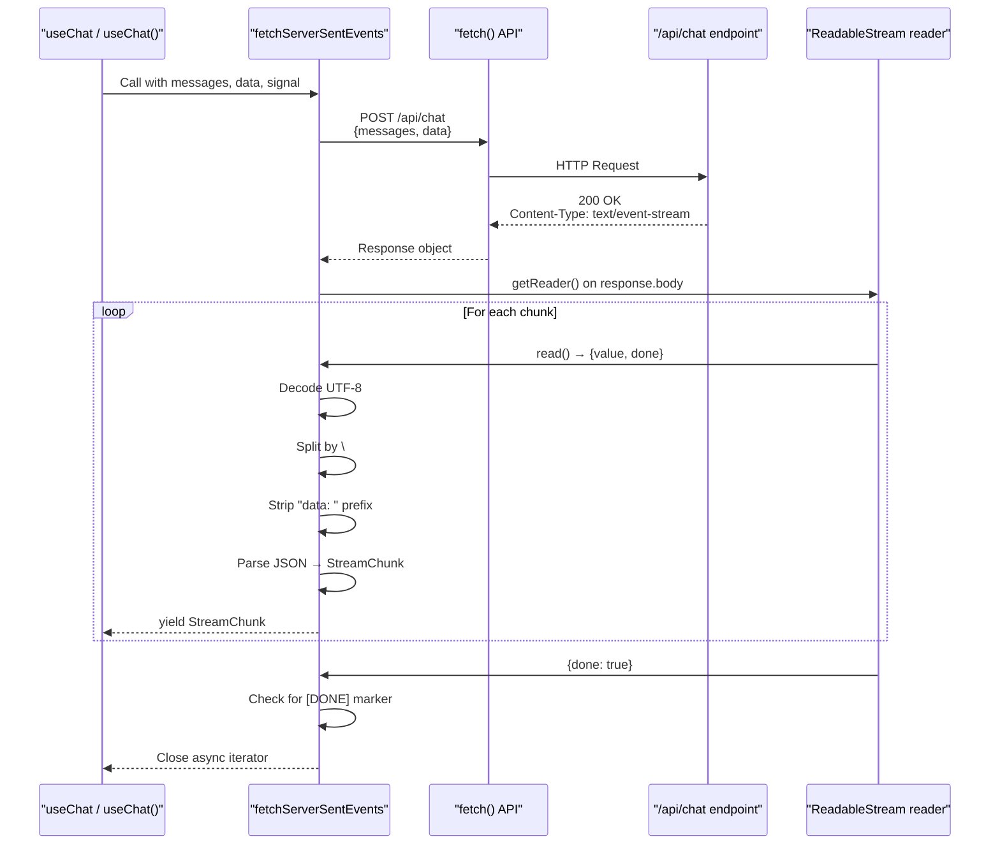
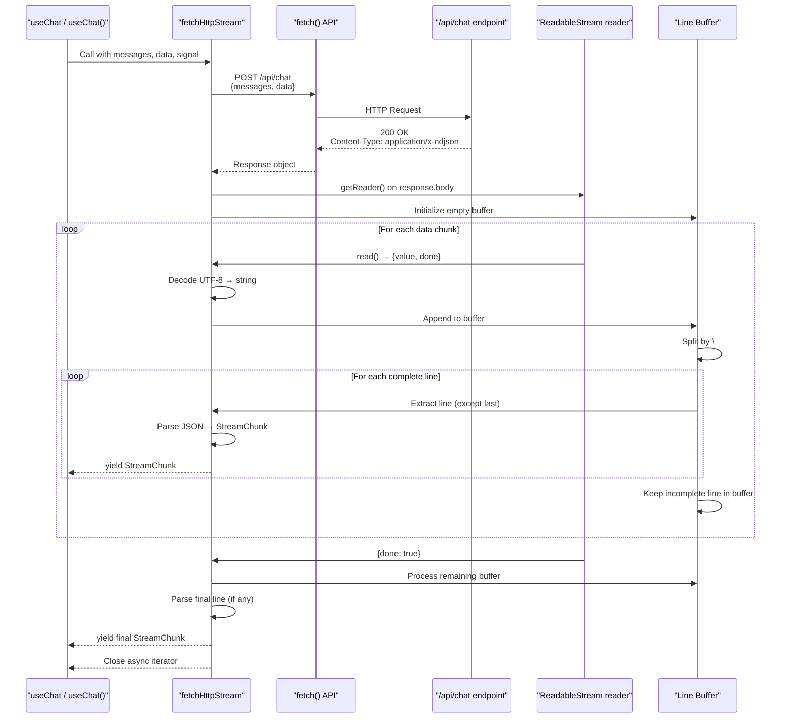
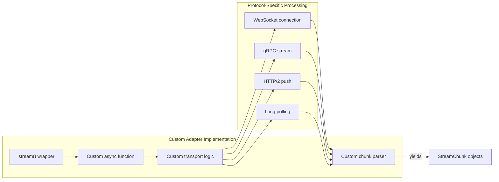
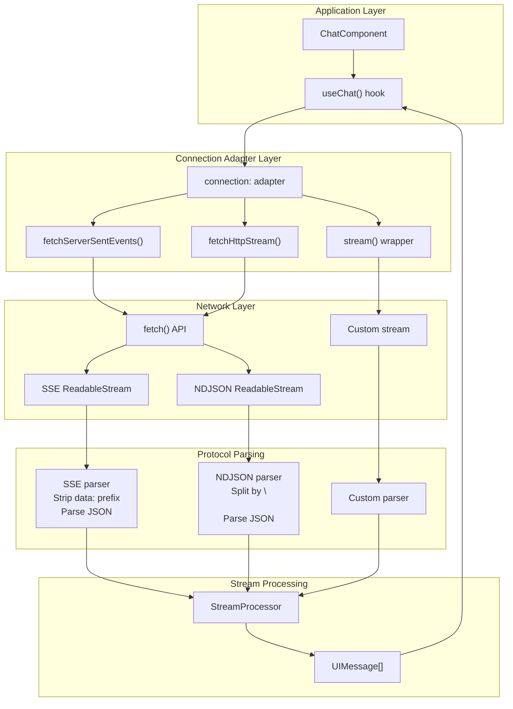
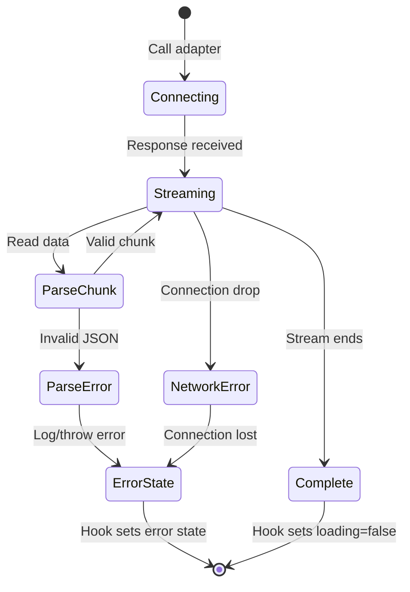

# Connection Adapters

<details>
<summary>Relevant source files</summary>

The following files were used as context for generating this wiki page:

- [docs/adapters/anthropic.md](docs/adapters/anthropic.md)
- [docs/adapters/gemini.md](docs/adapters/gemini.md)
- [docs/adapters/ollama.md](docs/adapters/ollama.md)
- [docs/adapters/openai.md](docs/adapters/openai.md)
- [docs/api/ai.md](docs/api/ai.md)
- [docs/getting-started/overview.md](docs/getting-started/overview.md)
- [docs/getting-started/quick-start.md](docs/getting-started/quick-start.md)
- [docs/guides/client-tools.md](docs/guides/client-tools.md)
- [docs/guides/server-tools.md](docs/guides/server-tools.md)
- [docs/guides/streaming.md](docs/guides/streaming.md)
- [docs/guides/tool-approval.md](docs/guides/tool-approval.md)
- [docs/guides/tool-architecture.md](docs/guides/tool-architecture.md)
- [docs/guides/tools.md](docs/guides/tools.md)
- [docs/protocol/chunk-definitions.md](docs/protocol/chunk-definitions.md)
- [docs/protocol/http-stream-protocol.md](docs/protocol/http-stream-protocol.md)
- [docs/protocol/sse-protocol.md](docs/protocol/sse-protocol.md)
- [examples/ts-svelte-chat/CHANGELOG.md](examples/ts-svelte-chat/CHANGELOG.md)
- [examples/ts-svelte-chat/package.json](examples/ts-svelte-chat/package.json)
- [examples/ts-vue-chat/CHANGELOG.md](examples/ts-vue-chat/CHANGELOG.md)
- [examples/ts-vue-chat/package.json](examples/ts-vue-chat/package.json)
- [packages/typescript/ai-gemini/CHANGELOG.md](packages/typescript/ai-gemini/CHANGELOG.md)
- [packages/typescript/ai-openai/CHANGELOG.md](packages/typescript/ai-openai/CHANGELOG.md)
- [packages/typescript/smoke-tests/adapters/CHANGELOG.md](packages/typescript/smoke-tests/adapters/CHANGELOG.md)
- [packages/typescript/smoke-tests/adapters/package.json](packages/typescript/smoke-tests/adapters/package.json)
- [packages/typescript/smoke-tests/e2e/CHANGELOG.md](packages/typescript/smoke-tests/e2e/CHANGELOG.md)
- [packages/typescript/smoke-tests/e2e/package.json](packages/typescript/smoke-tests/e2e/package.json)

</details>

Connection adapters provide the transport layer between client-side framework hooks and server-side chat endpoints. They handle streaming protocols, chunk parsing, error recovery, and connection lifecycle management. The `@tanstack/ai-client` package and framework-specific packages expose three connection adapter implementations: `fetchServerSentEvents()` (SSE protocol), `fetchHttpStream()` (NDJSON protocol), and `stream()` (custom protocol wrapper).

For information about the streaming chunk types that flow through connection adapters, see [StreamChunk Types](#5.1). For details about server-side response generation, see [Streaming Response Utilities](#3.5).

## Connection Adapter Pattern

Connection adapters implement a standardized interface that accepts request parameters and returns an async iterable of `StreamChunk` objects. Framework hooks like `useChat` accept a connection adapter via their `connection` option, enabling protocol-agnostic streaming.



**Sources:** [docs/guides/streaming.md:91-132](), [docs/protocol/sse-protocol.md:1-355](), [docs/protocol/http-stream-protocol.md:1-430]()

### Connection Adapter Interface

All connection adapters conform to a function signature that framework hooks expect:

```typescript
type ConnectionAdapter = (
  messages: ModelMessage[],
  data?: Record<string, any>,
  signal?: AbortSignal
) => AsyncIterable<StreamChunk>
```

Framework hooks call the adapter with the current message history, optional request data, and an `AbortSignal` for cancellation. The adapter returns an async iterable that yields `StreamChunk` objects as they arrive from the server.

**Sources:** [docs/guides/streaming.md:91-149](), [docs/getting-started/quick-start.md:124-147]()

## fetchServerSentEvents

The `fetchServerSentEvents()` function creates a connection adapter for the Server-Sent Events (SSE) protocol. This is the **recommended** transport for most applications due to its standardized format, automatic reconnection, and wide browser support.

### Basic Usage

```typescript
import { useChat, fetchServerSentEvents } from '@tanstack/ai-react'

const { messages, sendMessage } = useChat({
  connection: fetchServerSentEvents('/api/chat'),
})
```

The adapter makes POST requests to the specified endpoint, sending `messages` and optional `data` in the request body as JSON. It reads the response body as an SSE stream, parsing each `data:` line as a JSON-encoded `StreamChunk`.

**Sources:** [docs/getting-started/quick-start.md:129-147](), [docs/guides/streaming.md:95-103]()

### SSE Protocol Format

`fetchServerSentEvents` expects the server to send chunks in this format:

```
data: {JSON_ENCODED_CHUNK}\
\

```

Each chunk is prefixed with `data: `, followed by the JSON payload, and terminated with a double newline. The stream ends when the server sends:

```
data: [DONE]\
\

```

**Sources:** [docs/protocol/sse-protocol.md:57-91]()

### Connection Lifecycle



**Sources:** [docs/protocol/sse-protocol.md:92-139](), [docs/protocol/sse-protocol.md:196-213]()

### Request and Response Headers

**Request Headers:**

- `Content-Type: application/json`

**Response Headers:**

- `Content-Type: text/event-stream`
- `Cache-Control: no-cache`
- `Connection: keep-alive`

The adapter validates the response `Content-Type` to ensure the server is sending SSE format. It handles connection drops by allowing the browser's built-in reconnection logic (though custom reconnection is not implemented in the base adapter).

**Sources:** [docs/protocol/sse-protocol.md:18-54]()

### Error Handling

When the server sends an `ErrorStreamChunk`, the adapter yields it to the framework hook, which stores it in the `error` state:

```typescript
{
  type: "error",
  id: "msg_1",
  model: "gpt-5.2",
  timestamp: 1701234567893,
  error: {
    message: "Rate limit exceeded",
    code: "rate_limit_exceeded"
  }
}
```

The adapter closes the connection after an error chunk. Framework hooks expose the error via their `error` property and set `isLoading` to `false`.

**Sources:** [docs/protocol/sse-protocol.md:144-160](), [docs/protocol/chunk-definitions.md:309-346]()

## fetchHttpStream

The `fetchHttpStream()` function creates a connection adapter for HTTP streaming with newline-delimited JSON (NDJSON). This protocol has lower overhead than SSE but lacks automatic reconnection and a standard browser API.

### Basic Usage

```typescript
import { useChat, fetchHttpStream } from '@tanstack/ai-react'

const { messages, sendMessage } = useChat({
  connection: fetchHttpStream('/api/chat'),
})
```

The adapter makes POST requests to the specified endpoint and reads the response as a stream of newline-delimited JSON objects. Each line contains a complete `StreamChunk`.

**Sources:** [docs/guides/streaming.md:105-113](), [docs/protocol/http-stream-protocol.md:1-430]()

### NDJSON Protocol Format

`fetchHttpStream` expects the server to send chunks in this format:

```
{JSON_ENCODED_CHUNK}\

```

Each line is a complete JSON object representing a `StreamChunk`, with no prefixes or delimiters beyond the newline. The stream ends when the connection closes (no explicit `[DONE]` marker).

**Sources:** [docs/protocol/http-stream-protocol.md:65-103]()

### Connection Lifecycle



**Sources:** [docs/protocol/http-stream-protocol.md:105-143](), [docs/protocol/http-stream-protocol.md:278-323]()

### Request and Response Headers

**Request Headers:**

- `Content-Type: application/json`

**Response Headers:**

- `Content-Type: application/x-ndjson` (or `application/json`)
- `Transfer-Encoding: chunked`

Unlike SSE, the NDJSON protocol does not require `Cache-Control` or `Connection` headers. The adapter uses the `Transfer-Encoding: chunked` mechanism for streaming.

**Sources:** [docs/protocol/http-stream-protocol.md:44-62]()

### Comparison with SSE

| Feature | fetchServerSentEvents (SSE) | fetchHttpStream (NDJSON) |
| ------- | --------------------------- | ------------------------ |
| Format  | `data: {json}\              |

\
`|`{json}\
`|
| Overhead | Higher (prefix + double newline) | Lower (just newline) |
| Auto-reconnect | ✅ Browser-native support | ❌ Manual implementation needed |
| Completion marker |`data: [DONE]\
\
` | Connection close |
| Browser API | EventSource (not used by adapter) | None |
| Use case | Standard streaming, recommended | Custom protocols, lower overhead |

**Sources:** [docs/protocol/http-stream-protocol.md:327-339]()

## Custom Connection Adapters

The `stream()` function wraps a custom async function to create a connection adapter. This enables implementing custom transport protocols, WebSocket connections, or specialized streaming logic.

### Using the stream() Wrapper

```typescript
import { useChat, stream } from '@tanstack/ai-react'

const { messages } = useChat({
  connection: stream(async (messages, data, signal) => {
    // Custom implementation
    const response = await fetch('/api/chat', {
      method: 'POST',
      body: JSON.stringify({ messages, ...data }),
      signal,
    })

    // Return async iterable of StreamChunk
    return processCustomStream(response)
  }),
})
```

The wrapped function receives:

- `messages`: Current message history (`ModelMessage[]`)
- `data`: Optional request data (`Record<string, any>`)
- `signal`: `AbortSignal` for cancellation

It must return an `AsyncIterable<StreamChunk>` that yields chunks as they become available.

**Sources:** [docs/guides/streaming.md:115-132]()

### Custom Protocol Example



**Sources:** [docs/guides/streaming.md:115-132]()

### Example: WebSocket Adapter

```typescript
const wsAdapter = stream(async (messages, data, signal) => {
  const ws = new WebSocket('ws://localhost:3000/chat')

  ws.send(JSON.stringify({ messages, ...data }))

  signal?.addEventListener('abort', () => ws.close())

  async function* readChunks() {
    for await (const message of ws) {
      const chunk = JSON.parse(message.data)
      yield chunk as StreamChunk
    }
  }

  return readChunks()
})
```

This pattern allows integrating any transport mechanism while maintaining compatibility with framework hooks.

**Sources:** [docs/guides/streaming.md:115-132]()

## Transport Layer Integration

Connection adapters sit between framework hooks and the network layer, handling the protocol details so hooks can work with a consistent `StreamChunk` interface.



**Sources:** [docs/guides/streaming.md:91-132](), [docs/protocol/sse-protocol.md:196-213](), [docs/protocol/http-stream-protocol.md:258-323]()

### Chunk Flow from Server to Client

The following table shows how a `ContentStreamChunk` flows through the transport layers:

| Layer                          | SSE Format                  | NDJSON Format               |
| ------------------------------ | --------------------------- | --------------------------- |
| Server generates               | `ContentStreamChunk` object | `ContentStreamChunk` object |
| `toServerSentEventsResponse()` | Wraps: `data: {JSON}\       |

\
`| N/A (custom implementation) |
| Custom NDJSON handler | N/A | Wraps:`{JSON}\
`|
| Network transport | Text stream with SSE format | Text stream with NDJSON format |
|`fetchServerSentEvents()`| Strips`data: `, parses JSON | N/A |
| `fetchHttpStream()`| N/A | Splits by`\
`, parses JSON |
| Adapter output | `ContentStreamChunk`object |`ContentStreamChunk`object |
|`StreamProcessor`| Accumulates into`UIMessage`| Accumulates into`UIMessage`|
|`useChat()`hook | Returns`messages`array | Returns`messages` array |

**Sources:** [docs/protocol/sse-protocol.md:169-192](), [docs/protocol/http-stream-protocol.md:169-217]()

## Error Handling and Reconnection

Connection adapters handle various error conditions during streaming, including network failures, malformed responses, and server errors.

### Network Error Handling



**Sources:** [docs/protocol/sse-protocol.md:144-160](), [docs/protocol/http-stream-protocol.md:144-164]()

### Error Types

| Error Type         | Cause                       | Adapter Behavior                     |
| ------------------ | --------------------------- | ------------------------------------ |
| Network failure    | Connection drop, timeout    | Throws error, hook catches           |
| Parse error        | Invalid JSON in chunk       | Logs warning, continues parsing      |
| HTTP error         | Non-200 status code         | Throws error with status             |
| Server error chunk | `ErrorStreamChunk` received | Yields chunk, hook stores in `error` |
| Abort signal       | User cancels request        | Closes stream, throws abort error    |

**Sources:** [docs/protocol/sse-protocol.md:144-160](), [docs/protocol/chunk-definitions.md:309-346]()

### Cancellation Support

All connection adapters respect the `AbortSignal` passed from framework hooks, enabling request cancellation:

```typescript
const { stop } = useChat({
  connection: fetchServerSentEvents('/api/chat'),
})

// Cancel the current stream
stop()
```

The `stop()` method aborts the underlying `fetch()` request, causing the connection adapter to stop yielding chunks and close the stream.

**Sources:** [docs/guides/streaming.md:152-161]()

### Reconnection

**SSE Protocol:** The SSE specification includes automatic reconnection, but `fetchServerSentEvents` does not currently implement retry logic. Reconnection must be handled at the application level by calling `sendMessage()` again.

**NDJSON Protocol:** The NDJSON protocol has no built-in reconnection. Applications must implement retry logic manually.

**Best Practice:** Implement exponential backoff at the application level when retrying failed requests.

**Sources:** [docs/protocol/sse-protocol.md:154-160](), [docs/protocol/http-stream-protocol.md:158-164]()

## Best Practices

### When to Use SSE vs NDJSON

**Use `fetchServerSentEvents` (SSE) when:**

- Building standard chat applications
- Browser compatibility is important
- You want standardized SSE format
- Debugging with browser DevTools is valuable

**Use `fetchHttpStream` (NDJSON) when:**

- Minimizing protocol overhead is critical
- Building custom streaming infrastructure
- You have existing NDJSON tooling
- You need maximum control over the format

**Use `stream()` wrapper when:**

- Implementing WebSocket connections
- Integrating with gRPC or other protocols
- Building custom transport mechanisms
- You need specialized connection logic

**Sources:** [docs/protocol/http-stream-protocol.md:327-339](), [docs/guides/streaming.md:91-175]()

### Configuration Patterns

**Framework-Specific Examples:**

React:

```typescript
import { useChat, fetchServerSentEvents } from '@tanstack/ai-react'
```

Solid:

```typescript
import { useChat, fetchServerSentEvents } from '@tanstack/ai-solid'
```

Vue:

```typescript
import { useChat, fetchServerSentEvents } from '@tanstack/ai-vue'
```

All framework packages export the same connection adapter functions with identical interfaces.

**Sources:** [docs/getting-started/quick-start.md:129-147](), [examples/ts-vue-chat/package.json:12-25](), [examples/ts-svelte-chat/package.json:14-27]()

### Server-Side Considerations

Connection adapters expect specific server response formats. Use the appropriate server-side utilities:

**For SSE (recommended):**

```typescript
import { chat, toServerSentEventsResponse } from '@tanstack/ai'

const stream = chat({ adapter, messages })
return toServerSentEventsResponse(stream)
```

**For NDJSON (custom):**

```typescript
import { chat } from '@tanstack/ai'

const stream = chat({ adapter, messages })
// Custom NDJSON response implementation
```

**Sources:** [docs/getting-started/quick-start.md:19-76](), [docs/protocol/sse-protocol.md:169-192](), [docs/protocol/http-stream-protocol.md:169-217]()
