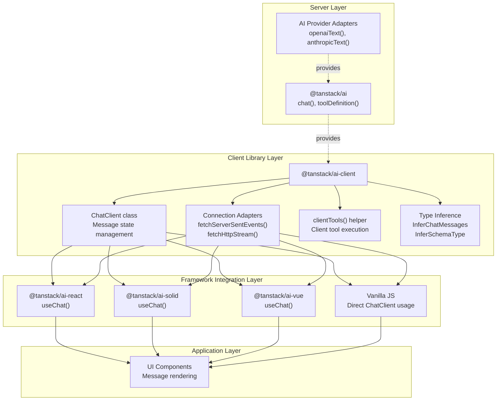
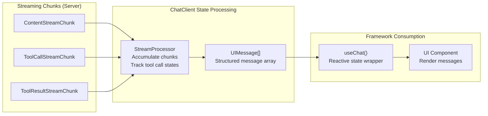
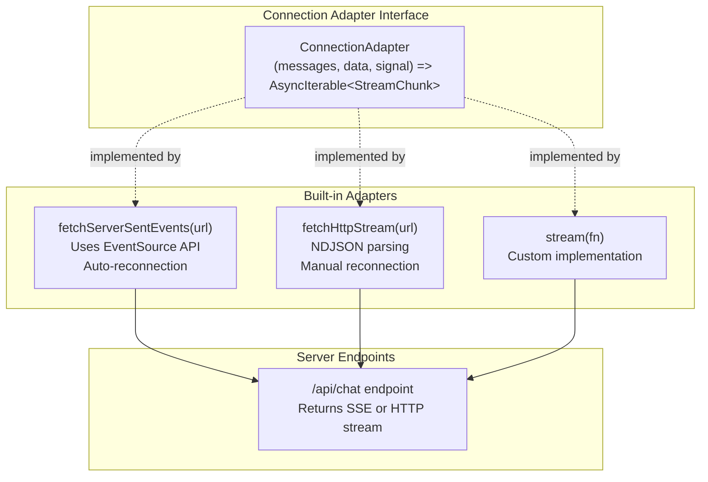
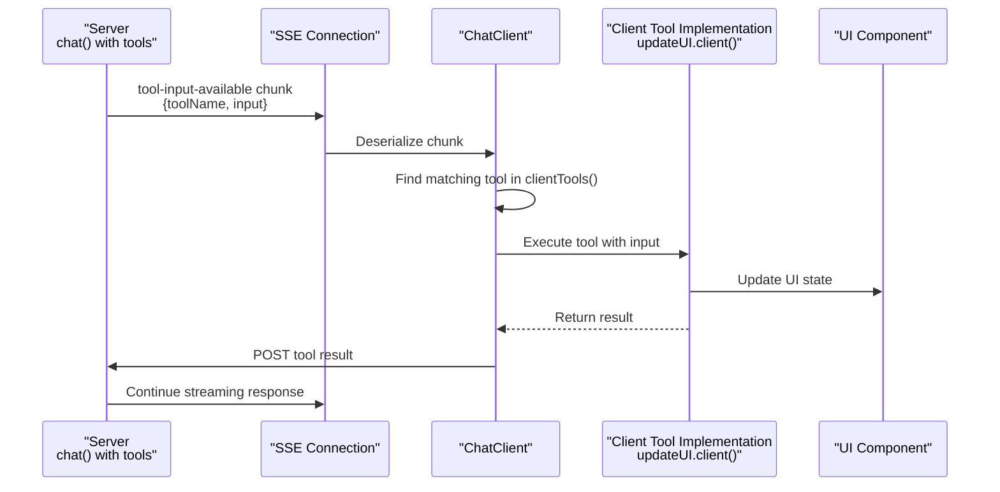

# Client Libraries

<details>
<summary>Relevant source files</summary>

The following files were used as context for generating this wiki page:

- [README.md](README.md)
- [docs/api/ai.md](docs/api/ai.md)
- [docs/getting-started/overview.md](docs/getting-started/overview.md)
- [docs/guides/client-tools.md](docs/guides/client-tools.md)
- [docs/guides/server-tools.md](docs/guides/server-tools.md)
- [docs/guides/streaming.md](docs/guides/streaming.md)
- [docs/guides/tool-approval.md](docs/guides/tool-approval.md)
- [docs/guides/tool-architecture.md](docs/guides/tool-architecture.md)
- [docs/guides/tools.md](docs/guides/tools.md)
- [docs/protocol/chunk-definitions.md](docs/protocol/chunk-definitions.md)
- [docs/protocol/http-stream-protocol.md](docs/protocol/http-stream-protocol.md)
- [docs/protocol/sse-protocol.md](docs/protocol/sse-protocol.md)
- [examples/vanilla-chat/package.json](examples/vanilla-chat/package.json)
- [packages/typescript/ai-client/README.md](packages/typescript/ai-client/README.md)
- [packages/typescript/ai-client/package.json](packages/typescript/ai-client/package.json)
- [packages/typescript/ai-devtools/README.md](packages/typescript/ai-devtools/README.md)
- [packages/typescript/ai-devtools/package.json](packages/typescript/ai-devtools/package.json)
- [packages/typescript/ai-gemini/README.md](packages/typescript/ai-gemini/README.md)
- [packages/typescript/ai-ollama/README.md](packages/typescript/ai-ollama/README.md)
- [packages/typescript/ai-openai/README.md](packages/typescript/ai-openai/README.md)
- [packages/typescript/ai-react-ui/README.md](packages/typescript/ai-react-ui/README.md)
- [packages/typescript/ai-react/README.md](packages/typescript/ai-react/README.md)
- [packages/typescript/ai/README.md](packages/typescript/ai/README.md)
- [packages/typescript/ai/package.json](packages/typescript/ai/package.json)
- [packages/typescript/react-ai-devtools/README.md](packages/typescript/react-ai-devtools/README.md)
- [packages/typescript/react-ai-devtools/package.json](packages/typescript/react-ai-devtools/package.json)
- [packages/typescript/solid-ai-devtools/README.md](packages/typescript/solid-ai-devtools/README.md)
- [packages/typescript/solid-ai-devtools/package.json](packages/typescript/solid-ai-devtools/package.json)

</details>

The `@tanstack/ai-client` package provides framework-agnostic, headless state management for AI chat interactions. It handles streaming connections, message state, client-side tool execution, and approval workflows without being tied to any specific UI framework.

For server-side AI capabilities (adapters, tool definitions, streaming utilities), see [Core Library](#3). For framework-specific hooks that wrap this client, see [Framework Integrations](#6).

## Purpose and Scope

This document covers the `@tanstack/ai-client` package, which serves as the middle layer between the server-side `@tanstack/ai` core and framework-specific integrations. It provides:

- **State Management**: Maintains conversation history as `UIMessage[]` arrays
- **Connection Management**: Abstracts streaming protocols (SSE, HTTP, custom)
- **Tool Execution**: Handles client-side tool calls and approval workflows
- **Type Safety**: Provides type inference from tool definitions to message types

Sources: [packages/typescript/ai-client/package.json:1-53](), [docs/getting-started/overview.md:69-75]()

## Architecture Overview



**The Client Library as Middleware**

The `@tanstack/ai-client` package acts as a framework-agnostic middleware that:

1. Receives streaming chunks from server endpoints
2. Maintains conversation state as structured `UIMessage` objects
3. Executes client-side tools when requested
4. Provides type-safe interfaces for framework hooks to consume

Sources: [docs/getting-started/overview.md:69-89](), [packages/typescript/ai-client/package.json:1-53]()

## Package Exports

The `@tanstack/ai-client` package exports the following primary entities:

| Export                    | Type     | Purpose                                    |
| ------------------------- | -------- | ------------------------------------------ |
| `ChatClient`              | Class    | Core state management class                |
| `fetchServerSentEvents`   | Function | SSE connection adapter factory             |
| `fetchHttpStream`         | Function | HTTP stream connection adapter factory     |
| `stream`                  | Function | Custom connection adapter factory          |
| `clientTools`             | Function | Type-safe tool array builder               |
| `createChatClientOptions` | Function | Options object builder with type inference |
| `InferChatMessages`       | Type     | Infer message types from chat options      |
| `InferSchemaType`         | Type     | Infer types from Zod/JSON schemas          |

Sources: [packages/typescript/ai-client/package.json:20-28](), [docs/guides/client-tools.md:119-154]()

## Core Concepts

### Headless State Management

The client library maintains conversation state independently of any UI framework. State is represented as an array of `UIMessage` objects, where each message contains:

- **Basic properties**: `id`, `role`, `createdAt`
- **Parts array**: Array of `ContentPart | ThinkingPart | ToolCallPart | ToolResultPart`
- **Metadata**: `isLoading`, `error`, etc.



**State Update Flow**

1. Server sends `StreamChunk` objects via SSE/HTTP
2. Connection adapter deserializes chunks
3. `ChatClient` (or `StreamProcessor` internally) updates `UIMessage[]` array
4. Framework hooks reactively update UI

Sources: [docs/getting-started/overview.md:70-75](), [docs/guides/streaming.md:9-64]()

### Connection Adapters

Connection adapters abstract the transport protocol between client and server. They implement a common interface that returns an async iterable of `StreamChunk` objects.



**Adapter Selection**

- **SSE (Recommended)**: Use `fetchServerSentEvents()` for most applications. Provides automatic reconnection and standard browser support.
- **HTTP Stream**: Use `fetchHttpStream()` for lower overhead or custom requirements.
- **Custom**: Use `stream()` to implement custom protocols (WebSocket, polling, etc.).

Sources: [docs/guides/streaming.md:90-133](), [docs/protocol/sse-protocol.md:1-355](), [docs/protocol/http-stream-protocol.md:1-430]()

### Client-Side Tool Execution

Client tools execute in the browser when the server determines a tool has no server-side implementation. The flow is:



**Automatic Execution**

When `clientTools()` is used to define client tool implementations, the `ChatClient` automatically:

1. Receives `tool-input-available` chunks from the server
2. Matches the tool name to the local implementation
3. Executes the tool with validated arguments
4. Sends the result back to the server
5. Continues the conversation with the result

Sources: [docs/guides/client-tools.md:43-98](), [docs/guides/client-tools.md:199-209]()

### Type Safety and Inference

The client library provides compile-time type safety through TypeScript generics and type inference. The `InferChatMessages` type extracts precise types from chat options:

**Type Inference Flow**

```typescript
// From code example in docs/guides/client-tools.md:119-197

// 1. Define tool with Zod schema
const updateUIDef = toolDefinition({
  name: "update_ui",
  inputSchema: z.object({
    message: z.string(),
    type: z.enum(["success", "error", "info\
```
