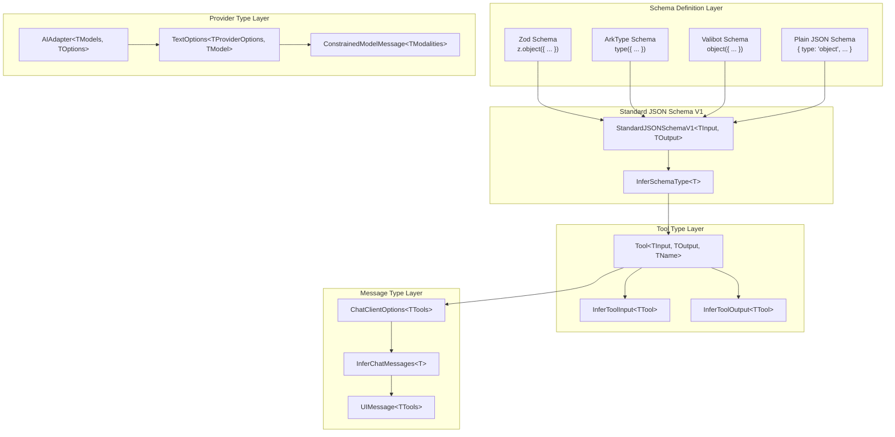
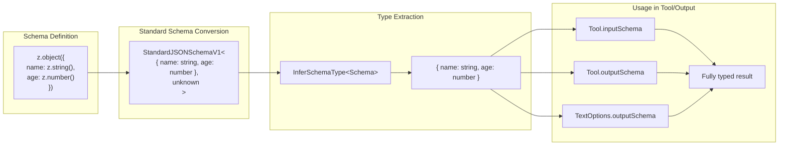
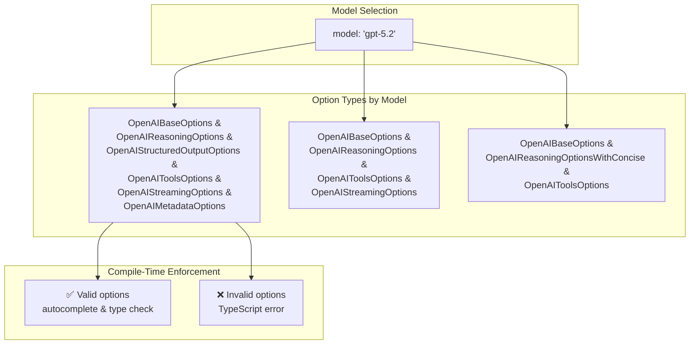
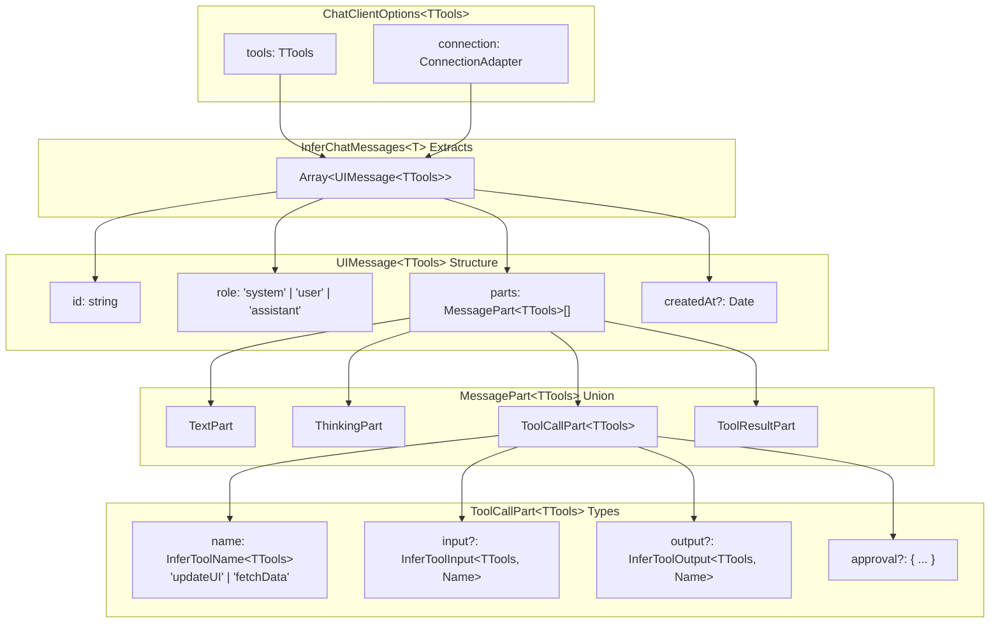
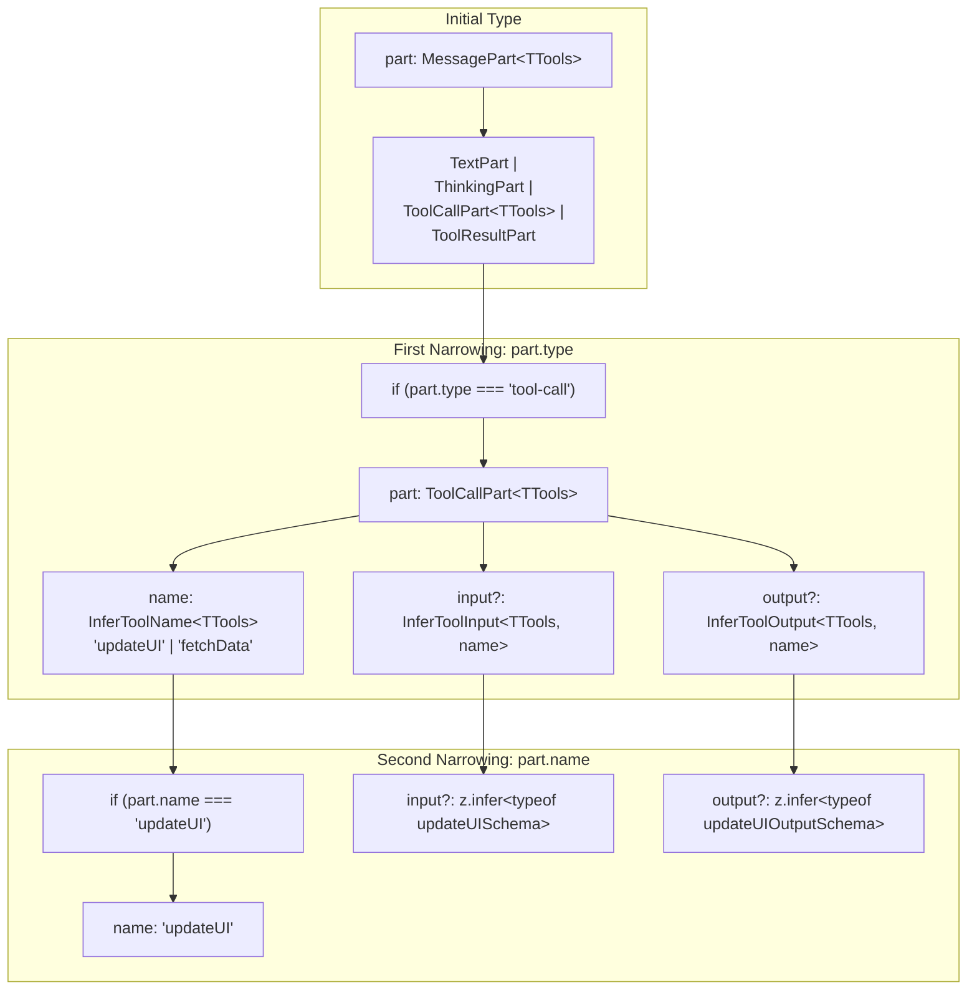
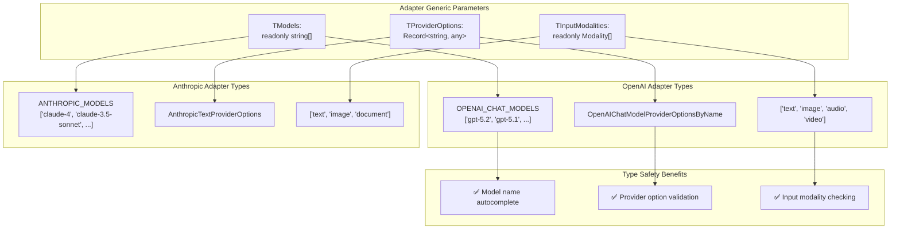

# Type Safety and Inference

<details>
<summary>Relevant source files</summary>

The following files were used as context for generating this wiki page:

- [docs/community-adapters/decart.md](docs/community-adapters/decart.md)
- [docs/community-adapters/guide.md](docs/community-adapters/guide.md)
- [docs/config.json](docs/config.json)
- [docs/guides/structured-outputs.md](docs/guides/structured-outputs.md)
- [packages/typescript/ai-anthropic/package.json](packages/typescript/ai-anthropic/package.json)
- [packages/typescript/ai-anthropic/src/text/text-provider-options.ts](packages/typescript/ai-anthropic/src/text/text-provider-options.ts)
- [packages/typescript/ai-gemini/package.json](packages/typescript/ai-gemini/package.json)
- [packages/typescript/ai-ollama/package.json](packages/typescript/ai-ollama/package.json)
- [packages/typescript/ai-openai/package.json](packages/typescript/ai-openai/package.json)
- [packages/typescript/ai-openai/src/text/text-provider-options.ts](packages/typescript/ai-openai/src/text/text-provider-options.ts)
- [packages/typescript/ai-react-ui/package.json](packages/typescript/ai-react-ui/package.json)
- [packages/typescript/ai-react/package.json](packages/typescript/ai-react/package.json)
- [packages/typescript/ai-solid-ui/package.json](packages/typescript/ai-solid-ui/package.json)
- [packages/typescript/ai-solid/package.json](packages/typescript/ai-solid/package.json)
- [packages/typescript/ai-svelte/package.json](packages/typescript/ai-svelte/package.json)
- [packages/typescript/ai-vue-ui/package.json](packages/typescript/ai-vue-ui/package.json)
- [packages/typescript/ai-vue/package.json](packages/typescript/ai-vue/package.json)
- [packages/typescript/ai/src/types.ts](packages/typescript/ai/src/types.ts)

</details>

TanStack AI provides comprehensive compile-time type safety through TypeScript type inference. The type system ensures that schemas, tool definitions, provider options, and message structures are fully typed without manual type assertions.

This page covers the core type inference mechanisms:

- **`InferSchemaType<T>`** - Extracts TypeScript types from Standard JSON Schema objects
- **Schema-based type inference** - How Zod, ArkType, and Valibot schemas provide compile-time types
- **`InferChatMessages<T>`** - Extracts message types from chat configuration
- **Provider-specific type safety** - Per-model options and modality constraints

For tool-specific type safety patterns, see [Isomorphic Tool System](#3.2). For client-side tool type inference, see [Client-Side Tools](#4.3).

## Overview

TanStack AI's type system provides three layers of type safety:

1. **Schema Type Inference** - Extract types from Zod/ArkType/Valibot schemas or Standard JSON Schema objects
2. **Provider Type Safety** - Model-specific options and input modality constraints enforced at compile time
3. **Message Type Inference** - Full type safety from chat configuration through to UI rendering

The type system eliminates runtime errors by catching type mismatches at compile time, including invalid tool arguments, unsupported modalities, and incorrect provider options.

## Type System Architecture



**Title: TanStack AI Type System Layers**

Sources: [packages/typescript/ai/src/types.ts:1-85](), [docs/guides/structured-outputs.md:1-301]()

## InferSchemaType and Schema Type Inference

The `InferSchemaType<T>` utility extracts TypeScript types from Standard JSON Schema objects, enabling compile-time type safety for tool inputs, outputs, and structured responses.

### Type Definition

The `InferSchemaType<T>` type is defined at [packages/typescript/ai/src/types.ts:84-85]():

```typescript
type InferSchemaType<T> =
  T extends StandardJSONSchemaV1<infer TInput, unknown> ? TInput : unknown
```

This type extracts the input type from any Standard JSON Schema compliant schema. For plain JSON Schema objects, it returns `unknown` since TypeScript cannot infer types from JSON Schema at compile time.

### Standard JSON Schema Support

TanStack AI uses the [Standard JSON Schema](https://standardschema.dev/) specification, which allows any compliant schema library to provide compile-time types:

| Schema Library    | Native Support                   | Type Inference                   |
| ----------------- | -------------------------------- | -------------------------------- |
| Zod v4.2+         | ✅ Native `StandardJSONSchemaV1` | Full compile-time inference      |
| ArkType v2.1.28+  | ✅ Native `StandardJSONSchemaV1` | Full compile-time inference      |
| Valibot v1.2+     | ⚠️ Via `@valibot/to-json-schema` | Full compile-time inference      |
| Plain JSON Schema | ✅ Accepted as `JSONSchema`      | Runtime only, typed as `unknown` |

**Sources**: [packages/typescript/ai/src/types.ts:66-85](), [docs/guides/structured-outputs.md:26-34]()

### Schema Type Inference Flow



**Title: Schema Type Inference from Zod to Typed Results**

**Sources**: [packages/typescript/ai/src/types.ts:66-85](), [docs/guides/structured-outputs.md:70-112]()

### Tool Schema Type Inference

The `Tool` interface uses `InferSchemaType<T>` to extract types from input and output schemas:

```typescript
// From packages/typescript/ai/src/types.ts:328-438
interface Tool<
  TInput extends SchemaInput = SchemaInput,
  TOutput extends SchemaInput = SchemaInput,
  TName extends string = string,
> {
  name: TName
  inputSchema?: TInput
  outputSchema?: TOutput
  execute?: (
    args: InferSchemaType<TInput>
  ) => Promise<InferSchemaType<TOutput>> | InferSchemaType<TOutput>
}
```

The `execute` function is typed to accept `InferSchemaType<TInput>` and return `InferSchemaType<TOutput>`, providing full type safety between schema definition and implementation.

**Type Safety Benefits**:

- Tool implementations must match schema types
- TypeScript catches type mismatches at compile time
- Autocomplete works for all schema-defined properties
- Refactoring schemas updates all usage sites

**Sources**: [packages/typescript/ai/src/types.ts:328-438]()

### Structured Output Type Inference

When using `outputSchema` with `chat()`, the return type changes from `AsyncIterable<StreamChunk>` to `Promise<InferSchemaType<TSchema>>`:

```typescript
// Without outputSchema - returns stream
const stream = chat({
  adapter: openaiText("gpt-5.2"),
  messages: [...],
})
// Type: AsyncIterable<StreamChunk>

// With outputSchema - returns typed object
const person = await chat({
  adapter: openaiText("gpt-5.2"),
  messages: [...],
  outputSchema: z.object({
    name: z.string(),
    age: z.number(),
  }),
})
// Type: { name: string, age: number }
person.name // ✅ Fully typed
person.age  // ✅ Fully typed
```

The type system automatically changes the return type based on whether `outputSchema` is provided, eliminating the need for type assertions.

**Sources**: [docs/guides/structured-outputs.md:70-112]()

### Plain JSON Schema Limitation

When using plain JSON Schema objects (not from a schema library), TypeScript cannot infer types at compile time:

```typescript
const schema: JSONSchema = {
  type: 'object',
  properties: {
    name: { type: 'string' },
    age: { type: 'number' },
  },
  required: ['name', 'age'],
}

const result = await chat({
  adapter: openaiText("gpt-5.2"),
  messages: [...],
  outputSchema: schema,
})
// Type: unknown (not { name: string, age: number })

// Requires manual type assertion
const person = result as { name: string; age: number }
```

**Recommendation**: Use Zod, ArkType, or Valibot for full compile-time type safety. Plain JSON Schema is supported for runtime validation but loses compile-time type inference.

**Sources**: [docs/guides/structured-outputs.md:222-249](), [packages/typescript/ai/src/types.ts:22-85]()

## Provider-Specific Type Safety

TanStack AI enforces provider-specific options and constraints at compile time using TypeScript generics.

### Per-Model Options

Provider adapters use generics to expose only valid options for each model:

```typescript
// From packages/typescript/ai-openai/src/text/text-provider-options.ts
interface TextOptions<
  TProviderOptionsSuperset extends Record<string, any>,
  TProviderOptionsForModel = TProviderOptionsSuperset,
> {
  model: string
  modelOptions?: TProviderOptionsForModel
  // ...
}
```

The `modelOptions` parameter is typed per-model, ensuring only supported options are accessible:



**Title: Per-Model Type Safety for Provider Options**

**Sources**: [packages/typescript/ai-openai/src/text/text-provider-options.ts:16-243]()

### Input Modality Constraints

Models support different input modalities (text, image, audio, video, document). TanStack AI enforces these constraints at compile time using `ConstrainedModelMessage<T>`:

```typescript
// From packages/typescript/ai/src/types.ts:308-313
type ConstrainedModelMessage<
  TInputModalitiesTypes extends InputModalitiesTypes,
> = Omit<ModelMessage, 'content'> & {
  content: ConstrainedContent<TInputModalitiesTypes>
}
```

The `content` field is constrained to only allow `ContentPart` types matching the model's supported modalities:

```typescript
// Model with text + image support
type TextImageMessage = ConstrainedModelMessage<{
  inputModalities: readonly ['text', 'image']
  messageMetadataByModality: DefaultMessageMetadataByModality
}>

// Valid: text and image parts allowed
const message: TextImageMessage = {
  role: 'user',
  content: [
    { type: 'text', content: 'Describe this image' },
    { type: 'image', source: { type: 'url', value: '...' } },
  ],
}

// Invalid: audio not supported - TypeScript error
const invalid: TextImageMessage = {
  role: 'user',
  content: [
    { type: 'audio', source: { type: 'data', value: '...' } }, // ❌ Error
  ],
}
```

**Type Safety Benefits**:

- Prevents sending unsupported modalities to models
- Autocomplete shows only valid `ContentPart` types
- Compile-time errors when using unsupported modalities

**Sources**: [packages/typescript/ai/src/types.ts:100-231]()

### Provider Option Validation

Providers validate options at runtime and compile time. Example from Anthropic adapter:

```typescript
// From packages/typescript/ai-anthropic/src/text/text-provider-options.ts:158-204
const validateTopPandTemperature = (options: InternalTextProviderOptions) => {
  if (options.top_p !== undefined && options.temperature !== undefined) {
    throw new Error('You should either set top_p or temperature, but not both.')
  }
}

const validateThinking = (options: InternalTextProviderOptions) => {
  const thinking = options.thinking
  if (thinking && thinking.type === 'enabled') {
    if (thinking.budget_tokens < 1024) {
      throw new Error('thinking.budget_tokens must be at least 1024.')
    }
    if (thinking.budget_tokens >= options.max_tokens) {
      throw new Error('thinking.budget_tokens must be less than max_tokens.')
    }
  }
}
```

**Validation Strategy**: TypeScript provides compile-time type checking, while runtime validation catches constraint violations (e.g., mutually exclusive options, range constraints).

**Sources**: [packages/typescript/ai-anthropic/src/text/text-provider-options.ts:1-205](), [packages/typescript/ai-openai/src/text/text-provider-options.ts:310-343]()

## InferChatMessages Type Utility

The `InferChatMessages<T>` utility extracts fully-typed message arrays from chat client options, propagating tool types through to UI rendering.

### Type Extraction Pattern

```typescript
import {
  clientTools,
  createChatClientOptions,
  type InferChatMessages,
} from '@tanstack/ai-client'

// 1. Create typed tools array
const tools = clientTools(updateUI, fetchData)

// 2. Create typed chat options
const chatOptions = createChatClientOptions({
  connection: fetchServerSentEvents('/api/chat'),
  tools,
})

// 3. Extract message type
type Messages = InferChatMessages<typeof chatOptions>
// Type: Array<UIMessage<ReadonlyArray<ClientTool<'updateUI', ...> | ClientTool<'fetchData', ...>>>>
```

The utility preserves tool names, input types, and output types through the entire type chain from schema definition to UI usage.

### Message Type Structure



**Title: Message Type Structure from InferChatMessages**

**Sources**: [packages/typescript/ai/src/types.ts:283-298](), [packages/typescript/ai-preact/src/types.ts:1-99]()

### Typed Message Parts

The `MessagePart` type is a discriminated union based on the `type` field:

| Part Type              | Type Field      | Key Properties                                 |
| ---------------------- | --------------- | ---------------------------------------------- |
| `TextPart`             | `'text'`        | `content: string`                              |
| `ThinkingPart`         | `'thinking'`    | `content: string`                              |
| `ToolCallPart<TTools>` | `'tool-call'`   | `name`, `input`, `output`, `state`, `approval` |
| `ToolResultPart`       | `'tool-result'` | `toolCallId`, `content`, `state`, `error`      |

The `ToolCallPart<TTools>` is parameterized by the tools array type, enabling tool-specific type narrowing.

**Sources**: [packages/typescript/ai/src/types.ts:248-288]()

## Discriminated Union Type Narrowing

TypeScript's discriminated union narrowing provides compile-time type safety when handling message parts.

### Two-Step Narrowing Pattern

```typescript
import type { InferChatMessages } from '@tanstack/ai-client'

type Messages = InferChatMessages<typeof chatOptions>

messages.forEach((message: Messages[number]) => {
  message.parts.forEach((part) => {
    // Step 1: Narrow by part type
    if (part.type === 'tool-call') {
      // ✅ part is ToolCallPart<TTools>
      // ✅ part.name is 'updateUI' | 'fetchData' | ...

      // Step 2: Narrow by tool name
      if (part.name === 'updateUI') {
        // ✅ TypeScript knows name is literally "updateUI"
        // ✅ part.input is typed from updateUI's inputSchema
        // ✅ part.output is typed from updateUI's outputSchema

        console.log(part.input.message) // ✅ Fully typed
        console.log(part.input.type) // ✅ Literal union type

        if (part.output) {
          console.log(part.output.success) // ✅ boolean
        }
      }
    }
  })
})
```

### Type Narrowing Flow



**Title: Discriminated Union Type Narrowing Process**

**Sources**: [packages/typescript/ai/src/types.ts:248-288](), [packages/typescript/ai-preact/src/types.ts:1-99]()

### Type Safety Guarantees

Discriminated union narrowing provides compile-time guarantees:

| Scenario        | Without Type Narrowing       | With Type Narrowing         |
| --------------- | ---------------------------- | --------------------------- |
| Tool name check | `string` - any value allowed | `'updateUI'` - literal type |
| Input access    | `any` or manual cast         | Typed from schema           |
| Output access   | `any` or manual cast         | Typed from schema           |
| Misspelled name | Runtime error                | Compile error               |
| Wrong property  | Runtime error                | Compile error               |
| Refactoring     | No detection                 | Compile errors              |

**Key Benefit**: TypeScript catches errors when tool names are misspelled, properties don't exist, or schemas change without updating UI code.

**Sources**: [packages/typescript/ai/src/types.ts:254-268]()

## End-to-End Type Safety Flow

The following diagram shows the complete type flow from schema definition through to UI rendering:

```mermaid
sequenceDiagram
    participant Dev as Developer
    participant Schema as Zod/ArkType/Valibot
    participant InferType as InferSchemaType&lt;T&gt;
    participant Tool as Tool&lt;TInput, TOutput, TName&gt;
    participant Client as ClientTool&lt;TName, TInput, TOutput&gt;
    participant Options as ChatClientOptions&lt;TTools&gt;
    participant InferMsg as InferChatMessages&lt;T&gt;
    participant UI as UI Component

    Dev->>Schema: Define input/output schemas
    Note over Schema: z.object({<br/>  name: z.string(),<br/>  age: z.number()<br/>})

    Schema->>InferType: Convert to StandardJSONSchemaV1
    Note over InferType: Extract TInput type<br/>{ name: string, age: number }

    InferType->>Tool: Type tool definition
    Note over Tool: inputSchema → InferSchemaType&lt;TInput&gt;<br/>outputSchema → InferSchemaType&lt;TOutput&gt;<br/>execute: (TInput) → TOutput

    Tool->>Client: Create client implementation
    Note over Client: .client((input: TInput) → TOutput)<br/>Captures literal name 'toolName'

    Client->>Options: Add to chat options
    Note over Options: tools: ReadonlyArray&lt;ClientTool&lt;...&gt;&gt;<br/>Preserves tool types

    Options->>InferMsg: Extract message types
    Note over InferMsg: Array&lt;UIMessage&lt;TTools&gt;&gt;<br/>ToolCallPart&lt;TTools&gt; has typed input/output

    InferMsg->>UI: Render with type safety
    Note over UI: if (part.type === 'tool-call')<br/>  if (part.name === 'toolName')<br/>    part.input: TInput ✅<br/>    part.output: TOutput ✅
```

**Title: End-to-End Type Safety from Schema to UI**

**Sources**: [packages/typescript/ai/src/types.ts:77-438](), [docs/guides/client-tools.md:117-198]()

## Type Safety Across Adapters

TanStack AI's type system works consistently across all provider adapters while allowing provider-specific options.

### Generic Adapter Interface

All adapters implement the `AIAdapter` interface with generic type parameters:

```typescript
// Simplified from packages/typescript/ai/src/types.ts
interface AIAdapter<
  TModels extends ReadonlyArray<string>,
  TProviderOptions,
  TInputModalities extends ReadonlyArray<Modality>,
> {
  models: TModels
  supportedModalities: TInputModalities
  chatStream(options: TextOptions<TProviderOptions>): AsyncIterable<StreamChunk>
  // ...
}
```

The generics enable:

- **`TModels`** - Literal union of model names for autocomplete
- **`TProviderOptions`** - Provider-specific options (e.g., OpenAI's `reasoning`, Anthropic's `thinking`)
- **`TInputModalities`** - Supported input modalities for content validation

**Sources**: [packages/typescript/ai/src/types.ts:1020-1072]()

### Adapter Type Mapping



**Title: Type Mapping Across Provider Adapters**

**Sources**: [packages/typescript/ai-openai/src/text/text-provider-options.ts:1-343](), [packages/typescript/ai-anthropic/src/text/text-provider-options.ts:1-205]()

## Compile-Time Type Safety Benefits

TanStack AI's type system catches errors at compile time rather than runtime:

| Error Category           | Compile-Time Detection | Example                                        |
| ------------------------ | ---------------------- | ---------------------------------------------- |
| Tool name typos          | ✅ TypeScript error    | `if (part.name === 'udpateUI')` - not in union |
| Missing properties       | ✅ TypeScript error    | `part.input.mesage` - property doesn't exist   |
| Wrong property type      | ✅ TypeScript error    | `part.input.age = "25"` - expects number       |
| Unsupported modality     | ✅ TypeScript error    | Sending audio to text-only model               |
| Invalid provider options | ✅ TypeScript error    | Using `reasoning` on unsupported model         |
| Schema changes           | ✅ Compile errors      | Removing schema field breaks all usages        |
| Refactoring              | ✅ Find all usages     | Renaming tool name updates all references      |

### IDE Integration

TypeScript's type system provides IDE features:

- **Autocomplete**: Shows valid tool names, properties, and options
- **Go to Definition**: Jump from UI usage to tool definition
- **Find All References**: Locate all uses of a tool
- **Rename Refactoring**: Update tool name everywhere safely
- **Type Hints**: Hover to see inferred types

**Developer Experience Impact**: Catching errors at compile time reduces debugging time, prevents runtime crashes, and makes refactoring safer.

**Sources**: [packages/typescript/ai/src/types.ts:77-438](), [docs/guides/structured-outputs.md:70-112]()

## Implementation Details

The type safety system relies on TypeScript's advanced type features:

### Tool Name as Discriminant

```typescript
// Tool definition captures name as literal type
interface ClientTool<TName extends string, TInput, TOutput> {
  name: TName // Literal type, not widened to string
  inputSchema: SchemaInput
  outputSchema: SchemaInput
  execute: (input: TInput) => Promise<TOutput> | TOutput
}
```

### Schema Type Inference

```typescript
// InferSchemaType extracts types from Standard JSON Schema
type InferSchemaType<T> =
  T extends StandardJSONSchemaV1<infer TInput, unknown> ? TInput : unknown

// Tool types use inferred schema types
type InferToolInput<TTool> = InferSchemaType<TTool['inputSchema']>
type InferToolOutput<TTool> = InferSchemaType<TTool['outputSchema']>
```

### Part Type with Tool Parameter

```typescript
// ToolCallPart is parameterized by tool array type
interface ToolCallPart<TTools extends ReadonlyArray<AnyClientTool>> {
  type: 'tool-call'
  name: InferToolName<TTools> // Union of literal tool names
  input?: InferToolInput<TTools, Name>
  output?: InferToolOutput<TTools, Name>
  // ... other fields
}
```

**Type System Constraint**: The helpers only work with Standard JSON Schema compliant libraries (Zod v4+, ArkType v2.1.28+, Valibot v1.2+) that provide `StandardJSONSchemaV1` interface. Plain JSON Schema objects are supported but lose compile-time type inference.

Sources: [packages/typescript/ai/src/types.ts:77-85](), [packages/typescript/ai-preact/src/types.ts:1-99]()

## Best Practices

1. **Always use `clientTools()`** - Never create tool arrays manually
2. **Always use `createChatClientOptions()`** - Ensures type propagation
3. **Extract message types with `InferChatMessages<>`** - Type component props
4. **Use discriminated unions** - Check `part.type` then `part.name`
5. **Type component props** - Pass `Messages[number]` to sub-components
6. **Avoid type assertions** - Let the helpers handle type inference

### Anti-Pattern Example

```typescript
// ❌ Anti-pattern: Manual array loses types
const tools = [tool1, tool2]
const { messages } = useChat({ connection, tools })
messages.forEach((m) =>
  m.parts.forEach((p) => {
    if (p.type === 'tool-call') {
      // ❌ part.name is string, not discriminated union
      // ❌ part.input is unknown
      // ❌ part.output is unknown
    }
  })
)
```

### Best Practice Example

```typescript
// ✅ Best practice: Use all helpers
const tools = clientTools(tool1, tool2)
const chatOptions = createChatClientOptions({ connection, tools })
type Messages = InferChatMessages<typeof chatOptions>

const { messages } = useChat(chatOptions)
messages.forEach((m) =>
  m.parts.forEach((p) => {
    if (p.type === 'tool-call' && p.name === 'tool1') {
      // ✅ part.name is literally 'tool1'
      // ✅ part.input is fully typed
      // ✅ part.output is fully typed
    }
  })
)
```

Sources: [docs/guides/client-tools.md:309-314](), [docs/api/ai-client.md:180-218]()
