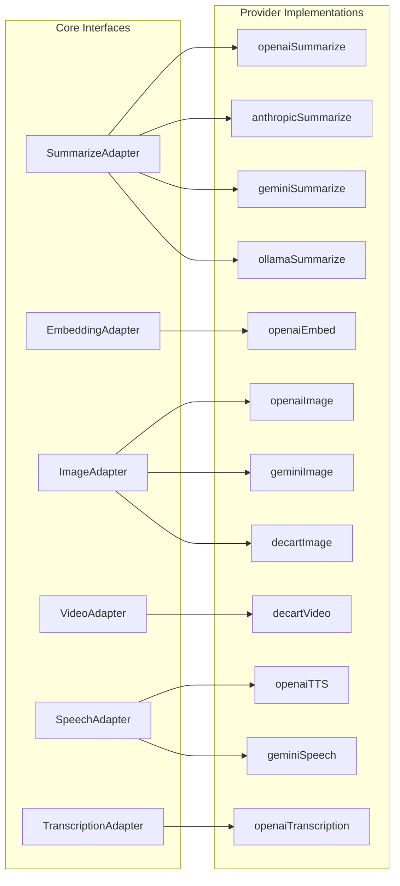

# Additional Capabilities

<details>
<summary>Relevant source files</summary>

The following files were used as context for generating this wiki page:

- [README.md](README.md)
- [docs/adapters/anthropic.md](docs/adapters/anthropic.md)
- [docs/adapters/gemini.md](docs/adapters/gemini.md)
- [docs/adapters/ollama.md](docs/adapters/ollama.md)
- [docs/adapters/openai.md](docs/adapters/openai.md)
- [docs/community-adapters/decart.md](docs/community-adapters/decart.md)
- [docs/community-adapters/guide.md](docs/community-adapters/guide.md)
- [docs/config.json](docs/config.json)
- [docs/getting-started/quick-start.md](docs/getting-started/quick-start.md)
- [docs/guides/structured-outputs.md](docs/guides/structured-outputs.md)
- [packages/typescript/ai-client/README.md](packages/typescript/ai-client/README.md)
- [packages/typescript/ai-devtools/README.md](packages/typescript/ai-devtools/README.md)
- [packages/typescript/ai-gemini/README.md](packages/typescript/ai-gemini/README.md)
- [packages/typescript/ai-ollama/README.md](packages/typescript/ai-ollama/README.md)
- [packages/typescript/ai-openai/README.md](packages/typescript/ai-openai/README.md)
- [packages/typescript/ai-react-ui/README.md](packages/typescript/ai-react-ui/README.md)
- [packages/typescript/ai-react/README.md](packages/typescript/ai-react/README.md)
- [packages/typescript/ai/README.md](packages/typescript/ai/README.md)
- [packages/typescript/react-ai-devtools/README.md](packages/typescript/react-ai-devtools/README.md)
- [packages/typescript/solid-ai-devtools/README.md](packages/typescript/solid-ai-devtools/README.md)

</details>

This document covers specialized AI capabilities provided by TanStack AI beyond conversational chat: text summarization, embeddings, image generation, video generation, text-to-speech, and audio transcription. These capabilities use dedicated functions and adapters separate from the `chat()` function documented in [chat() Function](#3.1).

## Overview

TanStack AI provides several specialized functions for non-chat AI tasks:

| Capability       | Core Function             | Purpose                                        |
| ---------------- | ------------------------- | ---------------------------------------------- |
| Summarization    | `summarize()`             | Condense long text into concise summaries      |
| Embeddings       | `embedding()`             | Generate vector embeddings for semantic search |
| Image Generation | `generateImage()`         | Generate images from text prompts              |
| Video Generation | `generateVideo()`         | Generate videos from text prompts (async)      |
| Text-to-Speech   | `generateSpeech()`        | Convert text to audio                          |
| Transcription    | `generateTranscription()` | Convert audio to text                          |

Each capability uses a specialized adapter that implements the capability-specific interface. Unlike `chat()`, which returns a stream, most of these functions return a single result object. Video generation uses an asynchronous job pattern with polling.

**Capability Architecture**

```mermaid
graph TB
    subgraph "Core Functions"
        SUMM["summarize()"]
        EMB["embedding()"]
        IMG["generateImage()"]
        VID["generateVideo()"]
        TTS["generateSpeech()"]
        TRANS["generateTranscription()"]
    end

    subgraph "OpenAI Adapters"
        OISUMM["openaiSummarize()"]
        OIEMB["openaiEmbed()"]
        OIIMG["openaiImage()"]
        OITTS["openaiTTS()"]
        OITRANS["openaiTranscription()"]
    end

    subgraph "Anthropic Adapters"
        ANTSUMM["anthropicSummarize()"]
    end

    subgraph "Gemini Adapters"
        GEMSUMM["geminiSummarize()"]
        GEMIMG["geminiImage()"]
        GEMTTS["geminiSpeech()"]
    end

    subgraph "Ollama Adapters"
        OLLSUMM["ollamaSummarize()"]
    end

    subgraph "Community Adapters"
        DECIMG["decartImage()"]
        DECVID["decartVideo()"]
    end

    SUMM --> OISUMM
    SUMM --> ANTSUMM
    SUMM --> GEMSUMM
    SUMM --> OLLSUMM

    EMB --> OIEMB

    IMG --> OIIMG
    IMG --> GEMIMG
    IMG --> DECIMG

    VID --> DECVID

    TTS --> OITTS
    TTS --> GEMTTS

    TRANS --> OITRANS
```



Sources: [docs/adapters/openai.md:1-334](), [docs/adapters/anthropic.md:1-231](), [docs/adapters/gemini.md:1-284](), [docs/adapters/ollama.md:1-293](), [docs/community-adapters/decart.md:1-249]()

## Summarization

The `summarize()` function condenses long text content into shorter summaries. It supports different summary styles and length constraints.

### API

```typescript
import { summarize } from '@tanstack/ai'
import { openaiSummarize } from '@tanstack/ai-openai'

const result = await summarize({
  adapter: openaiSummarize('gpt-4o-mini'),
  text: 'Your long text to summarize...',
  maxLength: 100,
  style: 'concise',
})

console.log(result.summary)
```

**Summarization Data Flow**

```mermaid
sequenceDiagram
    participant App["Application"]
    participant Core["summarize()"]
    participant Adapter["SummarizeAdapter<br/>(openaiSummarize,<br/>anthropicSummarize,<br/>geminiSummarize,<br/>ollamaSummarize)"]
    participant LLM["LLM Service"]

    App->>Core: "summarize({<br/>  adapter,<br/>  text,<br/>  maxLength,<br/>  style<br/>})"
    Core->>Adapter: "Process options"
    Adapter->>Adapter: "Build prompt from<br/>text + constraints"
    Adapter->>LLM: "Send summarization<br/>request"
    LLM-->>Adapter: "Return summary"
    Adapter-->>Core: "SummarizationResult"
    Core-->>App: "{ id, model,<br/>  summary, usage }"
```

Sources: [docs/api/ai.md:46-73](), [docs/adapters/openai.md:135-151]()

### Options

The `SummarizationOptions` interface defines available parameters:

| Property        | Type                                              | Description                          |
| --------------- | ------------------------------------------------- | ------------------------------------ |
| `adapter`       | Adapter instance                                  | The summarization adapter with model |
| `text`          | `string`                                          | Text content to summarize            |
| `maxLength?`    | `number`                                          | Maximum length of summary            |
| `style?`        | `"concise"` \| `"bullet-points"` \| `"paragraph"` | Summary format style                 |
| `focus?`        | `string[]`                                        | Specific topics to focus on          |
| `modelOptions?` | Provider-specific                                 | Additional model options             |

Sources: [docs/reference/interfaces/SummarizationOptions.md:1-59]()

### Result

The `SummarizationResult` interface provides the summary output:

| Property  | Type     | Description                                                                |
| --------- | -------- | -------------------------------------------------------------------------- |
| `id`      | `string` | Unique identifier for the summarization                                    |
| `model`   | `string` | Model used for summarization                                               |
| `summary` | `string` | The generated summary text                                                 |
| `usage`   | Object   | Token usage statistics (`promptTokens`, `completionTokens`, `totalTokens`) |

Sources: [docs/reference/interfaces/SummarizationResult.md:1-67]()

### Provider Support

| Provider  | Adapter Function       | Models                                 |
| --------- | ---------------------- | -------------------------------------- |
| OpenAI    | `openaiSummarize()`    | `gpt-4o`, `gpt-4o-mini`, `gpt-4`       |
| Anthropic | `anthropicSummarize()` | `claude-sonnet-4-5`, `claude-opus-4-5` |
| Gemini    | `geminiSummarize()`    | `gemini-2.5-pro`                       |
| Ollama    | `ollamaSummarize()`    | `llama3`, `mistral`, etc.              |

Sources: [docs/adapters/openai.md:135-151](), [docs/adapters/anthropic.md:160-177](), [docs/adapters/gemini.md:141-157](), [docs/adapters/ollama.md:173-189]()

### Example: Concise Summary

```typescript
import { summarize } from '@tanstack/ai'
import { anthropicSummarize } from '@tanstack/ai-anthropic'

const result = await summarize({
  adapter: anthropicSummarize('claude-sonnet-4-5'),
  text: `
    Long article text spanning multiple paragraphs
    discussing various topics...
  `,
  maxLength: 50,
  style: 'concise',
})

// result.summary: "Brief one-sentence summary..."
```

Sources: [docs/adapters/anthropic.md:160-177]()

### Example: Bullet Points

```typescript
import { summarize } from '@tanstack/ai'
import { geminiSummarize } from '@tanstack/ai-gemini'

const result = await summarize({
  adapter: geminiSummarize('gemini-2.5-pro'),
  text: 'Long documentation...',
  style: 'bullet-points',
  focus: ['key features', 'limitations'],
})

// result.summary:
// "- Feature 1: ...
//  - Feature 2: ...
//  - Limitation: ..."
```

Sources: [docs/adapters/gemini.md:141-157]()

## Embeddings

The `embedding()` function generates vector embeddings from text. Embeddings are numerical representations of text that capture semantic meaning, enabling operations like similarity search, clustering, and recommendation systems.

### API

```typescript
import { embedding } from '@tanstack/ai'
import { openaiEmbed } from '@tanstack/ai-openai'

const result = await embedding({
  adapter: openaiEmbed('text-embedding-3-small'),
  input: 'What is the meaning of life?',
})

console.log(result.embeddings) // Array of number arrays
console.log(result.embeddings[0].length) // Embedding dimension (e.g., 1536)
```

**Embedding Generation Flow**

```mermaid
sequenceDiagram
    participant App["Application"]
    participant Core["embedding()"]
    participant Adapter["EmbeddingAdapter<br/>(openaiEmbed)"]
    participant LLM["Embedding Service"]

    App->>Core: "embedding({<br/>  adapter,<br/>  input<br/>})"
    Core->>Adapter: "Process input"
    Adapter->>LLM: "Send embedding<br/>request"
    LLM-->>LLM: "Generate vector<br/>representation"
    LLM-->>Adapter: "Return embeddings"
    Adapter-->>Core: "EmbeddingResult"
    Core-->>App: "{ embeddings,<br/>  usage }"
```

Sources: [docs/config.json:243-245](), [docs/config.json:370-376]()

### Options

The `EmbeddingOptions` interface defines available parameters:

| Property        | Type                 | Description                        |
| --------------- | -------------------- | ---------------------------------- |
| `adapter`       | Adapter instance     | The embedding adapter with model   |
| `input`         | `string \| string[]` | Text or array of texts to embed    |
| `dimensions?`   | `number`             | Output dimension (model-dependent) |
| `modelOptions?` | Provider-specific    | Additional model options           |

Sources: [docs/config.json:370-376]()

### Result

The `EmbeddingResult` interface provides the embedding output:

| Property     | Type         | Description                |
| ------------ | ------------ | -------------------------- |
| `embeddings` | `number[][]` | Array of embedding vectors |
| `usage`      | Object       | Token usage statistics     |

Each embedding is a dense vector of floating-point numbers. The dimension depends on the model (e.g., `text-embedding-3-small` produces 1536-dimensional vectors).

Sources: [docs/config.json:370-376]()

### Provider Support

| Provider | Adapter Function | Models                                                                       | Dimensions       |
| -------- | ---------------- | ---------------------------------------------------------------------------- | ---------------- |
| OpenAI   | `openaiEmbed()`  | `text-embedding-3-small`, `text-embedding-3-large`, `text-embedding-ada-002` | 1536, 3072, 1536 |

**Note:** Currently, only OpenAI provides embedding adapters in TanStack AI. Embeddings are primarily used with OpenAI models for semantic search and retrieval-augmented generation (RAG) applications.

Sources: [README.md:56-73]()

### Example: Batch Embeddings

```typescript
import { embedding } from '@tanstack/ai'
import { openaiEmbed } from '@tanstack/ai-openai'

// Embed multiple texts in one request
const result = await embedding({
  adapter: openaiEmbed('text-embedding-3-small'),
  input: [
    'What is artificial intelligence?',
    'How do neural networks work?',
    'What is machine learning?',
  ],
})

// result.embeddings has 3 vectors
console.log(result.embeddings.length) // 3
```

Sources: [README.md:56-73]()

### Example: Semantic Search

```typescript
import { embedding } from '@tanstack/ai'
import { openaiEmbed } from '@tanstack/ai-openai'

// Embed query
const queryResult = await embedding({
  adapter: openaiEmbed('text-embedding-3-small'),
  input: 'How to deploy a web app?',
})

// Embed documents
const docResult = await embedding({
  adapter: openaiEmbed('text-embedding-3-small'),
  input: [
    'Deploy using Docker containers',
    'Use serverless functions for scaling',
    'Configure CI/CD pipelines',
  ],
})

// Calculate cosine similarity
function cosineSimilarity(a: number[], b: number[]) {
  const dotProduct = a.reduce((sum, val, i) => sum + val * b[i], 0)
  const magA = Math.sqrt(a.reduce((sum, val) => sum + val * val, 0))
  const magB = Math.sqrt(b.reduce((sum, val) => sum + val * val, 0))
  return dotProduct / (magA * magB)
}

const queryVector = queryResult.embeddings[0]
const similarities = docResult.embeddings.map((docVector) =>
  cosineSimilarity(queryVector, docVector)
)

// Find most similar document
const maxIndex = similarities.indexOf(Math.max(...similarities))
console.log('Most relevant:', maxIndex) // Likely index 0 or 1
```

Sources: [README.md:56-73]()

## Image Generation

The `generateImage()` function creates images from text prompts. It supports multiple images per request, various size/quality options, and different providers. For detailed guidance, see the [Image Generation Guide](../guides/image-generation).

### API

```typescript
import { generateImage } from '@tanstack/ai'
import { openaiImage } from '@tanstack/ai-openai'

const result = await generateImage({
  adapter: openaiImage('gpt-image-1'),
  prompt: 'A futuristic cityscape at sunset',
  numberOfImages: 1,
  size: '1024x1024',
})

console.log(result.images) // Array of image data
```

**Image Generation Flow**

```mermaid
sequenceDiagram
    participant App["Application"]
    participant Core["generateImage()"]
    participant Adapter["ImageAdapter<br/>(openaiImage,<br/>geminiImage)"]
    participant ImgSvc["Image Service<br/>(DALL-E, Imagen)"]

    App->>Core: "generateImage({<br/>  adapter,<br/>  prompt,<br/>  numberOfImages,<br/>  size<br/>})"
    Core->>Adapter: "Process request"
    Adapter->>ImgSvc: "Send generation<br/>request"
    ImgSvc-->>ImgSvc: "Generate image(s)"
    ImgSvc-->>Adapter: "Return image data"
    Adapter-->>Core: "ImageGenerationResult"
    Core-->>App: "{ images: [...]}"
```

Sources: [docs/adapters/openai.md:153-182](), [docs/adapters/gemini.md:159-188]()

### Provider Support

| Provider | Adapter Function | Models                                | Supported Sizes                                    |
| -------- | ---------------- | ------------------------------------- | -------------------------------------------------- |
| OpenAI   | `openaiImage()`  | `gpt-image-1`, `dall-e-3`, `dall-e-2` | `1024x1024`, `1792x1024`, `1024x1792`              |
| Gemini   | `geminiImage()`  | `imagen-3.0-generate-002`             | Aspect ratios: `1:1`, `3:4`, `4:3`, `9:16`, `16:9` |

**Note:** Anthropic and Ollama do not support image generation.

Sources: [docs/adapters/openai.md:153-182](), [docs/adapters/gemini.md:159-188](), [docs/adapters/anthropic.md:222-225](), [docs/adapters/ollama.md:283-286]()

### OpenAI Image Options

```typescript
const result = await generateImage({
  adapter: openaiImage('gpt-image-1'),
  prompt: '...',
  modelOptions: {
    quality: 'hd', // "standard" | "hd"
    style: 'natural', // "natural" | "vivid"
  },
})
```

Sources: [docs/adapters/openai.md:172-182]()

### Gemini Image Options

```typescript
const result = await generateImage({
  adapter: geminiImage('imagen-3.0-generate-002'),
  prompt: '...',
  modelOptions: {
    aspectRatio: '16:9', // "1:1" | "3:4" | "4:3" | "9:16" | "16:9"
    personGeneration: 'DONT_ALLOW', // Control person generation
    safetyFilterLevel: 'BLOCK_SOME', // Safety filtering
  },
})
```

Sources: [docs/adapters/gemini.md:176-188]()

### Example: High-Quality Image

```typescript
import { generateImage } from '@tanstack/ai'
import { openaiImage } from '@tanstack/ai-openai'

const result = await generateImage({
  adapter: openaiImage('dall-e-3'),
  prompt: 'A serene mountain landscape with a lake reflecting the sky',
  numberOfImages: 1,
  size: '1792x1024',
  modelOptions: {
    quality: 'hd',
    style: 'vivid',
  },
})

// result.images[0] contains base64-encoded image data
```

Sources: [docs/adapters/openai.md:153-182]()

## Video Generation

The `generateVideo()` function creates videos from text prompts. Unlike other capabilities, video generation uses an asynchronous job-based architecture where you submit a job, then poll for completion. For detailed guidance, see the [Video Generation Guide](../guides/video-generation).

### API

Video generation involves two steps: job creation and status polling.

```typescript
import { generateVideo } from '@tanstack/ai'
import { decartVideo } from '@decartai/tanstack-ai-adapter'

// Step 1: Create video generation job
const { jobId } = await generateVideo({
  adapter: decartVideo('lucy-pro-t2v'),
  prompt: 'A cat playing with a ball of yarn',
})

console.log('Job started:', jobId)
```

**Video Generation Flow (Async)**

```mermaid
sequenceDiagram
    participant App["Application"]
    participant Core["generateVideo()"]
    participant Adapter["VideoAdapter<br/>(decartVideo)"]
    participant VideoSvc["Video Service"]

    App->>Core: "generateVideo({<br/>  adapter,<br/>  prompt<br/>})"
    Core->>Adapter: "Create job"
    Adapter->>VideoSvc: "Submit generation<br/>request"
    VideoSvc-->>VideoSvc: "Queue job"
    VideoSvc-->>Adapter: "Return jobId"
    Adapter-->>Core: "{ jobId }"
    Core-->>App: "{ jobId }"

    Note over App,VideoSvc: Polling Phase

    loop Poll until complete
        App->>Core: "getVideoJobStatus({<br/>  adapter, jobId<br/>})"
        Core->>Adapter: "Check status"
        Adapter->>VideoSvc: "GET /jobs/:jobId"
        VideoSvc-->>Adapter: "status, url?"
        Adapter-->>Core: "JobStatus"
        Core-->>App: "{ status,<br/>  url? }"
    end
```

Sources: [docs/community-adapters/decart.md:89-159]()

### Polling for Status

After creating a job, poll for completion using `getVideoJobStatus()`:

```typescript
import { getVideoJobStatus } from '@tanstack/ai'
import { decartVideo } from '@decartai/tanstack-ai-adapter'

const status = await getVideoJobStatus({
  adapter: decartVideo('lucy-pro-t2v'),
  jobId,
})

console.log('Status:', status.status) // "pending" | "processing" | "completed" | "failed"

if (status.status === 'completed' && status.url) {
  console.log('Video URL:', status.url)
}
```

Sources: [docs/community-adapters/decart.md:107-123]()

### Complete Example with Polling

```typescript
import { generateVideo, getVideoJobStatus } from '@tanstack/ai'
import { decartVideo } from '@decartai/tanstack-ai-adapter'

async function createVideo(prompt: string) {
  const adapter = decartVideo('lucy-pro-t2v')

  // Create the job
  const { jobId } = await generateVideo({ adapter, prompt })
  console.log('Job created:', jobId)

  // Poll for completion
  let status = 'pending'
  while (status !== 'completed' && status !== 'failed') {
    await new Promise((resolve) => setTimeout(resolve, 5000)) // Wait 5 seconds

    const result = await getVideoJobStatus({ adapter, jobId })
    status = result.status
    console.log(`Status: ${status}`)

    if (result.status === 'failed') {
      throw new Error('Video generation failed')
    }

    if (result.status === 'completed' && result.url) {
      return result.url
    }
  }
}

const videoUrl = await createVideo('A drone shot over a tropical beach')
console.log('Video ready:', videoUrl)
```

Sources: [docs/community-adapters/decart.md:125-159]()

### Video Model Options

```typescript
const { jobId } = await generateVideo({
  adapter: decartVideo('lucy-pro-t2v'),
  prompt: 'A timelapse of a blooming flower',
  modelOptions: {
    resolution: '720p', // "720p" | "480p"
    orientation: 'landscape', // "portrait" | "landscape"
    seed: 42, // Seed for reproducible generation
  },
})
```

Sources: [docs/community-adapters/decart.md:160-179]()

### Provider Support

| Provider | Adapter Package                 | Models         | Notes                      |
| -------- | ------------------------------- | -------------- | -------------------------- |
| Decart   | `@decartai/tanstack-ai-adapter` | `lucy-pro-t2v` | Async job-based generation |

**Note:** Video generation is currently provided by community adapters like Decart. The async job pattern is necessary because video generation can take several minutes to complete.

Sources: [docs/community-adapters/decart.md:1-249]()

## Text-to-Speech

The `generateSpeech()` function converts text to audio. It supports multiple voices and audio formats. For detailed guidance, see the [Text-to-Speech Guide](../guides/text-to-speech).

### API

```typescript
import { generateSpeech } from '@tanstack/ai'
import { openaiTTS } from '@tanstack/ai-openai'

const result = await generateSpeech({
  adapter: openaiTTS('tts-1'),
  text: 'Hello, welcome to TanStack AI!',
  voice: 'alloy',
  format: 'mp3',
})

console.log(result.audio) // Base64-encoded audio
console.log(result.format) // "mp3"
```

**Text-to-Speech Flow**

```mermaid
sequenceDiagram
    participant App["Application"]
    participant Core["generateSpeech()"]
    participant Adapter["SpeechAdapter<br/>(openaiTTS,<br/>geminiSpeech)"]
    participant TTSSvc["TTS Service"]

    App->>Core: "generateSpeech({<br/>  adapter,<br/>  text,<br/>  voice,<br/>  format<br/>})"
    Core->>Adapter: "Process request"
    Adapter->>TTSSvc: "Send synthesis<br/>request"
    TTSSvc-->>TTSSvc: "Generate audio"
    TTSSvc-->>Adapter: "Return audio data"
    Adapter->>Adapter: "Base64 encode"
    Adapter-->>Core: "SpeechResult"
    Core-->>App: "{ audio, format }"
```

Sources: [docs/adapters/openai.md:184-217](), [docs/adapters/gemini.md:190-207]()

### Provider Support

| Provider | Adapter Function | Models                         | Voices                                                                                         |
| -------- | ---------------- | ------------------------------ | ---------------------------------------------------------------------------------------------- |
| OpenAI   | `openaiTTS()`    | `tts-1`, `tts-1-hd`            | `alloy`, `echo`, `fable`, `onyx`, `nova`, `shimmer`, `ash`, `ballad`, `coral`, `sage`, `verse` |
| Gemini   | `geminiSpeech()` | `gemini-2.5-flash-preview-tts` | (Experimental)                                                                                 |

**Note:** Gemini TTS is experimental and may require the Live API for full functionality.

Sources: [docs/adapters/openai.md:184-217](), [docs/adapters/gemini.md:190-207]()

### OpenAI TTS Options

```typescript
const result = await generateSpeech({
  adapter: openaiTTS('tts-1-hd'),
  text: 'High quality speech',
  voice: 'nova',
  modelOptions: {
    speed: 1.0, // 0.25 to 4.0
  },
})
```

Sources: [docs/adapters/openai.md:208-217]()

### Example: Multiple Formats

```typescript
import { generateSpeech } from '@tanstack/ai'
import { openaiTTS } from '@tanstack/ai-openai'

// Generate MP3 audio
const mp3 = await generateSpeech({
  adapter: openaiTTS('tts-1'),
  text: 'This will be saved as MP3',
  voice: 'alloy',
  format: 'mp3',
})

// Generate WAV audio for better quality
const wav = await generateSpeech({
  adapter: openaiTTS('tts-1-hd'),
  text: 'This will be saved as WAV',
  voice: 'shimmer',
  format: 'wav',
})
```

Sources: [docs/adapters/openai.md:184-217]()

## Transcription

The `generateTranscription()` function converts audio files to text. It supports multiple languages and response formats. For detailed guidance, see the [Transcription Guide](../guides/transcription).

### API

```typescript
import { generateTranscription } from '@tanstack/ai'
import { openaiTranscription } from '@tanstack/ai-openai'

const result = await generateTranscription({
  adapter: openaiTranscription('whisper-1'),
  audio: audioFile, // File object or base64 string
  language: 'en',
})

console.log(result.text) // Transcribed text
```

**Transcription Flow**

```mermaid
sequenceDiagram
    participant App["Application"]
    participant Core["generateTranscription()"]
    participant Adapter["TranscriptionAdapter<br/>(openaiTranscription)"]
    participant Whisper["Whisper Service"]

    App->>Core: "generateTranscription({<br/>  adapter,<br/>  audio,<br/>  language<br/>})"
    Core->>Adapter: "Process request"
    Adapter->>Whisper: "Send audio data"
    Whisper-->>Whisper: "Transcribe audio"
    Whisper-->>Adapter: "Return transcript"
    Adapter-->>Core: "TranscriptionResult"
    Core-->>App: "{ text,<br/>  segments? }"
```

Sources: [docs/adapters/openai.md:219-252]()

### Provider Support

| Provider | Adapter Function        | Models      |
| -------- | ----------------------- | ----------- |
| OpenAI   | `openaiTranscription()` | `whisper-1` |

**Note:** Currently, only OpenAI provides transcription through TanStack AI adapters.

Sources: [docs/adapters/openai.md:219-252]()

### Transcription Options

```typescript
const result = await generateTranscription({
  adapter: openaiTranscription('whisper-1'),
  audio: audioFile,
  modelOptions: {
    response_format: 'verbose_json', // Get timestamps
    temperature: 0, // More deterministic
    prompt: 'Technical terms: API, SDK', // Context hints
  },
})

// Access segments with timestamps
console.log(result.segments)
```

Sources: [docs/adapters/openai.md:236-252]()

### Example: Multi-Language Transcription

```typescript
import { generateTranscription } from '@tanstack/ai'
import { openaiTranscription } from '@tanstack/ai-openai'

// English transcription
const englishResult = await generateTranscription({
  adapter: openaiTranscription('whisper-1'),
  audio: englishAudioFile,
  language: 'en',
})

// Spanish transcription
const spanishResult = await generateTranscription({
  adapter: openaiTranscription('whisper-1'),
  audio: spanishAudioFile,
  language: 'es',
})

// Auto-detect language
const autoResult = await generateTranscription({
  adapter: openaiTranscription('whisper-1'),
  audio: unknownAudioFile,
  // No language specified - auto-detect
})
```

Sources: [docs/adapters/openai.md:219-252]()

## Creating Custom Capability Adapters

Each capability has a corresponding adapter interface. Providers implement these interfaces to support specific capabilities.

**Adapter Interface Mapping**



Sources: [docs/adapters/openai.md:261-328](), [docs/adapters/anthropic.md:186-221](), [docs/adapters/gemini.md:224-278](), [docs/adapters/ollama.md:240-274](), [docs/community-adapters/decart.md:1-249]()

## Best Practices

1. **Choose the Right Provider** - Different providers excel at different activities:
   - OpenAI: Best for image generation (DALL-E), comprehensive TTS, transcription
   - Gemini: Good for image generation (Imagen), experimental TTS
   - Anthropic: Strong text summarization
   - Ollama: Local summarization for privacy

2. **Handle Results Appropriately**:
   - Summarization: Cache results for repeated use
   - Images: Store base64 data or convert to files
   - Audio: Decode base64 for playback
   - Transcription: Consider post-processing for formatting

3. **Use Model Options** - Leverage provider-specific options for better results:
   - Image quality and style parameters
   - TTS speed adjustments
   - Transcription response formats

4. **Error Handling** - Wrap activity calls in try-catch blocks:
   ```typescript
   try {
     const result = await summarize({ adapter, text })
   } catch (error) {
     console.error('Summarization failed:', error)
   }
   ```

Sources: [docs/adapters/openai.md:1-334](), [docs/adapters/anthropic.md:1-231](), [docs/adapters/gemini.md:1-284](), [docs/adapters/ollama.md:1-293]()
