# AI Provider Adapters

<details>
<summary>Relevant source files</summary>

The following files were used as context for generating this wiki page:

- [docs/adapters/anthropic.md](docs/adapters/anthropic.md)
- [docs/adapters/gemini.md](docs/adapters/gemini.md)
- [docs/adapters/ollama.md](docs/adapters/ollama.md)
- [docs/adapters/openai.md](docs/adapters/openai.md)
- [docs/community-adapters/decart.md](docs/community-adapters/decart.md)
- [docs/community-adapters/guide.md](docs/community-adapters/guide.md)
- [docs/config.json](docs/config.json)
- [docs/getting-started/quick-start.md](docs/getting-started/quick-start.md)
- [docs/guides/structured-outputs.md](docs/guides/structured-outputs.md)
- [packages/typescript/ai-anthropic/src/text/text-provider-options.ts](packages/typescript/ai-anthropic/src/text/text-provider-options.ts)
- [packages/typescript/ai-grok/CHANGELOG.md](packages/typescript/ai-grok/CHANGELOG.md)
- [packages/typescript/ai-grok/package.json](packages/typescript/ai-grok/package.json)
- [packages/typescript/ai-openai/src/text/text-provider-options.ts](packages/typescript/ai-openai/src/text/text-provider-options.ts)
- [packages/typescript/ai/src/types.ts](packages/typescript/ai/src/types.ts)

</details>

AI provider adapters implement a standardized interface that allows TanStack AI to work with different LLM providers (OpenAI, Anthropic, Gemini, Ollama) through a consistent API. Each adapter handles the bidirectional transformation between TanStack AI's generic types and provider-specific formats.

For information about the core `chat()` function that uses these adapters, see [chat() Function](#3.1). For details about streaming protocols, see [Streaming Response Utilities](#3.5).

## Adapter Architecture

All text adapters extend the `BaseTextAdapter` abstract class, which defines the core interface for chat streaming, structured output generation, and type-safe option handling.

### Adapter Interface

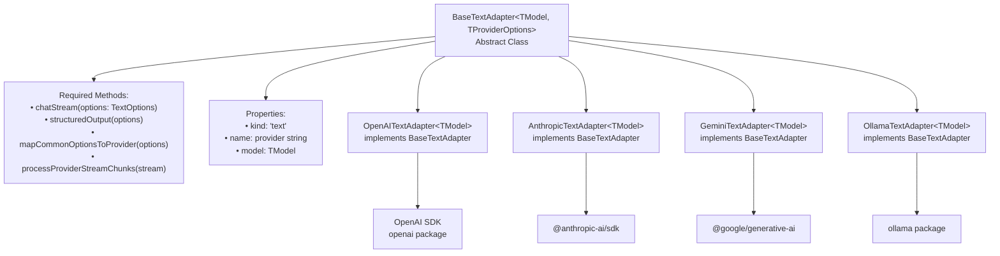

Sources: [packages/typescript/ai-ollama/src/adapters/text.ts:122-141](), [docs/adapters/openai.md:1-334](), [docs/adapters/anthropic.md:1-231](), [docs/adapters/gemini.md:1-284]()

### Bidirectional Transformation Flow

Adapters perform two critical transformations: mapping generic `TextOptions` to provider-specific request formats, and transforming provider response streams into generic `StreamChunk` types.

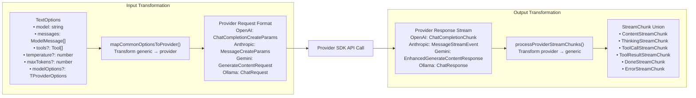

Sources: [packages/typescript/ai/src/types.ts:565-650](), [packages/typescript/ai/src/types.ts:652-748]()

## Built-in Adapters

TanStack AI provides four built-in adapter packages, each supporting multiple adapter kinds (text, image, TTS, transcription, summarization).

| Package                  | Provider  | Text Models                        | Image Generation     | TTS                 | Transcription |
| ------------------------ | --------- | ---------------------------------- | -------------------- | ------------------- | ------------- |
| `@tanstack/ai-openai`    | OpenAI    | GPT-4o, GPT-5, GPT-4.1-mini, etc.  | DALL-E (gpt-image-1) | ✓ (tts-1, tts-1-hd) | ✓ (whisper-1) |
| `@tanstack/ai-anthropic` | Anthropic | Claude Sonnet 4.5, Claude Opus 4.5 | ✗                    | ✗                   | ✗             |
| `@tanstack/ai-gemini`    | Google    | Gemini 2.5 Pro, Gemini Flash       | Imagen (imagen-3.0)  | ✓ (experimental)    | ✗             |
| `@tanstack/ai-ollama`    | Ollama    | Llama 3, Mistral, Qwen, etc.       | ✗                    | ✗                   | ✗             |

Sources: [docs/adapters/openai.md:1-334](), [docs/adapters/anthropic.md:1-231](), [docs/adapters/gemini.md:1-284](), [docs/adapters/ollama.md:1-293]()

## OpenAI Adapter

The OpenAI adapter provides access to OpenAI's models through the `openai` npm package.

### Factory Functions

```mermaid
graph TB
    EnvBased["Environment-based Functions<br/>Read OPENAI_API_KEY from env"]
    Explicit["Explicit API Key Functions<br/>Accept apiKey parameter"]

    openaiText["openaiText(model)<br/>Returns: OpenAITextAdapter"]
    openaiImage["openaiImage(model)<br/>Returns: OpenAIImageAdapter"]
    openaiTTS["openaiTTS(model)<br/>Returns: OpenAITTSAdapter"]
    openaiTranscription["openaiTranscription(model)<br/>Returns: OpenAITranscriptionAdapter"]
    openaiSummarize["openaiSummarize(model)<br/>Returns: OpenAISummarizeAdapter"]

    createOpenaiChat["createOpenaiChat(apiKey, config?)<br/>Returns: (model) => OpenAITextAdapter"]
    createOpenaiImage["createOpenaiImage(apiKey, config?)<br/>Returns: (model) => OpenAIImageAdapter"]
    createOpenaiTTS["createOpenaiTTS(apiKey, config?)<br/>Returns: (model) => OpenAITTSAdapter"]
    createOpenaiTranscription["createOpenaiTranscription(apiKey, config?)<br/>Returns: (model) => OpenAITranscriptionAdapter"]
    createOpenaiSummarize["createOpenaiSummarize(apiKey, config?)<br/>Returns: (model) => OpenAISummarizeAdapter"]

    EnvBased --> openaiText
    EnvBased --> openaiImage
    EnvBased --> openaiTTS
    EnvBased --> openaiTranscription
    EnvBased --> openaiSummarize

    Explicit --> createOpenaiChat
    Explicit --> createOpenaiImage
    Explicit --> createOpenaiTTS
    Explicit --> createOpenaiTranscription
    Explicit --> createOpenaiSummarize
```

Sources: [docs/adapters/openai.md:17-40](), [docs/adapters/openai.md:261-327]()

### OpenAI-Specific Options

OpenAI adapters support provider-specific options through `modelOptions`:

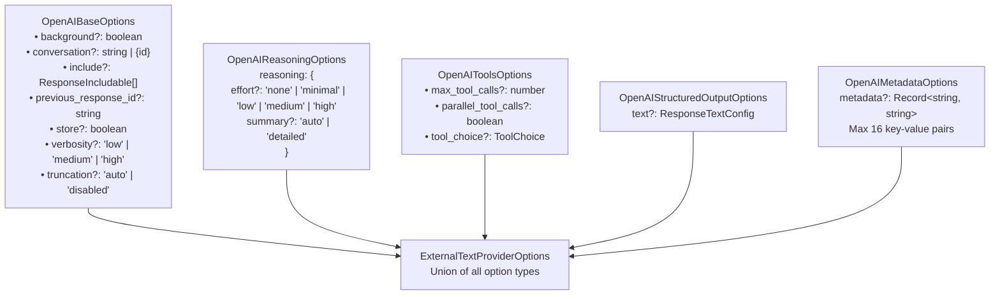

Sources: [packages/typescript/ai-openai/src/text/text-provider-options.ts:17-125](), [packages/typescript/ai-openai/src/text/text-provider-options.ts:130-182](), [packages/typescript/ai-openai/src/text/text-provider-options.ts:193-243]()

### Reasoning Feature

OpenAI models like GPT-5 and O3 support extended reasoning, which streams the model's internal reasoning process as `ThinkingStreamChunk` types:

```typescript
// Enable reasoning with effort level and summary control
modelOptions: {
  reasoning: {
    effort: "medium", // "none" | "minimal" | "low" | "medium" | "high"
    summary: "detailed", // "auto" | "detailed"
  },
}
```

The `computer-use-preview` model supports an additional `"concise"` summary option via `OpenAIReasoningOptionsWithConcise`.

Sources: [packages/typescript/ai-openai/src/text/text-provider-options.ts:130-182](), [docs/adapters/openai.md:120-133]()

## Anthropic Adapter

The Anthropic adapter provides access to Claude models through the `@anthropic-ai/sdk` package.

### Factory Functions

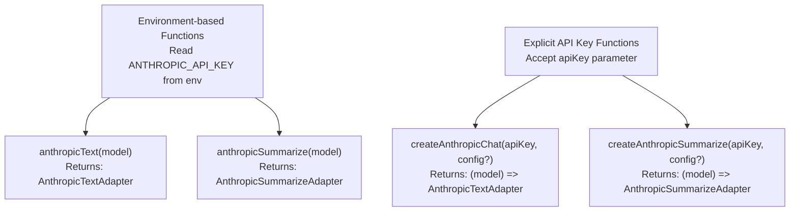

Sources: [docs/adapters/anthropic.md:17-40](), [docs/adapters/anthropic.md:186-220]()

### Anthropic-Specific Options

Anthropic adapters support unique provider features through `modelOptions`:

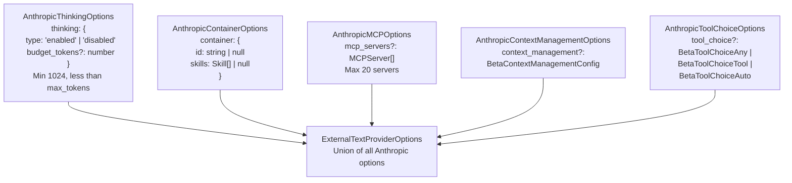

Sources: [packages/typescript/ai-anthropic/src/text/text-provider-options.ts:13-118](), [packages/typescript/ai-anthropic/src/text/text-provider-options.ts:74-93]()

### Extended Thinking Feature

Anthropic's Claude models support extended thinking with token budgets:

```typescript
modelOptions: {
  thinking: {
    type: "enabled",
    budget_tokens: 2048, // Min 1024, must be < max_tokens
  },
}
```

The adapter automatically validates that `budget_tokens >= 1024` and `budget_tokens < max_tokens`, adjusting `max_tokens` if needed.

Sources: [packages/typescript/ai-anthropic/src/text/text-provider-options.ts:74-93](), [packages/typescript/ai-anthropic/src/text/text-provider-options.ts:169-179](), [docs/adapters/anthropic.md:119-133]()

### Prompt Caching

Anthropic supports prompt caching through message metadata:

```typescript
messages: [
  {
    role: 'user',
    content: [
      {
        type: 'text',
        content: 'What is the capital of France?',
        metadata: {
          cache_control: {
            type: 'ephemeral',
          },
        },
      },
    ],
  },
]
```

Sources: [docs/adapters/anthropic.md:136-158](), [packages/typescript/ai-anthropic/src/text/text-provider-options.ts:163-167]()

## Gemini Adapter

The Gemini adapter provides access to Google's Gemini models and Imagen image generation through the `@google/generative-ai` package.

### Factory Functions

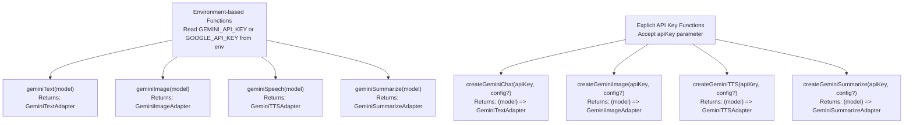

Sources: [docs/adapters/gemini.md:17-41](), [docs/adapters/gemini.md:224-277]()

### Gemini-Specific Options

Gemini models support thinking tokens and structured output configuration:

```typescript
modelOptions: {
  maxOutputTokens: 2048,
  temperature: 0.7,
  topP: 0.9,
  topK: 40,
  stopSequences: ["END"],

  // Enable thinking for supported models
  thinking: {
    includeThoughts: true,
  },

  // Structured output
  responseMimeType: "application/json",
}
```

Sources: [docs/adapters/gemini.md:102-139]()

## Ollama Adapter

The Ollama adapter provides access to locally-hosted models through the `ollama` npm package.

### Factory Functions

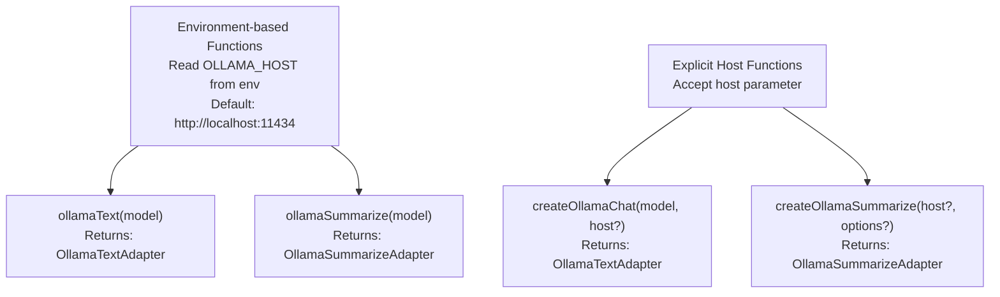

Sources: [docs/adapters/ollama.md:17-51](), [docs/adapters/ollama.md:240-273](), [packages/typescript/ai-ollama/src/adapters/text.ts:400-420]()

### Ollama-Specific Options

Ollama supports extensive model configuration options:

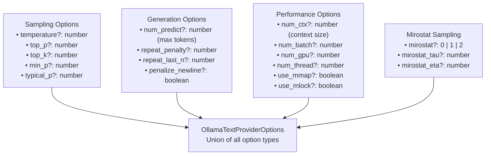

Sources: [packages/typescript/ai-ollama/src/adapters/text.ts:52-93](), [docs/adapters/ollama.md:120-171]()

### Ollama Model Support

Ollama supports any dynamically-loaded model. Common models include:

```typescript
type OllamaTextModel =
  | 'llama2'
  | 'llama3'
  | 'llama3.1'
  | 'llama3.2'
  | 'mistral'
  | 'mixtral'
  | 'phi'
  | 'phi3'
  | 'qwen2'
  | 'qwen2.5'
  | 'gemma'
  | 'gemma2'
  | 'codellama'
  | 'deepseek-coder'
  | (string & {}) // Any string accepted
```

Sources: [packages/typescript/ai-ollama/src/adapters/text.ts:24-48](), [docs/adapters/ollama.md:54-70]()

## Adapter Usage Pattern

Adapters are passed to the `chat()` function through the `adapter` parameter:

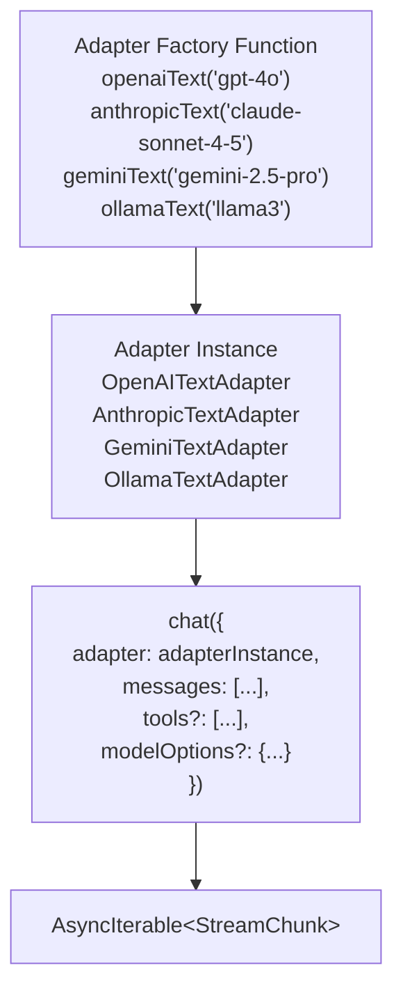

Sources: [docs/api/ai.md:16-44]()

## Custom Tool Support

Each adapter must convert TanStack AI's generic `Tool` type to the provider's tool format. Tool schemas are already converted to JSON Schema in the core `ai` layer before reaching adapters.

### Tool Conversion Pattern

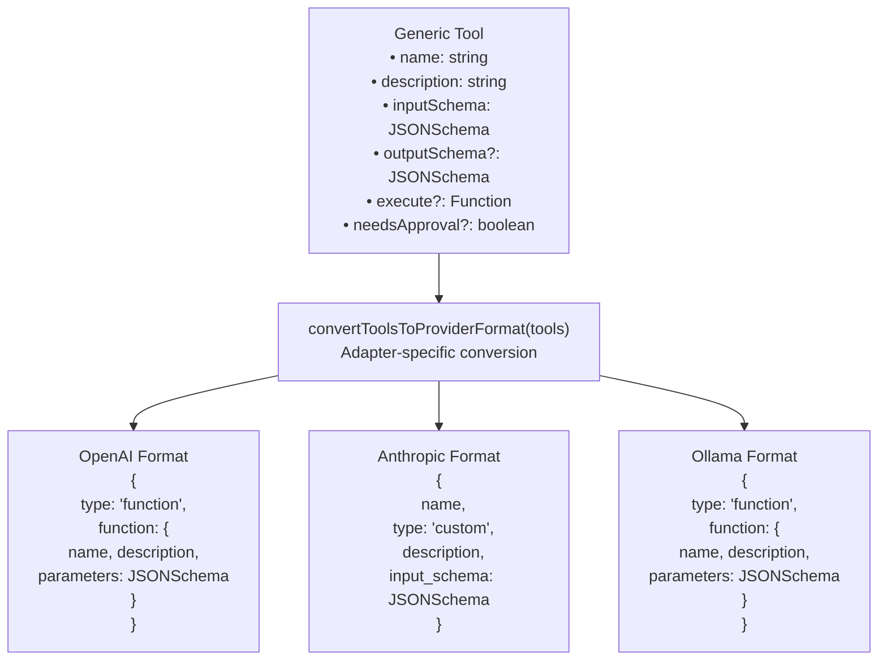

Sources: [packages/typescript/ai-anthropic/src/tools/custom-tool.ts:26-50](), [packages/typescript/ai-ollama/src/adapters/text.ts:290-312]()

### Anthropic Custom Tool Conversion

The Anthropic adapter converts tools using the `convertCustomToolToAdapterFormat()` function:

```typescript
// Tool schemas are already JSON Schema at this point
const inputSchema = {
  type: 'object' as const,
  properties: jsonSchema.properties || null,
  required: jsonSchema.required || null,
}

return {
  name: tool.name,
  type: 'custom',
  description: tool.description,
  input_schema: inputSchema,
  cache_control: metadata.cacheControl || null,
}
```

Sources: [packages/typescript/ai-anthropic/src/tools/custom-tool.ts:26-50]()

## Structured Output Support

All text adapters implement the `structuredOutput()` method for generating structured JSON responses conforming to a schema:

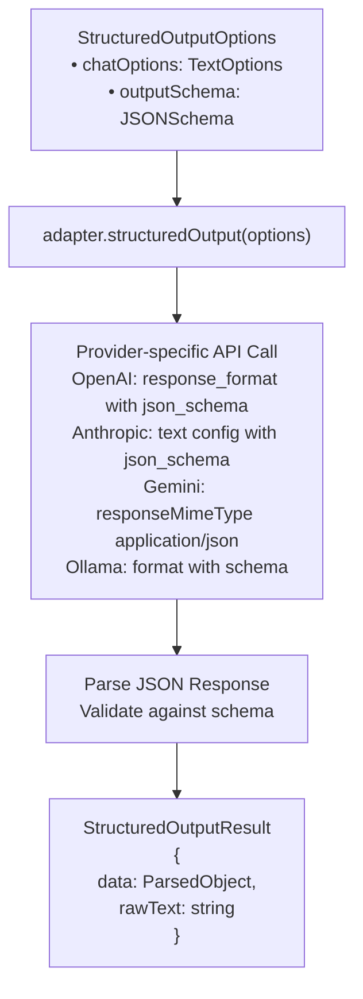

Sources: [packages/typescript/ai-ollama/src/adapters/text.ts:152-194]()

## Environment Variable Configuration

Each adapter reads its API key or configuration from environment variables:

| Adapter   | Environment Variables              | Default Value            |
| --------- | ---------------------------------- | ------------------------ |
| OpenAI    | `OPENAI_API_KEY`                   | Required                 |
| Anthropic | `ANTHROPIC_API_KEY`                | Required                 |
| Gemini    | `GEMINI_API_KEY`, `GOOGLE_API_KEY` | Required                 |
| Ollama    | `OLLAMA_HOST`                      | `http://localhost:11434` |

Sources: [docs/adapters/openai.md:253-259](), [docs/adapters/anthropic.md:178-184](), [docs/adapters/gemini.md:208-216](), [docs/adapters/ollama.md:233-238]()

## Message Format Transformation

Adapters must transform TanStack AI's `ModelMessage` format (which supports multimodal content) into provider-specific message formats:

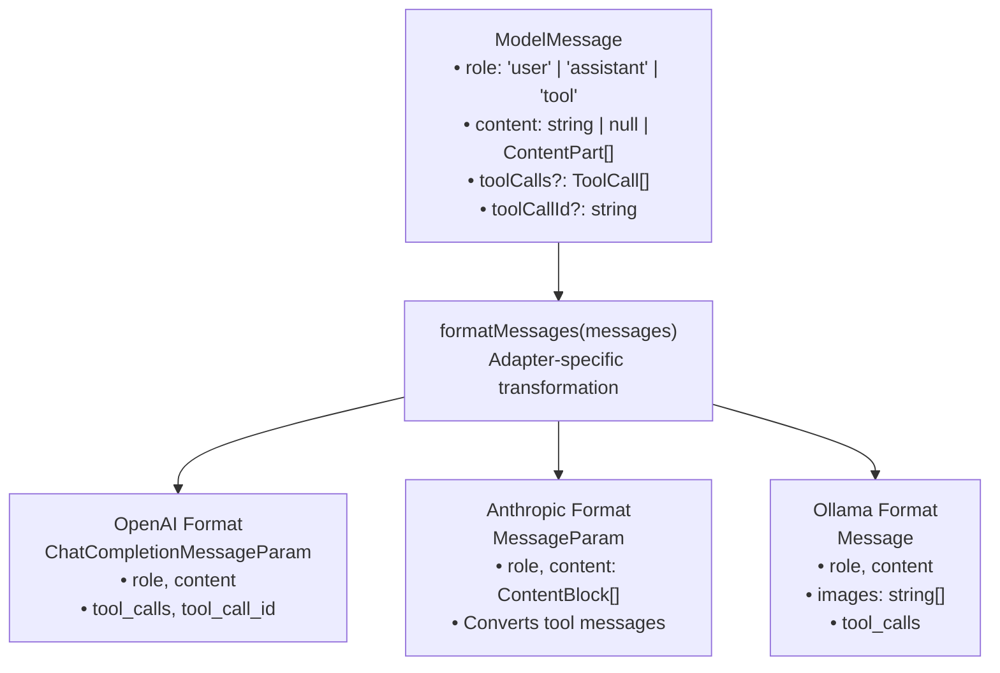

Sources: [packages/typescript/ai-ollama/src/adapters/text.ts:314-376](), [packages/typescript/ai/src/types.ts:232-243]()

### Ollama Message Formatting

The Ollama adapter extracts images from multimodal content and formats tool messages:

```typescript
private formatMessages(messages: TextOptions['messages']): Array<Message> {
  return messages.map((msg) => {
    let textContent = ''
    const images: Array<string> = []

    if (Array.isArray(msg.content)) {
      for (const part of msg.content) {
        if (part.type === 'text') {
          textContent += part.content
        } else if (part.type === 'image') {
          images.push(part.source.value)
        }
      }
    }

    const hasToolCallId = msg.role === 'tool' && msg.toolCallId
    return {
      role: hasToolCallId ? 'tool' : msg.role,
      content: textContent,
      ...(images.length > 0 ? { images } : {}),
      // ... handle tool_calls
    }
  })
}
```

Sources: [packages/typescript/ai-ollama/src/adapters/text.ts:314-376]()

## Stream Processing Implementation

Each adapter implements `processProviderStreamChunks()` to convert provider-specific stream events into generic `StreamChunk` types:

### Ollama Stream Processing

```typescript
private async *processOllamaStreamChunks(
  stream: AbortableAsyncIterator<ChatResponse>
): AsyncIterable<StreamChunk> {
  let accumulatedContent = ''
  let accumulatedReasoning = ''
  const timestamp = Date.now()
  const responseId = generateId('msg')

  for await (const chunk of stream) {
    if (chunk.done) {
      yield {
        type: 'done',
        id: responseId,
        model: chunk.model,
        timestamp,
        finishReason: hasEmittedToolCalls ? 'tool_calls' : 'stop',
      }
      continue
    }

    if (chunk.message.content) {
      accumulatedContent += chunk.message.content
      yield {
        type: 'content',
        id: responseId,
        model: chunk.model,
        timestamp,
        delta: chunk.message.content,
        content: accumulatedContent,
        role: 'assistant',
      }
    }

    if (chunk.message.thinking) {
      accumulatedReasoning += chunk.message.thinking
      yield {
        type: 'thinking',
        id: responseId,
        model: chunk.model,
        timestamp,
        content: accumulatedReasoning,
        delta: chunk.message.thinking,
      }
    }

    if (chunk.message.tool_calls) {
      // Process tool calls...
    }
  }
}
```

Sources: [packages/typescript/ai-ollama/src/adapters/text.ts:196-288]()

## Creating Custom Adapters

To create a custom adapter, extend `BaseTextAdapter` and implement the required methods:

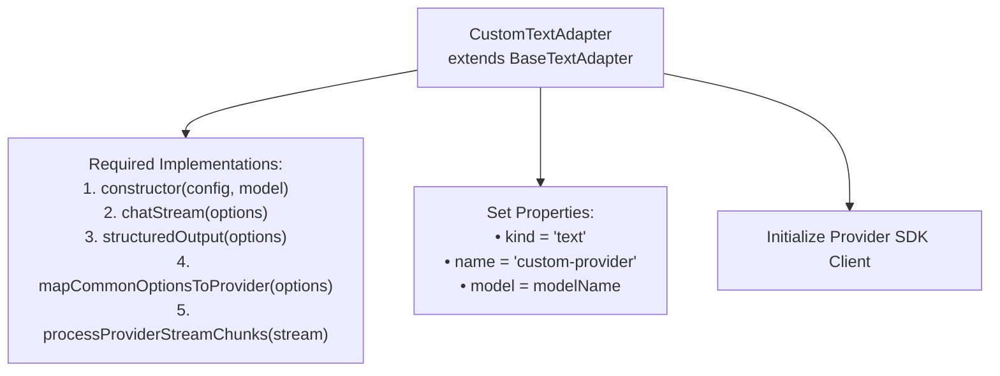

The adapter must:

1. Transform `TextOptions` to provider request format
2. Call the provider's SDK
3. Transform provider responses to `StreamChunk` union types
4. Handle tool calls, thinking tokens, and completion signals

Sources: [packages/typescript/ai-ollama/src/adapters/text.ts:122-141]()
