# chat() and generate() Functions

<details>
<summary>Relevant source files</summary>

The following files were used as context for generating this wiki page:

- [docs/adapters/anthropic.md](docs/adapters/anthropic.md)
- [docs/adapters/gemini.md](docs/adapters/gemini.md)
- [docs/adapters/ollama.md](docs/adapters/ollama.md)
- [docs/adapters/openai.md](docs/adapters/openai.md)
- [docs/api/ai.md](docs/api/ai.md)
- [docs/getting-started/overview.md](docs/getting-started/overview.md)
- [docs/getting-started/quick-start.md](docs/getting-started/quick-start.md)
- [docs/guides/client-tools.md](docs/guides/client-tools.md)
- [docs/guides/server-tools.md](docs/guides/server-tools.md)
- [docs/guides/streaming.md](docs/guides/streaming.md)
- [docs/guides/tool-approval.md](docs/guides/tool-approval.md)
- [docs/guides/tool-architecture.md](docs/guides/tool-architecture.md)
- [docs/guides/tools.md](docs/guides/tools.md)
- [docs/protocol/chunk-definitions.md](docs/protocol/chunk-definitions.md)
- [docs/protocol/http-stream-protocol.md](docs/protocol/http-stream-protocol.md)
- [docs/protocol/sse-protocol.md](docs/protocol/sse-protocol.md)
- [examples/ts-react-chat/src/lib/model-selection.ts](examples/ts-react-chat/src/lib/model-selection.ts)
- [examples/ts-react-chat/src/routes/api.tanchat.ts](examples/ts-react-chat/src/routes/api.tanchat.ts)
- [packages/typescript/ai-gemini/src/adapters/text.ts](packages/typescript/ai-gemini/src/adapters/text.ts)
- [packages/typescript/ai-gemini/src/model-meta.ts](packages/typescript/ai-gemini/src/model-meta.ts)
- [packages/typescript/ai-gemini/src/text/text-provider-options.ts](packages/typescript/ai-gemini/src/text/text-provider-options.ts)
- [packages/typescript/ai-gemini/tests/gemini-adapter.test.ts](packages/typescript/ai-gemini/tests/gemini-adapter.test.ts)
- [packages/typescript/ai-openai/live-tests/tool-test-empty-object.ts](packages/typescript/ai-openai/live-tests/tool-test-empty-object.ts)
- [packages/typescript/ai/src/activities/chat/stream/processor.ts](packages/typescript/ai/src/activities/chat/stream/processor.ts)

</details>

## Overview

The `chat()` and `generate()` functions are the primary entry points for AI text generation in TanStack AI. Both provide unified APIs for interacting with AI models through provider adapters, supporting streaming responses, tool execution, and structured output.

**Key Differences**:

| Function     | Purpose                            | Messages Format                   | Best For                                                     |
| ------------ | ---------------------------------- | --------------------------------- | ------------------------------------------------------------ |
| `chat()`     | Conversation-oriented interactions | Array of `ModelMessage[]`         | Multi-turn conversations, chat interfaces, agentic workflows |
| `generate()` | Direct text generation             | String prompt or `ModelMessage[]` | Single prompts, text completion, simpler use cases           |

Both functions share the same core capabilities:

- Streaming and non-streaming modes
- Automatic tool execution
- Structured output with schemas
- Provider-agnostic via adapters
- Full TypeScript type safety

**Locations**:

- `chat()`: [packages/typescript/ai/src/activities/chat/index.ts:976]()
- `generate()`: [packages/typescript/ai/src/activities/generate/index.ts]()

**Sources**: [packages/typescript/ai/src/activities/chat/index.ts:976](), [docs/reference/functions/chat.md:1-95](), [README.md:55-71]()
</thinking>

---

## Function Comparison

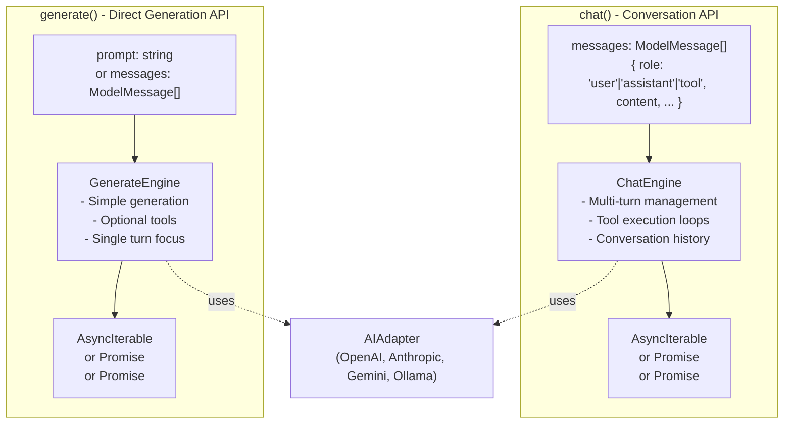

**Sources**: [packages/typescript/ai/src/activities/chat/index.ts:976](), [packages/typescript/ai/src/activities/generate/index.ts](), [README.md:55-71]()

---

## chat() Function

The `chat()` function is designed for conversation-oriented interactions with full support for multi-turn conversations, automatic tool execution loops, and agentic workflows.

### Function Signature

```typescript
function chat<TAdapter, TSchema, TStream>(
  options: TextActivityOptions<TAdapter, TSchema, TStream>
): TextActivityResult<TSchema, TStream>
```

**Type Parameters**:

| Parameter  | Description                                                      |
| ---------- | ---------------------------------------------------------------- |
| `TAdapter` | The AI adapter type (e.g., `OpenAITextAdapter`)                  |
| `TSchema`  | Optional Zod/ArkType schema for structured output                |
| `TStream`  | Boolean literal type indicating streaming mode (default: `true`) |

**Return Type**:

- When `stream: true` (default): `AsyncIterable<StreamChunk>`
- When `stream: false`: `Promise<string>`
- When `outputSchema` provided: `Promise<InferSchemaType<TSchema>>`

**Sources**: [docs/reference/functions/chat.md:1-45](), [packages/typescript/ai/src/activities/chat/index.ts:976]()

### Usage Modes

The `chat()` function supports four distinct usage modes:

1. **Streaming agentic text** - Stream responses with automatic tool execution loops
2. **Streaming one-shot text** - Simple streaming without tools
3. **Non-streaming text** - Returns complete text as a string (`stream: false`)
4. **Agentic structured output** - Execute tools, then return typed structured data

**Sources**: [packages/typescript/ai/src/activities/chat/index.ts:976](), [docs/reference/functions/chat.md:1-95]()

---

## Function Signature

```typescript
function chat<TAdapter, TSchema, TStream>(
  options: TextActivityOptions<TAdapter, TSchema, TStream>
): TextActivityResult<TSchema, TStream>
```

**Type Parameters**:

| Parameter  | Description                                                      |
| ---------- | ---------------------------------------------------------------- |
| `TAdapter` | The AI adapter type (e.g., `OpenAITextAdapter`)                  |
| `TSchema`  | Optional Zod/ArkType schema for structured output                |
| `TStream`  | Boolean literal type indicating streaming mode (default: `true`) |

**Return Type**:

- When `stream: true` (default): `AsyncIterable<StreamChunk>`
- When `stream: false`: `Promise<string>`
- When `outputSchema` provided: `Promise<InferSchemaType<TSchema>>`

**Sources**: [docs/reference/functions/chat.md:1-45](), [packages/typescript/ai/src/activities/chat/index.ts:976]()

---

## Core Parameters

### adapter (required)

An AI provider adapter instance with a selected model. Adapters abstract the differences between LLM providers (OpenAI, Anthropic, Gemini, Ollama).

```typescript
import { chat } from '@tanstack/ai'
import { openaiText } from '@tanstack/ai-openai'
import { anthropicText } from '@tanstack/ai-anthropic'

// OpenAI
const stream = chat({
  adapter: openaiText('gpt-4o'),
  messages: [{ role: 'user', content: 'Hello!' }],
})

// Anthropic
const stream = chat({
  adapter: anthropicText('claude-sonnet-4-5'),
  messages: [{ role: 'user', content: 'Hello!' }],
})
```

**Adapter Creation Pattern**:

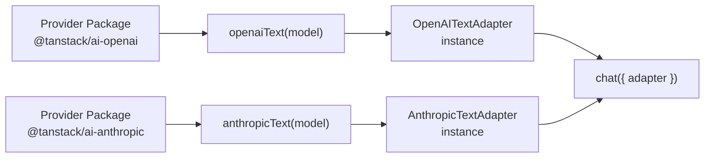

**Sources**: [docs/api/ai.md:15-30](), [docs/adapters/openai.md:17-25](), [docs/adapters/anthropic.md:17-25]()

### messages (required)

An array of conversation messages representing the chat history. Messages follow the `ModelMessage` interface.

```typescript
interface ModelMessage {
  role: 'user' | 'assistant' | 'tool'
  content: string | ContentPart[] | null
  toolCalls?: ToolCall[]
  toolCallId?: string
  name?: string
}
```

**Basic Usage**:

```typescript
const stream = chat({
  adapter: openaiText('gpt-4o'),
  messages: [{ role: 'user', content: 'What is the weather in Paris?' }],
})
```

**Multi-turn Conversation**:

```typescript
const stream = chat({
  adapter: openaiText('gpt-4o'),
  messages: [
    { role: 'user', content: 'Hello!' },
    { role: 'assistant', content: 'Hi! How can I help you?' },
    { role: 'user', content: 'Tell me about TypeScript.' },
  ],
})
```

**Multimodal Content**:

```typescript
const stream = chat({
  adapter: openaiText('gpt-4o'),
  messages: [
    {
      role: 'user',
      content: [
        { type: 'text', content: 'What is in this image?' },
        { type: 'image', source: { type: 'url', url: 'https://...' } },
      ],
    },
  ],
})
```

**Sources**: [docs/reference/interfaces/ModelMessage.md:1-65](), [docs/api/ai.md:212-218](), [docs/guides/multimodal-content.md]()

### tools (optional)

An array of tool definitions that the model can call. Tools enable function calling and agentic behavior.

```typescript
import { toolDefinition } from '@tanstack/ai'
import { z } from 'zod'

const weatherToolDef = toolDefinition({
  name: 'get_weather',
  description: 'Get current weather for a location',
  inputSchema: z.object({
    location: z.string(),
  }),
})

const weatherTool = weatherToolDef.server(async ({ location }) => {
  // Server-side implementation
  return { temperature: 72, conditions: 'sunny' }
})

const stream = chat({
  adapter: openaiText('gpt-4o'),
  messages: [{ role: 'user', content: 'What is the weather in Paris?' }],
  tools: [weatherTool],
})
```

See [Tool System](#3.2) for complete documentation on tool definitions and execution.

**Sources**: [docs/api/ai.md:74-119](), [docs/guides/tools.md:1-335]()

### modelOptions (optional)

Provider-specific options for controlling model behavior. Available options depend on the adapter and model being used.

**Common Options** (supported by most providers):

```typescript
const stream = chat({
  adapter: openaiText('gpt-4o'),
  messages,
  modelOptions: {
    temperature: 0.7, // Randomness (0-2)
    maxOutputTokens: 1000, // Max tokens to generate
    topP: 0.9, // Nucleus sampling
    frequencyPenalty: 0.5, // Reduce repetition
    presencePenalty: 0.5, // Encourage new topics
  },
})
```

**OpenAI Reasoning Options**:

```typescript
modelOptions: {
  reasoning: {
    effort: 'medium',      // 'minimal' | 'low' | 'medium' | 'high'
    summary: 'detailed'    // 'auto' | 'detailed'
  }
}
```

**Anthropic Thinking Options**:

```typescript
modelOptions: {
  thinking: {
    type: 'enabled',
    budget_tokens: 2048
  }
}
```

**Sources**: [docs/adapters/openai.md:101-132](), [docs/adapters/anthropic.md:101-133](), [docs/api/ai.md:40]()

### agentLoopStrategy (optional)

Controls when to stop iterating in agentic tool execution loops. Default: `maxIterations(5)`.

```typescript
import { maxIterations } from '@tanstack/ai'

const stream = chat({
  adapter: openaiText('gpt-4o'),
  messages,
  tools: [tool1, tool2],
  agentLoopStrategy: maxIterations(20), // Allow up to 20 iterations
})
```

**Custom Strategy**:

```typescript
const customStrategy = ({ iterationCount, messages, finishReason }) => {
  // Stop if we've done 10 iterations OR if no tools were called
  return iterationCount < 10 && finishReason === 'tool_calls'
}

const stream = chat({
  adapter: openaiText('gpt-4o'),
  messages,
  tools,
  agentLoopStrategy: customStrategy,
})
```

**Sources**: [docs/api/ai.md:185-207](), [docs/guides/agentic-cycle.md]()

### systemPrompts (optional)

System-level instructions prepended to the conversation. Useful for setting context or behavior.

```typescript
const stream = chat({
  adapter: openaiText('gpt-4o'),
  messages: [{ role: 'user', content: 'Hello!' }],
  systemPrompts: [
    'You are a helpful assistant.',
    'Always respond in a friendly tone.',
  ],
})
```

**Sources**: [docs/api/ai.md:27]()

### abortController (optional)

An `AbortController` for canceling in-flight requests.

```typescript
const abortController = new AbortController()

const stream = chat({
  adapter: openaiText('gpt-4o'),
  messages,
  abortController,
})

// Cancel after 5 seconds
setTimeout(() => abortController.abort(), 5000)
```

**Sources**: [docs/api/ai.md:39]()

### conversationId (optional)

Optional identifier for tracking conversations across requests. Useful for analytics and debugging.

```typescript
const stream = chat({
  adapter: openaiText('gpt-4o'),
  messages,
  conversationId: 'conv-12345',
})
```

**Sources**: [docs/getting-started/quick-start.md:47-56]()

---

## Return Type: StreamChunk

When streaming (`stream: true`, the default), `chat()` returns an `AsyncIterable<StreamChunk>`. Stream chunks represent different types of data flowing through the response.

### StreamChunk Type Diagram

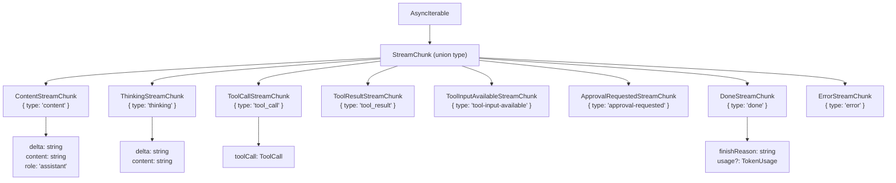

**StreamChunk Types**:

| Type                   | Purpose                       | Key Fields                        |
| ---------------------- | ----------------------------- | --------------------------------- |
| `content`              | Incremental text response     | `delta`, `content`, `role`        |
| `thinking`             | Model reasoning process       | `delta`, `content`                |
| `tool_call`            | Model requests tool execution | `toolCall` (id, name, arguments)  |
| `tool_result`          | Tool execution result         | `toolCallId`, `result`            |
| `tool-input-available` | Client should execute tool    | `toolCall`, `input`               |
| `approval-requested`   | User approval needed          | `toolCall`, `input`, `approvalId` |
| `done`                 | Stream completion             | `finishReason`, `usage`           |
| `error`                | Stream error                  | `error`                           |

**Sources**: [docs/api/ai.md:220-249](), [docs/reference/type-aliases/StreamChunk.md]()

---

## Usage Mode 1: Streaming Agentic Text

Default mode with automatic tool execution loops. The model can call tools, which execute automatically, and the model continues with results.

**Data Flow**:

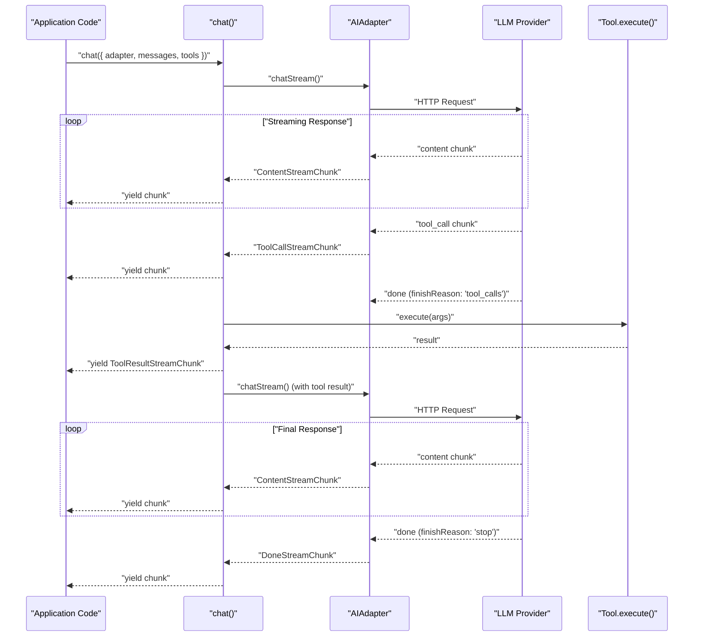

**Example**:

```typescript
import { chat } from '@tanstack/ai'
import { openaiText } from '@tanstack/ai-openai'

const weatherTool = toolDefinition({
  name: 'get_weather',
  description: 'Get weather for a location',
  inputSchema: z.object({ location: z.string() }),
}).server(async ({ location }) => {
  return { temperature: 72, conditions: 'sunny' }
})

const stream = chat({
  adapter: openaiText('gpt-4o'),
  messages: [{ role: 'user', content: 'What is the weather in Paris?' }],
  tools: [weatherTool],
})

for await (const chunk of stream) {
  if (chunk.type === 'content') {
    process.stdout.write(chunk.delta)
  }
  if (chunk.type === 'tool_call') {
    console.log('Calling tool:', chunk.toolCall.function.name)
  }
}
```

**Sources**: [docs/reference/functions/chat.md:47-61](), [docs/api/ai.md:275-280](), [docs/guides/agentic-cycle.md]()

---

## Usage Mode 2: Streaming One-Shot Text

Simple streaming without tools. Model generates a response and completes.

**Example**:

```typescript
const stream = chat({
  adapter: openaiText('gpt-4o'),
  messages: [
    { role: 'user', content: 'Explain quantum computing in simple terms.' },
  ],
  // No tools provided
})

for await (const chunk of stream) {
  if (chunk.type === 'content') {
    process.stdout.write(chunk.delta)
  }
  if (chunk.type === 'done') {
    console.log(
      '\
Tokens used:',
      chunk.usage?.totalTokens
    )
  }
}
```

**Sources**: [docs/reference/functions/chat.md:63-70](), [docs/getting-started/quick-start.md:20-76]()

---

## Usage Mode 3: Non-Streaming Text

Returns the complete text as a string instead of streaming. Set `stream: false`.

**Return Type**: `Promise<string>`

**Example**:

```typescript
const text = await chat({
  adapter: openaiText('gpt-4o'),
  messages: [{ role: 'user', content: 'What is the capital of France?' }],
  stream: false,
})

console.log(text) // "The capital of France is Paris."
```

**Sources**: [docs/reference/functions/chat.md:72-79](), [docs/api/ai.md:282-286]()

---

## Usage Mode 4: Agentic Structured Output

Execute tools in a loop, then return typed structured data. Requires `outputSchema`.

**Return Type**: `Promise<InferSchemaType<TSchema>>`

**Example**:

```typescript
import { z } from 'zod'

const researchTool = toolDefinition({
  name: 'research_topic',
  description: 'Research a topic',
  inputSchema: z.object({ topic: z.string() }),
}).server(async ({ topic }) => {
  // Fetch research data
  return { findings: '...', sources: ['...'] }
})

const result = await chat({
  adapter: openaiText('gpt-4o'),
  messages: [
    { role: 'user', content: 'Research quantum computing and summarize.' },
  ],
  tools: [researchTool],
  outputSchema: z.object({
    summary: z.string(),
    keyPoints: z.array(z.string()),
    sources: z.array(z.string()),
  }),
})

// result is fully typed:
// { summary: string, keyPoints: string[], sources: string[] }
console.log(result.summary)
console.log(result.keyPoints)
```

**Sources**: [docs/reference/functions/chat.md:81-94](), [docs/api/ai.md:288-326]()

---

## Integration with HTTP Endpoints

### Converting to Server-Sent Events

Use `toServerSentEventsResponse()` to convert the stream to an HTTP response:

```typescript
import { chat, toServerSentEventsResponse } from '@tanstack/ai'
import { openaiText } from '@tanstack/ai-openai'

export async function POST(request: Request) {
  const { messages } = await request.json()

  const stream = chat({
    adapter: openaiText('gpt-4o'),
    messages,
  })

  return toServerSentEventsResponse(stream)
}
```

**Sources**: [docs/api/ai.md:161-184](), [docs/getting-started/quick-start.md:78-122]()

### Next.js App Router Example

```typescript
// app/api/chat/route.ts
import { chat, toServerSentEventsResponse } from '@tanstack/ai'
import { openaiText } from '@tanstack/ai-openai'

export async function POST(request: Request) {
  const { messages, conversationId } = await request.json()

  const stream = chat({
    adapter: openaiText('gpt-4o'),
    messages,
    conversationId,
  })

  return toServerSentEventsResponse(stream)
}
```

**Sources**: [docs/getting-started/quick-start.md:78-122]()

### TanStack Start Example

```typescript
// routes/api/chat.ts
import { chat, toServerSentEventsResponse } from '@tanstack/ai'
import { openai } from '@tanstack/ai-openai'
import { createFileRoute } from '@tanstack/react-router'

export const Route = createFileRoute('/api/chat')({
  server: {
    handlers: {
      POST: async ({ request }) => {
        const { messages, conversationId } = await request.json()

        const stream = chat({
          adapter: openai(),
          messages,
          model: 'gpt-4o',
          conversationId,
        })

        return toServerSentEventsResponse(stream)
      },
    },
  },
})
```

**Sources**: [docs/getting-started/quick-start.md:20-76]()

---

## Type Safety

### Adapter-Specific Types

The `chat()` function provides full type safety based on the adapter and model:

```typescript
import { openaiText } from '@tanstack/ai-openai'

const stream = chat({
  adapter: openaiText('gpt-4o'),
  messages,
  modelOptions: {
    // TypeScript knows these options are for OpenAI GPT-4o
    reasoning: {
      effort: 'medium', // Type-checked against OpenAI options
    },
  },
})
```

**Sources**: [docs/guides/per-model-type-safety.md]()

### Model Message Type Constraints

When using multimodal models, content types are constrained by model capabilities:

```typescript
import { openaiText } from '@tanstack/ai-openai'

const stream = chat({
  adapter: openaiText('gpt-4o'),
  messages: [
    {
      role: 'user',
      content: [
        { type: 'text', content: 'Describe this image' },
        // TypeScript ensures this model supports image input
        { type: 'image', source: { type: 'url', url: '...' } },
      ],
    },
  ],
})
```

**Sources**: [docs/guides/multimodal-content.md]()

### Tool Type Inference

Tool input and output types are fully inferred from schemas:

```typescript
const weatherToolDef = toolDefinition({
  name: 'get_weather',
  inputSchema: z.object({
    location: z.string(),
    unit: z.enum(['celsius', 'fahrenheit']).optional(),
  }),
  outputSchema: z.object({
    temperature: z.number(),
    conditions: z.string(),
  }),
})

const weatherTool = weatherToolDef.server(async (input) => {
  // input is typed as: { location: string, unit?: 'celsius' | 'fahrenheit' }

  return {
    temperature: 72,
    conditions: 'sunny',
    // Return type is validated against outputSchema
  }
})
```

**Sources**: [docs/guides/tools.md:82-103](), [docs/reference/interfaces/ToolDefinition.md:1-310]()

---

## generate() Function

The `generate()` function provides a simpler, more direct API for text generation. It's ideal for single-turn interactions where you don't need full conversation management.

### Function Signature

```typescript
function generate<TAdapter, TSchema, TStream>(
  options: GenerateOptions<TAdapter, TSchema, TStream>
): GenerateResult<TSchema, TStream>
```

**Type Parameters**: Same as `chat()`

**Return Type**: Same as `chat()` - supports streaming, non-streaming, and structured output modes

**Sources**: [packages/typescript/ai/src/activities/generate/index.ts](), [README.md:55-71]()

### Basic Usage

**Simple String Prompt**:

```typescript
import { generate } from '@tanstack/ai'
import { openaiText } from '@tanstack/ai-openai'

// String prompt (automatically converted to messages)
const stream = generate({
  adapter: openaiText('gpt-4o'),
  prompt: 'Explain quantum computing in simple terms.',
})

for await (const chunk of stream) {
  if (chunk.type === 'content') {
    process.stdout.write(chunk.delta)
  }
}
```

**Message Array (same as chat)**:

```typescript
const stream = generate({
  adapter: openaiText('gpt-4o'),
  messages: [{ role: 'user', content: 'Hello!' }],
})
```

**Sources**: [README.md:55-71](), [packages/typescript/ai/src/activities/generate/index.ts]()

### Parameters

`generate()` accepts the same parameters as `chat()` with one addition:

| Parameter         | Type              | Description                                      |
| ----------------- | ----------------- | ------------------------------------------------ |
| `prompt`          | `string`          | Alternative to `messages` - simple string prompt |
| `messages`        | `ModelMessage[]`  | Alternative to `prompt` - full message array     |
| `adapter`         | `AIAdapter`       | Provider adapter (required)                      |
| `tools`           | `Tool[]`          | Optional tools for function calling              |
| `modelOptions`    | `object`          | Provider-specific options                        |
| `stream`          | `boolean`         | Streaming mode (default: `true`)                 |
| `outputSchema`    | `Schema`          | Schema for structured output                     |
| `abortController` | `AbortController` | Cancellation controller                          |

**Note**: You must provide either `prompt` or `messages`, but not both.

**Sources**: [packages/typescript/ai/src/activities/generate/index.ts](), [docs/api/ai.md:15-45]()

### When to Use generate() vs chat()

**Use `generate()` when**:

- Making single-turn requests without conversation history
- Working with simple string prompts
- Building non-conversational text generation features
- You want a simpler API surface

**Use `chat()` when**:

- Building multi-turn conversations
- Managing conversation history across multiple requests
- Using complex agentic workflows with multiple tool loops
- You need explicit control over message roles and structure

**Example - generate() for Simple Tasks**:

```typescript
// Quick text generation
const summary = await generate({
  adapter: openaiText('gpt-4o'),
  prompt: 'Summarize: ' + longText,
  stream: false,
})

// Quick structured output
const data = await generate({
  adapter: openaiText('gpt-4o'),
  prompt: 'Extract key points from this article',
  outputSchema: z.object({
    points: z.array(z.string()),
    sentiment: z.enum(['positive', 'neutral', 'negative']),
  }),
})
```

**Sources**: [README.md:55-71](), [packages/typescript/ai/src/activities/generate/index.ts]()

---

## Summary

The `chat()` and `generate()` functions form the core API for AI interactions in TanStack AI:

**Shared Capabilities**:

- **Multiple usage modes** - Streaming, non-streaming, with tools, structured output
- **Provider-agnostic** - Works with OpenAI, Anthropic, Gemini, Ollama via adapters
- **Automatic tool execution** - Both support server-side and client-side tools
- **Type-safe** - Full TypeScript inference for options, tools, and structured output
- **Streaming by default** - Returns `AsyncIterable<StreamChunk>` for real-time responses
- **HTTP integration** - Easy conversion to Server-Sent Events or HTTP streams

**Key Differences**:

- `chat()` requires `ModelMessage[]` array, `generate()` accepts string `prompt` or messages
- `chat()` is optimized for conversation management and multi-turn interactions
- `generate()` provides a simpler API for single-turn text generation
- Both use the same underlying `ChatEngine` and streaming infrastructure

**Sources**: [packages/typescript/ai/src/activities/chat/index.ts:976](), [packages/typescript/ai/src/activities/generate/index.ts](), [docs/api/ai.md:1-348](), [README.md:55-71]()

---

## ChatEngine Architecture

### Class Overview

`ChatEngine` is the internal orchestrator that manages the complete lifecycle of a chat conversation. It is instantiated once per `chat()` call and coordinates streaming, tool execution, event emission, and agent loop logic.

**Source**: [packages/typescript/ai/src/core/chat.ts:33-710]()

```mermaid
graph TB
    subgraph "ChatEngine Instance"
        ADAPTER["adapter: AIAdapter"]
        PARAMS["params: ChatOptions"]
        MESSAGES["messages: ModelMessage[]"]
        TOOLS["tools: Tool[]"]
        LOOP_STRATEGY["loopStrategy: AgentLoopStrategy"]
        TOOL_MANAGER["toolCallManager: ToolCallManager"]

        STATE_ITERATION["iterationCount: number"]
        STATE_FINISH["lastFinishReason: string | null"]
        STATE_CONTENT["accumulatedContent: string"]
        STATE_DONE["doneChunk: DoneStreamChunk | null"]
        STATE_MSG_ID["currentMessageId: string | null"]
        STATE_PHASE["cyclePhase: 'processChat' | 'executeToolCalls'"]
        STATE_TOOL_PHASE["toolPhase: 'continue' | 'stop' | 'wait'"]

        IDS["requestId: string<br/>streamId: string"]
        SIGNAL["effectiveSignal: AbortSignal"]
    end

    ADAPTER --> CHAT_METHOD["chat() async generator"]
    PARAMS --> CHAT_METHOD
    MESSAGES --> STREAM_RESPONSE["streamModelResponse()"]
    TOOLS --> TOOL_MANAGER
    LOOP_STRATEGY --> SHOULD_CONTINUE["shouldContinue()"]

    CHAT_METHOD --> BEFORE["beforeChat()"]
    CHAT_METHOD --> LOOP["do-while loop"]
    CHAT_METHOD --> AFTER["afterChat()"]

    LOOP --> BEGIN["beginCycle()"]
    LOOP --> PROCESS["processChat or executeToolCalls"]
    LOOP --> END["endCycle()"]
    LOOP --> SHOULD_CONTINUE

    STATE_PHASE -.controls.-> PROCESS
    STATE_TOOL_PHASE -.controls.-> SHOULD_CONTINUE
```

**Key Internal Fields**:

| Field              | Type                | Purpose                                                   |
| ------------------ | ------------------- | --------------------------------------------------------- |
| `adapter`          | `AIAdapter`         | Provider-specific adapter (OpenAI, Anthropic, etc.)       |
| `messages`         | `ModelMessage[]`    | Current conversation history (mutates during loops)       |
| `tools`            | `Tool[]`            | Available tools for this conversation                     |
| `loopStrategy`     | `AgentLoopStrategy` | Determines when to stop iterating                         |
| `toolCallManager`  | `ToolCallManager`   | Tracks tool calls across streaming chunks                 |
| `iterationCount`   | `number`            | Current agent loop iteration (0-indexed)                  |
| `lastFinishReason` | `string \| null`    | Finish reason from last LLM response                      |
| `cyclePhase`       | `CyclePhase`        | Current phase: `'processChat'` or `'executeToolCalls'`    |
| `toolPhase`        | `ToolPhaseResult`   | Tool execution state: `'continue'`, `'stop'`, or `'wait'` |
| `requestId`        | `string`            | Unique ID for this chat request (for devtools)            |
| `streamId`         | `string`            | Unique ID for this stream (for devtools)                  |

**Sources**: [packages/typescript/ai/src/core/chat.ts:33-78]()

---

## Conversation Lifecycle

### Complete Request Flow

The following diagram shows the complete flow from `chat()` invocation to response completion:

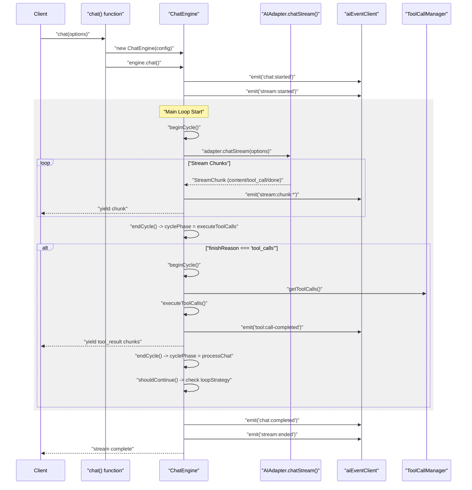

**Sources**: [packages/typescript/ai/src/core/chat.ts:80-107](), [packages/typescript/ai/src/core/chat.ts:109-163]()

### Lifecycle Phases

**1. Initialization (beforeChat)**

Executed once at the start of the conversation:

- Generates unique `requestId` and `streamId` identifiers
- Emits `chat:started` event with request metadata
- Emits `stream:started` event to signal streaming begin
- Captures initial message count and configuration

**Source**: [packages/typescript/ai/src/core/chat.ts:109-135]()

**2. Main Loop (do-while cycle)**

The core orchestration loop alternates between two phases:

- **Phase 1**: `cyclePhase = 'processChat'` → Streams LLM response via `streamModelResponse()`
- **Phase 2**: `cyclePhase = 'executeToolCalls'` → Executes tools via `processToolCalls()`

Loop continues while `shouldContinue()` returns true (based on `loopStrategy` and `toolPhase`).

**Source**: [packages/typescript/ai/src/core/chat.ts:89-103]()

**3. Finalization (afterChat)**

Executed once when the conversation completes:

- Emits `chat:completed` event with final content and usage statistics
- Emits `stream:ended` event with duration and chunk count
- Cleanup and resource release

**Source**: [packages/typescript/ai/src/core/chat.ts:137-163]()

---

## Agent Loop System

### Cycle Phases and Transitions

The agent loop operates as a state machine with two distinct phases that alternate:

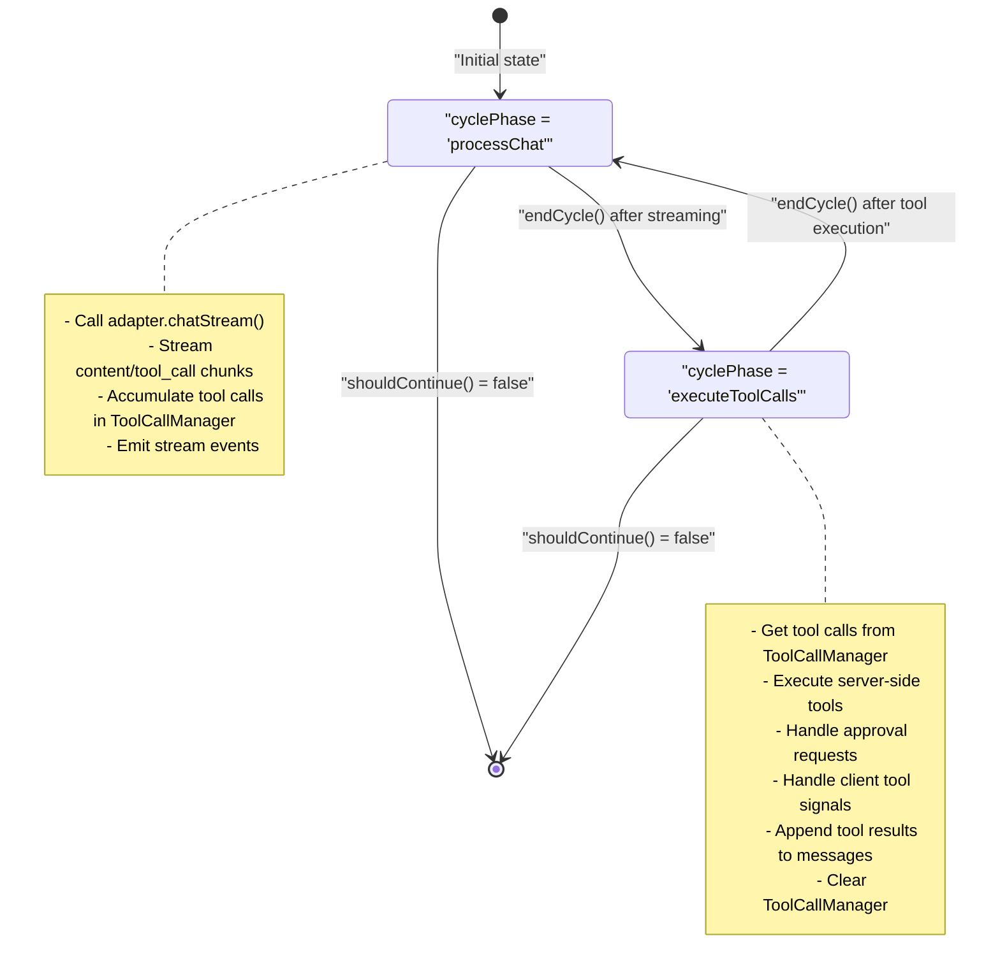

**Sources**: [packages/typescript/ai/src/core/chat.ts:165-179](), [packages/typescript/ai/src/core/chat.ts:682-710]()

### Agent Loop Strategy

The `AgentLoopStrategy` function determines when to stop iterating. It receives the current state and returns `true` to continue or `false` to stop.

**Strategy Function Type**:

```typescript
type AgentLoopStrategy = (state: AgentLoopState) => boolean

interface AgentLoopState {
  iterationCount: number
  messages: ModelMessage[]
  finishReason: string | null
}
```

**Built-in Strategy** (`maxIterations`):

```typescript
const maxIterations =
  (max: number): AgentLoopStrategy =>
  ({ iterationCount }) =>
    iterationCount < max
```

**Default Strategy**: `maxIterations(5)` - allows up to 5 iterations

**Sources**: [packages/typescript/ai/src/types.ts:441-464](), [packages/typescript/ai/src/core/chat.ts:67-68]()

### Iteration Tracking

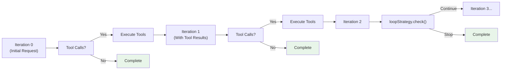

An **iteration** is defined as one complete pass through the `processChat` phase. The iteration counter increments only after both phases complete (processChat → executeToolCalls → processChat).

**Sources**: [packages/typescript/ai/src/core/chat.ts:50](), [packages/typescript/ai/src/core/chat.ts:165-179]()

---

## Stream Chunk Processing

### Chunk Type Handling

The `ChatEngine` processes different `StreamChunk` types from the adapter's stream:

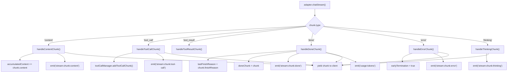

**Sources**: [packages/typescript/ai/src/core/chat.ts:216-354]()

### Content Accumulation

Content chunks are accumulated progressively to track the full assistant message:

```typescript
// Each content chunk contains:
{
  type: 'content',
  delta: 'Hello',      // Incremental text
  content: 'Hello',    // Full accumulated text so far
  role: 'assistant'
}
```

The `ChatEngine` stores the latest `content` value in `accumulatedContent`, which is used when creating the assistant message with tool calls.

**Source**: [packages/typescript/ai/src/core/chat.ts:241-250]()

### Tool Call Assembly

Tool calls may arrive as multiple streaming chunks with incremental JSON arguments. The `ToolCallManager` assembles complete tool calls:

```typescript
// Chunk 1:
{ type: 'tool_call', toolCall: { id: 'call-1', function: { name: 'weather', arguments: '{"loc' } } }

// Chunk 2:
{ type: 'tool_call', toolCall: { id: 'call-1', function: { name: 'weather', arguments: 'ation":' } } }

// Chunk 3:
{ type: 'tool_call', toolCall: { id: 'call-1', function: { name: 'weather', arguments: '"Paris"}' } } }

// ToolCallManager accumulates: '{"location":"Paris"}'
```

**Source**: [packages/typescript/ai/src/core/chat.ts:251-265](), [packages/typescript/ai/src/tools/tool-calls.ts]()

---

## Tool Execution Integration

### Tool Call Lifecycle

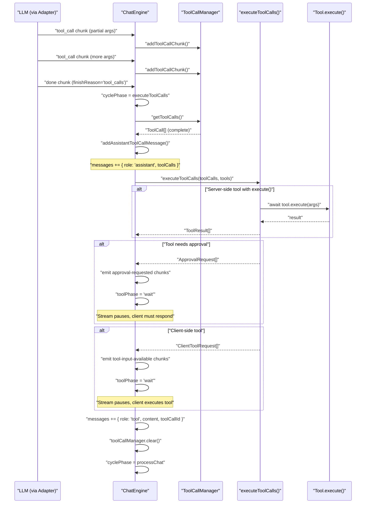

**Sources**: [packages/typescript/ai/src/core/chat.ts:420-488](), [packages/typescript/ai/src/tools/tool-calls.ts]()

### Execution Phases

**1. Tool Call Detection** (`finishReason === 'tool_calls'`):

- Transition to `executeToolCalls` phase
- Retrieve complete tool calls from `ToolCallManager`
- Add assistant message with tool calls to conversation

**Source**: [packages/typescript/ai/src/core/chat.ts:490-507]()

**2. Server-Side Execution**:

- Tools with `.execute()` function are called automatically
- Results are JSON-stringified and added as tool messages
- Execution continues to next iteration

**Source**: [packages/typescript/ai/src/tools/tool-calls.ts]()

**3. Approval Handling** (`needsApproval === true`):

- Emit `approval-requested` chunks with tool input
- Set `toolPhase = 'wait'` to pause the stream
- Client must respond with approval decision via subsequent request

**Source**: [packages/typescript/ai/src/core/chat.ts:543-576]()

**4. Client-Side Execution** (tool has no server `.execute()`):

- Emit `tool-input-available` chunks with parsed arguments
- Set `toolPhase = 'wait'` to pause the stream
- Client executes tool locally and sends result via subsequent request

**Source**: [packages/typescript/ai/src/core/chat.ts:578-606]()

### Pending Tool Calls

When resuming a conversation with pending tool calls (tool calls in messages without corresponding tool results), `ChatEngine` handles them before starting the main loop:

```typescript
const pendingToolCalls = messages
  .filter((m) => m.role === 'assistant' && m.toolCalls)
  .flatMap((m) => m.toolCalls.filter((tc) => !hasToolResult(tc.id)))
```

This enables resumption after approval responses or client-side tool execution.

**Source**: [packages/typescript/ai/src/core/chat.ts:356-418](), [packages/typescript/ai/src/core/chat.ts:651-671]()

---

## Event Emission

### DevTools Integration

`ChatEngine` emits structured events via `aiEventClient` for debugging and observability. These events power the TanStack AI DevTools browser extension.

**Event Types Emitted**:

| Event                         | When                     | Payload                                                            |
| ----------------------------- | ------------------------ | ------------------------------------------------------------------ |
| `chat:started`                | Before chat begins       | `{ requestId, streamId, model, provider, messageCount, hasTools }` |
| `stream:started`              | Stream begins            | `{ streamId, model, provider, timestamp }`                         |
| `stream:chunk:content`        | Content chunk received   | `{ streamId, messageId, content, delta }`                          |
| `stream:chunk:tool-call`      | Tool call chunk received | `{ streamId, toolCallId, toolName, arguments }`                    |
| `stream:chunk:done`           | Done chunk received      | `{ streamId, finishReason, usage }`                                |
| `stream:chunk:error`          | Error chunk received     | `{ streamId, error }`                                              |
| `stream:chunk:thinking`       | Thinking chunk received  | `{ streamId, content, delta }`                                     |
| `chat:iteration`              | Agent loop iteration     | `{ requestId, iterationNumber, toolCallCount }`                    |
| `tool:call-completed`         | Tool execution complete  | `{ requestId, toolCallId, toolName, result, duration }`            |
| `stream:approval-requested`   | Tool needs approval      | `{ streamId, toolCallId, toolName, input, approvalId }`            |
| `stream:tool-input-available` | Client tool ready        | `{ streamId, toolCallId, toolName, input }`                        |
| `usage:tokens`                | Token usage tracked      | `{ requestId, model, usage }`                                      |
| `chat:completed`              | Chat finishes            | `{ requestId, content, finishReason, usage }`                      |
| `stream:ended`                | Stream ends              | `{ streamId, totalChunks, duration }`                              |

**Sources**: [packages/typescript/ai/src/core/chat.ts:114-134](), [packages/typescript/ai/src/core/chat.ts:243-328]()

### Event Flow Example

```mermaid
graph LR
    START["chat() invoked"] --> STARTED["chat:started<br/>stream:started"]
    STARTED --> CONTENT["stream:chunk:content<br/>(multiple times)"]
    CONTENT --> TOOL["stream:chunk:tool-call<br/>(if model calls tools)"]
    TOOL --> DONE1["stream:chunk:done<br/>(finishReason='tool_calls')"]
    DONE1 --> ITERATION["chat:iteration"]
    ITERATION --> TOOL_EXEC["tool:call-completed<br/>(for each tool)"]
    TOOL_EXEC --> CONTENT2["stream:chunk:content<br/>(next iteration)"]
    CONTENT2 --> DONE2["stream:chunk:done<br/>(finishReason='stop')"]
    DONE2 --> USAGE["usage:tokens"]
    USAGE --> COMPLETED["chat:completed<br/>stream:ended"]
```

**Sources**: [packages/typescript/ai/src/core/chat.ts:109-163]()

---

## State Management

### Message Array Mutations

The `messages` array is mutable and grows during the conversation:

```typescript
// Initial state
messages = [
  { role: 'user', content: 'What is the weather in Paris?' }
]

// After first LLM response with tool call
messages = [
  { role: 'user', content: 'What is the weather in Paris?' },
  { role: 'assistant', content: '', toolCalls: [{ id: 'call-1', function: { name: 'weather', arguments: '{"location":"Paris"}' } }] }
]

// After tool execution
messages = [
  { role: 'user', content: 'What is the weather in Paris?' },
  { role: 'assistant', content: '', toolCalls: [...] },
  { role: 'tool', content: '{"temp":72,"condition":"sunny"}', toolCallId: 'call-1' }
]

// After final LLM response
messages = [
  { role: 'user', content: 'What is the weather in Paris?' },
  { role: 'assistant', content: '', toolCalls: [...] },
  { role: 'tool', content: '...', toolCallId: 'call-1' },
  { role: 'assistant', content: 'The weather in Paris is sunny with a temperature of 72°F.' }
]
```

Each iteration adds new messages to support multi-turn reasoning.

**Source**: [packages/typescript/ai/src/core/chat.ts:49](), [packages/typescript/ai/src/core/chat.ts:499-507](), [packages/typescript/ai/src/core/chat.ts:638-646]()

### Abort Signal Handling

`ChatEngine` respects `AbortController` signals to cancel in-flight requests:

```typescript
const abortController = new AbortController()

const stream = chat({
  adapter,
  model: 'gpt-4o',
  messages,
  abortController,
})

// Cancel after 5 seconds
setTimeout(() => abortController.abort(), 5000)
```

The engine checks `isAborted()` at critical points:

- Before each iteration
- During chunk streaming
- Before tool execution

**Source**: [packages/typescript/ai/src/core/chat.ts:74-77](), [packages/typescript/ai/src/core/chat.ts:89-92]()

---

## Summary

The `chat()` function and `ChatEngine` form the core orchestration layer of TanStack AI:

**Key Design Principles**:

1. **Generator-based API** - `AsyncIterable<StreamChunk>` enables streaming without buffering
2. **Stateful orchestration** - `ChatEngine` manages conversation state across iterations
3. **Pluggable adapters** - Abstract provider differences via `AIAdapter.chatStream()`
4. **Automatic tool loops** - Agent loop system handles multi-turn tool execution
5. **Event-driven observability** - Comprehensive event emission for debugging
6. **Pause/resume support** - Client tools and approvals pause stream, resume with context

**Sources**: [packages/typescript/ai/src/core/chat.ts:1-900](), [packages/typescript/ai/src/types.ts:1-873]()
