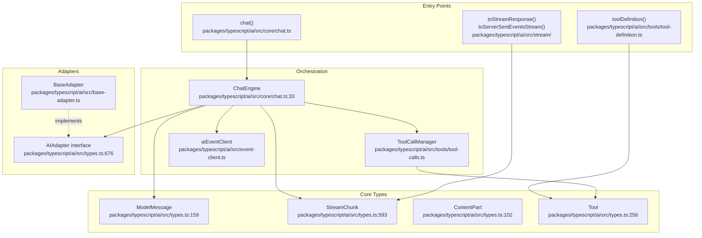
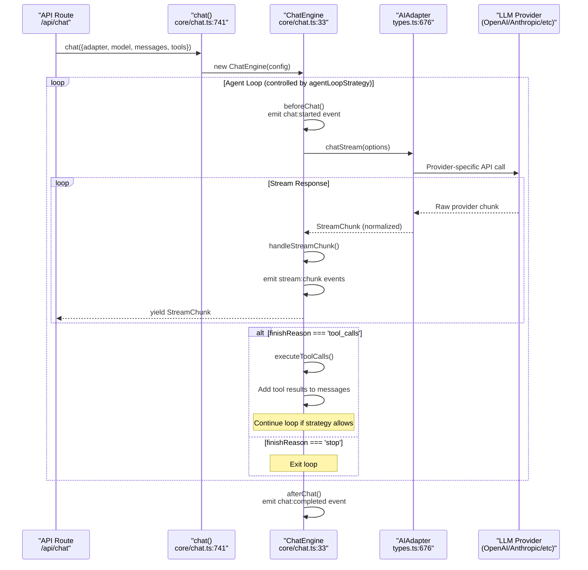
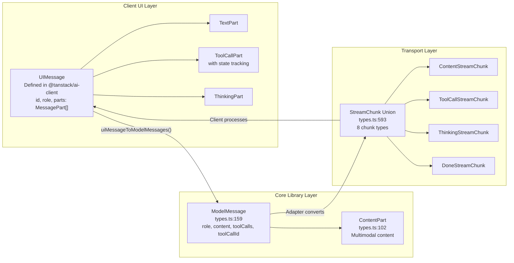
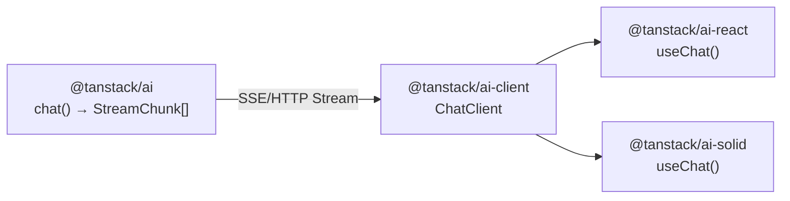
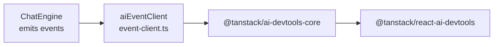

# Core Library (@tanstack/ai)

<details>
<summary>Relevant source files</summary>

The following files were used as context for generating this wiki page:

- [README.md](README.md)
- [docs/adapters/anthropic.md](docs/adapters/anthropic.md)
- [docs/adapters/gemini.md](docs/adapters/gemini.md)
- [docs/adapters/ollama.md](docs/adapters/ollama.md)
- [docs/adapters/openai.md](docs/adapters/openai.md)
- [docs/getting-started/quick-start.md](docs/getting-started/quick-start.md)
- [packages/typescript/ai-anthropic/src/text/text-provider-options.ts](packages/typescript/ai-anthropic/src/text/text-provider-options.ts)
- [packages/typescript/ai-client/README.md](packages/typescript/ai-client/README.md)
- [packages/typescript/ai-devtools/README.md](packages/typescript/ai-devtools/README.md)
- [packages/typescript/ai-gemini/README.md](packages/typescript/ai-gemini/README.md)
- [packages/typescript/ai-ollama/README.md](packages/typescript/ai-ollama/README.md)
- [packages/typescript/ai-openai/README.md](packages/typescript/ai-openai/README.md)
- [packages/typescript/ai-openai/src/text/text-provider-options.ts](packages/typescript/ai-openai/src/text/text-provider-options.ts)
- [packages/typescript/ai-react-ui/README.md](packages/typescript/ai-react-ui/README.md)
- [packages/typescript/ai-react/README.md](packages/typescript/ai-react/README.md)
- [packages/typescript/ai/README.md](packages/typescript/ai/README.md)
- [packages/typescript/ai/src/types.ts](packages/typescript/ai/src/types.ts)
- [packages/typescript/react-ai-devtools/README.md](packages/typescript/react-ai-devtools/README.md)
- [packages/typescript/solid-ai-devtools/README.md](packages/typescript/solid-ai-devtools/README.md)

</details>

## Purpose and Scope

The `@tanstack/ai` package is the server-side core library that orchestrates AI interactions with Language Learning Models (LLMs). It provides a framework-agnostic, provider-agnostic API for chat completions, streaming responses, tool execution, and agentic workflows. This library runs exclusively on the server and is responsible for interfacing with AI providers (OpenAI, Anthropic, Gemini, Ollama) through a unified adapter pattern.

**Key Features:**

- **Tree-shakeable adapters** - Import only the functionality needed (e.g., `openaiText`, `openaiImage`, `openaiSummarize`) for smaller bundle sizes
- **Provider-agnostic API** - Switch between providers without changing application code
- **Multimodal content support** - Send images, audio, video, and documents
- **Isomorphic tools** - Type-safe tool definitions with server/client execution
- **Streaming-first architecture** - Real-time response processing via `AsyncIterable<StreamChunk>`

This document covers the high-level architecture and main responsibilities of the core library. For detailed information about specific subsystems, see:

- [chat() Function](#3.1) - Conversation orchestration and streaming
- [Isomorphic Tool System](#3.2) - Tool definitions and execution strategies
- [AI Provider Adapters](#3.3) - Adapter pattern and provider integrations
- [Multimodal Content Support](#3.4) - Working with images, audio, video, and documents
- [Streaming Response Utilities](#3.5) - HTTP response formatting utilities
- [Additional Capabilities](#3.6) - Summarization, embeddings, image generation, TTS, transcription
- [Structured Output and Schema Conversion](#3.7) - Type-safe structured outputs with Zod, ArkType, Valibot

**Sources:** [README.md:38-48](), [docs/getting-started/quick-start.md:1-262]()

## Package Organization

The core library is structured around several key concerns:



**Sources:** [packages/typescript/ai/src/core/chat.ts:1-741](), [packages/typescript/ai/src/types.ts:1-850](), [packages/typescript/ai/src/tools/tool-definition.ts](), [packages/typescript/ai/src/stream/]()

## Main Exports and Functions

The core library exports several primary functions and utilities:

### `chat()` Function

The main entry point for streaming chat completions. Returns an `AsyncIterable<StreamChunk>` that yields chunks as the model generates responses.

```typescript
// Basic usage pattern
import { chat } from '@tanstack/ai'
import { openaiText } from '@tanstack/ai-openai'

const stream = chat({
  adapter: openaiText('gpt-4o'),
  messages: [{ role: 'user', content: 'Hello!' }],
})
```

**Key responsibilities:**

- Orchestrates multi-turn agent loops for tool execution
- Emits structured `StreamChunk` events (content, tool_call, tool_result, done, error, thinking)
- Manages conversation state across iterations
- Integrates with devtools event system via `conversationId`

**Parameters:**

- `adapter` - Provider adapter instance (from `@tanstack/ai-openai`, `@tanstack/ai-anthropic`, etc.)
- `messages` - Array of `ModelMessage` objects representing conversation history
- `tools` - Optional array of server-side tool implementations
- `systemPrompts` - Optional array of system instruction strings
- `agentLoopStrategy` - Optional function controlling multi-turn iteration behavior
- `temperature`, `topP`, `maxTokens` - Optional sampling parameters
- `outputSchema` - Optional schema for structured output (Zod, ArkType, Valibot)
- `conversationId` - Optional ID for devtools correlation
- `abortController` - Optional `AbortController` for request cancellation

**Sources:** [docs/getting-started/quick-start.md:20-76](), [packages/typescript/ai/src/types.ts:563-650]()

### `toolDefinition()` Function

Creates isomorphic tool definitions with runtime validation and type inference. Tools can execute on the server (`.server()`), client (`.client()`), or both.

```typescript
import { toolDefinition } from '@tanstack/ai'
import { z } from 'zod'

const getWeatherDef = toolDefinition({
  name: 'get_weather',
  description: 'Get the current weather in a location',
  inputSchema: z.object({
    location: z.string(),
  }),
  outputSchema: z.object({
    temperature: z.number(),
    conditions: z.string(),
  }),
})

const getWeather = getWeatherDef.server(async ({ location }) => {
  // Server-side execution
  return await weatherAPI.fetch(location)
})
```

**Features:**

- Runtime validation via Standard JSON Schema compliant libraries (Zod, ArkType, Valibot)
- Type inference from schemas
- Optional `needsApproval` flag for user confirmation
- Dual server/client implementations for flexible execution

**Sources:** [docs/getting-started/quick-start.md:236-255](), [packages/typescript/ai/src/types.ts:328-438]()

### `toServerSentEventsResponse()` Function

Converts an `AsyncIterable<StreamChunk>` into an HTTP `Response` object with Server-Sent Events (SSE) formatting.

```typescript
import { chat, toServerSentEventsResponse } from '@tanstack/ai'
import { openaiText } from '@tanstack/ai-openai'

export async function POST(request: Request) {
  const { messages } = await request.json()

  const stream = chat({
    adapter: openaiText('gpt-4o'),
    messages,
  })

  return toServerSentEventsResponse(stream)
}
```

**Sources:** [docs/getting-started/quick-start.md:80-122]()

### Additional Functions

| Function                     | Purpose                         | Usage                                        |
| ---------------------------- | ------------------------------- | -------------------------------------------- |
| `summarize()`                | Text summarization              | Works with adapters supporting summarization |
| `generateImage()`            | Image generation                | OpenAI DALL-E, Gemini Imagen                 |
| `generateVideo()`            | Video generation (experimental) | Decart adapter                               |
| `generateSpeech()`           | Text-to-speech                  | OpenAI TTS, Gemini TTS                       |
| `generateTranscription()`    | Speech-to-text                  | OpenAI Whisper                               |
| `toServerSentEventsStream()` | Lower-level SSE conversion      | Custom streaming implementations             |

**Sources:** [docs/adapters/openai.md:136-251](), [docs/adapters/gemini.md:140-206]()

## Architecture: Request-Response Flow

The following diagram illustrates how a chat request flows through the core library from API endpoint to LLM and back:



**Key components:**

1. **`chat()` function** [packages/typescript/ai/src/core/chat.ts:741-762]() - Entry point that instantiates ChatEngine
2. **`ChatEngine` class** [packages/typescript/ai/src/core/chat.ts:33-707]() - Orchestrates iterations, tool execution, and event emission
3. **`AIAdapter` interface** [packages/typescript/ai/src/types.ts:676-732]() - Abstraction for provider-specific implementations
4. **`AgentLoopStrategy`** [packages/typescript/ai/src/types.ts:463-464]() - Function that determines when to continue iterating

**Sources:** [packages/typescript/ai/src/core/chat.ts:33-707](), [packages/typescript/ai/src/types.ts:676-732]()

## Tree-Shakeable Adapter Architecture

The core library uses a tree-shakeable adapter pattern that allows importing only the functionality needed, reducing bundle sizes. Adapters abstract provider-specific API details while providing type-safe, capability-specific factory functions.

### Adapter Factory Functions

Each provider package exports specialized adapter factories:

```typescript
// OpenAI adapters - import only what you need
import { openaiText } from '@tanstack/ai-openai/adapters'
import { openaiImage } from '@tanstack/ai-openai/adapters'
import { openaiSummarize } from '@tanstack/ai-openai/adapters'
import { openaiTTS } from '@tanstack/ai-openai/adapters'
import { openaiTranscription } from '@tanstack/ai-openai/adapters'

// Anthropic adapters
import { anthropicText } from '@tanstack/ai-anthropic/adapters'
import { anthropicSummarize } from '@tanstack/ai-anthropic/adapters'

// Gemini adapters
import { geminiText } from '@tanstack/ai-gemini/adapters'
import { geminiImage } from '@tanstack/ai-gemini/adapters'
import { geminiSummarize } from '@tanstack/ai-gemini/adapters'

// Ollama adapters
import { ollamaText } from '@tanstack/ai-ollama/adapters'
```

### Tree-Shakeable Benefits

| Approach                     | Bundle Impact              | Use Case              |
| ---------------------------- | -------------------------- | --------------------- |
| `import { openaiText }`      | Only text completion code  | Chat applications     |
| `import { openaiImage }`     | Only image generation code | Image generation apps |
| `import { openaiSummarize }` | Only summarization code    | Document processing   |
| Full adapter import          | All capabilities bundled   | Multi-capability apps |

### Adapter Architecture Diagram

```mermaid
graph TB
    subgraph "Core Library"
        CHAT["chat()"]
        SUMMARIZE["summarize()"]
        GEN_IMAGE["generateImage()"]
        GEN_SPEECH["generateSpeech()"]
        STREAM_CHUNK["StreamChunk<br/>types.ts"]
    end

    subgraph "OpenAI Adapters (@tanstack/ai-openai)"
        OPENAI_TEXT["openaiText(model)<br/>Returns TextAdapter"]
        OPENAI_IMAGE["openaiImage(model)<br/>Returns ImageAdapter"]
        OPENAI_SUMMARIZE["openaiSummarize(model)<br/>Returns SummarizeAdapter"]
        OPENAI_TTS["openaiTTS(model)<br/>Returns TTSAdapter"]
    end

    subgraph "Anthropic Adapters (@tanstack/ai-anthropic)"
        ANTHROPIC_TEXT["anthropicText(model)<br/>Returns TextAdapter"]
        ANTHROPIC_SUMMARIZE["anthropicSummarize(model)<br/>Returns SummarizeAdapter"]
    end

    subgraph "Gemini Adapters (@tanstack/ai-gemini)"
        GEMINI_TEXT["geminiText(model)<br/>Returns TextAdapter"]
        GEMINI_IMAGE["geminiImage(model)<br/>Returns ImageAdapter"]
    end

    subgraph "Provider APIs"
        OPENAI_API["OpenAI API<br/>Chat Completions<br/>Images<br/>Audio"]
        ANTHROPIC_API["Anthropic API<br/>Messages"]
        GEMINI_API["Google AI API<br/>GenerateContent<br/>Imagen"]
    end

    CHAT --> OPENAI_TEXT
    CHAT --> ANTHROPIC_TEXT
    CHAT --> GEMINI_TEXT

    GEN_IMAGE --> OPENAI_IMAGE
    GEN_IMAGE --> GEMINI_IMAGE

    SUMMARIZE --> OPENAI_SUMMARIZE
    SUMMARIZE --> ANTHROPIC_SUMMARIZE

    GEN_SPEECH --> OPENAI_TTS

    OPENAI_TEXT --> STREAM_CHUNK
    ANTHROPIC_TEXT --> STREAM_CHUNK
    GEMINI_TEXT --> STREAM_CHUNK

    OPENAI_TEXT --> OPENAI_API
    OPENAI_IMAGE --> OPENAI_API
    OPENAI_TTS --> OPENAI_API

    ANTHROPIC_TEXT --> ANTHROPIC_API

    GEMINI_TEXT --> GEMINI_API
    GEMINI_IMAGE --> GEMINI_API
```



### Provider-Specific Model Options

Each adapter supports provider-specific options through the `modelOptions` parameter:

**OpenAI Options:**

```typescript
chat({
  adapter: openaiText('gpt-4o'),
  messages,
  modelOptions: {
    reasoning: {
      effort: 'medium', // "none" | "minimal" | "low" | "medium" | "high"
      summary: 'detailed', // "auto" | "detailed"
    },
    max_tool_calls: 10,
    parallel_tool_calls: true,
  },
})
```

**Anthropic Options:**

```typescript
chat({
  adapter: anthropicText('claude-sonnet-4-5'),
  messages,
  modelOptions: {
    thinking: {
      type: 'enabled',
      budget_tokens: 2048, // Must be >= 1024 and < max_tokens
    },
    top_k: 40,
  },
})
```

**Gemini Options:**

```typescript
chat({
  adapter: geminiText('gemini-2.5-pro'),
  messages,
  modelOptions: {
    thinking: {
      includeThoughts: true,
    },
    responseMimeType: 'application/json',
  },
})
```

**Sources:** [README.md:51-73](), [docs/adapters/openai.md:16-119](), [docs/adapters/anthropic.md:16-117](), [docs/adapters/gemini.md:16-138](), [packages/typescript/ai-openai/src/text/text-provider-options.ts:1-344](), [packages/typescript/ai-anthropic/src/text/text-provider-options.ts:1-205]()

## Message Types and Transformations

The core library defines multiple message representations optimized for different layers of the stack:



### ModelMessage

Server-side message format used by the `chat()` function and adapters [packages/typescript/ai/src/types.ts:232-243]():

```typescript
interface ModelMessage {
  role: 'user' | 'assistant' | 'tool'
  content: string | null | Array<ContentPart>
  name?: string
  toolCalls?: Array<ToolCall>
  toolCallId?: string
}
```

**Characteristics:**

- Simple, provider-agnostic structure
- Supports multimodal content via `ContentPart[]` (text, images, audio, video, documents)
- Tool metadata separate from content
- Optimized for adapter processing

### ContentPart (Multimodal Content)

Union type for multimodal message content [packages/typescript/ai/src/types.ts:184-195]():

| Type           | Purpose          | Source Types             | Metadata                                     |
| -------------- | ---------------- | ------------------------ | -------------------------------------------- |
| `TextPart`     | Plain text       | N/A                      | Provider-specific text metadata              |
| `ImagePart`    | Images           | `data` (base64) or `url` | OpenAI's `detail: 'auto' \| 'low' \| 'high'` |
| `AudioPart`    | Audio            | `data` (base64) or `url` | Format, sample rate                          |
| `VideoPart`    | Video            | `data` (base64) or `url` | Duration, resolution                         |
| `DocumentPart` | Documents (PDFs) | `data` (base64) or `url` | Anthropic's `media_type`                     |

**ContentPartSource Structure:**

```typescript
interface ContentPartSource {
  type: 'data' | 'url'
  value: string // base64 string or URL
}
```

### StreamChunk

Discriminated union of 8 chunk types emitted during streaming [packages/typescript/ai/src/types.ts:652-661]():

| Chunk Type                      | Purpose                                 | Key Fields                                                             |
| ------------------------------- | --------------------------------------- | ---------------------------------------------------------------------- |
| `ContentStreamChunk`            | Incremental text                        | `delta`, `content`, `role`                                             |
| `ToolCallStreamChunk`           | Tool invocation                         | `toolCall.id`, `toolCall.function.name`, `toolCall.function.arguments` |
| `ToolResultStreamChunk`         | Tool execution result                   | `toolCallId`, `content`                                                |
| `ThinkingStreamChunk`           | Model reasoning (GPT-5, Claude, Gemini) | `delta`, `content`                                                     |
| `DoneStreamChunk`               | Stream completion                       | `finishReason`, `usage.promptTokens`, `usage.completionTokens`         |
| `ErrorStreamChunk`              | Error occurred                          | `error.message`, `error.code`                                          |
| `ApprovalRequestedStreamChunk`  | User approval needed                    | `approval.id`, `toolName`, `input`                                     |
| `ToolInputAvailableStreamChunk` | Client tool execution                   | `toolName`, `input` (parsed arguments)                                 |

**Base Structure:**

```typescript
interface BaseStreamChunk {
  type: StreamChunkType
  id: string
  model: string
  timestamp: number
}
```

**Sources:** [packages/typescript/ai/src/types.ts:232-243](), [packages/typescript/ai/src/types.ts:114-175](), [packages/typescript/ai/src/types.ts:652-748]()

## Execution Model

The core library follows a streaming-first, async execution model:

### Server-Side Only

All core library code executes on the server. This ensures:

- API keys remain secure
- Tool execution occurs in trusted environment
- Provider-specific SDKs can be used without bundler issues

### Async Iterables

The `chat()` function returns `AsyncIterable<StreamChunk>` [packages/typescript/ai/src/core/chat.ts:9](), enabling:

- Incremental processing of responses
- Backpressure control (consumer can pause stream)
- Composable stream transformations
- Framework-agnostic consumption (works with for-await-of loops)

### Event System

The core library emits events to `aiEventClient` [packages/typescript/ai/src/event-client.ts]() for devtools integration [packages/typescript/ai/src/core/chat.ts:114-134]():

| Event Type               | When Emitted                | Data                                  |
| ------------------------ | --------------------------- | ------------------------------------- |
| `chat:started`           | Request initiated           | `requestId`, `model`, `messageCount`  |
| `stream:started`         | Stream begins               | `streamId`, `timestamp`               |
| `stream:chunk:content`   | Content chunk received      | `delta`, `content`                    |
| `stream:chunk:tool-call` | Tool call chunk received    | `toolCallId`, `toolName`, `arguments` |
| `chat:iteration`         | Agent loop iteration starts | `iterationNumber`, `toolCallCount`    |
| `chat:completed`         | Request finished            | `content`, `finishReason`, `usage`    |
| `stream:ended`           | Stream closed               | `totalChunks`, `duration`             |

**Sources:** [packages/typescript/ai/src/core/chat.ts:109-163](), [packages/typescript/ai/src/event-client.ts]()

## Type Safety Features

The core library provides extensive type safety through TypeScript:

### Per-Model Type Constraints

Adapters can specify per-model provider options and supported modalities [packages/typescript/ai/src/types.ts:709-720]():

```typescript
// OpenAI adapter type definitions from ai-openai/src/model-meta.ts
interface OpenAIChatModelProviderOptionsByName {
  'gpt-4o': OpenAIReasoningOptions & OpenAIToolsOptions
  'gpt-5': OpenAIReasoningOptions & OpenAIStructuredOutputOptions
  // ... per-model options
}

// Type-safe usage: providerOptions narrows based on model
chat({
  adapter: openai(),
  model: 'gpt-5',
  providerOptions: {
    reasoning: { effort: 'high' }, // Only valid for gpt-5
  },
})
```

### Tool Type Inference

Zod schemas provide runtime validation and compile-time types [packages/typescript/ai/src/types.ts:256-342]():

```typescript
const tool = toolDefinition({
  name: 'calculate',
  inputSchema: z.object({
    a: z.number(),
    b: z.number(),
  }),
  outputSchema: z.object({
    result: z.number(),
  }),
})

// TypeScript infers:
// InferToolInput<typeof tool> = { a: number, b: number }
// InferToolOutput<typeof tool> = { result: number }
```

**Sources:** [packages/typescript/ai/src/types.ts:256-342](), [packages/typescript/ai/src/types.ts:709-720]()

## Common Usage Patterns

### Basic Chat Stream (Tree-Shakeable)

```typescript
// TanStack Start example
import { chat, toServerSentEventsResponse } from '@tanstack/ai'
import { openaiText } from '@tanstack/ai-openai'
import { createFileRoute } from '@tanstack/react-router'

export const Route = createFileRoute('/api/chat')({
  server: {
    handlers: {
      POST: async ({ request }) => {
        const { messages, conversationId } = await request.json()

        const stream = chat({
          adapter: openaiText('gpt-5.2'),
          messages,
          conversationId,
        })

        return toServerSentEventsResponse(stream)
      },
    },
  },
})
```

```typescript
// Next.js App Router example
import { chat, toServerSentEventsResponse } from '@tanstack/ai'
import { openaiText } from '@tanstack/ai-openai'

export async function POST(request: Request) {
  const { messages, conversationId } = await request.json()

  const stream = chat({
    adapter: openaiText('gpt-5.2'),
    messages,
    conversationId,
  })

  return toServerSentEventsResponse(stream)
}
```

### With Tools

```typescript
import { chat, toolDefinition } from '@tanstack/ai'
import { openaiText } from '@tanstack/ai-openai'
import { z } from 'zod'

const getWeatherDef = toolDefinition({
  name: 'get_weather',
  description: 'Get the current weather',
  inputSchema: z.object({
    location: z.string(),
  }),
})

const getWeather = getWeatherDef.server(async ({ location }) => {
  // Server-side execution
  return await weatherAPI.fetch(location)
})

const stream = chat({
  adapter: openaiText('gpt-5.2'),
  messages,
  tools: [getWeather],
})
```

### Custom Agent Loop

```typescript
import { chat } from '@tanstack/ai'
import { anthropicText } from '@tanstack/ai-anthropic'

const stream = chat({
  adapter: anthropicText('claude-sonnet-4-5'),
  messages,
  tools: [tool1, tool2],
  agentLoopStrategy: ({ iterationCount }) => iterationCount < 10,
})
```

### Multimodal Messages

```typescript
import { chat } from '@tanstack/ai'
import { openaiText } from '@tanstack/ai-openai'

const stream = chat({
  adapter: openaiText('gpt-4o'),
  messages: [
    {
      role: 'user',
      content: [
        {
          type: 'text',
          content: "What's in this image?",
        },
        {
          type: 'image',
          source: {
            type: 'url',
            value: 'https://example.com/image.jpg',
          },
        },
      ],
    },
  ],
})
```

**Sources:** [docs/getting-started/quick-start.md:23-122](), [docs/getting-started/quick-start.md:234-255](), [docs/adapters/openai.md:56-99]()

## Integration Points

### With Client Libraries

The core library produces `StreamChunk` objects that client libraries consume:



### With Devtools

The event system integrates with browser-based devtools [packages/typescript/ai-devtools-core]():



**Sources:** [packages/typescript/ai/src/event-client.ts](), [packages/typescript/ai-devtools-core]()
