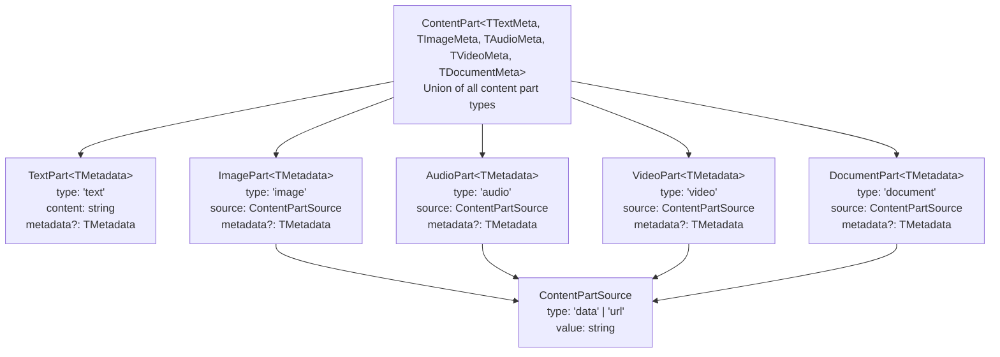
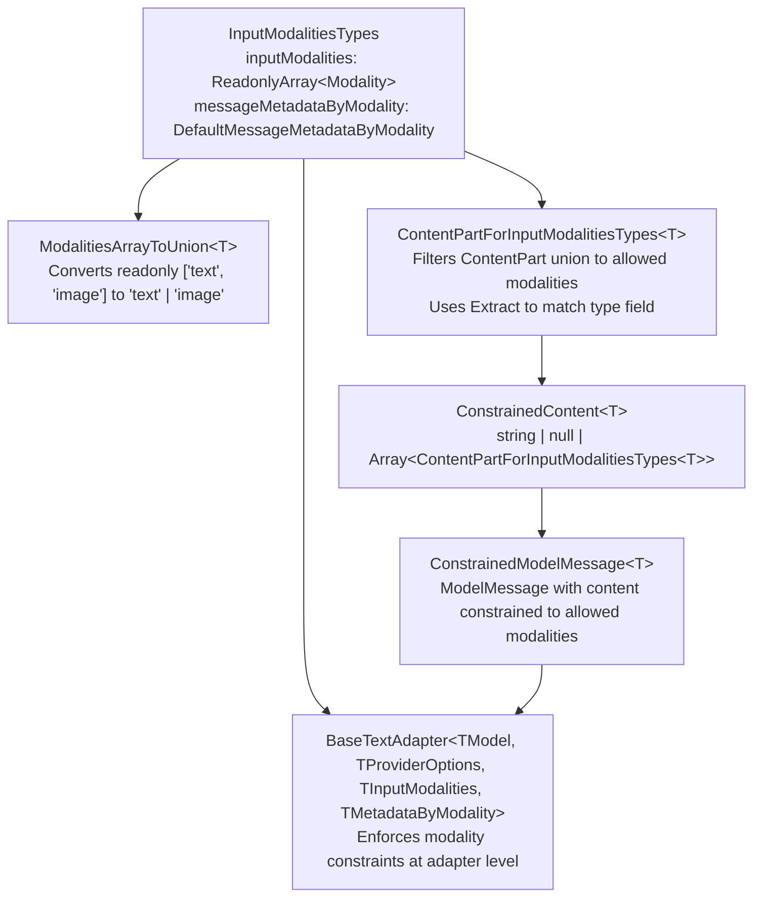
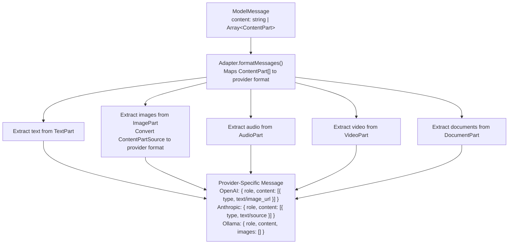

# Multimodal Content Support

<details>
<summary>Relevant source files</summary>

The following files were used as context for generating this wiki page:

- [README.md](README.md)
- [docs/adapters/anthropic.md](docs/adapters/anthropic.md)
- [docs/adapters/gemini.md](docs/adapters/gemini.md)
- [docs/adapters/ollama.md](docs/adapters/ollama.md)
- [docs/adapters/openai.md](docs/adapters/openai.md)
- [docs/getting-started/quick-start.md](docs/getting-started/quick-start.md)
- [packages/typescript/ai-anthropic/src/text/text-provider-options.ts](packages/typescript/ai-anthropic/src/text/text-provider-options.ts)
- [packages/typescript/ai-client/README.md](packages/typescript/ai-client/README.md)
- [packages/typescript/ai-devtools/README.md](packages/typescript/ai-devtools/README.md)
- [packages/typescript/ai-gemini/README.md](packages/typescript/ai-gemini/README.md)
- [packages/typescript/ai-ollama/README.md](packages/typescript/ai-ollama/README.md)
- [packages/typescript/ai-openai/README.md](packages/typescript/ai-openai/README.md)
- [packages/typescript/ai-openai/src/text/text-provider-options.ts](packages/typescript/ai-openai/src/text/text-provider-options.ts)
- [packages/typescript/ai-react-ui/README.md](packages/typescript/ai-react-ui/README.md)
- [packages/typescript/ai-react/README.md](packages/typescript/ai-react/README.md)
- [packages/typescript/ai/README.md](packages/typescript/ai/README.md)
- [packages/typescript/ai/src/types.ts](packages/typescript/ai/src/types.ts)
- [packages/typescript/react-ai-devtools/README.md](packages/typescript/react-ai-devtools/README.md)
- [packages/typescript/solid-ai-devtools/README.md](packages/typescript/solid-ai-devtools/README.md)

</details>

This document explains how TanStack AI handles different content types (text, images, audio, video, documents) in messages. It covers the type system for multimodal content, how modalities are constrained per model, and how adapters transform multimodal content for specific providers.

For information about message types and data flow, see [Data Flow and Message Types](#2.2). For provider-specific features, see [AI Provider Adapters](#3.3).

## Overview

TanStack AI supports five input modalities beyond plain text messages. Each modality has a corresponding `ContentPart` type that describes how content is provided (inline data or URL) and includes optional provider-specific metadata.

The type system enforces modality constraints at compile time, ensuring that only supported content types can be used with specific models. This prevents runtime errors when models don't support certain modalities.

Sources: [packages/typescript/ai/src/types.ts:100-196]()

## Content Modalities

TanStack AI defines five modality types representing different forms of input content:

| Modality   | Description                                | Typical Use Cases                    |
| ---------- | ------------------------------------------ | ------------------------------------ |
| `text`     | Plain text content                         | Chat messages, prompts, instructions |
| `image`    | Image content (base64 or URL)              | Visual Q&A, OCR, image analysis      |
| `audio`    | Audio content (base64 or URL)              | Speech recognition, audio analysis   |
| `video`    | Video content (base64 or URL)              | Video understanding, frame analysis  |
| `document` | Document content like PDFs (base64 or URL) | Document Q&A, content extraction     |

```typescript
export type Modality = 'text' | 'image' | 'audio' | 'video' | 'document'
```

Each adapter defines which modalities its models support through the `inputModalities` type parameter in `BaseTextAdapter`.

Sources: [packages/typescript/ai/src/types.ts:100-108]()

## ContentPart Type Hierarchy



**ContentPart Type System**

The `ContentPart` union type supports discriminated union patterns through the `type` field, enabling type-safe content handling.

Sources: [packages/typescript/ai/src/types.ts:184-196](), [packages/typescript/ai/src/types.ts:130-175]()

## Content Sources

Non-text content parts specify their source through the `ContentPartSource` interface, which supports two delivery methods:

```typescript
export interface ContentPartSource {
  /** 'data': Inline data (base64) | 'url': URL reference */
  type: 'data' | 'url'
  /**
   * For 'data': base64-encoded string
   * For 'url': HTTP(S) URL or data URI
   */
  value: string
}
```

**Data Source Example (Base64)**:

```typescript
{
  type: 'image',
  source: {
    type: 'data',
    value: 'iVBORw0KGgoAAAANSUhEUgAA...' // base64 encoded
  }
}
```

**URL Source Example**:

```typescript
{
  type: 'image',
  source: {
    type: 'url',
    value: 'https://example.com/image.jpg'
  }
}
```

Adapters transform these sources into provider-specific formats during message processing.

Sources: [packages/typescript/ai/src/types.ts:110-128]()

## Individual ContentPart Types

### TextPart

```typescript
export interface TextPart<TMetadata = unknown> {
  type: 'text'
  content: string
  metadata?: TMetadata
}
```

Text parts represent plain text content. The generic `TMetadata` parameter allows providers to attach custom metadata.

### ImagePart

```typescript
export interface ImagePart<TMetadata = unknown> {
  type: 'image'
  source: ContentPartSource
  metadata?: TMetadata
}
```

Image parts support both inline base64 data and URL references. Provider-specific metadata might include detail levels (OpenAI) or cache control (Anthropic).

### AudioPart

```typescript
export interface AudioPart<TMetadata = unknown> {
  type: 'audio'
  source: ContentPartSource
  metadata?: TMetadata
}
```

Audio parts enable audio input for models that support speech recognition or audio analysis. Metadata might include format specifications or sample rates.

### VideoPart

```typescript
export interface VideoPart<TMetadata = unknown> {
  type: 'video'
  source: ContentPartSource
  metadata?: TMetadata
}
```

Video parts support video input for multimodal models. Metadata might include duration, resolution, or frame rate information.

### DocumentPart

```typescript
export interface DocumentPart<TMetadata = unknown> {
  type: 'document'
  source: ContentPartSource
  metadata?: TMetadata
}
```

Document parts handle structured documents like PDFs. Anthropic models, for example, require a `media_type` in metadata (e.g., `application/pdf`).

Sources: [packages/typescript/ai/src/types.ts:130-175]()

## Provider-Specific Metadata

Each `ContentPart` type accepts a generic `TMetadata` parameter for provider-specific extensions. Different providers use metadata to expose unique capabilities:

| Provider  | Modality | Metadata Example                                     | Purpose                               |
| --------- | -------- | ---------------------------------------------------- | ------------------------------------- |
| OpenAI    | image    | `{ detail: 'high' \| 'low' \| 'auto' }`              | Control image processing detail level |
| Anthropic | document | `{ media_type: 'application/pdf' }`                  | Specify document MIME type            |
| Anthropic | any      | `{ cacheControl: { type: 'ephemeral', ttl: '5m' } }` | Control prompt caching                |

### OpenAI Image Metadata Example

OpenAI's `detail` parameter controls token usage and processing detail:

```typescript
{
  type: 'image',
  source: { type: 'url', value: 'https://example.com/image.jpg' },
  metadata: { detail: 'high' } // OpenAI-specific
}
```

### Anthropic Document Metadata Example

Anthropic requires `media_type` for document parts:

```typescript
{
  type: 'document',
  source: { type: 'data', value: 'JVBERi0xLjQK...' },
  metadata: { media_type: 'application/pdf' } // Anthropic-specific
}
```

Sources: [packages/typescript/ai/src/types.ts:130-175](), [packages/typescript/ai-anthropic/src/text/text-provider-options.ts:1-67]()

## Modality Constraints and Type Safety



**Type-Level Modality Constraint Flow**

The type system ensures compile-time safety by constraining which `ContentPart` types can be used with specific models.

### InputModalitiesTypes

Each adapter specifies supported modalities through the `InputModalitiesTypes` type:

```typescript
export type InputModalitiesTypes = {
  inputModalities: ReadonlyArray<Modality>
  messageMetadataByModality: DefaultMessageMetadataByModality
}
```

For example, Ollama's text adapter defines:

```typescript
type OllamaInputModalities = readonly ['text', 'image']

type OllamaMessageMetadataByModality = {
  text: unknown
  image: unknown
  audio: unknown
  video: unknown
  document: unknown
}
```

### ContentPartForInputModalitiesTypes

This helper type filters the `ContentPart` union to only include parts matching supported modalities:

```typescript
export type ContentPartForInputModalitiesTypes<
  TInputModalitiesTypes extends InputModalitiesTypes,
> = Extract<
  ContentPart<...>,
  { type: TInputModalitiesTypes['inputModalities'][number] }
>
```

If a model only supports `['text', 'image']`, then `AudioPart`, `VideoPart`, and `DocumentPart` are excluded from the allowed types.

### ConstrainedModelMessage

Messages can be constrained to only accept specific modalities:

```typescript
export type ConstrainedModelMessage<
  TInputModalitiesTypes extends InputModalitiesTypes,
> = Omit<ModelMessage, 'content'> & {
  content: ConstrainedContent<TInputModalitiesTypes>
}
```

This ensures that messages passed to an adapter cannot contain unsupported content types.

Sources: [packages/typescript/ai/src/types.ts:197-231](), [packages/typescript/ai/src/types.ts:300-313](), [packages/typescript/ai-ollama/src/adapters/text.ts:103-114]()

## Message Construction with Multimodal Content

### String Content (Text Only)

The simplest form uses a string for text-only content:

```typescript
const messages = [
  {
    role: 'user',
    content: 'Describe this image',
  },
]
```

### Array Content (Multimodal)

For multimodal messages, use an array of `ContentPart` objects:

```typescript
const messages = [
  {
    role: 'user',
    content: [
      {
        type: 'text',
        content: 'What is in this image?',
      },
      {
        type: 'image',
        source: {
          type: 'url',
          value: 'https://example.com/photo.jpg',
        },
      },
    ],
  },
]
```

### Base64 Image Example

```typescript
const messages = [
  {
    role: 'user',
    content: [
      {
        type: 'text',
        content: 'Analyze this document',
      },
      {
        type: 'document',
        source: {
          type: 'data',
          value: 'JVBERi0xLjQK...', // base64 PDF
        },
        metadata: {
          media_type: 'application/pdf', // Anthropic-specific
        },
      },
    ],
  },
]
```

Sources: [packages/typescript/ai/src/types.ts:232-243]()

## Adapter Processing of Multimodal Content



**Adapter Message Transformation Pipeline**

### Ollama Image Processing Example

The Ollama adapter demonstrates how multimodal content is transformed:

```typescript
private formatMessages(messages: TextOptions['messages']): Array<Message> {
  return messages.map((msg) => {
    let textContent = ''
    const images: Array<string> = []

    if (Array.isArray(msg.content)) {
      for (const part of msg.content) {
        if (part.type === 'text') {
          textContent += part.content
        } else if (part.type === 'image') {
          if (part.source.type === 'data') {
            images.push(part.source.value)
          } else {
            images.push(part.source.value)
          }
        }
      }
    } else {
      textContent = msg.content || ''
    }

    return {
      role: msg.role,
      content: textContent,
      ...(images.length > 0 ? { images } : {})
    }
  })
}
```

This method:

1. Iterates through `ContentPart` array
2. Accumulates text from `TextPart` entries
3. Collects image sources from `ImagePart` entries
4. Constructs Ollama-specific message format with separate `content` and `images` fields

Different adapters implement similar transformations specific to their provider's API requirements.

Sources: [packages/typescript/ai-ollama/src/adapters/text.ts:314-376]()

## Default Metadata Types

When an adapter doesn't define custom metadata types, the system defaults to `unknown` for all modalities:

```typescript
export interface DefaultMessageMetadataByModality {
  text: unknown
  image: unknown
  audio: unknown
  video: unknown
  document: unknown
}
```

This allows adapters to opt into metadata support incrementally. Adapters that need provider-specific metadata override these types in their `InputModalitiesTypes` definition.

Sources: [packages/typescript/ai/src/types.ts:1023-1030]()

## Type Inference Example

The modality constraint system enables full type safety:

```typescript
// Adapter that only supports text and image
class MyAdapter extends BaseTextAdapter<
  'my-model',
  {},
  readonly ['text', 'image'],
  DefaultMessageMetadataByModality
> {
  // ...
}

// ✅ Valid: text and image
const validMessage = {
  role: 'user',
  content: [
    { type: 'text', content: 'Hello' },
    { type: 'image', source: { type: 'url', value: '...' } },
  ],
}

// ❌ Type Error: audio not supported
const invalidMessage = {
  role: 'user',
  content: [
    { type: 'text', content: 'Hello' },
    { type: 'audio', source: { type: 'data', value: '...' } }, // Type error!
  ],
}
```

The TypeScript compiler prevents passing unsupported content types at compile time, catching errors before runtime.

Sources: [packages/typescript/ai/src/types.ts:197-231](), [packages/typescript/ai/src/types.ts:300-313]()
