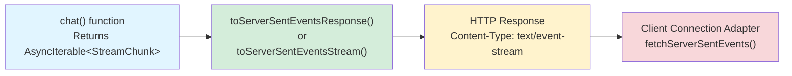
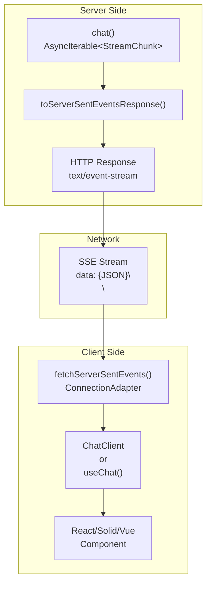
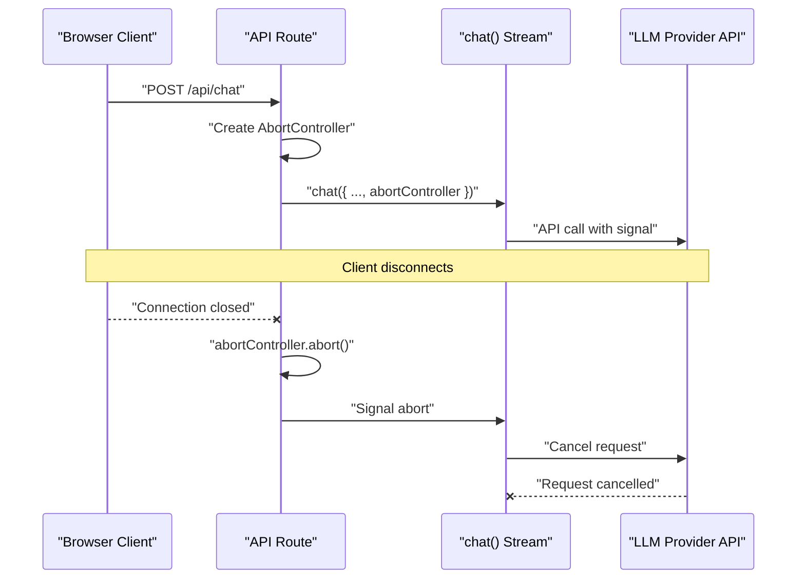

# Streaming Response Utilities

<details>
<summary>Relevant source files</summary>

The following files were used as context for generating this wiki page:

- [docs/adapters/anthropic.md](docs/adapters/anthropic.md)
- [docs/adapters/gemini.md](docs/adapters/gemini.md)
- [docs/adapters/ollama.md](docs/adapters/ollama.md)
- [docs/adapters/openai.md](docs/adapters/openai.md)
- [docs/api/ai.md](docs/api/ai.md)
- [docs/getting-started/overview.md](docs/getting-started/overview.md)
- [docs/getting-started/quick-start.md](docs/getting-started/quick-start.md)
- [docs/guides/client-tools.md](docs/guides/client-tools.md)
- [docs/guides/server-tools.md](docs/guides/server-tools.md)
- [docs/guides/streaming.md](docs/guides/streaming.md)
- [docs/guides/tool-approval.md](docs/guides/tool-approval.md)
- [docs/guides/tool-architecture.md](docs/guides/tool-architecture.md)
- [docs/guides/tools.md](docs/guides/tools.md)
- [docs/protocol/chunk-definitions.md](docs/protocol/chunk-definitions.md)
- [docs/protocol/http-stream-protocol.md](docs/protocol/http-stream-protocol.md)
- [docs/protocol/sse-protocol.md](docs/protocol/sse-protocol.md)
- [packages/typescript/ai-anthropic/src/text/text-provider-options.ts](packages/typescript/ai-anthropic/src/text/text-provider-options.ts)
- [packages/typescript/ai-openai/src/text/text-provider-options.ts](packages/typescript/ai-openai/src/text/text-provider-options.ts)
- [packages/typescript/ai/src/types.ts](packages/typescript/ai/src/types.ts)

</details>

This page documents the server-side utilities for converting AI chat streams into HTTP responses. These functions transform the `AsyncIterable<StreamChunk>` returned by `chat()` into Server-Sent Events (SSE) format suitable for HTTP streaming. For information about client-side consumption of these streams, see [Connection Adapters](#4.2). For details on the streaming architecture and chunk types, see [Streaming Protocols](#5).

**Sources:** [docs/api/ai.md:134-184]()

## Overview

The streaming response utilities bridge the gap between TanStack AI's streaming primitives and HTTP responses:



**Diagram: Stream Conversion Pipeline**

The conversion process:

1. `chat()` produces an `AsyncIterable<StreamChunk>` with typed chunks (content, tool_call, thinking, done, error)
2. Conversion utilities serialize chunks to JSON and wrap them in SSE format
3. HTTP response is created with appropriate headers (`Content-Type: text/event-stream`, `Cache-Control: no-cache`, `Connection: keep-alive`)
4. Client-side adapters consume the SSE stream and reconstruct the chunks

**Sources:** [docs/api/ai.md:134-184](), [docs/getting-started/quick-start.md:26-59](), [docs/guides/streaming.md:29-46]()

## toServerSentEventsResponse()

The primary utility for converting chat streams to HTTP responses. This is a convenience wrapper around `toServerSentEventsStream()` that adds proper HTTP headers.

### Function Signature

```typescript
function toServerSentEventsResponse(
  stream: AsyncIterable<StreamChunk>,
  init?: ResponseInit & { abortController?: AbortController }
): Response
```

### Parameters

| Parameter | Type                                                   | Required | Description                                                                                        |
| --------- | ------------------------------------------------------ | -------- | -------------------------------------------------------------------------------------------------- |
| `stream`  | `AsyncIterable<StreamChunk>`                           | Yes      | The stream returned by `chat()`, `summarize()`, or other AI activities                             |
| `init`    | `ResponseInit & { abortController?: AbortController }` | No       | Standard Response initialization options plus optional `abortController` for cancellation handling |

### Response Headers

The function automatically sets these headers on the returned `Response`:

| Header          | Value               | Purpose                         |
| --------------- | ------------------- | ------------------------------- |
| `Content-Type`  | `text/event-stream` | Identifies the response as SSE  |
| `Cache-Control` | `no-cache`          | Prevents proxy/browser caching  |
| `Connection`    | `keep-alive`        | Maintains persistent connection |

**Sources:** [docs/api/ai.md:161-184](), [docs/getting-started/quick-start.md:58-59]()

### Usage Example: TanStack Start

```typescript
// examples/ts-react-chat/src/routes/api.tanchat.ts
export const Route = createFileRoute('/api/tanchat')({
  server: {
    handlers: {
      POST: async ({ request }) => {
        const { messages, data } = await request.json()

        const stream = chat({
          adapter: openaiText('gpt-4o'),
          messages,
          tools: [getGuitars, recommendGuitarToolDef],
          systemPrompts: [SYSTEM_PROMPT],
          agentLoopStrategy: maxIterations(20),
          conversationId: data?.conversationId,
        })

        return toServerSentEventsResponse(stream)
      },
    },
  },
})
```

**Sources:** [examples/ts-react-chat/src/routes/api.tanchat.ts:54-141]()

### Usage Example: Next.js

```typescript
// app/api/chat/route.ts
import { chat, toServerSentEventsResponse } from '@tanstack/ai'
import { openaiText } from '@tanstack/ai-openai'

export async function POST(request: Request) {
  const { messages } = await request.json()

  const stream = chat({
    adapter: openaiText('gpt-4o'),
    messages,
  })

  return toServerSentEventsResponse(stream)
}
```

**Sources:** [docs/getting-started/quick-start.md:80-109](), [docs/adapters/openai.md:56-72]()

### Abort Controller Integration

Pass an `abortController` to handle client disconnections gracefully:

```typescript
const abortController = new AbortController()

const stream = chat({
  adapter: openaiText('gpt-4o'),
  messages,
  abortController,
})

return toServerSentEventsResponse(stream, { abortController })
```

When the client disconnects, the `abortController` signals cancellation to both the stream processing and the underlying LLM API call.

**Sources:** [examples/ts-react-chat/src/routes/api.tanchat.ts:66-141]()

## toServerSentEventsStream()

Lower-level utility that converts a stream to a `ReadableStream<Uint8Array>` without creating an HTTP Response. Use this when you need more control over the response construction or are working with non-standard HTTP frameworks.

### Function Signature

```typescript
function toServerSentEventsStream(
  stream: AsyncIterable<StreamChunk>,
  abortController?: AbortController
): ReadableStream<Uint8Array>
```

### Parameters

| Parameter         | Type                         | Required | Description                                            |
| ----------------- | ---------------------------- | -------- | ------------------------------------------------------ |
| `stream`          | `AsyncIterable<StreamChunk>` | Yes      | The stream returned by `chat()` or other AI activities |
| `abortController` | `AbortController`            | No       | Optional controller to abort when stream is cancelled  |

### Returns

A `ReadableStream<Uint8Array>` where each chunk follows SSE format:

- Prefixed with `"data: "`
- Followed by `"\
\
"`
- Stream terminates with `"data: [DONE]\
\
"`

### Usage Example

```typescript
import { chat, toServerSentEventsStream } from '@tanstack/ai'
import { openaiText } from '@tanstack/ai-openai'

const stream = chat({
  adapter: openaiText('gpt-4o'),
  messages,
})

const readableStream = toServerSentEventsStream(stream)

// Create custom response
return new Response(readableStream, {
  headers: {
    'Content-Type': 'text/event-stream',
    'Cache-Control': 'no-cache',
    'X-Custom-Header': 'value',
  },
})
```

**Sources:** [docs/api/ai.md:134-160]()

## Server-Sent Events Format

The utilities convert each `StreamChunk` into SSE format with the following structure:

```mermaid
sequenceDiagram
    participant Stream as "AsyncIterable&lt;StreamChunk&gt;"
    participant Converter as "toServerSentEventsStream()"
    participant Output as "ReadableStream&lt;Uint8Array&gt;"

    Stream->>Converter: "StreamChunk { type: 'content', delta: 'Hello' }"
    Converter->>Converter: "JSON.stringify(chunk)"
    Converter->>Output: 'data: {"type":"content","delta":"Hello"}\
\
'

    Stream->>Converter: "StreamChunk { type: 'thinking', content: 'Reasoning...' }"
    Converter->>Converter: "JSON.stringify(chunk)"
    Converter->>Output: 'data: {"type":"thinking","content":"Reasoning..."}\
\
'

    Stream->>Converter: "StreamChunk { type: 'done' }"
    Converter->>Converter: "JSON.stringify(chunk)"
    Converter->>Output: 'data: {"type":"done",...}\
\
'

    Converter->>Output: "data: [DONE]\
\
"
```

**Diagram: SSE Chunk Serialization**

### Format Specification

Each chunk in the output stream follows this pattern:

```
data: {JSON_SERIALIZED_CHUNK}\
\

```

For example, a content chunk:

```
data: {"type":"content","id":"abc123","model":"gpt-4o","timestamp":1234567890,"delta":"Hello","content":"Hello","role":"assistant"}\
\

```

The stream terminates with:

```
data: [DONE]\
\

```

**Sources:** [docs/api/ai.md:149-160](), [docs/guides/connection-adapters.md:12-14]()

## Framework Integration Patterns

### TanStack Start (Recommended)

Use `createFileRoute()` with server handlers:

```typescript
import { createFileRoute } from '@tanstack/react-router'
import { chat, toServerSentEventsResponse } from '@tanstack/ai'
import { openaiText } from '@tanstack/ai-openai'

export const Route = createFileRoute('/api/chat')({
  server: {
    handlers: {
      POST: async ({ request }) => {
        const { messages } = await request.json()

        const stream = chat({
          adapter: openaiText('gpt-4o'),
          messages,
        })

        return toServerSentEventsResponse(stream)
      },
    },
  },
})
```

**Sources:** [docs/getting-started/quick-start.md:23-76](), [examples/ts-react-chat/src/routes/api.tanchat.ts:54-141]()

### Next.js App Router

Export named HTTP method handlers:

```typescript
// app/api/chat/route.ts
export async function POST(request: Request) {
  const { messages } = await request.json()

  const stream = chat({
    adapter: openaiText('gpt-4o'),
    messages,
  })

  return toServerSentEventsResponse(stream)
}
```

**Sources:** [docs/getting-started/quick-start.md:78-122](), [docs/adapters/openai.md:56-72]()

### Express / Node.js

Manual response handling:

```typescript
app.post('/api/chat', async (req, res) => {
  const { messages } = req.body

  const stream = chat({
    adapter: openaiText('gpt-4o'),
    messages,
  })

  const sseStream = toServerSentEventsStream(stream)

  res.setHeader('Content-Type', 'text/event-stream')
  res.setHeader('Cache-Control', 'no-cache')
  res.setHeader('Connection', 'keep-alive')

  const reader = sseStream.getReader()

  try {
    while (true) {
      const { done, value } = await reader.read()
      if (done) break
      res.write(value)
    }
  } finally {
    res.end()
  }
})
```

**Sources:** [docs/getting-started/overview.md:22-27]()

## Error Handling

Handle errors during streaming by catching exceptions and returning appropriate error responses:

```typescript
export async function POST(request: Request) {
  try {
    const { messages } = await request.json()

    const stream = chat({
      adapter: openaiText('gpt-4o'),
      messages,
    })

    return toServerSentEventsResponse(stream)
  } catch (error) {
    console.error('Chat error:', error)

    return new Response(
      JSON.stringify({
        error: error instanceof Error ? error.message : 'An error occurred',
      }),
      {
        status: 500,
        headers: { 'Content-Type': 'application/json' },
      }
    )
  }
}
```

Error chunks are also streamed to the client as part of the normal SSE flow when they occur mid-stream:

```
data: {"type":"error","id":"err123","model":"gpt-4o","timestamp":1234567890,"error":{"message":"API rate limit exceeded"}}\
\

```

**Sources:** [docs/getting-started/quick-start.md:48-72](), [examples/ts-react-chat/src/routes/api.tanchat.ts:142-166]()

## Client-Side Consumption

The SSE streams produced by these utilities are consumed by client-side connection adapters:



**Diagram: End-to-End Streaming Flow**

The client-side code:

```typescript
import { useChat, fetchServerSentEvents } from '@tanstack/ai-react'

function ChatComponent() {
  const { messages, sendMessage } = useChat({
    connection: fetchServerSentEvents('/api/chat'),
  })

  // messages automatically update as chunks arrive
}
```

The `fetchServerSentEvents()` adapter:

1. Makes a POST request to the API route
2. Parses the SSE stream line-by-line
3. Deserializes JSON chunks
4. Yields reconstructed `StreamChunk` objects
5. Stops when `data: [DONE]` is received

**Sources:** [docs/guides/connection-adapters.md:12-61](), [docs/getting-started/quick-start.md:124-207]()

## Abort Signal Propagation

The abort controller integration enables proper cleanup when clients disconnect:



**Diagram: Abort Signal Flow**

Implementation pattern:

```typescript
export async function POST(request: Request) {
  const requestSignal = request.signal

  // Check if already aborted
  if (requestSignal.aborted) {
    return new Response(null, { status: 499 })
  }

  const abortController = new AbortController()
  const { messages } = await request.json()

  try {
    const stream = chat({
      adapter: openaiText('gpt-4o'),
      messages,
      abortController,
    })

    return toServerSentEventsResponse(stream, { abortController })
  } catch (error: any) {
    // Handle abort errors
    if (error.name === 'AbortError' || abortController.signal.aborted) {
      return new Response(null, { status: 499 })
    }
    throw error
  }
}
```

**Sources:** [examples/ts-react-chat/src/routes/api.tanchat.ts:58-166](), [docs/guides/connection-adapters.md:165-189]()

## Best Practices

### Always Handle Errors

Wrap stream creation in try-catch to handle synchronous errors:

```typescript
try {
  const stream = chat({ adapter, messages })
  return toServerSentEventsResponse(stream)
} catch (error) {
  return new Response(JSON.stringify({ error: error.message }), {
    status: 500,
    headers: { 'Content-Type': 'application/json' },
  })
}
```

### Use Abort Controllers

Always pass an abort controller to enable proper cleanup:

```typescript
const abortController = new AbortController()
const stream = chat({ adapter, messages, abortController })
return toServerSentEventsResponse(stream, { abortController })
```

### Check Request Validity Early

Validate API keys and request parameters before starting the stream:

```typescript
if (!process.env.OPENAI_API_KEY) {
  return new Response(
    JSON.stringify({ error: 'OPENAI_API_KEY not configured' }),
    { status: 500, headers: { 'Content-Type': 'application/json' } }
  )
}

const { messages } = await request.json()
// Stream processing continues...
```

### Set Appropriate Response Status

Use HTTP 499 (Client Closed Request) for aborted requests to distinguish from server errors:

```typescript
if (error.name === 'AbortError') {
  return new Response(null, { status: 499 })
}
```

**Sources:** [examples/ts-react-chat/src/routes/api.tanchat.ts:58-166](), [docs/getting-started/quick-start.md:34-75]()
