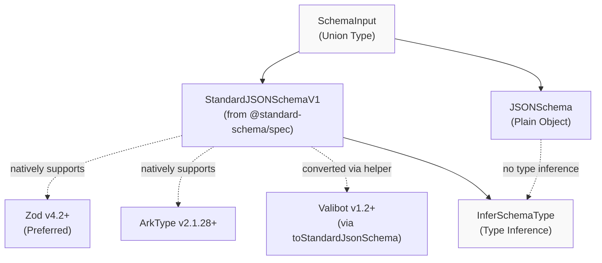
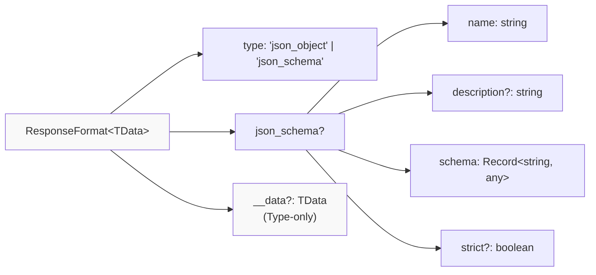
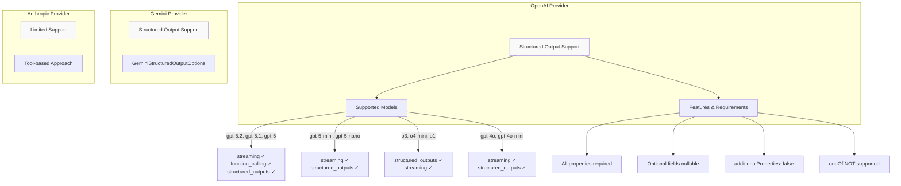
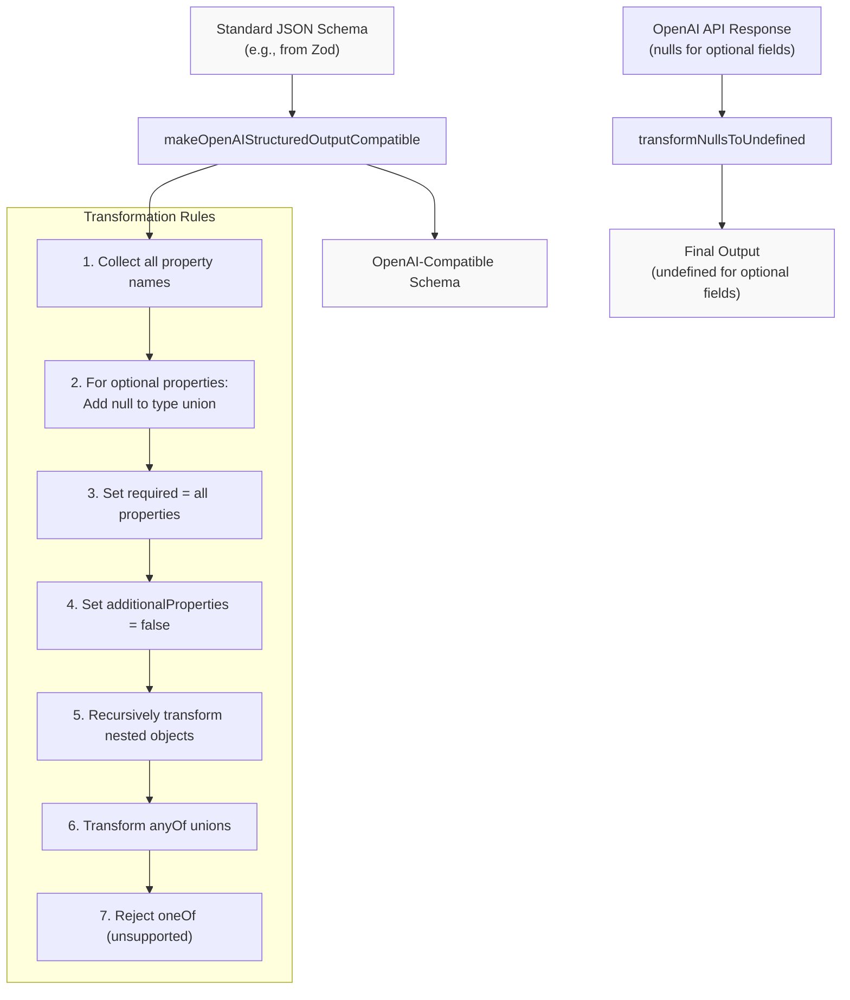
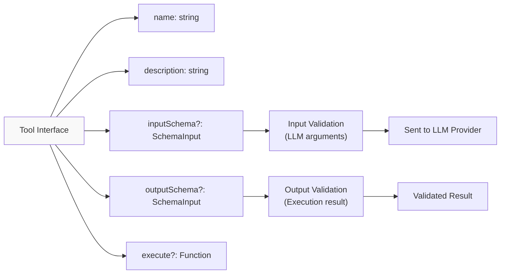

# Structured Output and Schema Conversion

<details>
<summary>Relevant source files</summary>

The following files were used as context for generating this wiki page:

- [docs/community-adapters/decart.md](docs/community-adapters/decart.md)
- [docs/community-adapters/guide.md](docs/community-adapters/guide.md)
- [docs/config.json](docs/config.json)
- [docs/guides/structured-outputs.md](docs/guides/structured-outputs.md)
- [examples/ts-react-chat/src/lib/model-selection.ts](examples/ts-react-chat/src/lib/model-selection.ts)
- [examples/ts-react-chat/src/routes/api.tanchat.ts](examples/ts-react-chat/src/routes/api.tanchat.ts)
- [packages/typescript/ai-anthropic/src/text/text-provider-options.ts](packages/typescript/ai-anthropic/src/text/text-provider-options.ts)
- [packages/typescript/ai-gemini/src/adapters/text.ts](packages/typescript/ai-gemini/src/adapters/text.ts)
- [packages/typescript/ai-gemini/src/model-meta.ts](packages/typescript/ai-gemini/src/model-meta.ts)
- [packages/typescript/ai-gemini/src/text/text-provider-options.ts](packages/typescript/ai-gemini/src/text/text-provider-options.ts)
- [packages/typescript/ai-gemini/tests/gemini-adapter.test.ts](packages/typescript/ai-gemini/tests/gemini-adapter.test.ts)
- [packages/typescript/ai-openai/live-tests/tool-test-empty-object.ts](packages/typescript/ai-openai/live-tests/tool-test-empty-object.ts)
- [packages/typescript/ai-openai/src/text/text-provider-options.ts](packages/typescript/ai-openai/src/text/text-provider-options.ts)
- [packages/typescript/ai/src/activities/chat/stream/processor.ts](packages/typescript/ai/src/activities/chat/stream/processor.ts)
- [packages/typescript/ai/src/types.ts](packages/typescript/ai/src/types.ts)

</details>

## Purpose and Scope

This page documents TanStack AI's structured output support, which enables constraining model responses to specific JSON structures. It covers the core schema input types, the `ResponseFormat<TData>` interface for structured output configuration, provider-specific structured output capabilities, and OpenAI's specialized schema conversion utilities that handle the provider's strict structured output requirements.

For information about tool input/output schema validation, see [Isomorphic Tool System](#3.2). For general type safety patterns, see [Type Safety Helpers](#4.4).

## Schema Input System

TanStack AI provides a flexible schema input system that supports multiple schema libraries while maintaining type safety. The system is designed around the Standard JSON Schema specification to enable interoperability.

### Schema Input Type Hierarchy



**Sources:** [packages/typescript/ai/src/types.ts:66-85]()

### SchemaInput Type Definition

The `SchemaInput` type accepts either Standard JSON Schema compliant schemas or plain JSON Schema objects:

```typescript
type SchemaInput = StandardJSONSchemaV1<any, any> | JSONSchema
```

Standard JSON Schema support includes:

- **Zod v4.2+** - Natively supports `StandardJSONSchemaV1` (preferred)
- **ArkType v2.1.28+** - Natively supports `StandardJSONSchemaV1`
- **Valibot v1.2+** - Via `toStandardJsonSchema()` from `@valibot/to-json-schema`

The `JSONSchema` interface defines a comprehensive plain JSON Schema structure supporting draft 2020-12 features including object types, arrays, enums, references (`$ref`), definitions (`$defs`, `definitions`), composition (`allOf`, `anyOf`, `oneOf`, `not`), validation constraints, and extensibility.

**Sources:** [packages/typescript/ai/src/types.ts:22-78]()

### Type Inference with InferSchemaType

The `InferSchemaType<T>` utility extracts TypeScript types from schemas at compile time:

```typescript
type InferSchemaType<T> =
  T extends StandardJSONSchemaV1<infer TInput, unknown> ? TInput : unknown
```

For Standard JSON Schema compliant schemas (Zod, ArkType), this extracts the input type. For plain JSON Schema objects, it returns `unknown` since compile-time type inference is not possible from runtime JSON Schema definitions.

**Sources:** [packages/typescript/ai/src/types.ts:79-85]()

## Structured Output Configuration

### ResponseFormat Interface

The `ResponseFormat<TData>` interface defines structured output configuration for model responses:



**Sources:** [packages/typescript/ai/src/types.ts:444-534]()

### Response Format Types

| Type          | Description                                                      | Schema Required |
| ------------- | ---------------------------------------------------------------- | --------------- |
| `json_object` | Forces model to output valid JSON (any structure)                | No              |
| `json_schema` | Validates output against provided JSON Schema (strict structure) | Yes             |

When using `json_schema`, the `json_schema` object must include:

- `name` - Unique identifier for the schema (used in logs/debugging)
- `schema` - JSON Schema definition (draft 2020-12 compatible)
- `description` - Optional documentation of schema purpose
- `strict` - Whether to enforce strict validation (default: true where supported)

The `__data` property is type-only and never set at runtime - it exists solely for TypeScript type inference to propagate the expected data structure through the SDK.

**Sources:** [packages/typescript/ai/src/types.ts:455-534]()

### Using outputSchema in TextOptions

The `TextOptions` interface includes an `outputSchema` field for structured output:

```typescript
interface TextOptions<...> {
  // ... other options

  outputSchema?: SchemaInput

  // ... other options
}
```

When `outputSchema` is provided:

1. The adapter uses the provider's native structured output API
2. The schema is converted to JSON Schema format before being sent to the provider
3. The response is validated and conforms to the schema structure
4. Type safety is maintained through `InferSchemaType<T>`

This is the recommended approach for structured outputs as it leverages provider-native capabilities and integrates with TanStack AI's type inference system.

**Sources:** [packages/typescript/ai/src/types.ts:624-631]()

## Provider Structured Output Support

### Provider Capability Matrix



**Sources:** [packages/typescript/ai-openai/src/model-meta.ts:67-1374]()

### OpenAI Structured Output Options

OpenAI provides structured output configuration through the `OpenAIStructuredOutputOptions` interface:

```typescript
interface OpenAIStructuredOutputOptions {
  text?: OpenAI.Responses.ResponseTextConfig
}
```

This maps to OpenAI's native `ResponseTextConfig` which supports both `json_object` and `json_schema` response formats. The configuration is passed directly to OpenAI's Responses API.

**Sources:** [packages/typescript/ai-openai/src/text/text-provider-options.ts:184-190]()

### Gemini Structured Output Support

Gemini supports structured outputs through `GeminiStructuredOutputOptions` exported from the Gemini adapter. The implementation leverages Gemini's native structured output capabilities.

**Sources:** [packages/typescript/ai-gemini/src/index.ts:72-74]()

### Anthropic Considerations

Anthropic does not have a dedicated structured output API comparable to OpenAI's. Applications typically use tool calling with a single tool to achieve structured outputs, where the tool's input schema defines the desired output structure.

**Sources:** [packages/typescript/ai-anthropic/src/index.ts:1-47]()

## OpenAI Schema Conversion Utilities

### Why Conversion is Needed

OpenAI's structured output implementation has strict requirements that differ from standard JSON Schema:

| Requirement           | Standard JSON Schema       | OpenAI Requirement                             |
| --------------------- | -------------------------- | ---------------------------------------------- |
| Required fields       | Optional `required` array  | ALL properties must be in `required` array     |
| Optional fields       | Omit from `required` array | Add `null` to type union: `["string", "null"]` |
| Additional properties | Can be true or false       | Must be `false` for objects                    |
| Union types           | `oneOf`, `anyOf` supported | `oneOf` NOT supported, only `anyOf`            |

These requirements ensure OpenAI can guarantee output conformance but require schema transformation when using Standard JSON Schema libraries like Zod.

**Sources:** [packages/typescript/ai-openai/src/utils/schema-converter.ts:37-47]()

### Schema Conversion Flow



**Sources:** [packages/typescript/ai-openai/src/utils/schema-converter.ts:1-135]()

### makeOpenAIStructuredOutputCompatible Function

Located at [packages/typescript/ai-openai/src/utils/schema-converter.ts:48-134](), this function transforms JSON schemas to meet OpenAI's requirements:

**Function signature:**

```typescript
function makeOpenAIStructuredOutputCompatible(
  schema: Record<string, any>,
  originalRequired: Array<string> = []
): Record<string, any>
```

**Transformation logic:**

1. **Object property transformation** - For each property in an object schema:
   - Recursively transform nested objects and arrays
   - Handle `anyOf` unions at property level
   - For properties not in `originalRequired`, add `null` to the type:
     - `{ type: "string" }` becomes `{ type: ["string", "null"] }`
     - `{ type: ["string", "number"] }` becomes `{ type: ["string", "number", "null"] }`

2. **Required field enforcement** - Set `required` to include ALL property names

3. **Additional properties restriction** - Set `additionalProperties: false` for all objects

4. **Array item transformation** - Recursively transform `items` schemas in array types

5. **Union type handling** - Transform each variant in `anyOf` arrays

6. **Unsupported feature detection** - Throw error if `oneOf` is encountered:
   ```
   Error: oneOf is not supported in OpenAI structured output schemas.
   Check the supported outputs here: https://platform.openai.com/docs/guides/structured-outputs#supported-types
   ```

**Sources:** [packages/typescript/ai-openai/src/utils/schema-converter.ts:48-134]()

### transformNullsToUndefined Function

Located at [packages/typescript/ai-openai/src/utils/schema-converter.ts:12-35](), this function converts OpenAI's null values back to undefined after receiving responses:

**Function signature:**

```typescript
function transformNullsToUndefined<T>(obj: T): T
```

**Purpose:** OpenAI returns `null` for optional fields in structured outputs (since they're marked nullable). This function converts them back to `undefined` to match TypeScript/Zod expectations.

**Transformation rules:**

1. If value is `null`, return `undefined`
2. If value is an array, recursively transform each item
3. If value is an object:
   - Recursively transform each property value
   - Only include properties where transformed value is not `undefined`
   - This makes `{ notes: null }` become `{}` (field absent) instead of `{ notes: undefined }`
4. Otherwise, return value unchanged

**Example:**

```typescript
// OpenAI response
{ name: "John", email: null, notes: null }

// After transformNullsToUndefined
{ name: "John" }
```

**Sources:** [packages/typescript/ai-openai/src/utils/schema-converter.ts:1-35]()

## Tool Schema Validation

### Tool Input and Output Schemas

Tools support schema validation through `inputSchema` and `outputSchema` fields:



**Sources:** [packages/typescript/ai/src/types.ts:315-438]()

### Input Schema Usage

The `inputSchema` defines the structure of arguments the model generates when calling the tool:

- Can be any `SchemaInput` type (Standard JSON Schema or plain JSON Schema)
- Provides runtime validation of model-generated arguments
- Converted to JSON Schema format before being sent to LLM providers
- Standard Schema compliant schemas (Zod, ArkType) enable type inference via `InferSchemaType<T>`
- Plain JSON Schema works but doesn't provide compile-time type inference

The model uses the schema to generate valid arguments that match the defined structure.

**Sources:** [packages/typescript/ai/src/types.ts:356-390]()

### Output Schema Usage

The `outputSchema` validates tool execution results before sending back to the model:

- Only validated at runtime for Standard Schema compliant schemas (Zod, ArkType, Valibot)
- Plain JSON Schema output validation is not performed at runtime
- Catches bugs in tool implementations
- Ensures consistent output formatting
- Client-side validation only - not sent to LLM providers

This helps maintain data quality throughout the agent loop by ensuring tool outputs match expected formats.

**Sources:** [packages/typescript/ai/src/types.ts:394-411]()

### Schema Support in Tool Definition

The tool interface supports flexible schema input:

```typescript
interface Tool<
  TInput extends SchemaInput = SchemaInput,
  TOutput extends SchemaInput = SchemaInput,
  TName extends string = string,
> {
  name: TName
  description: string
  inputSchema?: TInput
  outputSchema?: TOutput
  execute?: (args: any) => Promise<any> | any
  needsApproval?: boolean
  metadata?: Record<string, any>
}
```

Type parameters `TInput` and `TOutput` capture the specific schema types, enabling end-to-end type safety when using schema libraries like Zod.

**Sources:** [packages/typescript/ai/src/types.ts:328-438]()
